# CTF杂项：P46：隐写术与编码常用工具 🛠️

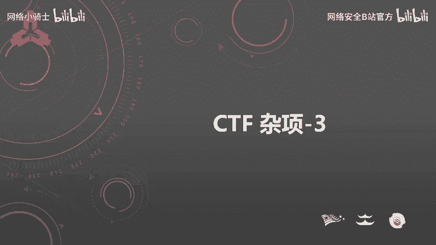

在本节课中，我们将学习CTF杂项题目中，隐写术与密码编码部分常用的解题工具。课程将涵盖图片隐写、十六进制分析、图像拼接、音频处理以及编解码等多个方面，并通过实例演示工具的具体使用方法。

## 图片隐写术工具：Stegsolve

隐写术题目没有固定套路，因此掌握常用工具至关重要。以下是图片隐写术的常用工具。

首先介绍Stegsolve。这是一个图片隐写术的常用工具，可以解决90%以上的图片隐写题目。我们通过两个示例来演示其操作。

**示例一：隐藏的二维码**

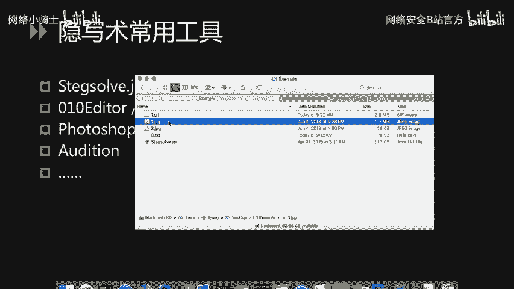

题目给出了一张图片，直接查看没有任何信息。

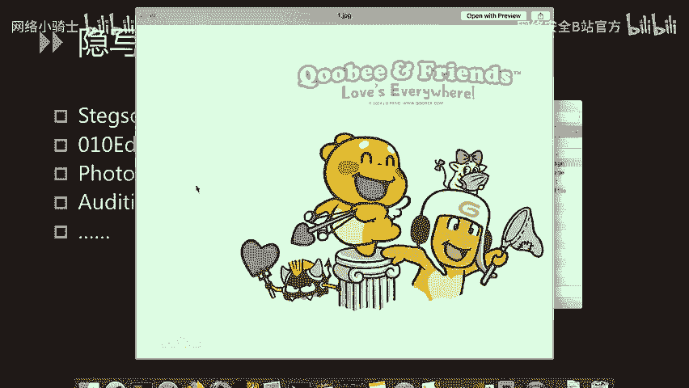

运行Stegsolve程序（一个JAR文件，需要Java环境）。使用 `File -> Open` 打开题目图片。

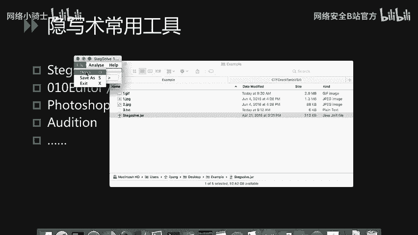

直接查看仍无信息。可以使用窗口下方的箭头按钮，在不同颜色通道和不同阈值下查看图片。

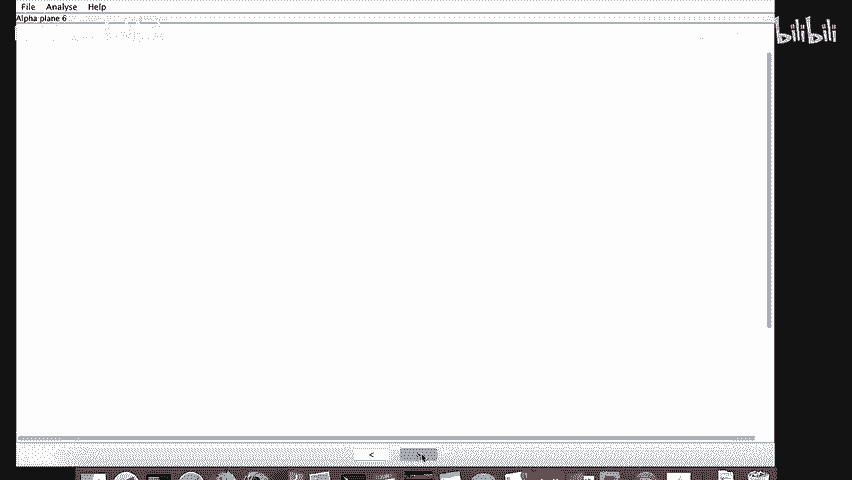

当调整到一定程度时，屏幕上出现了一个二维码。使用手机微信扫码可能因图片杂色过多而失败。可以尝试使用手机QQ或其他专业的扫码工具。推荐使用一款识别能力强的手机扫码工具，它能快速识别复杂或带杂色的二维码，直接获取flag值。

**示例二：GIF帧分析**

第二个示例是一个GIF图。直接播放看不到任何隐写信息，但仔细观察会发现屏幕底部有一个flag值一闪而过，速度太快无法记录。

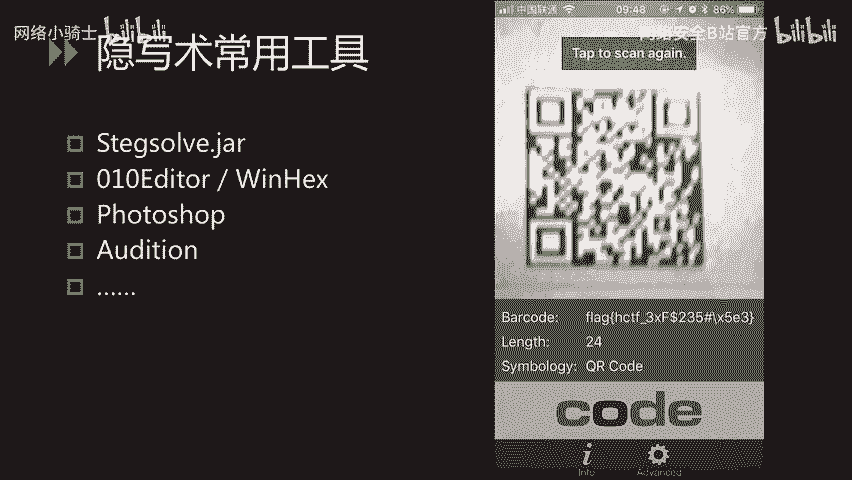

我们再次使用Stegsolve工具。打开题目文件后，点击窗口顶部的 `Analyse` 按钮，找到 `Frame Browser` 功能。

此时点击窗口底部的箭头浏览各帧。当浏览到包含flag的图片帧时，程序会智能地将flag提取并显示在屏幕左上角。

Stegsolve工具还具备其他图片隐写分析功能，例如分析文件格式、检查文件附加数据等。可以便捷地使用 `Analyse` 菜单分析图片中的隐写信息。

## 十六进制编辑器：010 Editor

在Windows平台上，常用的十六进制编辑器有010 Editor、WinHex等。这里重点介绍010 Editor，因为它有一个非常实用的“导入十六进制”功能。

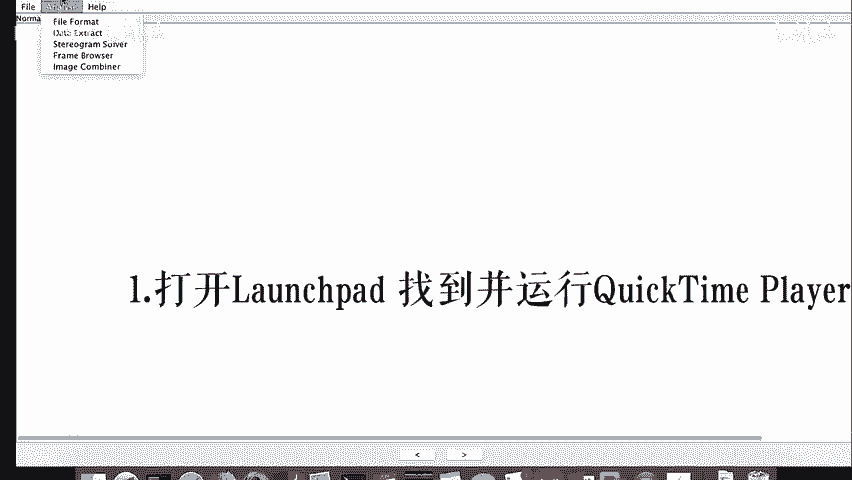

**示例：十六进制转文件**

题目给出一串十六进制数字代码，猜测它是一个十六进制文件被导出成了文本格式。

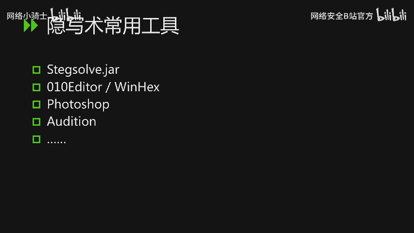

我们使用010 Editor的 `Import -> Import Hex Text` 功能来加载这串十六进制文本。

加载后，可以看到文件头是 `PK`。熟悉ZIP文件格式的人能认出，这代表一个ZIP压缩包。我们直接将其保存为 `.zip` 文件。

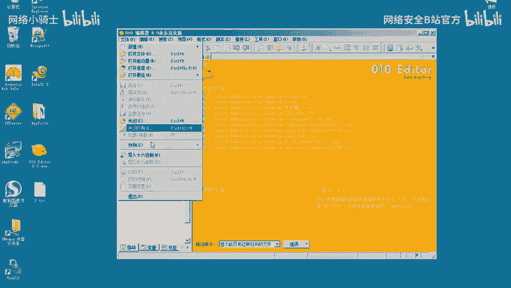

打开ZIP文件，里面包含一张图片 `2.GPG`。打开图片，发现其中有一段条形码。

## 图像处理工具：Photoshop

最近各类CTF比赛中，需要使用Photoshop对二维码或条形码进行拼接的题目也很多。因此，掌握Photoshop的一些基本功能很有必要。

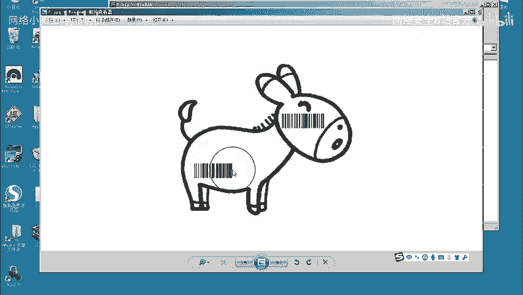

**示例：条形码拼接**

我们尝试用扫码工具扫描上一步得到的条形码，发现无法直接解开，可能需要拼接。

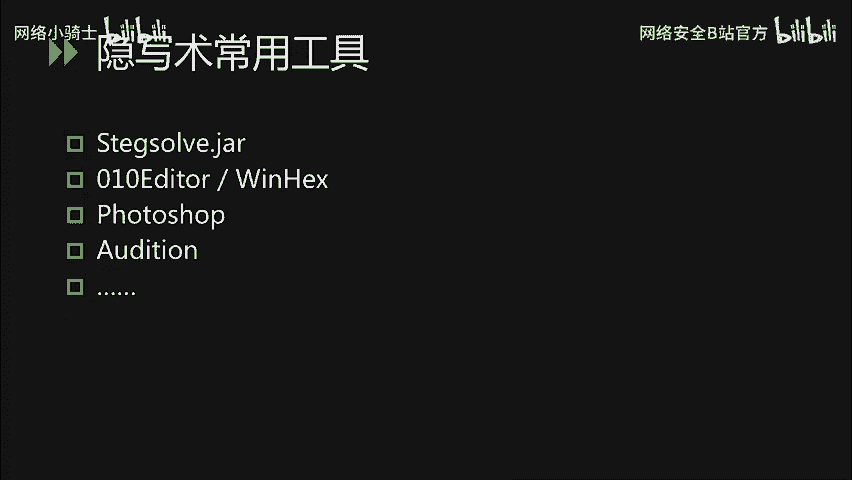

将图片拷贝到电脑上，用Photoshop打开。

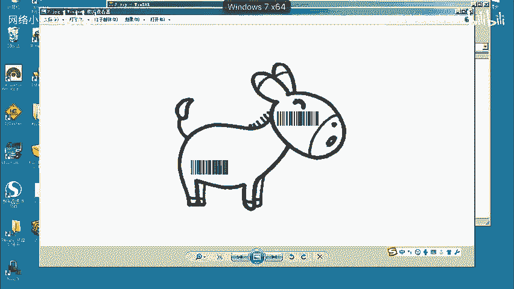

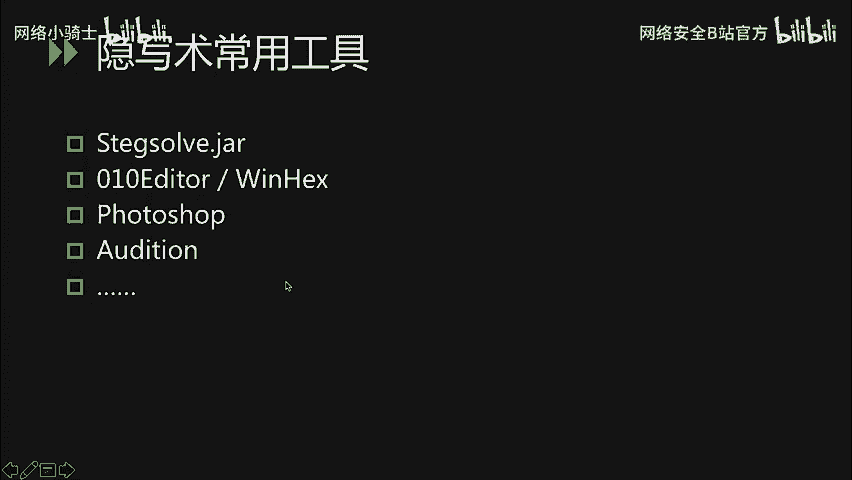

可以看到图片只有两部分存在有效数据。我们需要对这两部分进行拼接。

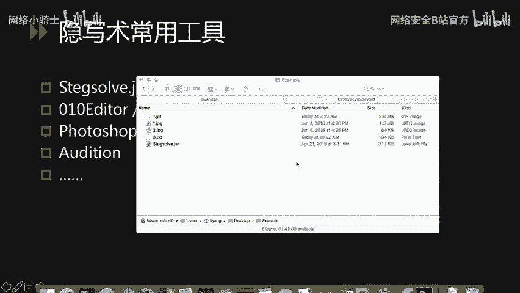

以下是操作步骤：
1.  使用矩形选框工具，选中第一部分条形码。
2.  使用 `Ctrl+C` (Windows) 或 `Command+C` (Mac) 复制。
3.  新建一个图层，将复制的内容粘贴到新图层上。
4.  重复步骤1-3，选取并复制第二部分条形码到另一个新图层。
5.  使用移动工具，将两个条形码图层移动到合适位置进行拼接。可以调整图层混合模式（如“变暗”）以便对齐。
6.  拼接完成后，再次尝试使用扫码工具或在线扫码工具，即可得出该题目的答案。

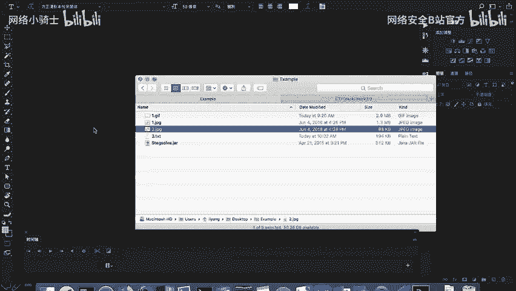

## 音频隐写术工具：Audition

下面简单介绍音频隐写术常用工具Audition。Audition与Photoshop一样，是Adobe公司出的多媒体处理软件，主要负责音频的后期处理。

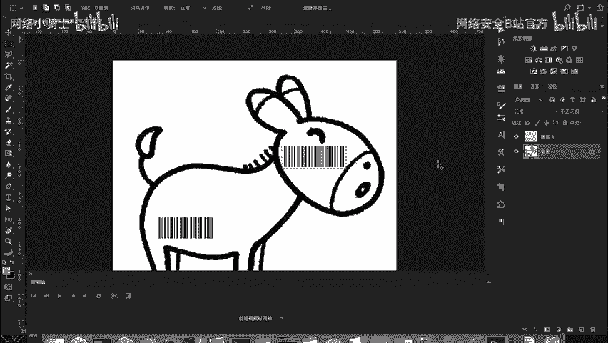

**示例：音频分析**

打开Audition，在左侧的文件窗口加载CTF音频题目文件。

加载后双击即可进入编辑界面。右侧的 `L` 和 `R` 分别代表左右声道，可以单独打开或关闭。

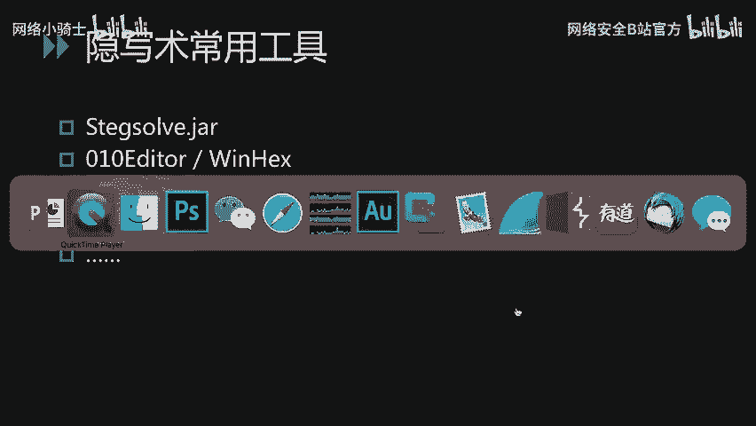

观察发现该题目的信息主要隐藏在左声道，因此关闭右声道。可以用光标直接选取没有信息的音频段并删除，只保留包含信息的部分。

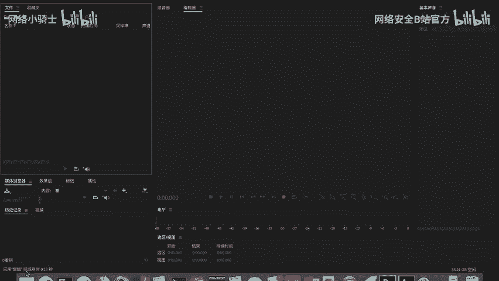

可以使用窗口上方的快捷按钮调节声音的振幅，例如进行增大处理。

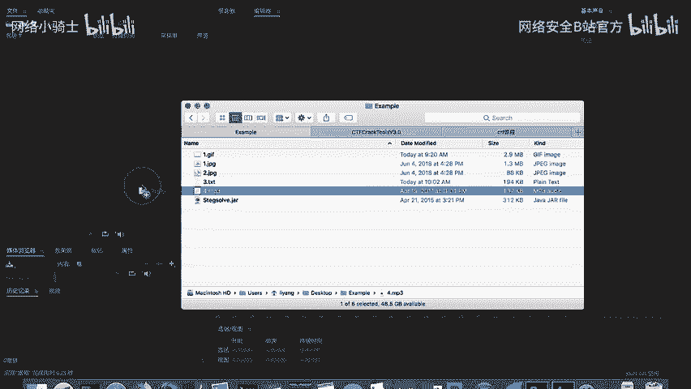

调整后，可以更清晰地看到音频中隐藏的信息。有时可能还需要用到“效果”菜单中的高级功能，此处不再赘述。

## 密码学与编解码工具

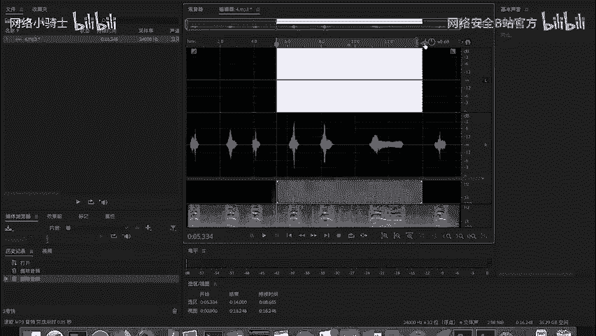

最后，我们介绍密码学以及编解码相应的工具。

**在线工具与脚本**

首先，可以在网上找到大量的加解密在线工具。通过搜索引擎搜索“在线加解密工具”，可以找到许多支持常用加解密算法和编码解码的工具。

此外，也可以使用脚本进行加解密和编解码操作。Python语言编写方便，且网上有大量现成脚本，因此推荐使用Python脚本在本地进行操作。大家可以通过在线搜索找到各种算法的Python实现脚本。

**CTF集成框架：CTFcrackTools**

这里推荐一个CTF解密用的框架——CTFcrackTools，由国内安全团队编写。

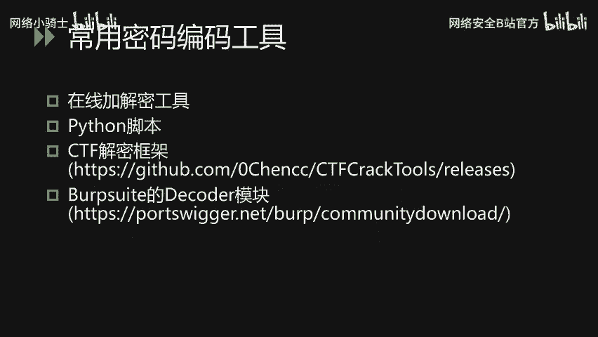

打开CTFcrackTools，可以看到工具具备多个功能模块。

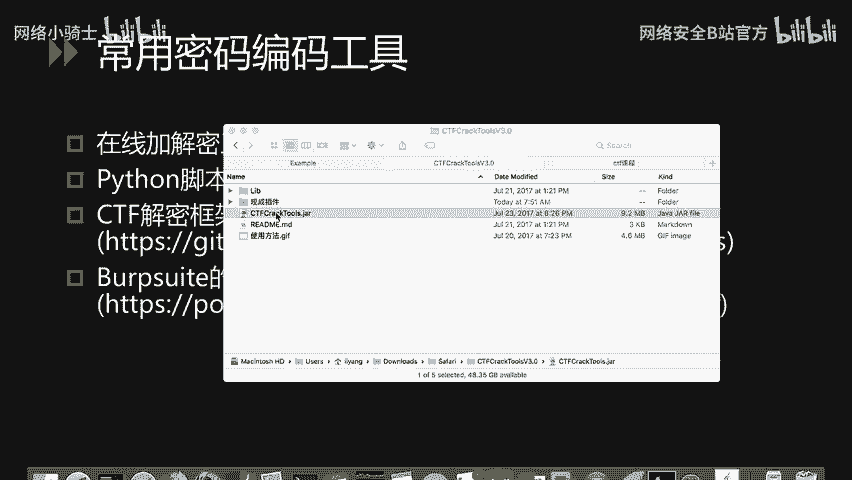

用户可以将自己的Python脚本以插件方式置入这个程序。因此，可以使用该框架集成多个Python脚本，方便CTF答题时的解密操作。工具的GitHub地址已显示在PPT中，可供下载。

**Burp Suite 解码模块**

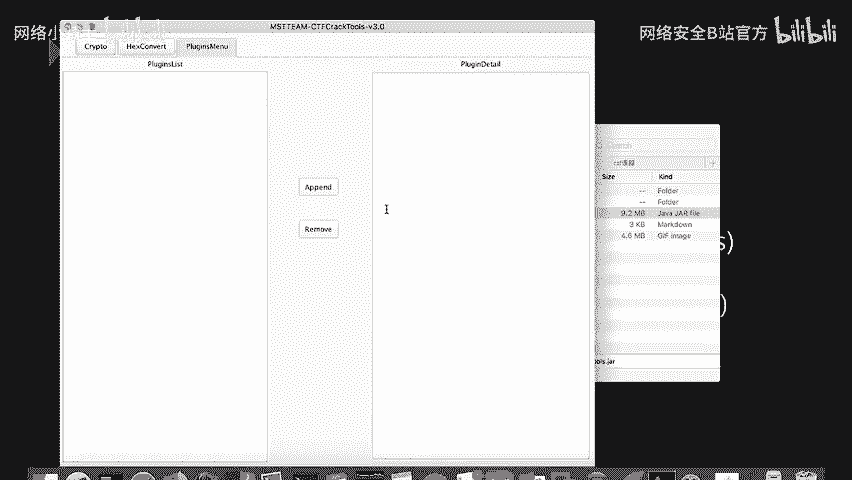

最后介绍Burp Suite中最常用的Decoder模块，它可以完成最常用的编解码操作。

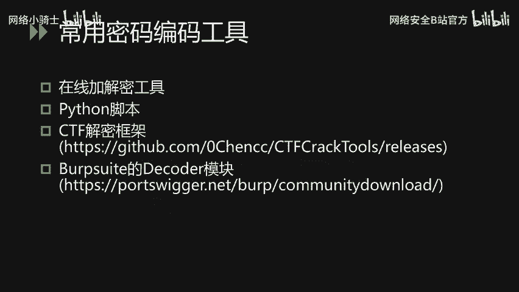

打开Burp Suite，找到Decoder模块。以 `hello world` 为例，可以使用右侧的 `Encode as` 进行不同编码方式的编码，也可以使用 `Decode as` 进行相应的解码操作。由于该模块直接内置在Burp Suite中，使用起来非常方便。

## 总结

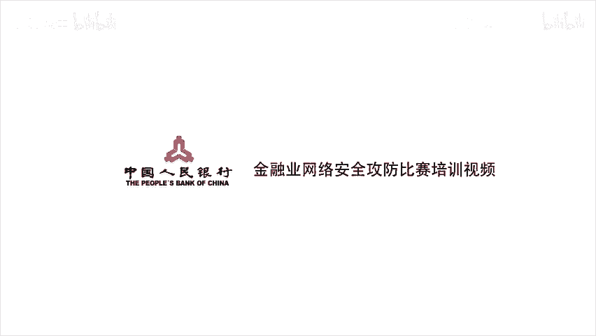

本节课我们一起学习了CTF杂项中隐写术与编码的常用工具。我们介绍了用于图片隐写分析的 **Stegsolve**，用于十六进制文件分析的 **010 Editor**，用于图像拼接的 **Photoshop**，用于音频分析的 **Audition**，以及用于加解密和编解码的在线工具、Python脚本、**CTFcrackTools** 框架和 **Burp Suite** 的Decoder模块。掌握这些工具能有效提升解决此类题目的效率。