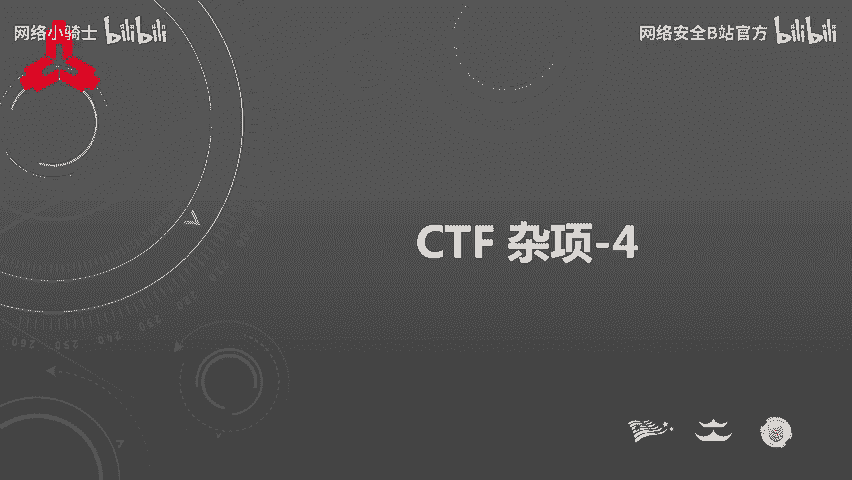
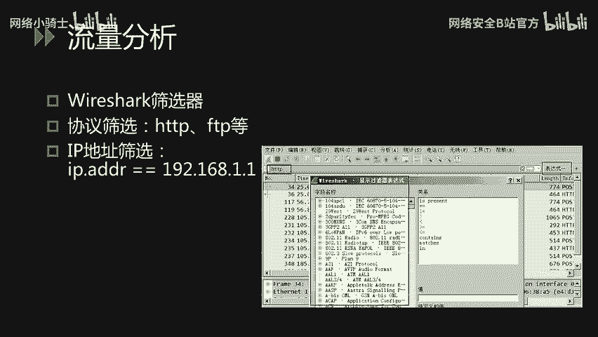
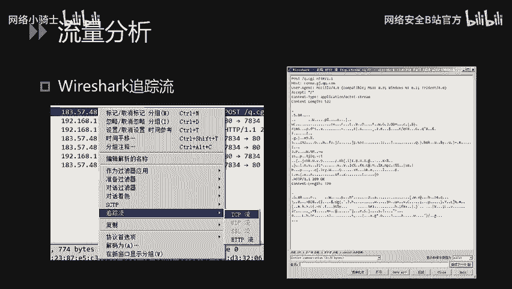
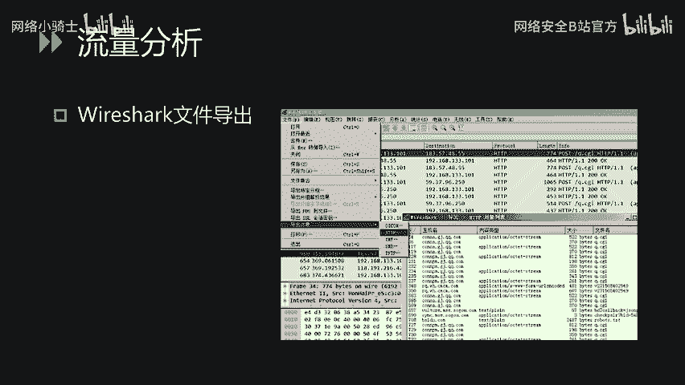
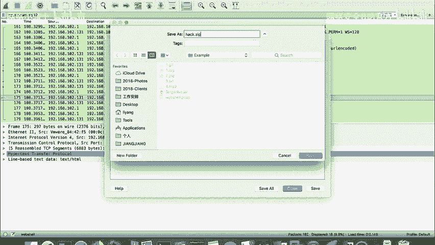
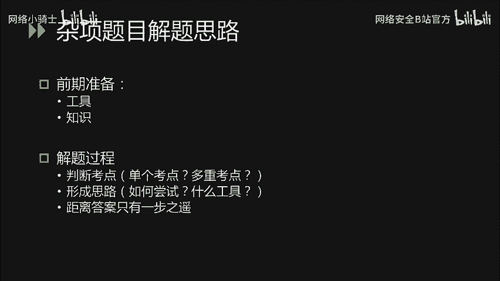
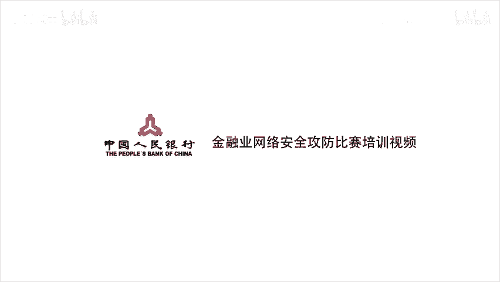

# CTF最强战队蓝莲花内部培训教程：P47：CTF取证与杂项解题技巧 🕵️

在本节课中，我们将学习CTF比赛中取证技术（Forensics）与杂项（Misc）题目的核心解题技巧。课程将分为三个主要部分：**流量分析**、**电子取证（日志分析）** 以及**杂项题目的通用解题思路**。我们将通过具体实例和工具操作，帮助你掌握这些关键技能。

## 流量分析：Wireshark实战 🔍

上一节我们介绍了课程概述，本节中我们来看看流量分析的具体方法。Wireshark是最常用的网络流量分析工具，功能强大。在CTF题目中，主要应用其筛选器、追踪流和文件导出等几个核心功能。

### Wireshark筛选器

通过Wireshark的筛选器，我们可以根据协议版本、IP地址等条件对数据包进行过滤，从而清晰、高效地定位所需信息。

以下是使用筛选器的基本方法：
*   点击筛选器输入框右侧的表达式按钮，可以使用Wireshark内置的表达式进行过滤。
*   表达式支持逻辑关系运算符，例如可以使用等号（`==`）、不等号（`!=`）、大于（`>`）、小于（`<`）或匹配（`contains`）等运算符进行条件组合。

### 追踪流功能

流量分析的核心是分析请求与响应的对应关系。Wireshark的追踪流功能可以直观地展示每一次完整的通信过程。

以下是使用追踪流功能的步骤：
*   在数据包列表中右键单击某条记录。
*   选择“追踪流” -> “TCP流”或“HTTP流”。
*   在弹出的新窗口中，可以完整查看该次会话的请求与响应内容。在此窗口中，你可以使用查找功能搜索关键词，也可以选择过滤掉此流、打印或保存整个会话。

### 文件导出功能

在流量中，经常包含通过HTTP或FTP传输的文件。Wireshark的文件导出功能可以帮助我们将这些文件对象提取到本地进行分析。

以下是一个CTF题目实例，演示文件导出功能的应用：
1.  题目文件名为 `web shell.pcap`，提示可能与Webshell分析相关。
2.  打开文件后，使用筛选器过滤`http`协议，观察HTTP请求与响应。
3.  发现攻击者先访问了 `upload.php`（上传点），随后访问了 `hack.php`（疑似上传的Webshell文件）。
4.  追踪 `hack.php` 的HTTP流，发现其响应内容经过Base64编码，解码后显示为列目录操作。
5.  继续查看后续流量，发现一个响应中包含 `PK` 文件头，表明这是一个ZIP压缩包。
6.  使用“文件” -> “导出对象” -> “HTTP…”功能，找到该响应（编号为175），将其保存到本地并重命名为 `.zip` 后缀。
7.  尝试解压时发现文件头异常导致失败，可使用 `010editor` 或 `WinHex` 等工具修复文件头。
8.  修复后，压缩包有密码保护。回顾攻击流量，寻找使用 `zip -P` 命令加密的参数，即可获得密码并解密压缩包，最终得到Flag。

## 电子取证：日志分析 📄

刚才讲解了使用Wireshark进行流量分析的过程，下面我们继续看电子取证的另一个重要部分——日志分析。这部分可能涉及HTTP访问日志、系统日志等多种类型。

我们以HTTP的 `access.log` 为例。日志的每一行通常包含以下信息：客户端IP地址、访问时间、HTTP方法、请求路径、协议版本、服务器响应状态码以及响应体长度。

在CTF中，此类题目的考察方式多样：
*   **寻找SQL注入点**：攻击者可能进行盲注，通过观察响应状态码（如200成功、500错误）来判断注入是否成功，并逐位获取数据。解题者需要熟悉SQL语法、盲注原理，并能编写脚本从日志中自动化恢复数据。
*   **查找Webshell**：在大量的访问日志中，通过搜索特定关键词（如 `eval`、`system`、`base64_decode` 等）或异常路径，来定位攻击者上传的Webshell文件位置。可以使用 `Notepad++` 等支持大文件的文本编辑器进行全局搜索。
*   **发现敏感路径访问**：通过分析日志，找到用户访问的敏感目录或文件（如 `/admin`、`/backup`、`config.php` 等），进而对相关资源进行深入分析以获取Flag。

此类题目没有固定套路，需要根据日志内容和题目描述灵活分析。

## 杂项题目：解题思路与练习 🧩

电子取证部分的讲解就是这些，下面我们看杂项题目的解题思路。杂项题目综合性强，可能涉及编码、隐写、密码学、逆向等多个领域的知识点。

与其他类型题目相似，解答杂项题需要充分的准备：
*   **工具与知识储备**：需要提前了解并准备各类CTF题目的常用解题工具，并学习相关考点知识。
*   **善用搜索引擎**：遇到不熟悉的概念或工具时，要快速通过搜索引擎进行学习和下载。

杂项题目的解题过程至关重要，可以遵循以下步骤：
1.  **识别考点**：首先判断题目考察的是单个考点还是多个考点的综合。例如，经典题目“困在栅栏里的凯撒”就明确提示了 **栅栏密码** 和 **凯撒密码** 两个考点。
2.  **形成思路**：针对识别出的考点，思考解题顺序（例如，先解栅栏还是先解凯撒？）、尝试最高效的方法、并选择合适的工具。
3.  **尝试与调整**：按照思路进行尝试。如果未能解出答案，需冷静判断：是距离成功只差一步（如密钥、偏移量不对），还是整体思路错误。根据情况决定是继续深入尝试，还是暂时放弃以节省时间。
4.  **坚持练习**：杂项题目能力提升的关键在于**大量练习**。平时应在CTF在线平台（如CTFHub、BugKu等）上多做题，并多看其他优秀队伍的解题报告（Writeup）。这能帮助你在比赛中快速识别考点并形成有效思路。

---

本节课中我们一起学习了CTF取证与杂项的核心技巧。我们掌握了使用Wireshark进行流量分析（筛选、追踪流、导出文件）的方法，了解了如何分析各类日志（特别是Web访问日志）以发现攻击痕迹，并梳理了应对综合性杂项题目的通用解题思路与练习策略。希望这些知识能帮助你在未来的CTF比赛中更加得心应手。