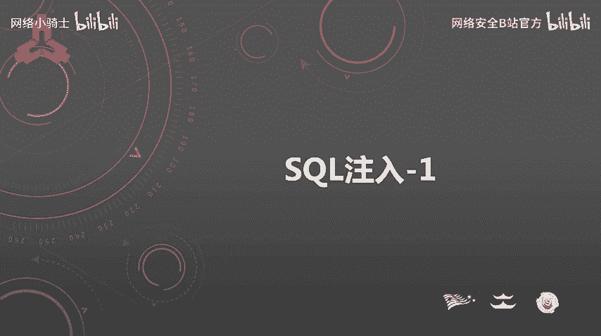
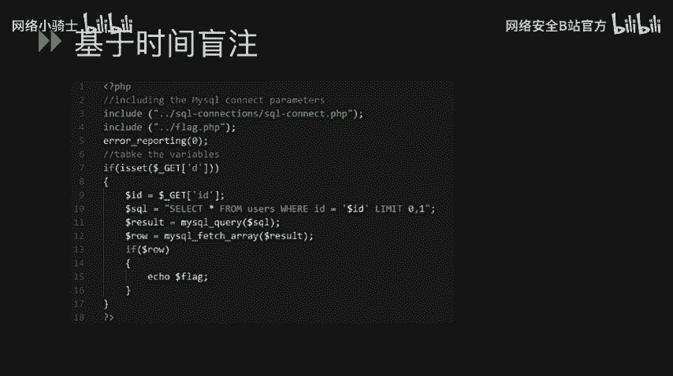
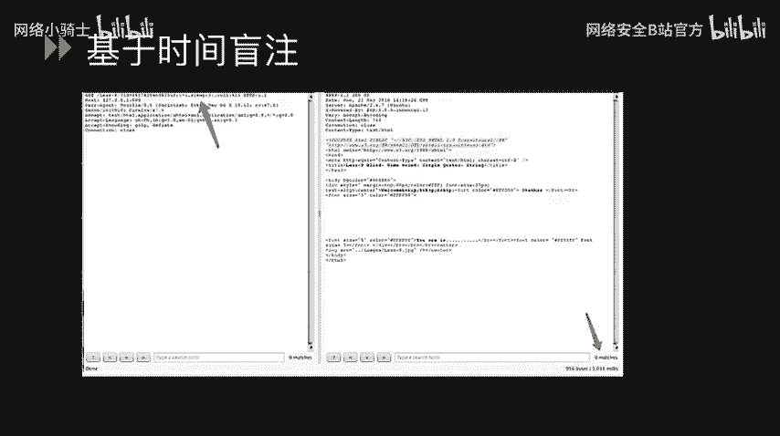
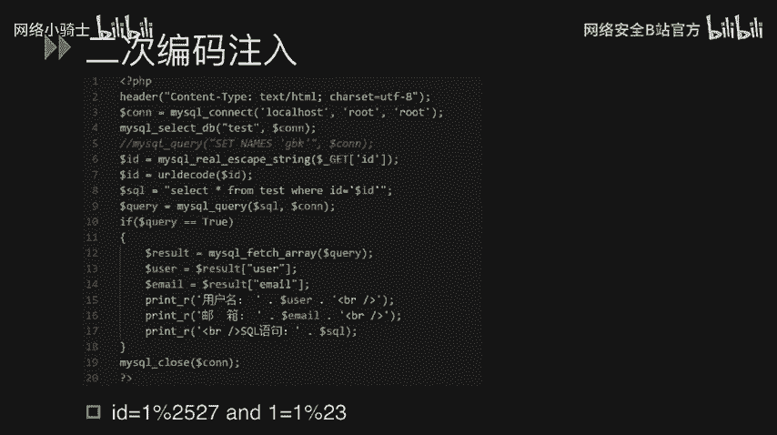

# CTF最强战队蓝莲花内部培训教程：P48：SQL注入在CTF中的应用 🎯



在本节课中，我们将要学习SQL注入在CTF（Capture The Flag）比赛中的具体应用。我们将从SQL注入的基本概念讲起，逐步深入到不同类型的注入技巧，包括字符型注入、数字型注入、布尔盲注、时间盲注、宽字节注入以及二次编码注入。课程内容将结合代码示例，帮助你理解攻击原理和防御方法。

## 什么是SQL注入？🔍

SQL注入是一种攻击技术。攻击者通过将恶意的SQL命令插入到Web表单提交的数据、输入参数或URL参数值中。这些恶意插入的SQL数据会导致额外的SQL语句被执行。

这些额外的SQL语句通常是攻击者构造的恶意指令。它们可能是查询语句，也可能是恶意的删除或更新语句。这些语句除了可能泄露数据库中的敏感信息，还可能对数据库造成严重的破坏性威胁。

在CTF比赛中，我们经常遇到的是MySQL数据库。因此，本节将重点讲解MySQL数据库的注入技巧，以及注入过程中可能遇到的问题。

## SQL注入的类型 📚

SQL注入有多种类型，我们将逐一进行讲解。

### 字符型注入

我们来看一个示例。以下代码中有一个SQL语句，在第4行是 `SELECT * FROM users WHERE name=`，后面拼接了一个从GET参数中获取的参数值。

```php
$name = $_GET['name'];
$sql = "SELECT * FROM users WHERE name='$name'";
```

我们可以通过向 `name` 参数输入特定的参数值，并构造恶意的SQL语句，从而造成额外的SQL语句执行。例如，我们可以输入 `name=test'`，这个单引号是为了闭合第4行SQL语句中的那个单引号。

然后，我们可以通过联合查询（UNION SELECT）的方式去执行额外的SQL语句。例如：`test' UNION SELECT ...` 这样的方式去查询额外的数据。

### 数字型注入

我们看一下示例代码。`demo` 里面有一个SQL语句：`SELECT content FROM test WHERE id=$id`。这个 `$id` 变量是第3行中通过GET参数获取的。因为这个变量是一个数值变量，所以我们称之为数字型注入。

```php
$id = $_GET['id'];
$sql = "SELECT content FROM test WHERE id=$id";
```

那么我们就可以通过 `id=1`，然后后面加上 `UNION SELECT` 进行联合查询，执行额外的SQL语句。

为了防止注入，开发者可能会使用安全函数来过滤内容。例如 `addslashes()` 对单引号进行转义，或者 `mysql_real_escape_string()` 对特殊字符进行过滤。

### 布尔盲注

接下来我们讲第三种类型：布尔盲注。我们可以看一下这个示例。在第9行有一个SQL语句，由于在 `id` 这个变量后面加上了 `LIMIT 1`，我们不能直接使用 `UNION SELECT` 来进行SQL查询。那我们只能通过一些盲注的方式来判断是否存在SQL注入，然后通过盲注的方式逐个读取想要的内容。

```php
$id = $_GET['id'];
$sql = "SELECT content FROM test WHERE id='$id' LIMIT 1";
```

首先，我们输入 `id=1'`，从而去闭合变量 `id` 前面的那个单引号。这样我们就破坏了整个SQL语句的结构，导致这个SQL语句无法执行，所以它没有回显。

接下来，我们输入 `1' AND 1=1`，然后最后把那个单引号去掉。这样我们可以完整地构造SQL语句，不会破坏它的结构。由于 `1=1` 是 `TRUE`，所以这个条件加了跟没加一样，查询结果和原来一样，有回显。

我们再输入 `1' AND 1=2`。由于 `1=2` 是 `FALSE`，并且使用了逻辑运算 `AND`，所以整个SQL语句执行下来结果是 `FALSE`，不会有任何回显。通过这样的方式，我们就可以得知这里存在一个SQL注入漏洞。

那么接下来，我们就要通过盲注的方式来获取一些敏感的信息内容。盲注我们往往会用到几个函数，下面介绍一下。

以下是盲注中常用的几个MySQL函数：

*   **`LENGTH(str)`**：返回字符串 `str` 的长度。
*   **`SUBSTRING(str, pos, len)`**：截取字符串 `str` 从位置 `pos` 开始的 `len` 个字符。例如 `SUBSTRING(str, 1, 1)` 就是截取这个字符串的第一个字符。我们可以逐个截取字符串的每个字符。
*   **`ASCII(char)`**：返回字符 `char` 对应的ASCII码。
*   **`SLEEP(seconds)`**：将程序挂起（休眠）指定的秒数。
*   **`IF(condition, value_if_true, value_if_false)`**：一个条件判断函数。如果 `condition` 为真，则返回第二个参数；如果为假，则返回第三个参数。

通过 `IF` 函数，我们可以构造条件来判断信息。例如，`IF(LENGTH(database()) > 3, SLEEP(5), 0)`。如果当前数据库名的长度大于3，则让查询休眠5秒；否则立即返回。通过观察响应时间，我们可以判断条件是否成立。

我们可以通过盲注的方式，将数据库的名字用 `DATABASE()` 这个函数获取到，然后输入给 `LENGTH()` 这个函数。再通过大于号、小于号、等于号来读取数据库名字的长度大小。

我们通过测试可以发现，当长度等于8时有回显，大于8时没有回显。也就是说，大于8时条件是 `FALSE`，等于8时是 `TRUE`。所以这个数据库名字的字符串长度就是8。



接下来，我们可以通过类似的方式，逐个知道这8个字符分别是什么。如何知道呢？就是通过判断每个字符对应的ASCII码是多少。例如，`IF(ASCII(SUBSTRING(DATABASE(),1,1)) > 100, SLEEP(2), 0)`。最后将这8个字符的ASCII码转换成字符并串起来，就能知道数据库名是什么。我们也可以通过这种二分法和ASCII码的方式来读取它的表名和列名。

### 基于时间的盲注

基于时间的盲注，实际上和前面基于布尔型的盲注有异曲同工之妙。也是通过一些无法获得直接回显的方式去读取想要的内容。我们的示例代码和前面那个差不多，但是我们这边使用基于时间的盲注语句来执行。



```php
$id = $_GET['id'];
$sql = "SELECT content FROM test WHERE id='$id'";
```

我们看一下，我们在 `id` 这个变量里面输入了一个 `SLEEP()` 函数，让它休眠5秒。例如：`1' AND SLEEP(5)-- `。我们发现，加上 `SLEEP(5)` 和没加 `SLEEP(5)`，整个请求得到返回的时间长度是不一样的。`SLEEP` 里面的数值越大，响应返回的速度就越慢，时间就越长。通过这样的方式，我们就可以得知这里存在一个SQL注入漏洞，并且可以执行 `SLEEP` 这个函数。

### 宽字节注入

宽字节注入发生的位置一般是PHP发送请求到MySQL时，字符集使用了 `character_set_client` 这个设置值进行了一次编码。当它被设置为GBK这类宽字节编码时，就可能存在这种问题。

我们可以看到这个示例里面，在第4行，我们将字符集设置为了GBK。然后在第5行执行了一句SQL语句。这个 `id` 变量在第3行做了一次安全函数的校验转换，用 `addslashes()` 做了一次转义。`addslashes()` 会将单引号转义为 `\'`，即在单引号前面加一个反斜杠。

```php
mysql_query("SET NAMES 'gbk'");
$id = addslashes($_GET['id']);
$sql = "SELECT content FROM test WHERE id='$id'";
```

那么这个时候我们如何去绕过这个过滤呢？我们看一下下面的Payload：`id=%df%27`。`%27` 是单引号的URL编码形式。由于存在 `addslashes()`，程序就会在 `%27` 前面加上一个反斜杠 `\`，这个反斜杠的URL编码是 `%5c`。

由于设置了GBK字符集，那么 `%df%5c` 就会被解码为一个繁体字“運”（GBK编码中，`%df%5c` 对应“運”字）。这个时候，我们输入的单引号 `%27` 就成功“逃逸”了出来，形成了一个没有被转义的单引号，从而实现了SQL注入的绕过。

如何去修复这个问题？实际上就是把字符集设置为UTF-8即可。宽字节注入还可以用来绕过另一个安全函数 `mysql_real_escape_string()`。`mysql_real_escape_string()` 会对单引号(`'`)、双引号(`"`)、反斜杠(`\`)、NULL字符等字符进行转义，在它们前面加上反斜杠。但在GBK等宽字节编码下，同样可能被类似手法绕过。

### 二次编码注入

二次编码注入是由于安全函数被冗余或错误使用导致的问题。我们可以看到这个示例。在第6行使用了 `mysql_real_escape_string()` 这个安全函数。由于在第2行我们设置字符集为UTF-8，所以这里不能使用宽字节注入。

```php
mysql_query("SET NAMES 'utf8'");
$id = mysql_real_escape_string($_GET['id']);
$id = urldecode($id);
$sql = "SELECT content FROM test WHERE id='$id'";
```

我们继续看第7行，又使用了一个URL解码的函数 `urldecode()`。这两个函数同时存在，导致了我们可以进行一次绕过。

我们输入的Payload变量是：`id=1%2527 AND 1=1%23`。重点在于第一个输入变量 `1%2527`。`1%2527` 里面不存在 `mysql_real_escape_string()` 想要转义的那些特殊字符（因为 `%25` 是 `%` 的URL编码，它不是一个单引号）。所以 `mysql_real_escape_string()` 会成功“绕过”，不对其进行转义。

进入到了第7行，`urldecode()` 在做URL解码的时候，`1%2527` 会做一次解码。`%25` 被解码成 `%`，所以字符串变成了 `1%27`。由于 `%27` 是单引号的URL编码，所以这里就形成了一个解码后的单引号，从而进入到了第8行的SQL语句当中，达到了让SQL语句额外执行的目的。这就是一个二次编码注入的问题。

## 总结 📝



本节课中，我们一起学习了SQL注入在CTF比赛中的多种应用形式。我们从基础的字符型和数字型注入讲起，介绍了如何通过闭合引号和联合查询来获取数据。接着，我们探讨了当无法直接获取回显时的盲注技术，包括布尔盲注和时间盲注，并学习了相关的MySQL函数。最后，我们分析了两种特殊的绕过技巧：宽字节注入和二次编码注入，理解了它们产生的原理是由于字符集设置和安全函数使用不当。


理解这些攻击手法的原理，不仅能帮助我们在CTF比赛中解题，更重要的是让我们认识到编写安全代码、正确使用参数化查询或预处理语句、以及合理配置数据库环境的重要性。