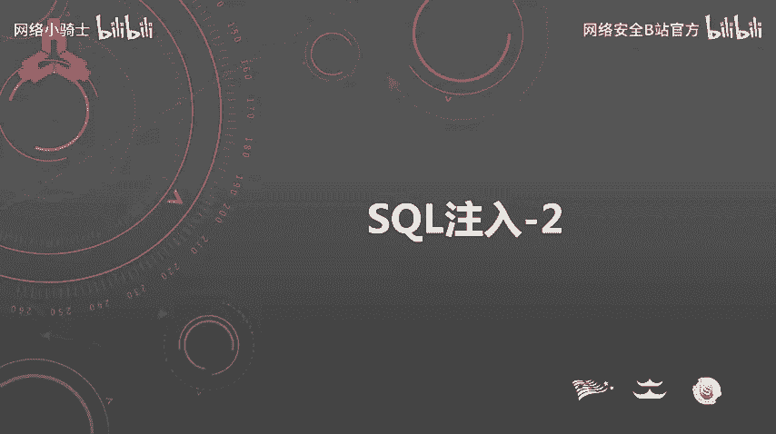
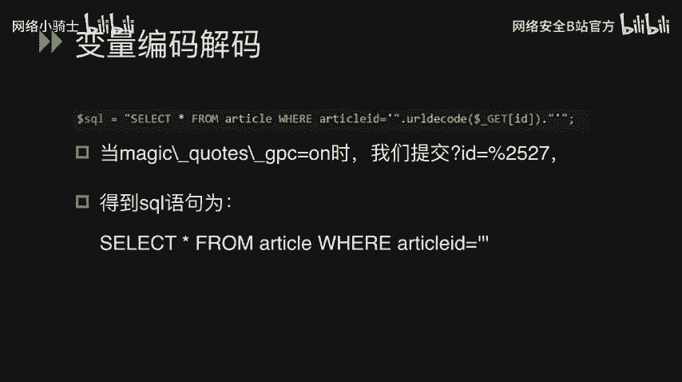
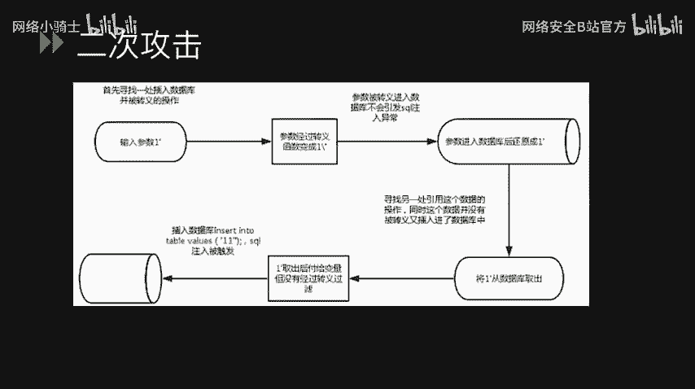
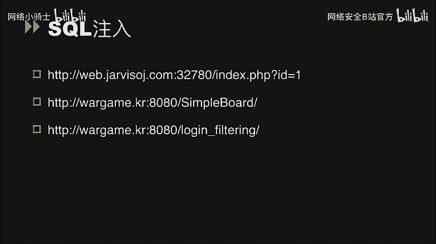
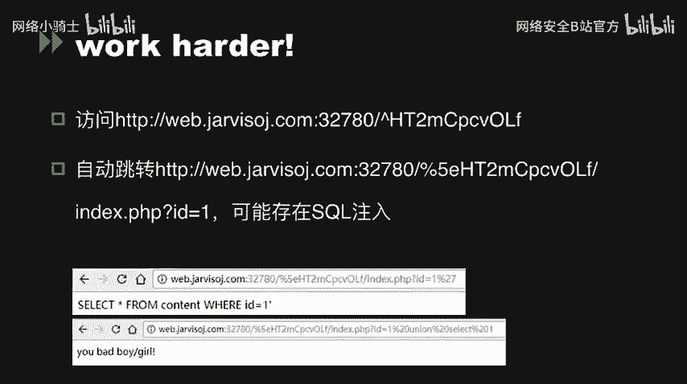
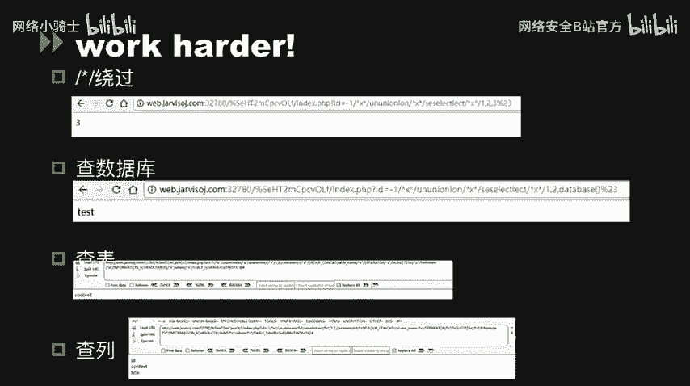
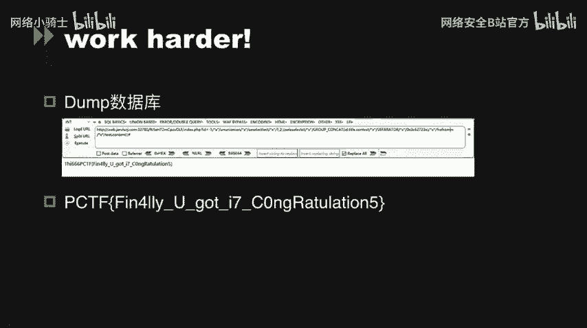
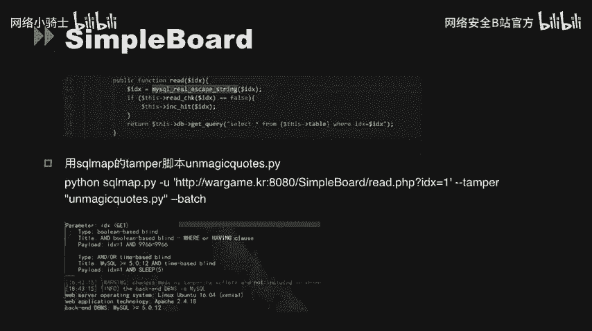
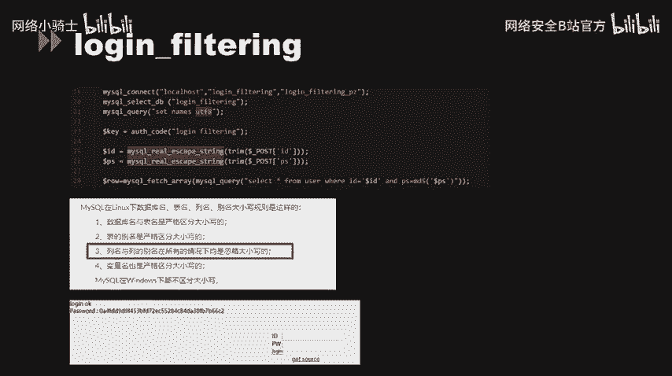

# CTF最强战队蓝莲花内部培训教程：P49：SQL注入



## 概述
在本节课中，我们将要学习SQL注入在CTF比赛中的一些关键应用，特别是围绕PHP的魔术引号（magic_quotes_gpc）安全机制及其绕过方法。我们将探讨魔术引号的工作原理、其带来的安全问题、变量编码解码过程中的漏洞，并通过三道CTF题目进行实战分析。

---

## 魔术引号（magic_quotes_gpc）详解

魔术引号是PHP的一个安全设置选项。当 `magic_quotes_gpc` 设置为 `on` 时，所有从GET、POST、COOKIE传入的单引号（`'`）、双引号（`"`）、反斜线（`\`）和NULL字符都会被自动加上一个反斜线进行转义。

从原理上讲，这与 `addslashes()` 函数的作用完全相同。例如，用户输入一个反斜线（`\`），系统会将其转义为 `\\`，使其失去转义功能，变为普通字符串。同理，单引号（`'`）会被转义为 `\'`。

在PHP版本小于4.2.3时，此选项是全局设置。自PHP 5.3.0起，该选项被废弃，并在PHP 5.4.0中被移除。

那么，为何这样一个安全选项会被关闭呢？主要原因是它影响了PHP项目的一致性。并非所有被转义的数据都需要插入数据库，对所有输入数据进行转义会影响程序执行效率。此外，在不需要转义的地方看到转义后的数据（如邮件内容中出现大量斜杠）可能导致误判。针对此问题，可以使用 `stripslashes()` 函数进行反转义处理。

`stripslashes()` 函数实质上是 `addslashes()` 函数的逆操作。

然而，`magic_quotes_gpc` 选项也存在缺陷。它可能影响 `$_SERVER` 等超全局变量，导致一些如CRLF注入等漏洞被利用。

我们可以通过 `get_magic_quotes_gpc()` 函数来检测当前PHP环境是否开启了此选项。在 `php://input` 或 `HTTP_RAW_POST_DATA` 流中，也常能看到该选项的应用，尤其是在SOAP、XML-RPC或Web Publishing功能中。

在代码中，魔术引号也可能在 `IN`、`LIMIT`、`ORDER BY`、`GROUP BY` 等数据库操作语句中被应用，开发者容易在此处忘记手动转义，从而产生漏洞。

---

## 变量编码与解码问题

上一节我们介绍了魔术引号的基本原理，本节中我们来看看变量在编码与解码过程中可能产生的问题。PHP中存在多对编码与解码函数：

*   `addslashes()` 与 `stripslashes()`：进行字符串转义与反转义。
*   `base64_encode()` 与 `base64_decode()`：进行Base64编码与解码。
*   `urlencode()` / `rawurlencode()` 与 `urldecode()` / `rawurldecode()`：进行URL编码与解码。
*   `serialize()` 与 `unserialize()`：进行序列化与反序列化。

在变量编码解码时，如果顺序或逻辑不当，就可能产生安全漏洞，例如二次编码注入。



请看以下SQL语句：
```php
$sql = "SELECT * FROM article WHERE articleid=" . urldecode($_GET[‘id’]);
```
假设服务器开启了 `magic_quotes_gpc`，用户输入的 `id` 参数会先被转义。如果攻击者输入 `%2527`（即URL编码后的单引号 `%27` 再次进行URL编码），魔术引号在第一次处理时，不会将 `%2527` 识别为单引号，因此不会添加反斜杠。随后，`urldecode()` 函数会对其进行解码，第一次解码得到 `%27`，第二次解码（如果存在或由其他流程处理）或数据库解析时，`%27` 会被还原为单引号（`'`），从而成功逃逸，引发SQL注入。

---



## 二次攻击（二次解码攻击）

二次攻击与二次解码攻击概念不同。我们看一下二次攻击的业务逻辑过程：

1.  **插入与转义**：攻击者提交参数 `1'`。由于存在转义（如魔术引号），参数变为 `1\'` 后存入数据库，此时不会引发SQL注入。
2.  **存储与还原**：数据存入数据库时，数据库会进行反转义处理，将 `1\'` 还原为 `1'`。
3.  **取出与利用**：在应用的另一处逻辑中，程序从数据库取出该数据（`1'`）并赋值给一个变量，且未经过滤直接用于SQL查询。此时，单引号被成功引入查询语句，从而触发SQL注入漏洞。

整个过程的核心在于：从数据库取出的变量没有经过适当的过滤，导致之前的转义防护失效。

对于不同数据库：
*   **MySQL与Oracle**：转移字符是反斜杠（`\`）。提交 `'` 经魔术引号变为 `\'`，入库时反转移变回 `'`。
*   **MSSQL**：转移字符是单引号本身（`''`）。提交 `'` 经魔术引号变为 `\'`，但MSSQL可能将其直接当作字符串 `\'` 处理，行为略有不同。

魔术引号还可能带来新型攻击。反斜杠在Windows下也是目录跳转符（`\`），这可能导致在文件路径操作中产生目录遍历漏洞。当使用 `magic_quotes_gpc` 或 `addslashes()` 对用户输入进行转义时，无意中可能为攻击者“添加”了目录跳转符，为后续攻击创造条件。

此外，魔术引号可能引发其他问题。考虑以下示例代码：
```php
$order_sn = substr($_GET[‘orderSN’], 0, 1); // 假设输入为 \'，开启gpc后，$order_sn = ‘\’
$sql = "SELECT * FROM orders WHERE order_sn='$order_sn' AND order_tn='$_GET[orderTN]'";
```
由于 `$order_sn` 是反斜杠（`\`），它会转义其后SQL语句中的单引号，使得 `order_tn` 参数处的单引号被逃逸，攻击者即可在此注入Payload。

---

## 其他魔术引号选项

除了 `magic_quotes_gpc`，PHP历史上还存在其他相关选项：

*   **magic_quotes_runtime**：此选项与 `gpc` 的区别在于，它会对从数据库或文件取出的数据进行转义。这理论上可以防御二次攻击。但如果使用不当，也可能造成问题。它会影响 `fgets()`、`file()`、`mysql_fetch_array()` 等文件读取和数据库查询函数。该选项别名是 `set_magic_quotes_runtime()`，自PHP 5.3.0起废弃，PHP 7.0.0中移除。
*   **magic_quotes_sybase**：此选项与 `gpc` 的区别在于，它只转义空字符（NULL），并将单引号转为双引号进行转义。当此选项为 `on` 时，它会覆盖 `magic_quotes_gpc` 的设置，但仍受 `addslashes()` 等函数影响。此选项同样自PHP 5.3.0起废弃，在5.4.0中移除。

---



## CTF实战：三道SQL注入题目分析

### 题目一：基础绕过与注入
题目提供了一个URL，查看源代码后发现提示访问 `index.phps`（通常为PHP源代码文件）。访问后获得源代码。

**核心挑战**：绕过一段条件判断语句。代码中使用了 `eregi()` 函数进行正则匹配，该函数存在截断漏洞可以利用。同时，可以通过 `php://input` 流来绕过对 `$_POST[‘data’]` 的检查。



**注入过程**：绕过初始判断后，获得提示路径。访问该路径发现存在SQL注入点。测试发现空格被过滤，可以使用注释符 `/**/` 代替空格进行绕过。随后采用常规的联合查询（UNION）步骤：查数据库名、表名、列名，最终读取到存储flag的数据。

### 题目二：宽字节注入
题目源代码中使用了 `mysql_real_escape_string()` 函数进行转义，这通常被认为是安全的。然而，当数据库连接字符集设置为GBK等宽字符集时，可能产生宽字节注入漏洞。



**攻击原理**：攻击者可以输入如 `%df%27` 的Payload。经过 `mysql_real_escape_string()` 转义后，单引号变为 `%df%5c%27`（`%5c` 是反斜杠）。在GBK字符集下，`%df%5c` 可能被解析为一个合法的宽字符（如“運”），从而使后面的 `%27`（单引号）逃逸出来。



**解题方法**：可以手动构造宽字节Payload，也可以使用自动化工具SQLMap的 `--tamper` 脚本，例如 `unmagicquotes.py` 来自动化完成注入。

### 题目三：大小写绕过
题目同样使用了 `mysql_real_escape_string()` 函数，并且在代码第21行将全局字符集设置为UTF-8，因此无法使用宽字节注入。



**绕过方法**：通过搜索发现，MySQL在Linux下对标识符（如列名、别名）的大小写处理有特定规则：**列名与列的别名在所有情况下都是忽略大小写的**。而题目中登录验证的列名恰好是“username”和“password”。

**攻击过程**：在登录时，通过输入大写或大小写混合的列名（如 `USERNAME`、`Password`），可以绕过 `mysql_real_escape_string()` 的检查，因为该函数转义的是数据内容，而不是SQL语句中的关键字或标识符。利用此特性，可以构造Payload绕过登录验证，获取最终的flag。

---




## 总结
本节课我们一起深入学习了SQL注入在CTF中的高级应用。我们从PHP的魔术引号机制出发，理解了其原理、缺陷及被废弃的原因。重点分析了变量在编码解码过程中产生的二次编码注入和二次攻击漏洞。最后，通过三道具有代表性的CTF题目，实战演练了基础绕过、宽字节注入以及利用数据库特性进行大小写绕过的技巧。掌握这些知识，对于理解和防御复杂的SQL注入攻击至关重要。