# CTF最强战队蓝莲花内部培训教程：P4：CTF赛制介绍与工具介绍

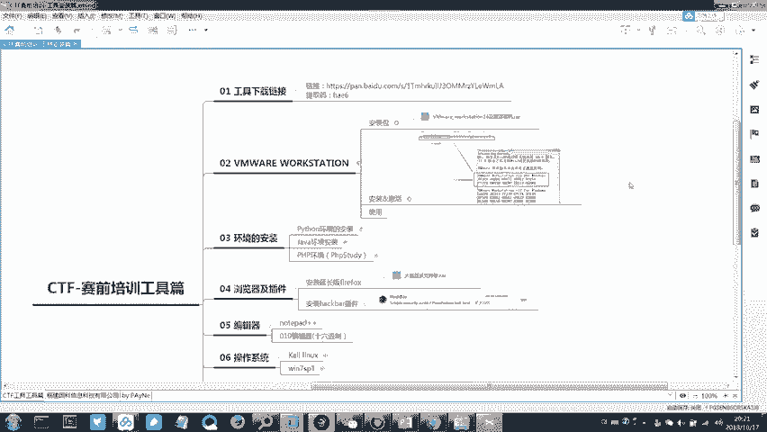

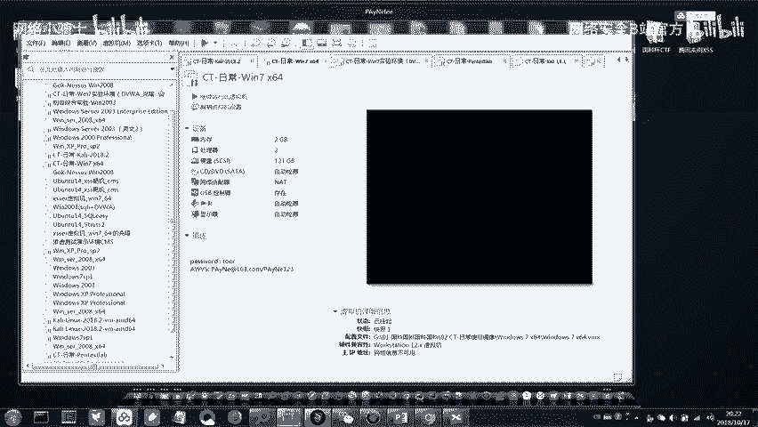

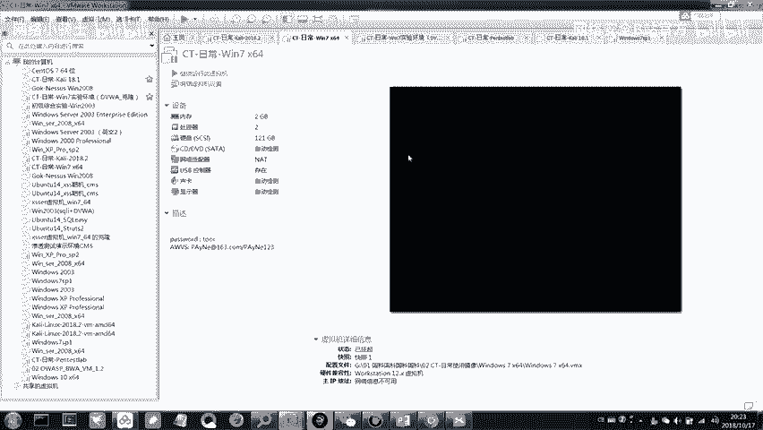

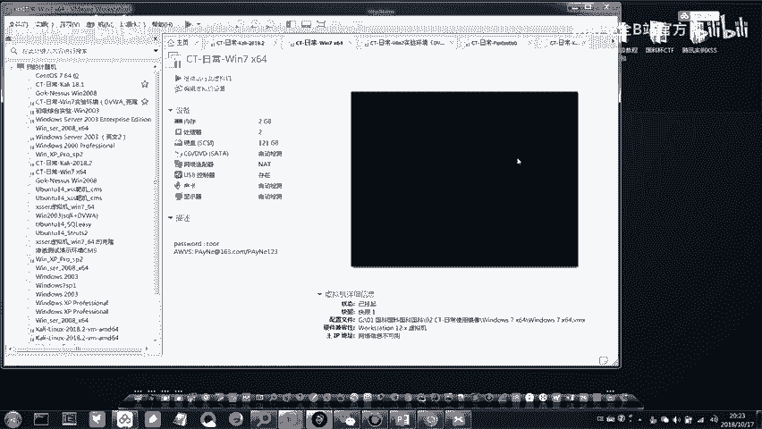

在本节课中，我们将学习CTF竞赛中必备的基础工具和环境配置。主要内容包括虚拟机软件VMware Workstation的安装与使用、Python和Java等编程环境的搭建、以及一些常用辅助工具的安装。掌握这些工具是后续深入学习CTF各项技能的基础。

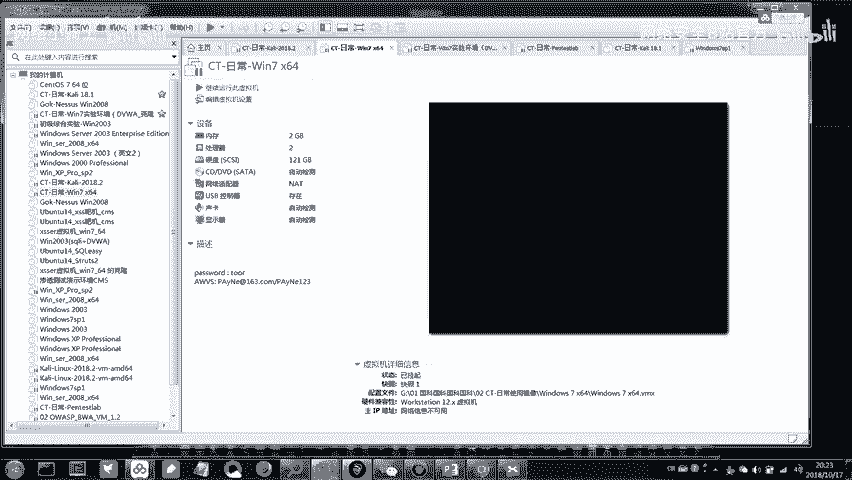

## VMware Workstation 虚拟机软件 🖥️

首先，我们需要安装并熟悉VMware Workstation这款虚拟机软件。虚拟机可以让我们在安全的隔离环境中运行各种操作系统和软件，这对于网络安全学习和CTF练习至关重要。

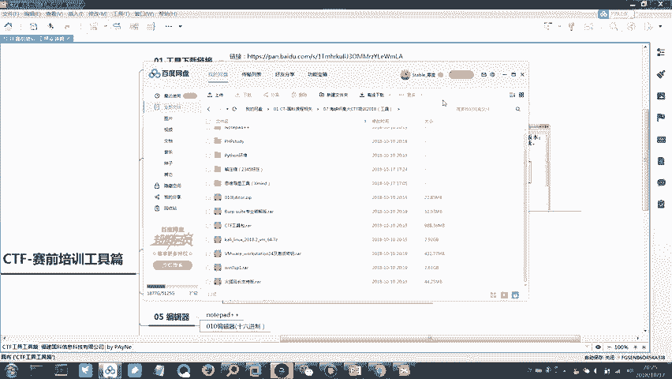

### 软件安装与激活

以下是VMware Workstation的安装步骤：

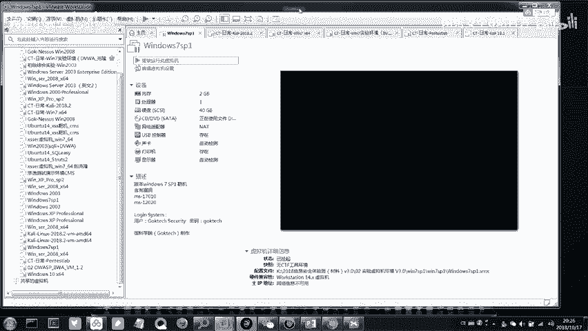

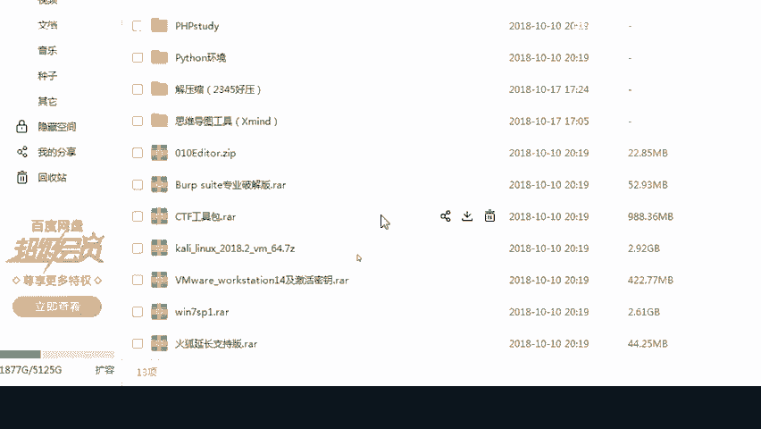

1.  **下载与安装**：从提供的资源中获取VMware Workstation 14版本的安装包。运行安装程序，在安装过程中，所有选项均选择默认设置，点击“下一步”或“确定”即可。
2.  **版本确认**：安装完成后，可以通过菜单栏的“帮助”->“关于”来查看软件版本，确保是14版本。如果版本不符，建议卸载后重新安装指定版本。
3.  **软件激活**：在安装过程中或首次启动时，会提示需要许可证密钥。在提供的文档解压包中，可以找到名为“win所有版本的永久许可证激活的密钥”的文件，使用其中标明的14版本密钥进行激活。

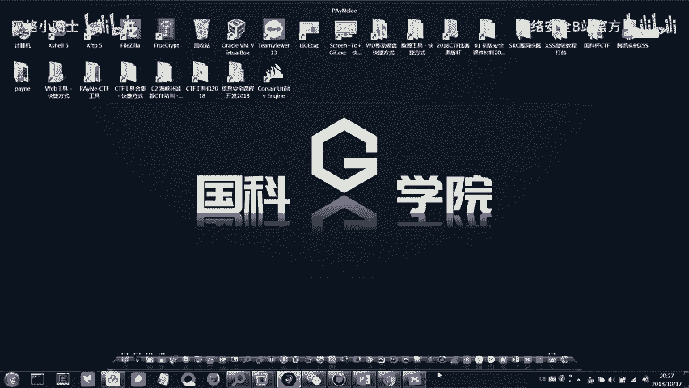

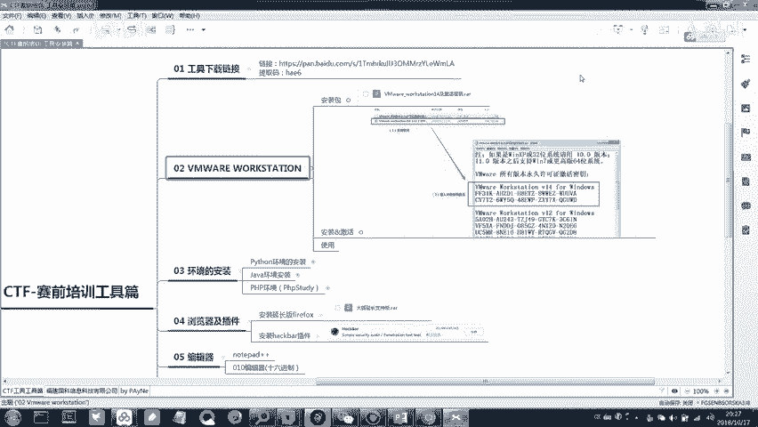

### 基本功能与使用

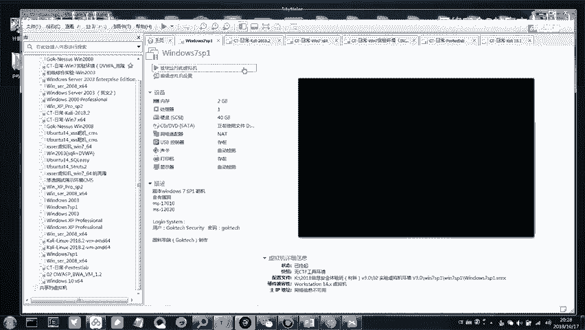

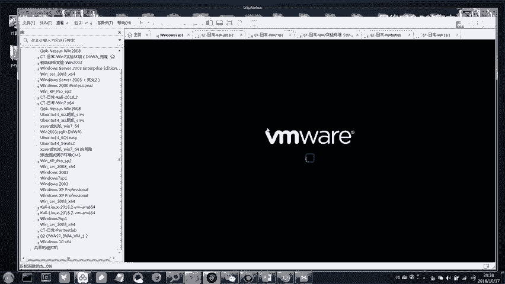

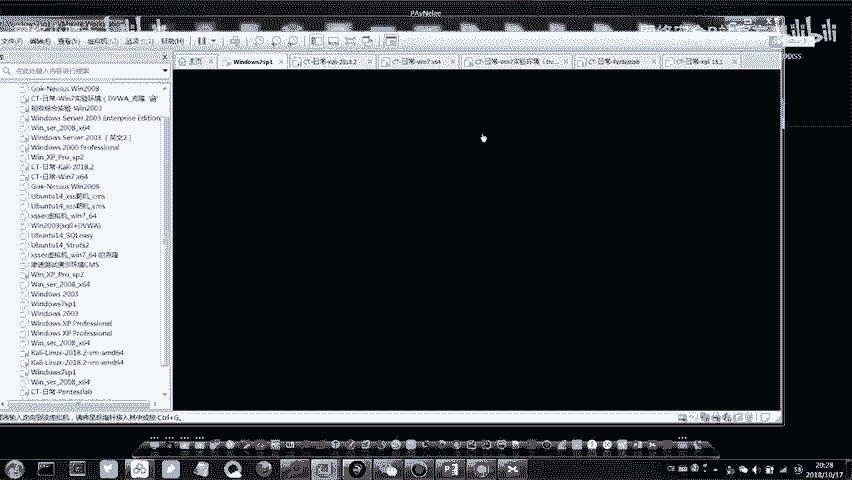

上一节我们介绍了如何安装VMware，本节中我们来看看它的核心功能。

*   **打开虚拟机**：软件主界面点击“打开”，然后选择提供的`.vmx`格式虚拟机文件（如Kali Linux或Windows 7）。这类文件是已安装好的系统镜像，直接打开即可使用，无需从ISO镜像重新安装。
*   **运行与显示**：在虚拟机列表中选中目标，点击“运行此虚拟机”即可启动。如果窗口显示过小，可以通过菜单栏的“查看”->“立即适应客户机”来自动调整窗口大小。
*   **虚拟机快照**：这是一个非常实用的功能。你可以在虚拟机的某个状态（例如安装完重要软件后）创建一个“快照”。之后如果系统出现问题或文件被误删，可以通过“恢复到快照”功能快速回到之前的状态。但请注意，创建快照会占用额外的硬盘空间。
*   **资源配置**：右键点击虚拟机，选择“设置”，可以调整分配给虚拟机的硬件资源，如内存大小、处理器核心数和硬盘容量。请根据自己电脑的实际配置进行调整，例如内存较小的电脑可以分配1GB给虚拟机，以保证主机运行流畅。

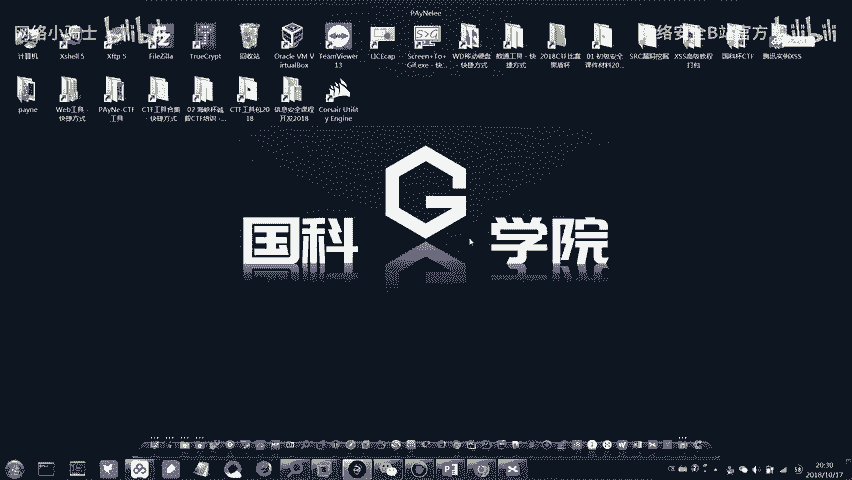

### 文件共享方法

在虚拟机和主机（真机）之间传输文件，主要有两种方法：

1.  **安装VMware Tools**：这是最便捷的方式。提供的虚拟机镜像中通常已预装此工具。安装后，可以直接在虚拟机和主机之间复制、粘贴文件和文本。如果此功能失效，可以尝试重启虚拟机或重新安装VMware Tools。
2.  **设置共享文件夹**：这是一种更稳定的文件共享方式。
    *   在虚拟机设置中，找到“选项”->“共享文件夹”，添加一个主机上的文件夹路径。
    *   启动虚拟机，在虚拟机系统内，通过“映射网络驱动器”功能，将主机共享的文件夹映射为一个网络磁盘。
    *   此后，在该文件夹内存放的文件，在虚拟机和主机上均可访问。

## 编程与运行环境搭建 ⚙️

掌握了虚拟机的基本操作后，我们需要在系统（建议在虚拟机内的Windows 7中）搭建必要的编程和运行环境。

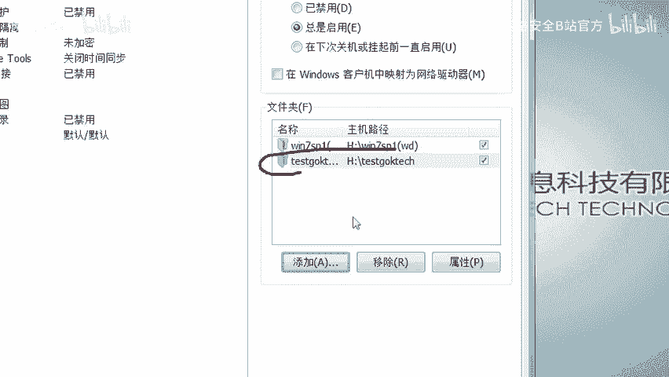

### Python环境安装

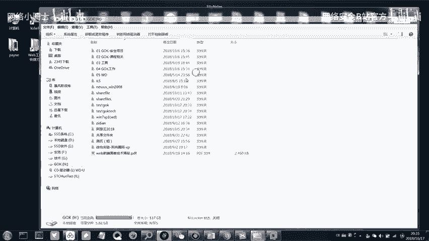

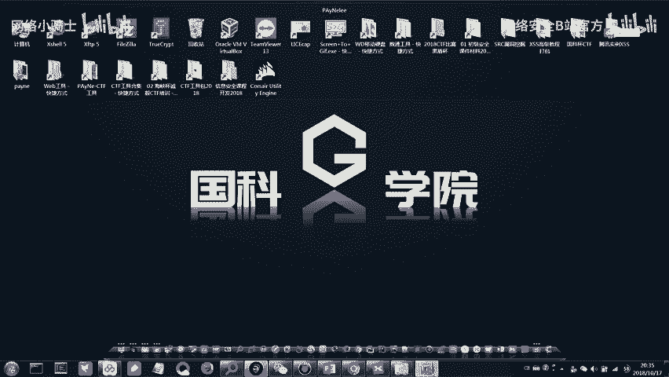

Python是CTF中编写和运行脚本的常用语言。以下是安装步骤：

1.  **运行安装包**：运行提供的Python安装包（根据系统选择32位或64位），全程使用默认选项进行安装。
2.  **配置环境变量**：这是关键步骤。安装完成后，需要将Python的安装路径添加到系统的环境变量中。
    *   打开命令提示符（按 `Win + R`，输入 `cmd` 后回车）。
    *   输入命令：`set path=%path%;C:\Python27`（假设Python安装在`C:\Python27`，请根据你的实际安装路径修改）。
3.  **验证安装**：在命令提示符中输入 `python` 并回车。如果出现Python的交互式命令行界面（显示版本号如 `Python 2.7.x`），则说明安装和环境变量配置成功。之后便可以在命令行中直接使用Python及其内置函数。

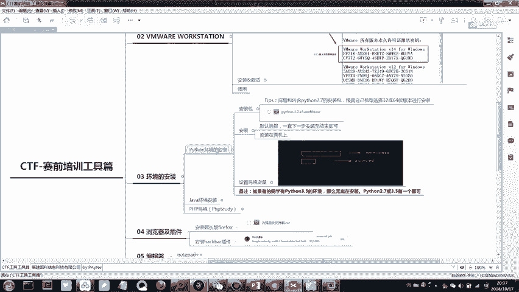

### Java环境安装

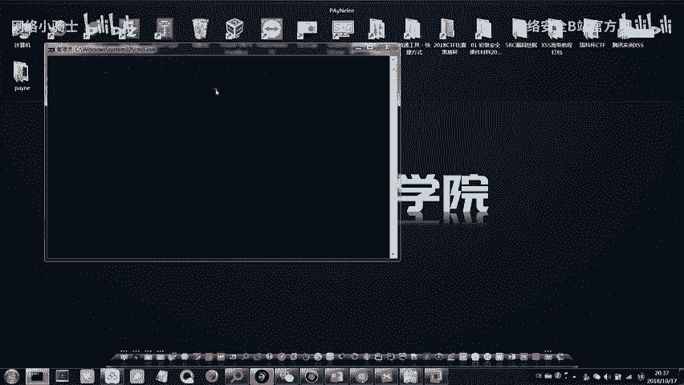

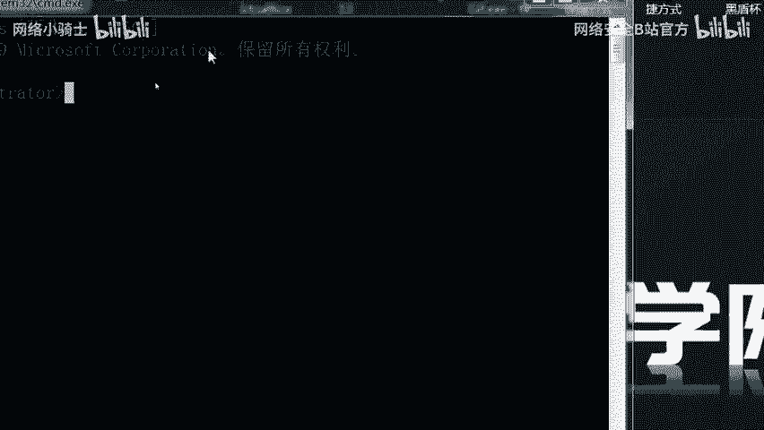

部分CTF工具和题目需要Java运行环境。

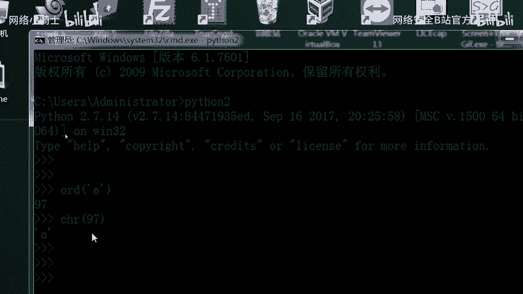

1.  **运行安装包**：运行提供的Java JDK安装包，同样全程默认安装。
2.  **验证安装**：安装完成后，打开新的命令提示符，输入命令 `java -version`。如果命令行显示Java的版本信息，则表明安装成功。

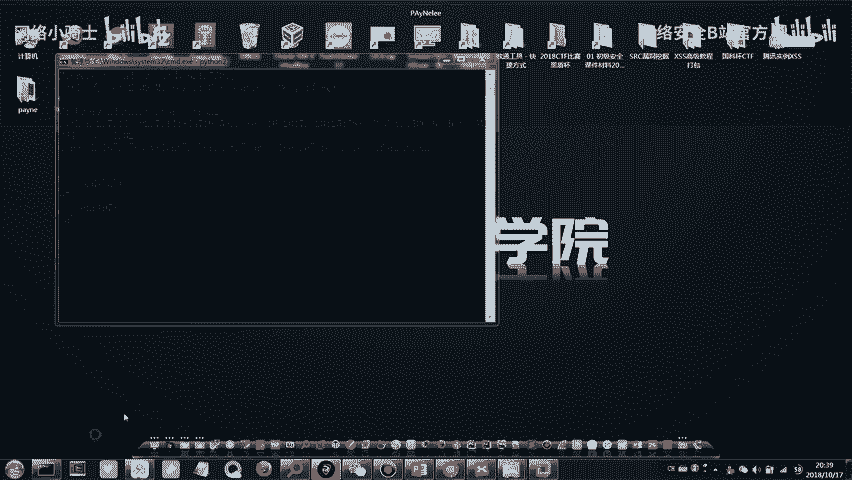

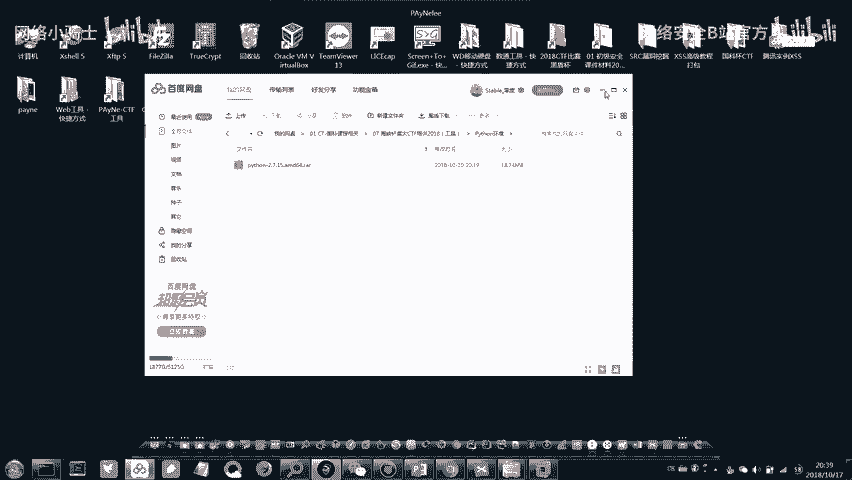

### PHP集成环境安装

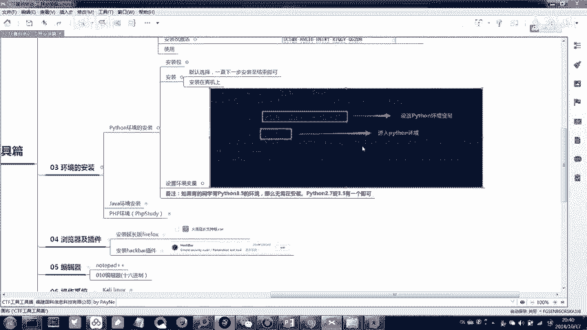

为了搭建本地Web测试环境，我们需要安装PHPStudy。

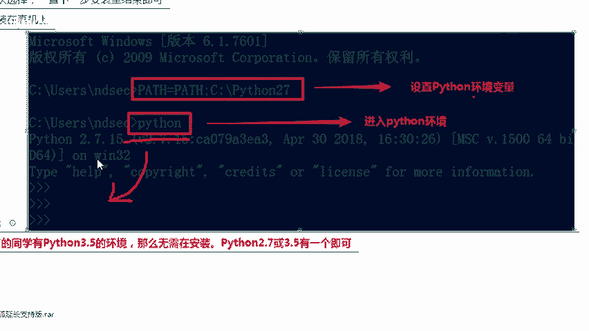

1.  **安装软件**：解压提供的PHPStudy安装包，运行安装程序，选择简体中文，按提示完成安装。
2.  **解决依赖问题**：如果安装后弹出提示框，显示系统缺少某些运行库（如VC9等），请安装PHPStudy文件夹内提供的“32位VC9和1114的运行库”组件。
3.  **注意事项**：安装路径请避免使用中文，尽量使用默认的英文路径，以防止出现兼容性问题。

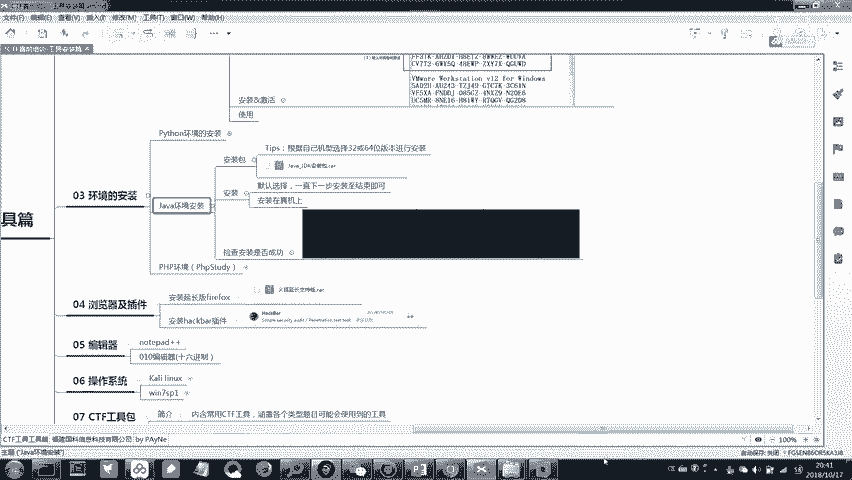

## 必备辅助工具 🛠️

最后，我们安装几个在CTF中常用的辅助工具。

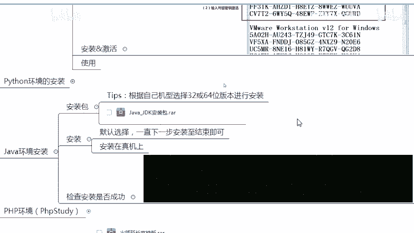

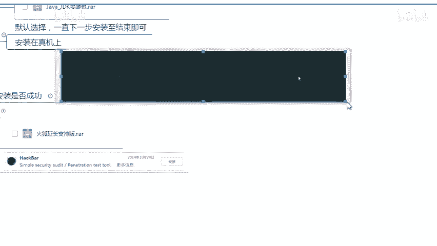

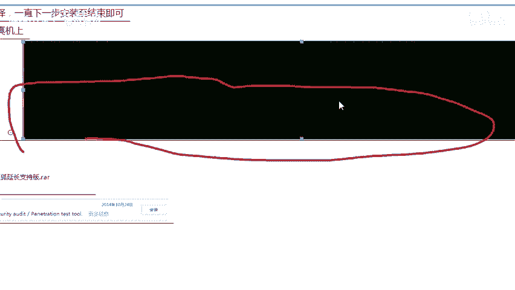

### 火狐浏览器与HackBar插件

我们需要一个特定版本的Firefox浏览器来配合安全插件使用。

1.  **安装浏览器**：安装提供的旧版本Firefox浏览器（非最新版）。这是因为我们要使用的安全插件与该版本兼容性最好。
2.  **安装HackBar插件**：
    *   打开Firefox，点击菜单，进入“附加组件”。
    *   在扩展页面搜索“HackBar”。
    *   在搜索结果中，**选择安装2014年发布的那个HackBar插件版本**（在脑图中有截图示例）。这个版本的插件功能稳定且实用。

### 代码与二进制编辑器

以下是两个功能强大的编辑器：

1.  **Notepad++**：这是一个增强型文本编辑器，支持多种编程语言的语法高亮，比系统自带的记事本功能强大得多。安装过程简单，选择对应系统位数的安装包默认安装即可。
2.  **010 Editor**：这是一个专业的二进制（十六进制）编辑器，在CTF的杂项（Misc）题目中，常用于分析文件结构、修复文件头等操作。同样按照提示安装即可。

---

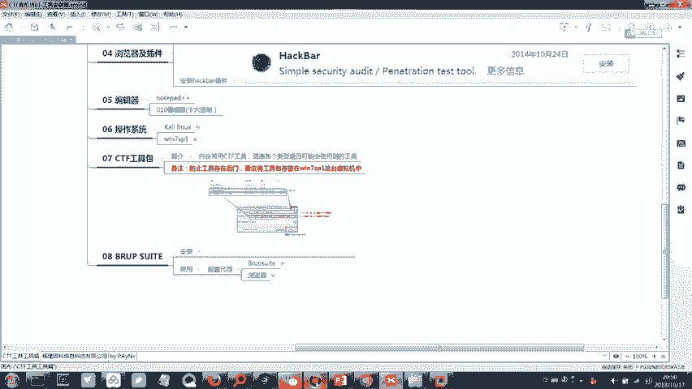

本节课中我们一起学习了CTF入门所需的核心工具与环境配置。我们介绍了VMware虚拟机的安装和使用方法，搭建了Python、Java和PHP的运行环境，并安装了Firefox浏览器、HackBar插件以及Notepad++、010 Editor等实用编辑器。请大家根据教程逐步完成安装和配置，如果在过程中遇到问题，可以随时提问。下节课我们将继续介绍其他重要的CTF工具。