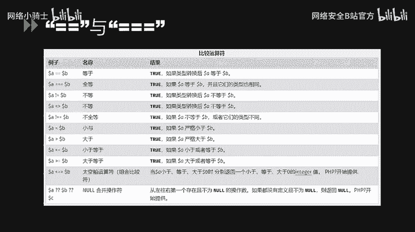
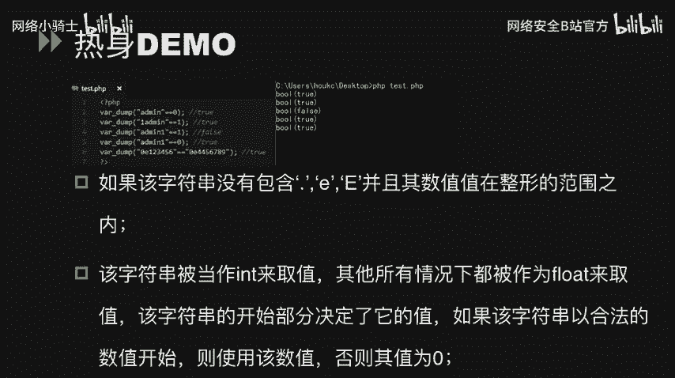
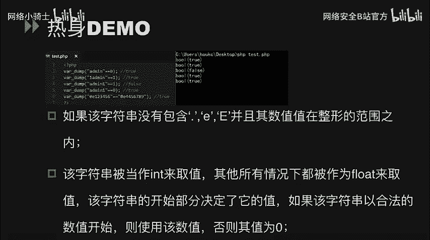
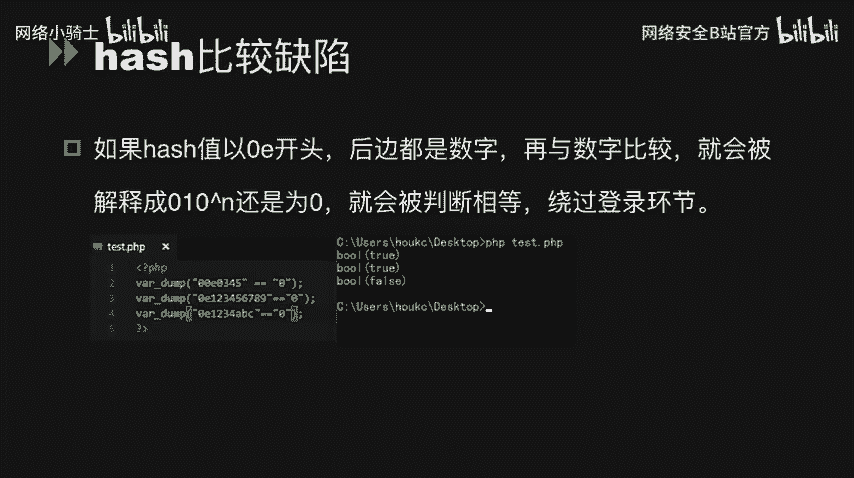
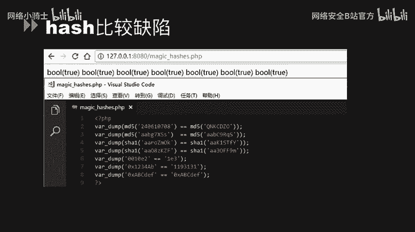
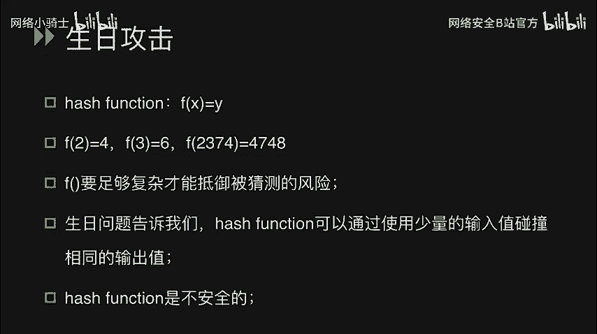
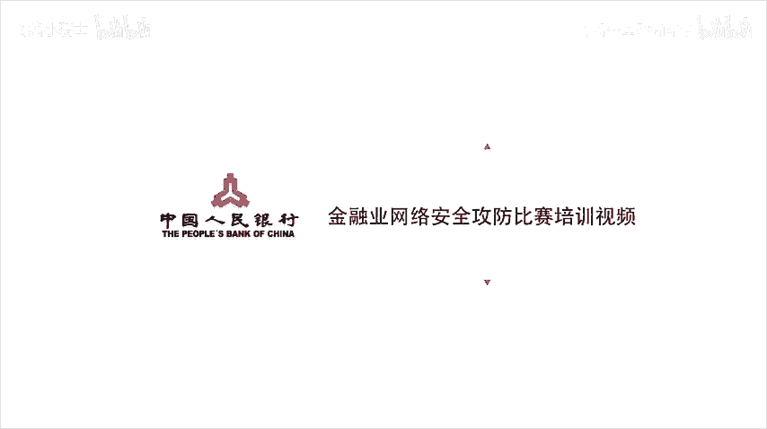

# CTF最强战队蓝莲花内部培训教程：P51：52.代码审计


## 概述
在本节课中，我们将要学习CTF比赛中PHP代码审计的核心应用。我们将重点探讨PHP中松散比较与严格比较的区别、哈希比较缺陷、布尔欺骗、数字转换欺骗以及相关函数的特性，并通过具体示例演示如何利用这些特性发现和利用漏洞。



## PHP中的比较运算符：`==` 与 `===`

上一节我们介绍了代码审计的重要性，本节中我们来看看PHP中两个核心的比较运算符：双等号（`==`）和三个等号（`===`）。

*   **双等号 (`==`)**：称为松散比较。在进行比较时，如果操作数类型不同，PHP会尝试将它们转换为相同类型后再进行比较。
*   **三个等号 (`===`)**：称为严格比较。在进行比较时，不仅比较值，还会比较操作数的类型。类型不同则直接返回 `false`。


松散比较中的类型转换是许多安全问题的根源。例如，当比较一个数字和一个字符串时，字符串会被转换为数值。

**代码示例：类型转换**
```php
var_dump(1 == "1");    // 输出: bool(true)
var_dump(1 === "1");   // 输出: bool(false)
var_dump(0 == "abc");  // 输出: bool(true)，因为"abc"被转换为数值0
```

## 松散比较的陷阱与利用

理解了基本概念后，我们通过一些具体场景来看看松散比较可能带来的问题。



以下是几个典型的松散比较示例：


1.  **字符串与数字比较**：`"admin" == 0` 结果为 `true`，因为 `"admin"` 在转换为数值时，由于开头不是数字，被转换为 `0`。
2.  **数字开头的字符串**：`"1admin" == 1` 结果为 `true`，因为转换时取开头数字 `1`。
3.  **非数字开头的字符串**：`"admin1" == 1` 结果为 `false`，因为转换结果为 `0`。





一个更隐蔽的利用涉及PHP的哈希值解析特性。

**哈希比较缺陷**：如果一个字符串形式的哈希值以 `0E` 开头，后面全是数字（例如 `0e123456`），PHP在松散比较中会将其解释为科学计数法 `0 * 10^123456`，其值等于 `0`。

**公式示例：**
```
"0e123456" == "0e987654"  // 结果为 true，因为两者都被解释为 0
"0e123456" == 0           // 结果为 true
```



因此，即使两个MD5值原文不同，只要其哈希结果符合 `0E+纯数字` 的格式，它们通过 `==` 比较就会相等。这常被用于绕过登录凭证的验证。

## 哈希“魔法值”与布尔欺骗

基于哈希比较缺陷，安全研究人员整理出了一些特定的字符串，它们的MD5值恰好是 `0E` 开头的。

以下是部分已知的“魔法值”对：
*   `240610708` 的 MD5 是 `0e462097431906509019562988736854`
*   `QNKCDZO` 的 MD5 是 `0e830400451993494058024219903391`
*   因此 `md5('240610708') == md5('QNKCDZO')` 在松散比较下为 `true`。

另一种欺骗手法是**布尔欺骗**。当使用 `json_decode()` 或 `unserialize()` 函数处理数据时，部分结构可能被解释为布尔类型 `true`。


**代码示例：布尔欺骗**
```php
// 示例1: json_decode
$json_string = '{"user":true,"pass":true}';
$data = json_decode($json_string, true);
if ($data['user'] == 'admin' && $data['pass'] == 'secret') {
    echo "登录成功！"; // 此分支会被执行，因为 true == 'admin' 为真
}

// 示例2: unserialize
$serialized_string = 'a:2:{s:4:"user";b:1;s:4:"pass";b:1;}';
$data = unserialize($serialized_string);
if ($data['user'] == 'admin' && $data['pass'] == 'secret') {
    echo "登录成功！"; // 此分支同样会被执行
}
```

## 数字转换欺骗

数字转换欺骗发生在字符串被强制转换为数值的场景。

以下是相关示例：

1.  **`intval()` 函数**：`intval("3abc")` 返回 `3`，`intval("abc")` 返回 `0`。
2.  **科学计数法字符串**：`"123456" == "0x1E240"` 结果为 `true`，因为 `"0x1E240"`（十六进制）被转换为十进制 `123456`。
3.  **浮点数转换**：`"0.999999999" == "1"` 在极高精度下可能因转换误差而成立，但在PHP常见环境中，`"0.999999999" == 1` 通常为 `false`。更常见的利用是如 `"1abc" == 1` 为 `true`。

**代码示例：数字转换欺骗**
```php
$uid = $_GET['uid']; // 用户输入
if ($uid == 1) {
    // 如果用户传入 uid=1abc，此条件判断为 true
    $sql = "SELECT * FROM users WHERE id = $uid";
}
```

## 特定函数的松散行为

一些PHP函数在处理非预期类型参数时，行为可能不符合直觉，从而引入漏洞。

*   **`strcmp()` 函数**：用于比较两个字符串。若传入一个数组作为参数，函数会返回 `NULL`。在松散比较中，`NULL == 0` 为 `true`。
    ```php
    // 假设通过GET传入 ?password[]=a
    if (strcmp($_GET['password'], 'secret_password') == 0) {
        echo "密码正确！"; // 传入数组可使此分支执行
    }
    ```

*   **`md5()` 函数**：计算字符串的MD5哈希值。如果传入一个数组，函数会返回 `NULL` 并产生一个警告，但不会终止执行。因此，两个不同数组的 `md5()` 结果在松散比较下相等（`NULL == NULL`）。
    ```php
    $arr1 = array('a');
    $arr2 = array('b');
    if (md5($arr1) == md5($arr2)) {
        echo "MD5相等！"; // 此分支会被执行
    }
    ```

## 哈希函数与生日攻击

最后，我们从理论层面理解为什么哈希比较可能存在风险。这涉及到密码学中的**生日攻击**概念。

生日问题是一个著名的概率问题：在一个房间里，至少需要多少人，才能使其中两个人生日相同的概率超过50%？答案远小于365，大约是23人。当人数达到70时，概率超过99.9%。

这个原理应用于哈希函数，意味着即使哈希函数非常复杂（例如 `f(x) = 2x` 这样简单的函数不符合要求），由于输入空间（可能的原文）远大于输出空间（固定长度的哈希值），找到两个不同输入产生相同哈希值（即碰撞）的难度，比找到与特定哈希值对应的原文的难度要低得多。

**结论**：没有绝对安全的哈希函数。对于MD5、SHA1等算法，已经可以高效地制造碰撞。因此，在安全要求高的场景，应使用更安全的算法（如SHA-256、SHA-3），并配合加盐（salt）处理。





## 总结
本节课中我们一起学习了PHP代码审计中的关键知识点。我们分析了松散比较(`==`)与严格比较(`===`)的本质区别，探讨了如何利用哈希比较缺陷、布尔欺骗、数字转换欺骗来绕过逻辑判断。我们还了解了`strcmp()`和`md5()`等函数在处理异常输入时的行为，并从生日攻击的角度理解了哈希函数固有的碰撞风险。掌握这些原理，是发现和利用PHP Web应用漏洞的基础。