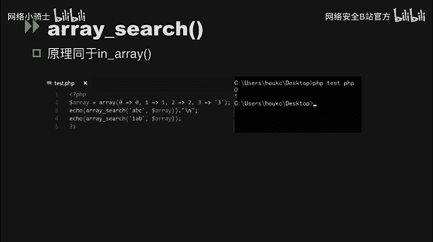
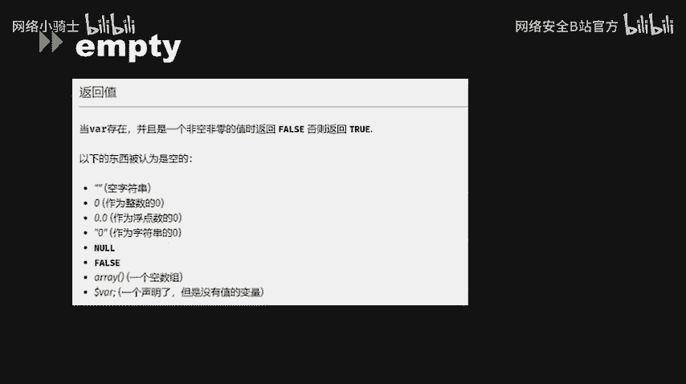
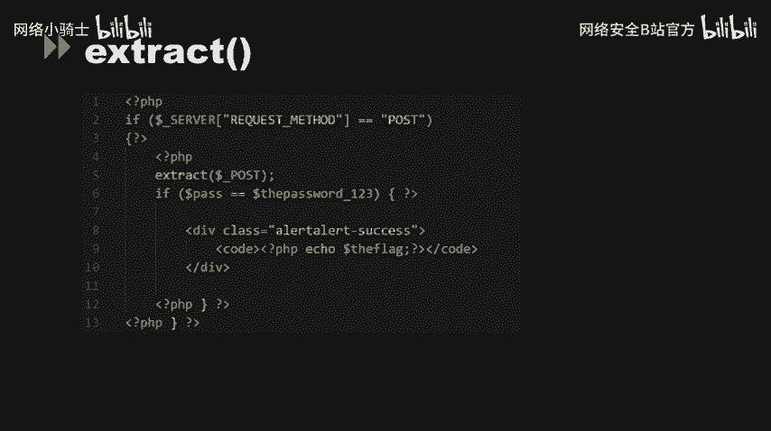
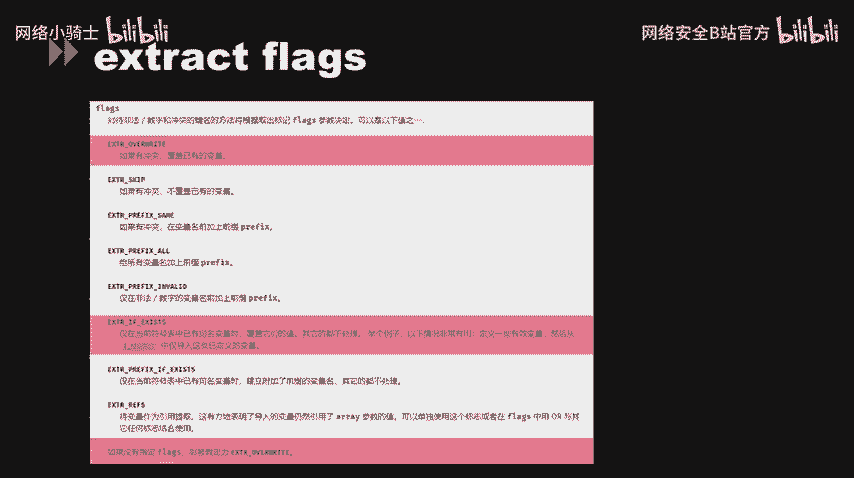
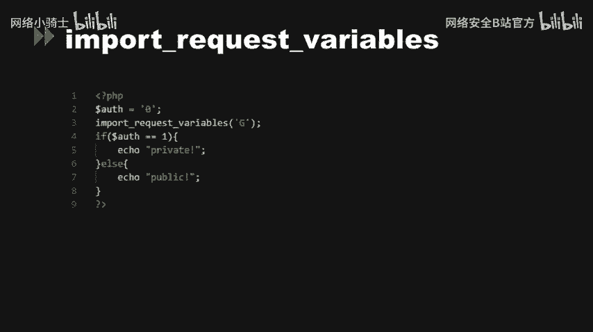
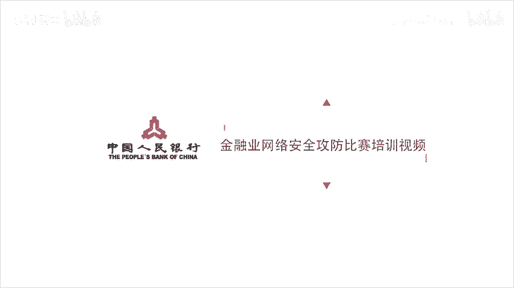

# CTF最强战队蓝莲花内部培训教程：P52：53.代码审计 🕵️


在本节课中，我们将要学习PHP代码审计中的几个核心概念，包括松散比较绕过、变量覆盖漏洞以及相关函数的特性。这些知识对于发现和利用Web应用中的安全漏洞至关重要。

---

## 松散比较与MD5绕过 🔄

上一节我们介绍了代码审计的基础，本节中我们来看看PHP中松散比较的典型问题及其在CTF挑战中的应用。

在CTF题目中，常会遇到使用松散比较（`==`）判断两个参数或它们的MD5值是否相等的情况。松散比较在比较前会尝试进行类型转换，这可能被利用来绕过检查。

以下是利用MD5函数缺陷绕过检查的几种情况：



1.  **第一环节：参数直接比较**
    当代码直接使用松散比较判断两个参数是否相等时，可以利用PHP的类型转换特性。例如，字符串与数字`0`松散比较结果为真。

2.  **第二环节：MD5值松散比较**
    当代码比较两个参数的MD5值时，如果输入是数组，`md5()`函数会返回`NULL`并产生警告。两个`NULL`值松散比较结果为真，因此可以通过传入数组参数来绕过。
    ```php
    // 示例：传入 a[]=1&b[]=2，md5($_GET['a']) == md5($_GET['b']) 结果为真
    ```



3.  **第三环节：MD5碰撞**
    当无法利用上述缺陷时，需要使用MD5碰撞。即找到两个不同的字符串，但它们的MD5值完全相同。我们可以使用现成的碰撞字符串对来满足条件。
    ```php
    $str1 = "4dc968ff0ee35c209572d4777b721587d36fa7b21bdc56b74a3dc0783e7b9518afbfa200a8284bf36e8e4b55b35f427593d849676da0d1555d8360fb5f07fea2";
    $str2 = "4dc968ff0ee35c209572d4777b721587d36fa7b21bdc56b74a3dc0783e7b9518afbfa200a8284bf36e8e4b55b35f427593d849676da0d1555d8360fb5f07fea2";
    // $str1 和 $str2 的原始值不同，但MD5值相同
    ```

---

## 类型转换与函数特性 ⚙️

理解了松散比较后，我们进一步探讨PHP中其他因类型转换可能导致安全问题的函数。

*   **`switch` 函数**：`switch`在比较前会对条件值进行强制类型转换。例如，字符串 `"2abc"` 会被转换为整数 `2`，从而进入 `case 2` 的分支。
*   **`is_numeric` 函数**：该函数会判断字符串是否为数字，包括十六进制格式（如`0x...`）。这可能导致攻击者提交的十六进制字符串被误判为数字，进而引发后续的SQL注入等问题。
*   **`in_array` 与 `array_search` 函数**：当未设置第三个参数 `$strict` 为 `true` 时，这两个函数会使用松散比较在数组中搜索值。例如，字符串 `"abc"` 在数组 `[0, 1, 2, 3]` 中会被认为是存在的，因为 `"abc"` 松散比较等于 `0`。
    ```php
    // 示例：in_array("abc", [0,1,2,3]) 返回 true
    ```
*   **`empty` 函数**：该函数在判断 `0`、`"0"`、`0.0` 等值时也会返回 `true`。如果开发者未意识到这一点，可能导致条件判断被绕过。类似问题的函数还有 `isset`、`strpos` 等。

---

## 变量覆盖漏洞 🎯



上一节我们介绍了由类型转换引发的问题，本节中我们来看看另一类高危漏洞：变量覆盖。变量覆盖允许攻击者篡改程序原有的变量值。



以下是几种常见的变量覆盖场景：

*   **双美元符号（`$$`）**：使用`foreach`等循环时，如果将用户输入的键名直接用作变量名，会导致变量被覆盖。
    ```php
    // 示例：$_GET['name'] = 'test'; $$key = $value; 会导致 $name 变量被覆盖为 'test'
    ```
*   **`extract` 函数**：该函数将数组中的键值对导入为变量，是导致变量覆盖的最常见原因。默认情况下（未设置`EXTR_SKIP`等标志），它会覆盖已有的同名变量。
    ```php
    // 示例：extract($_GET); 如果GET请求中有名为‘flag’的参数，则会覆盖已有的 $flag 变量。
    ```
    值得注意的是，`extract`函数仅在标志位为`EXTR_OVERWRITE`或`EXTR_IF_EXISTS`时存在覆盖行为，而默认标志正是`EXTR_OVERWRITE`。
*   **`parse_str` 函数**：该函数将查询字符串解析并设置为变量。如果未提供第二个数组参数，解析出的变量会直接覆盖全局作用域中的同名变量。
    ```php
    // 示例：parse_str("flag="); 会将 $flag 变量设置为空。
    ```
*   **`import_request_variables` 函数**：此函数（已废弃）用于将GET、POST、Cookie变量导入全局作用域，常用于在`register_globals`关闭时模拟其功能，但同样会引入变量覆盖风险。

---

## 总结 📝

本节课中我们一起学习了PHP代码审计中的几个关键知识点：
1.  **松散比较（`==`）的陷阱**：利用类型转换和MD5函数的特性（处理数组返回`NULL`、MD5碰撞）可以绕过等值判断。
2.  **敏感函数的类型转换特性**：`switch`、`is_numeric`、`in_array`、`empty`等函数在特定使用方式下可能产生非预期的结果，成为安全漏洞。
3.  **变量覆盖漏洞**：`$$`、`extract()`、`parse_str()`、`import_request_variables()`等特性或函数，如果处理了不可信的用户输入，可能导致程序原有变量被恶意覆盖，从而绕过安全逻辑或直接获取权限。





掌握这些原理是进行有效代码审计和CTF解题的基础。在实际审计中，需要仔细检查代码中是否存在这些危险模式，并理解用户输入如何影响程序状态。