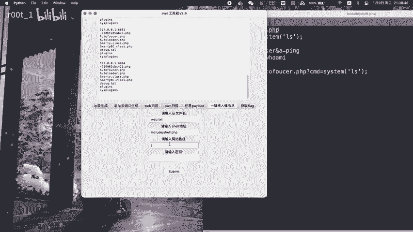
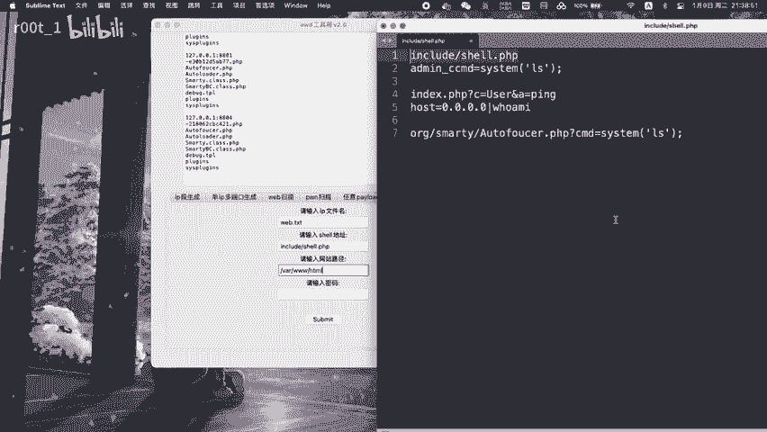
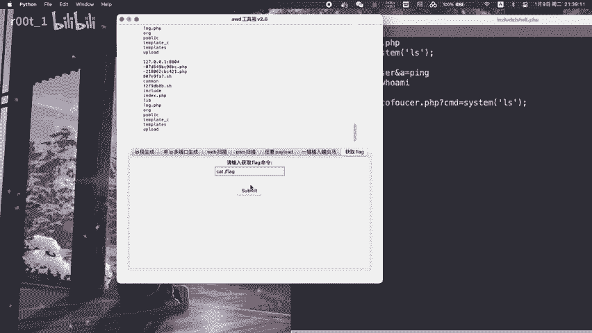

# AWDL 使用详解：P1：基础概念与启动

在本教程中，我们将学习 AWDL（Apple Wireless Direct Link）的基础概念及其启动过程。AWDL 是苹果设备间用于实现点对点无线通信的协议，常见于 AirDrop、Sidecar 等功能。

## 概述

AWDL 是一种低功耗、高性能的无线通信协议，它允许苹果设备在不连接传统 Wi-Fi 网络的情况下直接通信。理解其基础概念是掌握后续高级功能的关键。

上一节我们介绍了本教程的学习目标，本节中我们来看看 AWDL 的核心工作机制。

## AWDL 的核心工作机制

AWDL 通过在特定信道上同步设备间的通信窗口来实现高效的点对点连接。其核心是时间同步与信道切换机制。

以下是 AWDL 工作流程中的几个关键步骤：

1.  **设备发现**：设备通过发送和监听特定的广播帧来发现周围的 AWDL 设备。
2.  **时间同步**：设备间同步它们的“唤醒”时间表，以协调通信时机，节省电量。
3.  **信道协商**：设备协商一个共同的信道用于后续的数据传输。
4.  **数据传输**：在协商好的信道上，设备在同步的通信窗口内进行高速数据传输。

这个过程可以用一个简单的状态机来描述：

```python
# 简化的 AWDL 状态机概念
状态 = ["发现", "同步", "协商", "传输"]

for 当前状态 in 状态:
    if 当前状态 == "发现":
        执行设备发现()
    elif 当前状态 == "同步":
        执行时间同步()
    # ... 其他状态
```



## AWDL 的启动与初始化

AWDL 的启动通常由系统或特定应用（如 AirDrop）触发。启动过程包括初始化网络接口和开始发现对等设备。



以下是启动 AWDL 接口可能涉及的操作：

*   启用系统内的 AWDL 功能模块。
*   配置无线网卡进入 AWDL 兼容模式。
*   开始监听和发送 AWDL 宣告帧。

启动成功后，设备便可以作为 AWDL 网络中的一个节点进行工作。



## 总结

本节课中我们一起学习了 AWDL 的基础概念。我们了解到 AWDL 是苹果生态中用于设备直连的协议，其核心是通过时间同步和信道协商来建立高效的临时网络。我们还简要介绍了其启动过程。理解这些基础知识是后续深入学习 AWDL 高级特性和排错的关键。