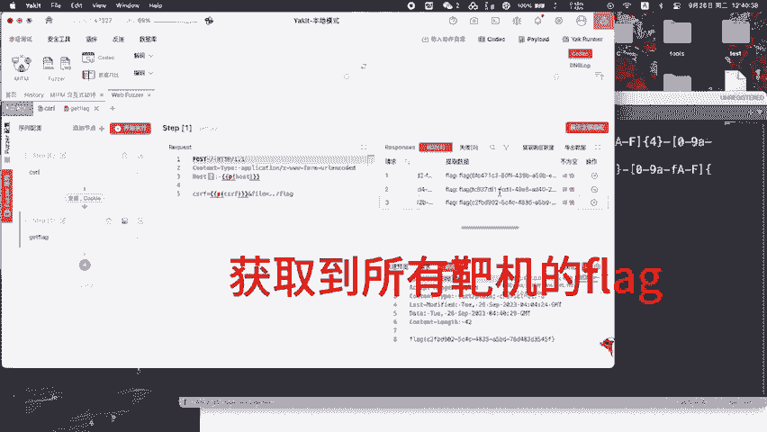
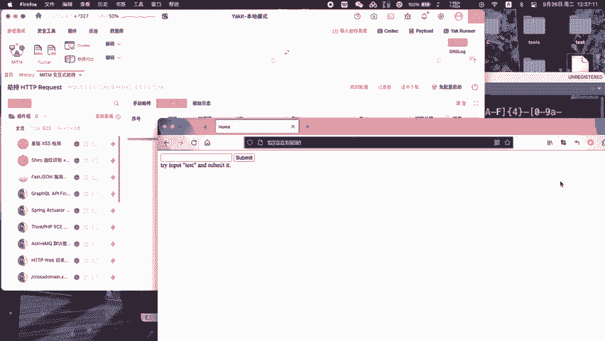
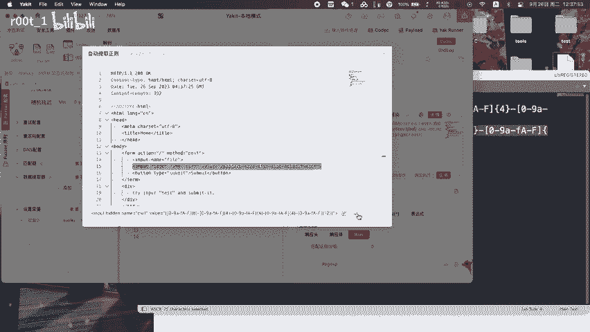
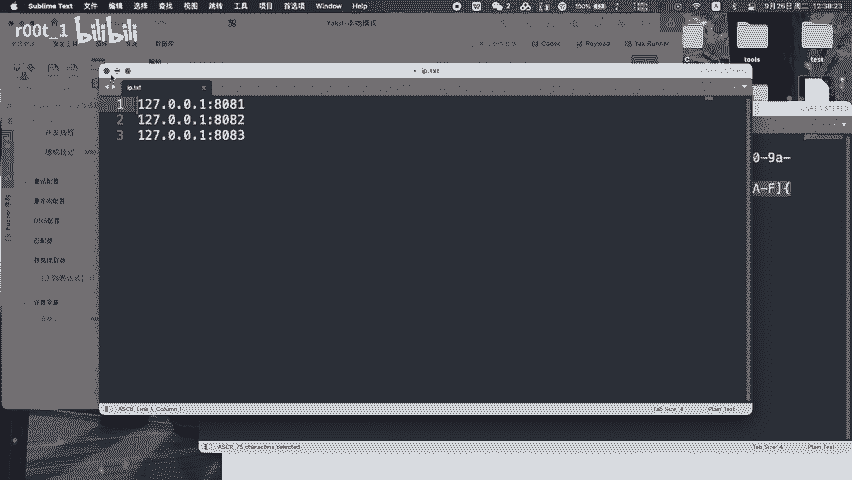
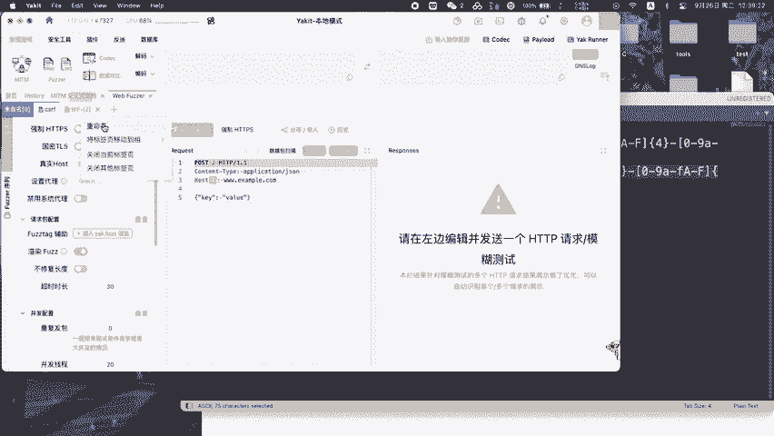
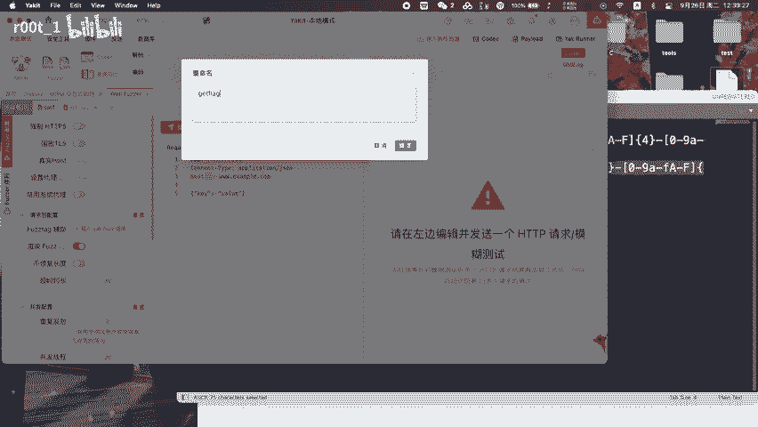
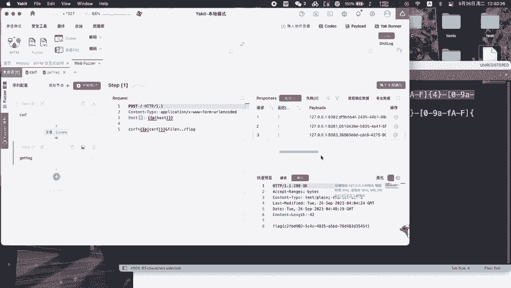
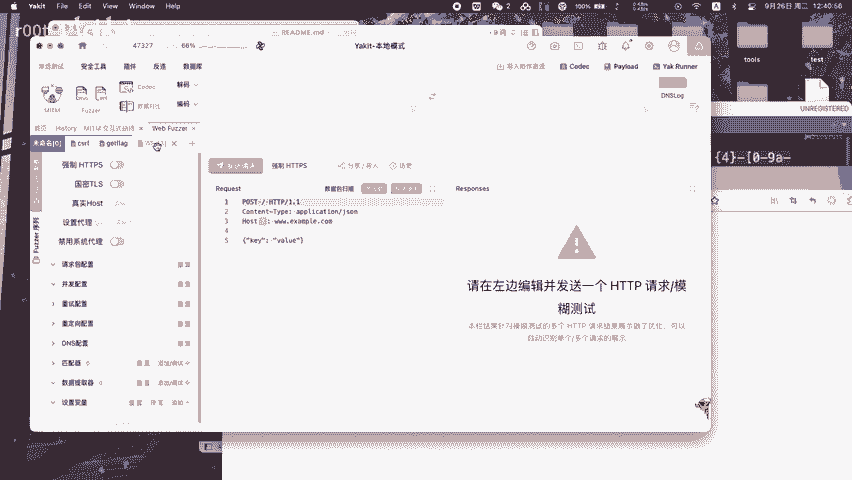
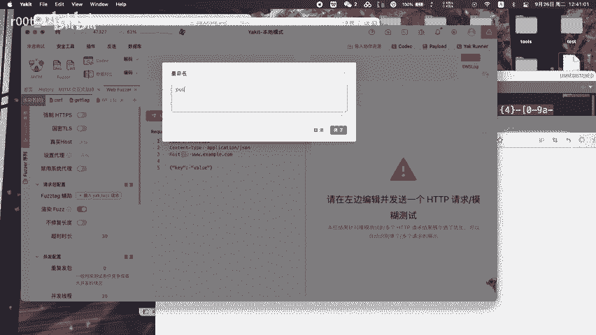
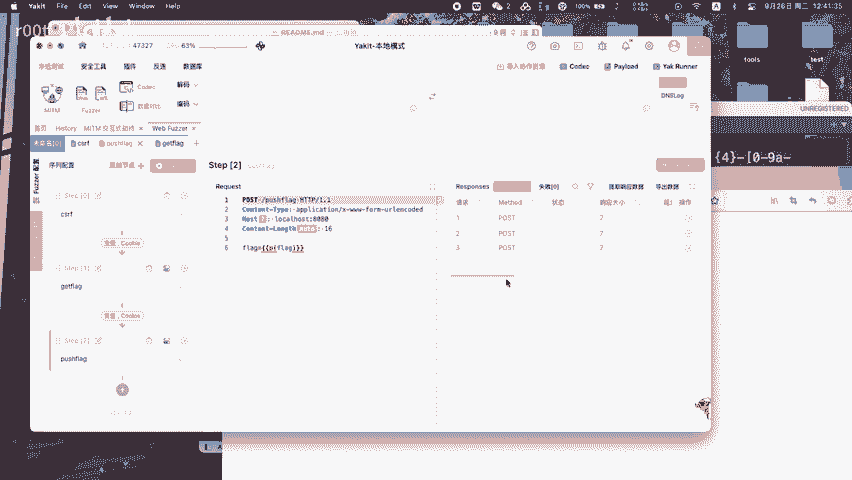

# AWD学习：P1：利用Yakit一键获取提交Flag



## 概述
在本节课中，我们将学习如何在AWD（Attack With Defense）攻防赛中，使用Yakit工具自动化地获取并提交Flag。整个过程分为两个核心步骤：首先获取所有靶机的访问令牌（Token），然后利用该令牌批量获取Flag。我们将通过构造和发送HTTP请求，并使用正则表达式匹配关键信息来实现自动化。

---



## 第一步：获取访问令牌（Token）

上一节我们介绍了课程目标，本节中我们来看看如何获取访问靶机所必需的Token。

首先，需要通过发包来获取Token。我们构造第一个HTTP请求包，其中包含用于登录或认证的特定参数。



以下是构造第一个请求包的关键步骤：
1.  设置请求方法为 **POST**（或根据实际情况调整）。
2.  设置目标URL为登录或获取Token的接口地址。
3.  在请求体中填入正确的认证参数，例如用户名和密码。
    ```http
    POST /api/login HTTP/1.1
    Host: target_ip
    Content-Type: application/x-www-form-urlencoded

    username=admin&password=admin123
    ```
4.  发送请求后，从服务器响应中提取Token。Token通常位于响应头（如`Authorization`字段）或响应体的JSON数据中。


发送请求后，测试匹配效果，确保我们能够正确地从响应中提取出Token字符串。这通常通过编写一个正则表达式来完成。



---

## 第二步：插入多台靶机IP并获取Flag

在成功获取Token之后，本节我们将利用这个Token来批量获取多台靶机的Flag。

将多台靶机的IP地址插入到我们的自动化脚本或工具配置中。无需等待太久，流程即可运行。



以下是利用Token获取Flag的核心步骤：
1.  使用上一步获取的Token，构造第二个HTTP请求包来访问获取Flag的接口。
    ```http
    GET /api/flag HTTP/1.1
    Host: target_ip
    Authorization: Bearer your_token_here
    ```
2.  为每一台靶机的IP地址，重复发送这个携带Token的请求。
3.  从每个请求的响应中，使用一个专门的正则表达式来匹配和提取Flag。Flag的格式通常类似 `flag{xxxx-xxxx-xxxx}`。




成功从每一台靶机获取到Flag后，就完成了核心的收割任务。

---

## 第三步：自动化与数据包转换



上一节我们完成了手动获取Flag的过程，本节中我们来看看如何将整个过程自动化。

将上述一系列手动操作（发送请求、匹配数据）转换为可以被Yakit自动执行的命令或数据流。Yakit能够将我们配置的请求流程转换为可重复执行的数据包序列。




在Yakit中配置好流程后，即可一键运行。工具会自动遍历所有靶机IP，依次执行获取Token和获取Flag的请求，并提取结果。





最终，通过比较提交结果，确认所有Flag是否成功获取并提交。

---


## 总结
本节课中我们一起学习了在AWD比赛中使用Yakit进行自动化攻击的关键技巧。我们掌握了三个核心环节：
1.  **构造请求获取Token**：通过分析登录接口，发送认证包并提取Token。
2.  **利用Token批量获取Flag**：使用Token构造授权请求，遍历靶机IP并提取Flag。
3.  **实现流程自动化**：在Yakit中配置整个流程，实现一键化操作，极大提升效率。

通过本教程，你可以将重复的手动操作转化为高效的自动化脚本，从而在紧张的比赛环境中占据优势。