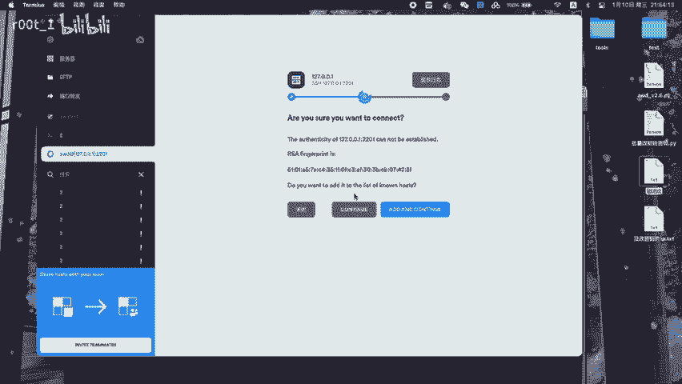
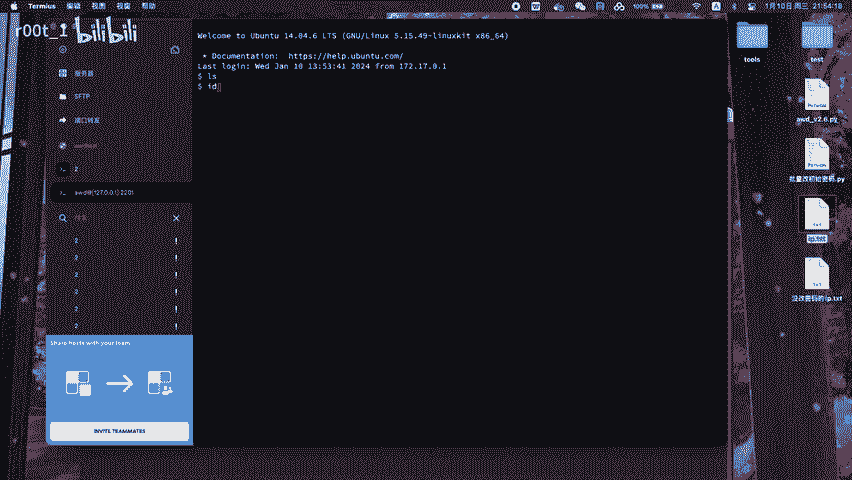

# AWD比赛技巧：P1：如何定时批量更改SSH密码

在本教程中，我们将学习在AWD（Attack With Defense）网络安全竞赛中，如何通过编写脚本定时、批量地更改多台服务器的SSH登录密码。这是防守方维持服务器控制权、防止被对手利用固定密码入侵的关键技巧。

上一节我们介绍了背景，本节中我们来看看具体的实现步骤。

## 核心思路与准备工作

核心思路是编写一个Shell脚本，利用`sshpass`工具非交互式地登录目标服务器，并使用`passwd`命令修改密码。最后，通过Linux系统的`crontab`服务设置定时任务，让脚本定期自动执行。

实现此功能需要两个核心工具：
1.  **sshpass**：用于在命令行中非交互式地输入SSH密码。
2.  **crontab**：用于设置定时任务。

以下是安装这些工具的命令（以Ubuntu/Debian系统为例）：
```bash
sudo apt-get update
sudo apt-get install sshpass cron
```

## 编写批量改密脚本

接下来，我们创建一个Shell脚本文件，例如 `change_passwd.sh`。

以下是脚本内容及分步解释：
```bash
#!/bin/bash

# 定义新密码
NEW_PASSWORD="YourNewStrongPassword123!"

# 读取服务器列表文件
# 文件格式：每行“IP地址 旧密码”
SERVERS_LIST="servers.txt"

# 循环处理每一台服务器
while read -r line; do
    # 提取IP和旧密码
    IP=$(echo $line | awk '{print $1}')
    OLD_PASS=$(echo $line | awk '{print $2}')

    echo "正在处理服务器：$IP"

    # 使用sshpass登录并执行改密命令
    sshpass -p "$OLD_PASS" ssh -o StrictHostKeyChecking=no root@$IP "echo -e '$NEW_PASSWORD\n$NEW_PASSWORD' | passwd root"

    # 检查上一条命令是否执行成功
    if [ $? -eq 0 ]; then
        echo "[成功] $IP 密码已更改。"
    else
        echo "[失败] $IP 密码更改失败。"
    fi

done < "$SERVERS_LIST"
```

**脚本关键点说明：**
*   `servers.txt` 文件需要提前创建，里面按行存放需要管理的服务器IP和对应的当前root密码。
*   `ssh -o StrictHostKeyChecking=no` 参数用于跳过首次连接时确认主机密钥的提示。
*   `echo -e ‘$NEW_PASSWORD\n$NEW_PASSWORD’ | passwd root` 这条命令通过管道将两次输入的新密码传递给`passwd`命令，实现非交互式改密。
*   `$?` 用于获取上一个命令的退出状态，0代表成功。

创建脚本后，别忘了赋予它执行权限：
```bash
chmod +x change_passwd.sh
```



## 设置定时任务

脚本编写完成后，我们需要让系统定时自动执行它。这需要用到crontab。

以下是配置步骤：
1.  打开当前用户的crontab编辑界面：
    ```bash
    crontab -e
    ```
2.  在文件末尾添加一行，定义定时规则。例如，设置每30分钟执行一次改密脚本，并将输出日志追加到 `change.log` 文件中：
    ```
    */30 * * * * /bin/bash /path/to/your/change_passwd.sh >> /path/to/your/change.log 2>&1
    ```
    **时间格式说明：** `*/30 * * * *` 代表在每小时的0、30分钟执行。你可以根据需要调整，例如 `0 */2 * * *` 代表每两小时执行一次。

保存并退出后，crontab服务会自动加载新配置。

## 安全注意事项与优化建议



在实战中，直接使用固定密码在脚本中存在安全风险。以下是一些优化建议：

以下是几点重要的安全优化建议：
*   **密码管理**：避免在脚本中硬编码密码。可以考虑从加密文件或环境变量中读取，或者使用密码生成器每次生成随机密码并妥善记录。
*   **密钥认证**：在比赛允许且条件具备的情况下，优先考虑配置SSH密钥对认证，这比密码更安全。
*   **日志记录**：确保脚本的日志输出（如`change.log`）被妥善保管和分析，以便追踪执行状态和排查问题。
*   **网络隔离**：确保执行改密脚本的管理机自身安全，并且与比赛服务器的网络连接稳定。

## 总结

本节课中我们一起学习了AWD比赛中定时批量更改SSH密码的完整流程。我们首先了解了其必要性和核心思路，然后逐步完成了从安装工具、编写自动化脚本到配置定时任务的全过程。最后，我们还探讨了实际应用中的安全注意事项。掌握这项技能，能有效提升你在AWD比赛防守端的主动性和安全性。