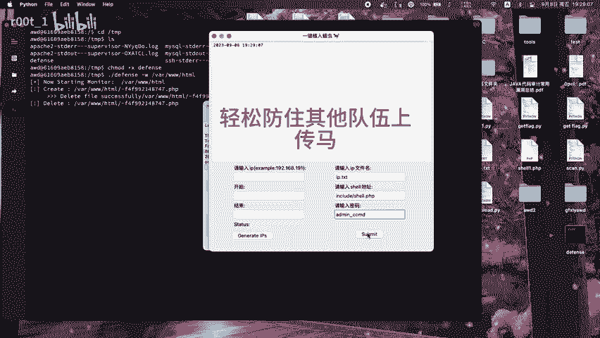
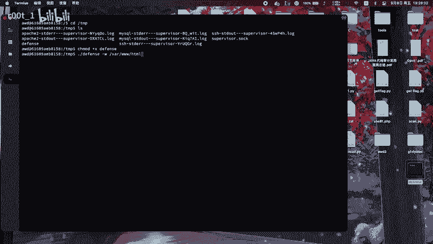
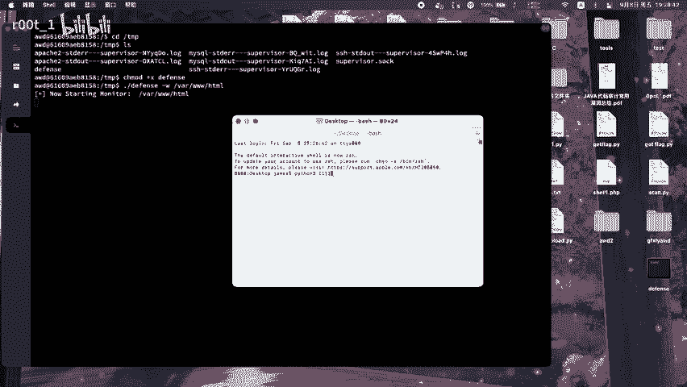
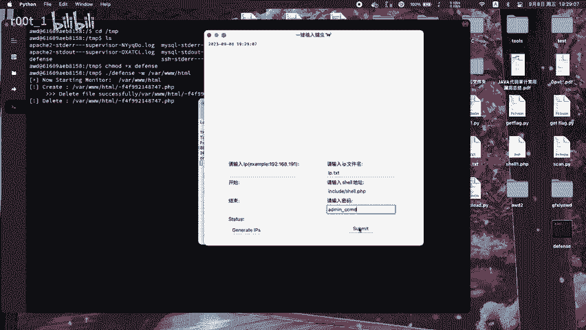

# AWD比赛矛与盾：P1：基础攻防策略与心态

在本节课中，我们将学习AWD攻防对抗赛的基础概念、核心策略以及参赛者应具备的正确心态。AWD比赛模拟了真实的网络攻防环境，要求参赛队伍在攻击对手服务的同时，保护自己的服务不被攻破。

## 核心概念：攻防一体

AWD比赛的核心在于“攻防一体”。参赛队伍需要同时扮演攻击者和防御者的角色。这意味着，你不仅要积极寻找并利用对手系统的漏洞（矛），还必须实时修补自己系统中的漏洞，并抵御来自其他队伍的攻击（盾）。

**公式**可以概括为：
**比赛得分 = 攻击得分 + 防御得分**

上一节我们介绍了AWD比赛的基本模式，本节中我们来看看如何构建有效的防御。

## 构建稳固的防线

稳固的防御是得分的基石。一个被频繁攻破的服务会让你损失大量防御分数。因此，上场后的首要任务不是攻击，而是快速加固自己的服务。

以下是构建初始防线的几个关键步骤：

1.  **修改默认密码**：立即修改服务器、数据库、Web应用后台等所有组件的默认密码，使用强密码。
2.  **备份源码与数据**：比赛开始后，第一时间备份原始的网站源码和数据库。这是后续进行漏洞分析和修复的基准。
3.  **关闭非必要服务**：检查并关闭服务器上非必要的端口和服务，减少被攻击的面。
4.  **部署监控脚本**：编写或使用现成的脚本，监控网站目录文件是否被篡改、服务是否异常退出，以便及时响应。

仅仅被动防御是不够的，我们还需要主动出击。

## 发动有效的攻击

在确保自身防线相对稳固后，需要转向攻击。攻击的目的在于获取对手服务器的权限（通常是一个`flag`文件），并提交到评分系统以获得分数。

以下是发动攻击的一般流程：

1.  **代码审计**：快速分析比赛提供的源码，寻找可能存在的漏洞，例如SQL注入、文件上传、命令执行等。
2.  **编写利用脚本**：一旦发现漏洞，立即编写自动化攻击脚本（`Exp`）。在AWD中，自动化是取胜的关键。
3.  **批量攻击与提交**：使用编写好的脚本，对其他所有队伍的靶机进行批量攻击，获取`flag`并自动提交。

攻防是动态的，其他队伍也会修补漏洞。因此，我们需要持续监控战场态势。

## 保持持续对抗的心态

比赛局势瞬息万变。你的漏洞可能被修复，新的漏洞也可能被对手发现。保持冷静和持续对抗的心态至关重要。

在比赛过程中，你需要：

*   **持续监控**：关注自己的服务是否正常，`flag`是否被他人获取。
*   **灵活应变**：当一种攻击手段失效时，迅速切换到其他漏洞或新发现的攻击点。
*   **团队协作**：明确分工，有人负责防御加固，有人负责代码审计和攻击。

本节课中我们一起学习了AWD比赛“攻防一体”的核心思想。我们探讨了如何通过修改默认配置、备份源码来建立基础防御，也介绍了通过代码审计和编写自动化脚本发动有效攻击的流程。记住，成功的AWD选手需要在稳固防守和犀利进攻之间找到平衡，并始终保持对战场动态的敏锐感知。