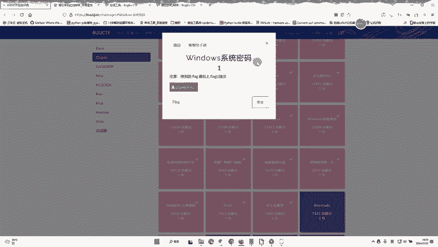
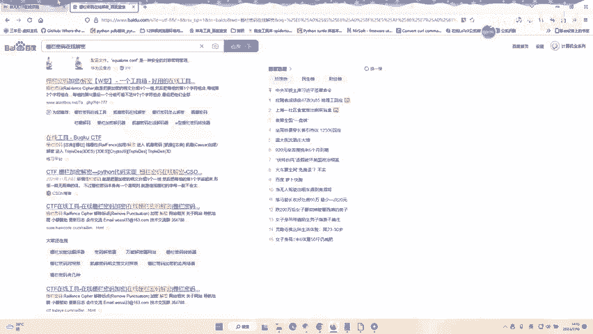
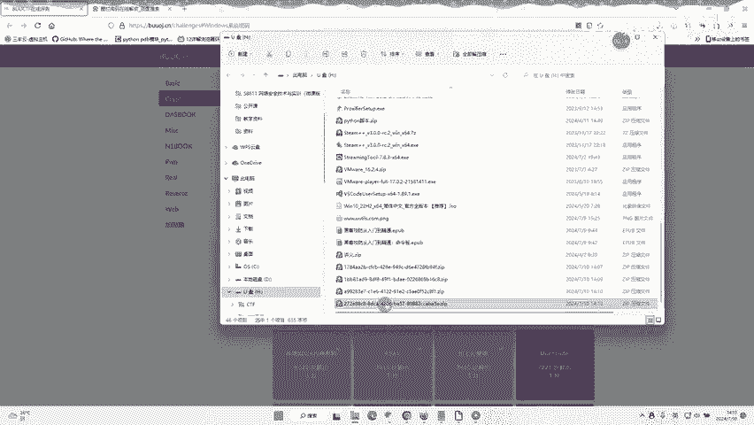
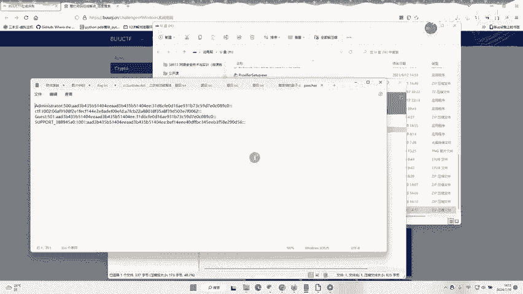
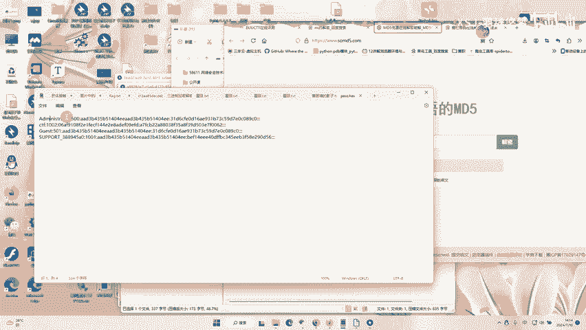
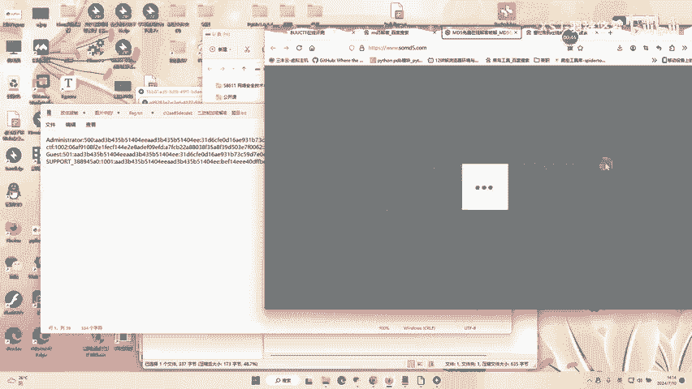
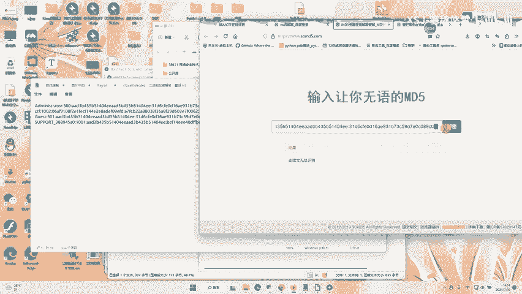
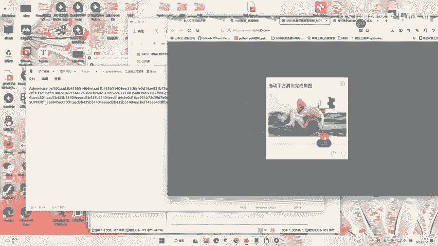
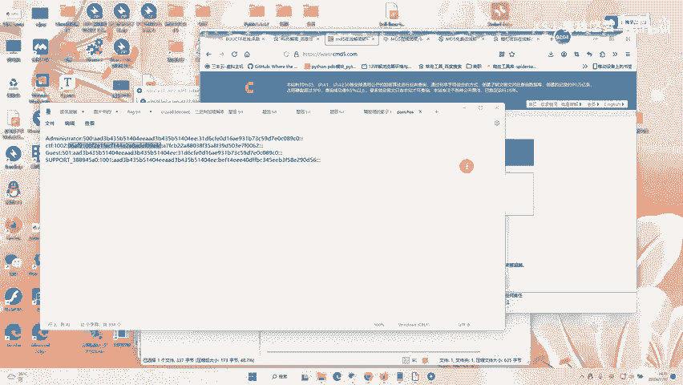

# CTF实战：Windows系统密码 - P1：哈希破解入门

在本节课中，我们将学习如何破解一道典型的CTF题目——Windows系统密码。我们将从下载题目文件开始，逐步分析其内容，并利用在线工具对MD5哈希值进行解密，最终获取隐藏的Flag。



---

## 1. 获取与分析题目文件

首先，我们需要下载题目提供的压缩包。下载完成后，解压并打开其中的文件。

上一节我们介绍了课程目标，本节中我们来看看如何获取并初步分析题目文件。





打开文件后，我们可以看到其内容。文件内通常包含由分号分隔的数据，其格式可表示为：



```
用户名:密码哈希值
```

其中，分号前是账号（用户名），分号后是该账号对应的密码哈希值。我们的目标就是破解这些哈希值。




## 2. 理解MD5哈希与解密原理

在上一节我们查看了文件格式后，本节中我们来看看其中使用的加密方式。题目明确指出，密码是经过MD5算法加密的。

MD5是一种广泛使用的密码哈希函数，它会将任意长度的输入（如密码）转换成一个固定长度（128位，即32个十六进制字符）的哈希值。其过程可以简化为：

**公式：`哈希值 = MD5(明文密码)`**

哈希过程是单向的，理论上无法直接逆向计算。因此，我们通常采用“碰撞”或“查表”的方法来破解，即通过比对已知的明文-哈希值对来寻找匹配项。





## 3. 使用在线工具进行解密

由于MD5的脆弱性，互联网上存在许多收录了大量哈希-明文对的数据库，我们可以利用在线MD5解密网站进行查询。

以下是进行在线解密的步骤：



1.  复制分号后的密码哈希值。
2.  访问一个MD5在线解密网站。
3.  将哈希值粘贴到网站的输入框中并提交查询。




如果在一个网站查询不到结果，可以尝试更换其他网站。不同的网站可能拥有不同的彩虹表数据库。




## 4. 整理结果与获取Flag

我们将所有账号的密码哈希值逐一进行解密。解密成功后，网站会返回对应的明文密码。


在解密出的所有明文密码中，其中一个就是本题的Flag。你需要将所有结果整理出来，并逐一尝试提交，以找到正确的Flag。





请注意，部分在线解密网站可能需要付费或提供更多查询次数。如果遇到限制，可以寻找其他免费网站或自行搭建工具进行破解。

---

本节课中我们一起学习了针对Windows系统密码哈希的CTF解题流程。我们掌握了如何分析题目文件格式，理解了MD5哈希的基本概念，并实践了利用在线工具对MD5哈希进行解密以获取Flag的方法。关键步骤是**逐一尝试**和**善用多个资源**。