# CTF入门：1：N种方法解决

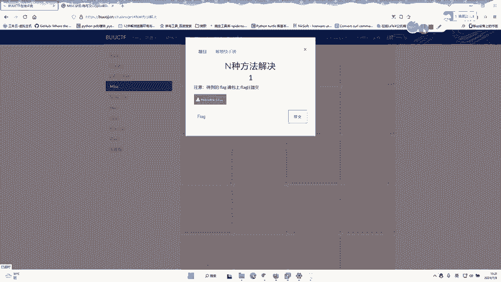

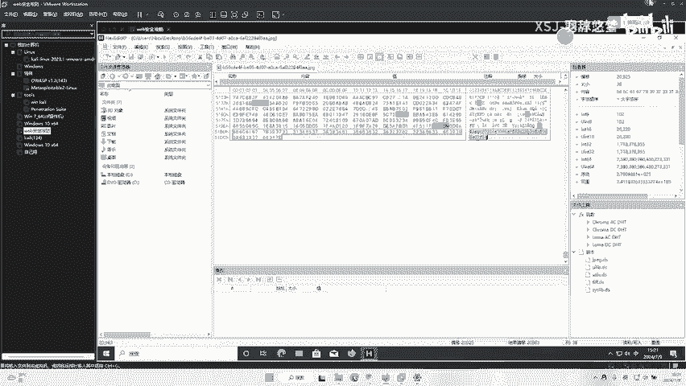

在本节课中，我们将学习如何解决一个名为“N种方法解决”的CTF题目。这道题看似是一个可执行文件，但实际上它隐藏着一段需要解码的数据。我们将通过分析文件内容，识别编码类型，并最终提取出隐藏的Flag。

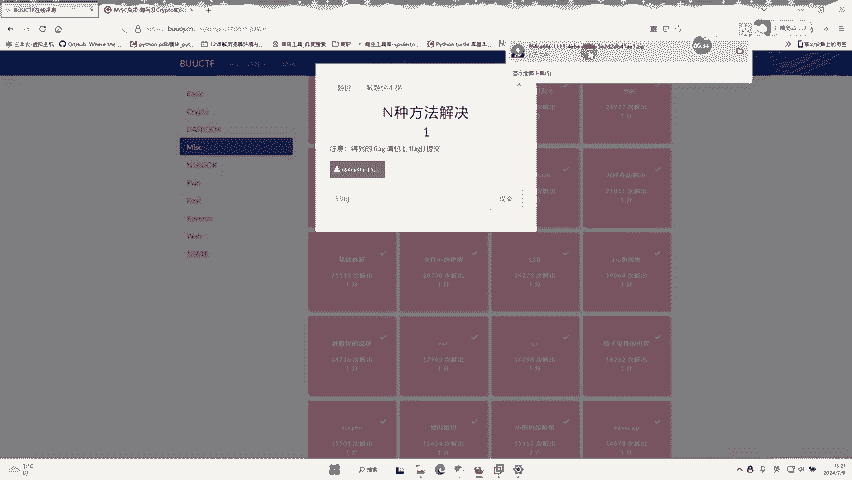

## 题目初步分析

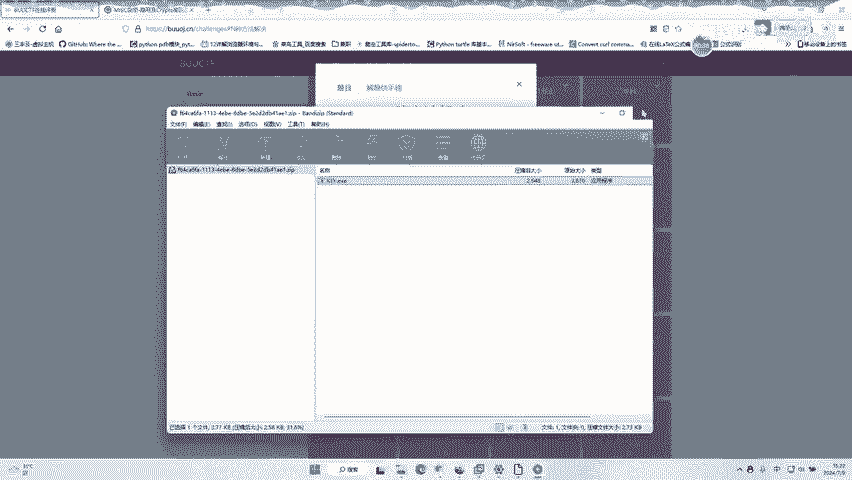

上一节我们介绍了课程目标，本节中我们来看看题目的具体情况。

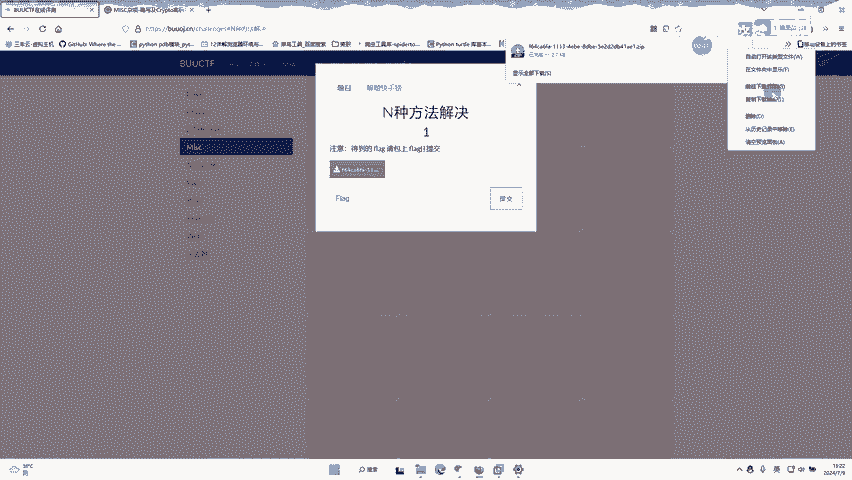

题目文件是一个EXE文件，但直接运行可能无法得到预期结果。实际上，这道题并非传统的逆向工程题，而是一道编码题。我们需要深入分析文件内容。

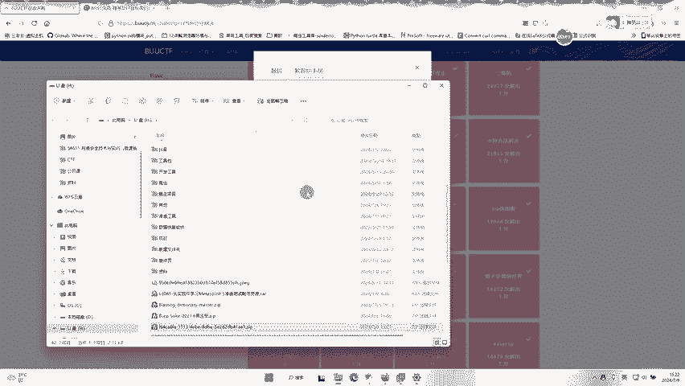

## 提取并识别数据

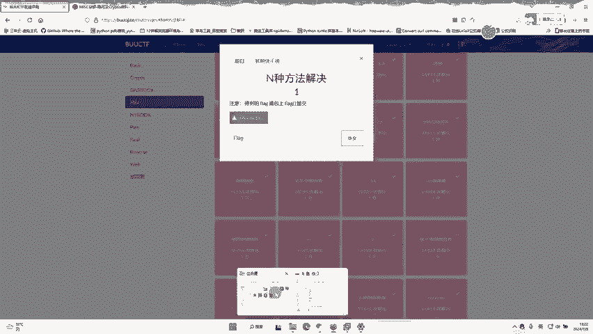

打开文件后，我们发现其内部包含一段数据。这段数据以特定的格式开头，这为我们提供了线索。

以下是数据开头的关键信息：
*   `data:` 表明这是一段数据URI。
*   `image/` 表明这段数据代表一张图片。
*   后续的字符看起来是Base64编码的字符串。

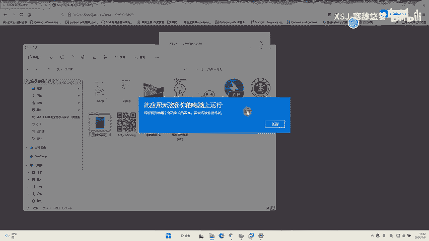

因此，我们可以推断这段数据是一个Base64编码的图片文件。

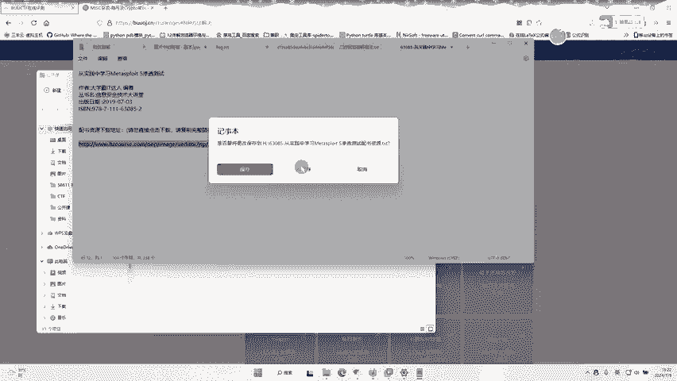

## 解码Base64数据

既然识别出数据是Base64编码的图片，下一步就是将其解码还原成图片。

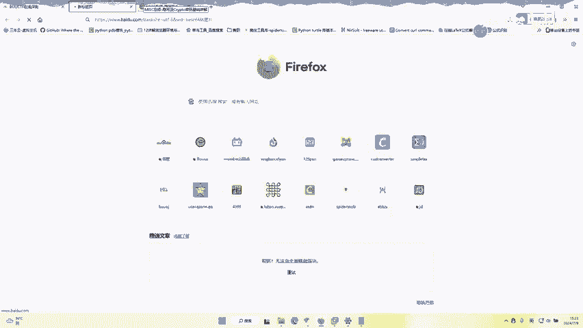

操作步骤如下：
1.  复制整个`data:image/...`之后的数据部分（即Base64编码字符串）。
2.  访问一个在线的Base64转图片工具网站。
3.  将复制的字符串粘贴到网站的输入框中。
4.  执行解码操作，网站会生成对应的图片，通常是一个二维码。

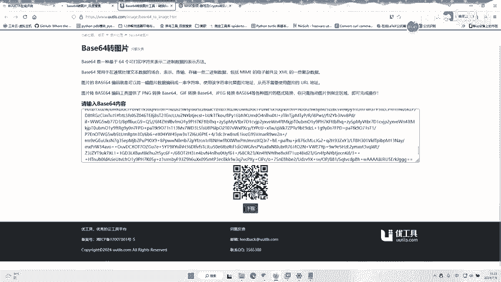

## 扫描二维码获取Flag

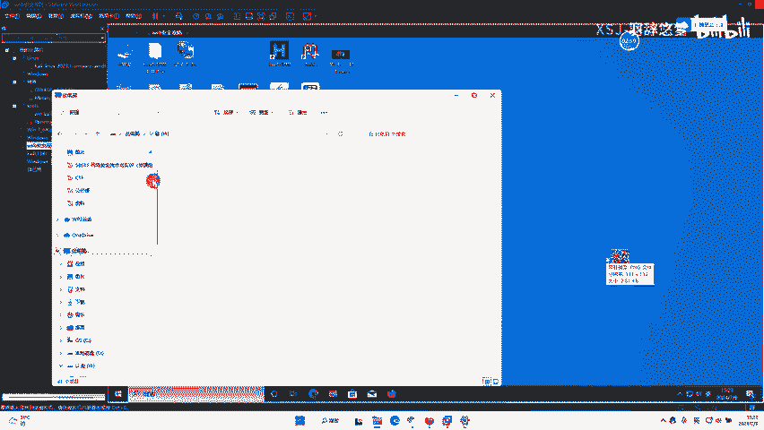

成功解码后，我们得到了一张二维码图片。最后一步就是扫描这个二维码。

你可以选择以下任一方法：
*   使用手机上的二维码扫描APP。
*   使用电脑上的二维码识别工具。
*   再次利用在线的二维码解码网站。

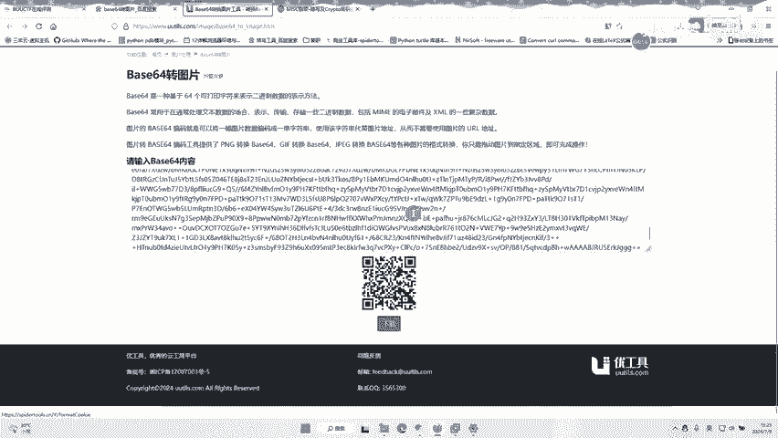

扫描二维码后，显示出的字符串就是本题的Flag。

## 总结

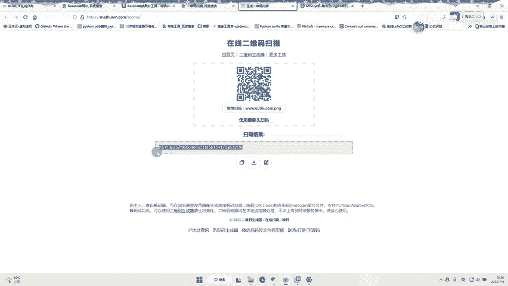

本节课中我们一起学习了解决“N种方法解决”这道CTF题的全过程。我们首先分析了非常规的EXE文件，识别出其中包含的Base64编码图片数据，接着通过在线工具将其解码为二维码，最终通过扫描二维码获得了Flag `flag{xxxxxx}`。这个流程展示了在CTF比赛中，灵活识别和处理各种编码格式的重要性。