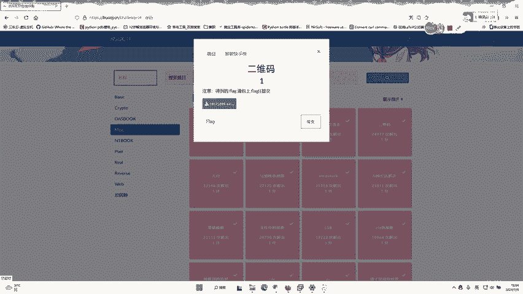
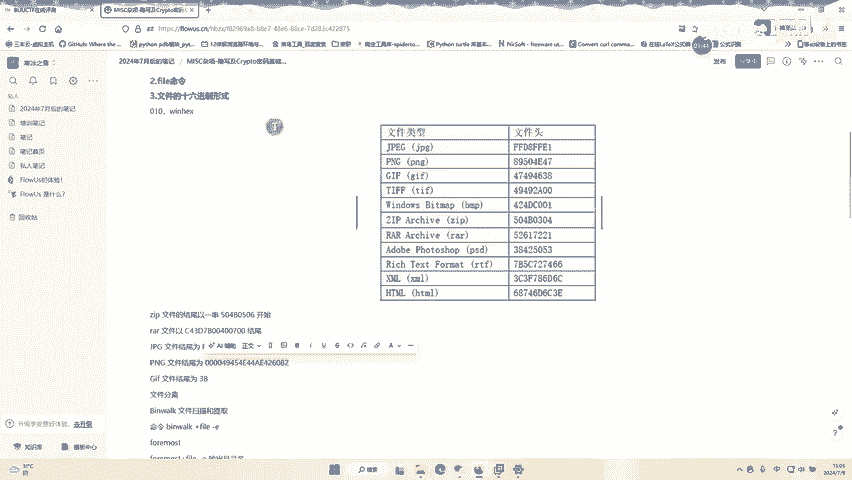
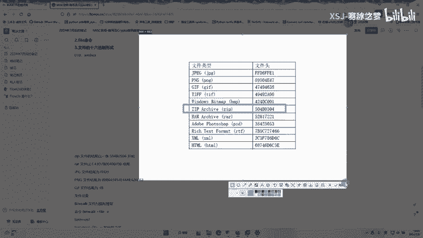
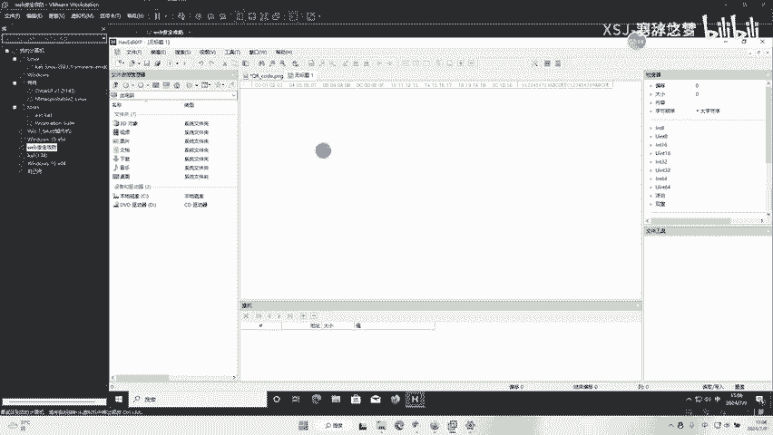
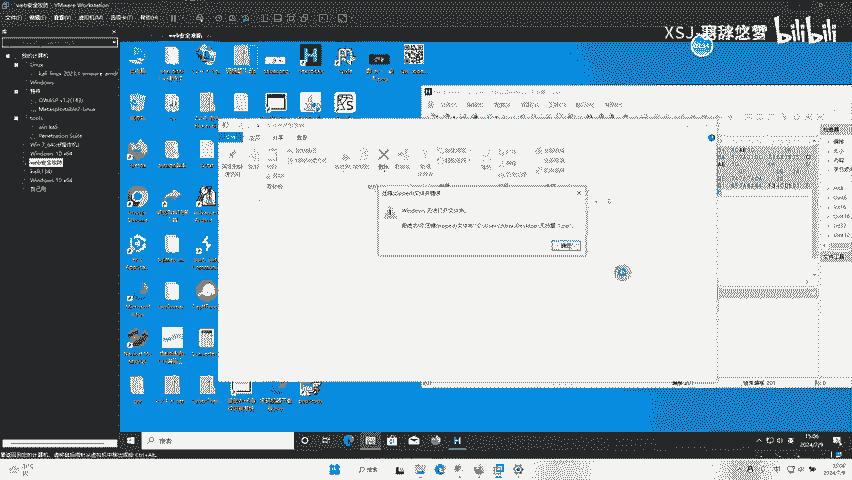
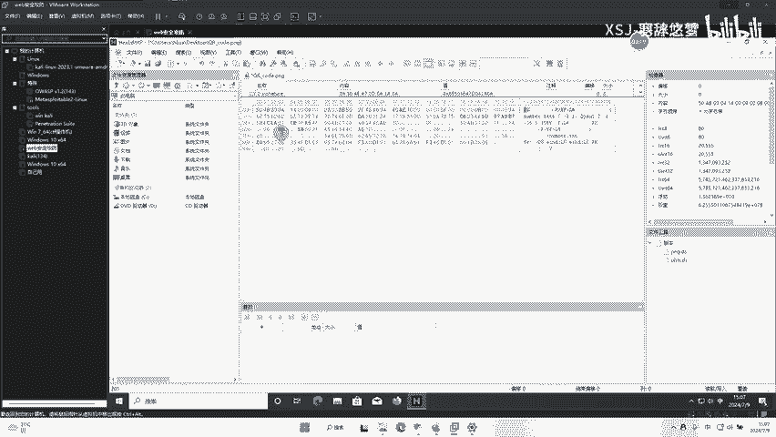
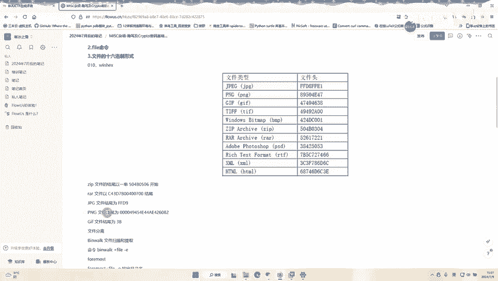
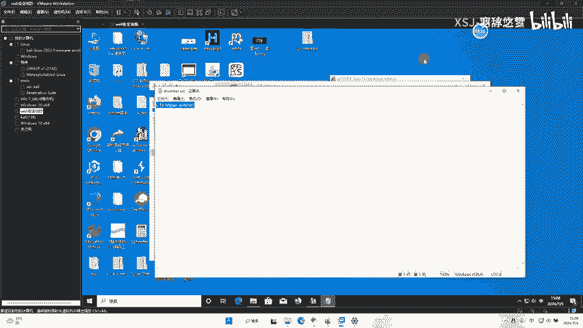

# CTF入门：P1：二维码隐写与文件分离

在本节课中，我们将学习一道典型的CTF（Capture The Flag）题目，它涉及二维码隐写和文件分离技术。我们将通过分析一个看似普通的二维码图片，从中提取隐藏的压缩包文件，并最终获得Flag。整个过程将涵盖文件结构分析、十六进制编辑和压缩包密码破解等基础技能。

---

## 题目文件初步分析

首先，我们下载并打开题目提供的文件。该文件显示为一个二维码图片。

使用手机或常规扫码工具扫描这个二维码，无法直接获得Flag。这表明二维码图片中可能隐藏了其他信息。

## 使用工具分析文件结构

为了深入分析，我们可以使用十六进制编辑器（如WinHex、010 Editor等）打开这个图片文件。将文件拖入编辑器后，我们观察其内容。

在十六进制视图中，我们注意到文件开头部分符合PNG图片的文件头格式。PNG文件的文件头（Magic Number）通常以 `89 50 4E 47 0D 0A 1A 0A` 开始。

然而，在文件的后半部分，我们发现了一段以 `50 4B` 开头的字节序列。

`50 4B` 是ZIP压缩包的文件头标识。这意味着，这个PNG图片文件尾部实际上附加了一个完整的ZIP压缩包，这是一种常见的文件合并（或隐写）方式。

## 分离隐藏的压缩包文件

上一节我们确认了图片中隐藏着一个ZIP压缩包。本节中，我们来看看如何将这个压缩包分离出来。

以下是分离步骤：

1.  在十六进制编辑器中，找到ZIP文件头 `50 4B` 的起始位置。
2.  选中从 `50 4B` 开始直到文件末尾的所有字节数据。
3.  将这些数据复制出来。

4.  新建一个十六进制文件，将复制的数据粘贴进去。
5.  将这个新文件保存，并将其文件扩展名改为 `.zip`。

**注意**：有时直接保存的ZIP文件可能无法正常打开，提示文件损坏。这是因为原PNG文件的数据可能对ZIP文件头造成了干扰。更稳妥的方法是：

1.  在十六进制编辑器中打开原图片文件。
2.  直接删除 `50 4B` 之前的所有数据（即PNG图片部分），只保留ZIP文件数据。
3.  将剩下的数据另存为一个新的 `.zip` 文件。

## 破解压缩包密码

成功分离出ZIP压缩包后，我们尝试打开它。压缩包内通常包含一个 `flag.txt` 或类似文件。

双击打开时，系统提示需要输入密码。这说明压缩包被加密保护，我们需要破解密码。

以下是破解密码的步骤：

1.  使用专门的压缩包密码破解工具，例如 `ARCHPR` (Advanced Archive Password Recovery)。
2.  打开工具，并加载我们分离出来的ZIP文件。
3.  在攻击类型中选择“暴力破解”。
4.  在范围设置中，勾选“所有数字”（因为许多CTF简单题的密码是纯数字）。
5.  点击“开始”按钮进行破解。

破解过程通常很快。工具会显示找到的密码。

在本例中，破解出的密码是：**7639**。

## 获取最终Flag

获得密码后，我们回到ZIP压缩包，输入密码 `7639` 进行解压。

解压后，打开压缩包内的文本文件（例如 `flag.txt`），即可看到本题的Flag。

---

本节课中我们一起学习了如何解决一道结合了二维码和文件隐写的CTF题目。关键步骤包括：
1.  使用十六进制编辑器分析文件结构，识别出附加的ZIP文件。
2.  通过编辑十六进制数据，将隐藏的ZIP压缩包从图片中分离出来。
3.  利用暴力破解工具，获取加密压缩包的密码。
4.  解压文件，最终获得Flag。

这个过程展示了CTF中常见的**文件格式分析**和**数据分离**技术，是入门必备的基础技能。