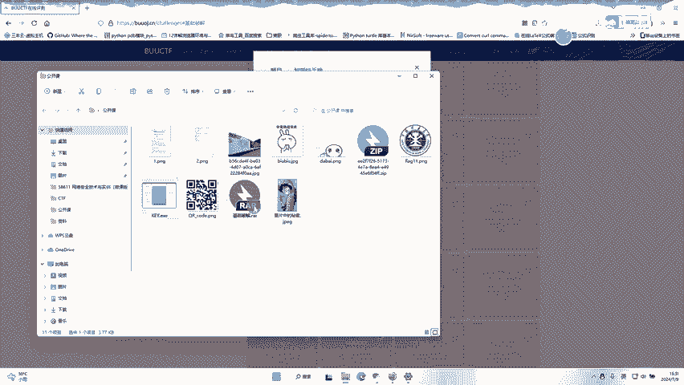
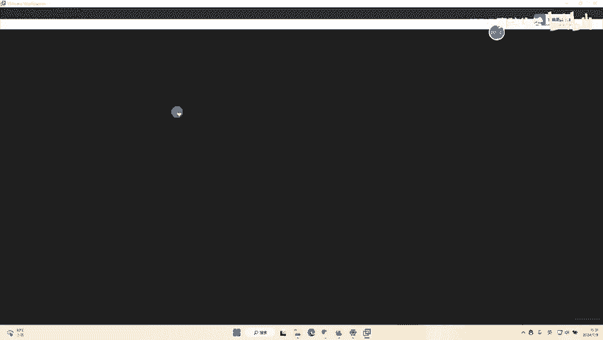
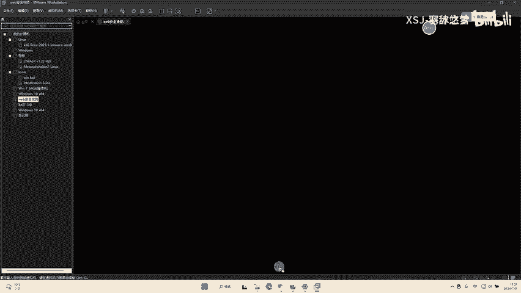
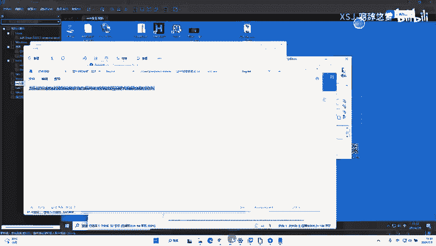
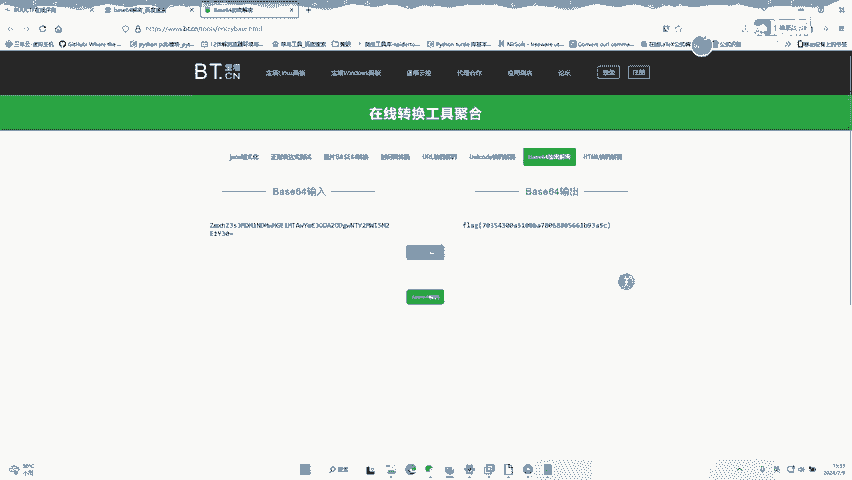

# CTF基础破解教程：P1：ZIP压缩包与Base64编码破解 🛠️

在本节课中，我们将学习如何破解一个包含密码的ZIP压缩包，并对其中的加密内容进行解码。整个过程将分为两个主要步骤：暴力破解ZIP密码和解码Base64加密的字符串。

## 概述

我们手头有一个受密码保护的ZIP压缩包文件。我们的目标是获取其中的内容。首先，我们需要找到压缩包的密码；其次，压缩包内的文件内容本身也经过了一层编码，我们需要对其进行解码才能获得最终的有效信息（即Flag）。

---

## 第一步：破解ZIP压缩包密码

上一节我们介绍了任务目标，本节中我们来看看如何获取ZIP文件的密码。

我们使用专门的工具来对ZIP压缩包进行暴力破解。以下是具体操作步骤：

1.  **准备工具与环境**：首先，确保你有一个可用于破解ZIP密码的工具（例如 `fcrackzip`、`John the Ripper` 或图形化工具如 `ARCHPR`）。本教程在虚拟机环境中进行操作。
2.  **加载目标文件**：打开破解工具，并选择需要破解的ZIP文件（本例中文件名为“基础破解.zip”）。
3.  **开始破解**：启动破解过程。工具会尝试各种可能的密码组合。
4.  **获取密码**：破解完成后，工具会显示找到的密码。在本案例中，破解出的密码是 **`2543`**。

得到密码后，使用该密码即可成功解压ZIP文件。

---

## 第二步：解码Base64加密内容

成功解压ZIP文件后，我们发现得到的文件内容并非明文，而是一串经过编码的字符。这看起来像是Base64编码。

Base64是一种用64个可打印字符来表示二进制数据的编码方式。其核心是将3个8位字节转换为4个6位字节，然后在6位字节前补两个0，形成8位字节。解码是其逆过程。

以下是处理步骤：

1.  **识别编码**：观察解压出的文件内容，其通常由字母、数字、`+`、`/`和`=`组成，这是Base64编码的典型特征。
2.  **进行解码**：找一个在线的Base64解码网站或使用命令行工具进行解码。
    *   **在线网站**：访问一个Base64解码网站，将编码字符串粘贴进去，点击解码。
    *   **命令行工具**：在Linux或Mac终端使用 `echo “编码字符串” | base64 -d` 命令；在Windows PowerShell中使用 `[System.Text.Encoding]::UTF8.GetString([System.Convert]::FromBase64String(“编码字符串”))`。

在本案例中，将编码字符串进行Base64解码后，我们得到了最终的Flag：**`flag{…}`**（此处以`flag`示例，实际内容取决于题目）。

---

## 总结

本节课中我们一起学习了CTF中基础破解的常见流程：
1.  使用密码破解工具对受保护的ZIP压缩包进行暴力破解，获得密码 **`2543`**。
2.  解压文件后，对其中经过**Base64编码**的内容进行解码，最终获得隐藏的Flag信息。

这个流程涵盖了从外围防护（压缩包密码）到内容混淆（编码）的两层安全措施破解，是CTF入门中的一项实用技能。