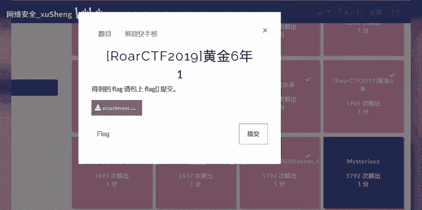
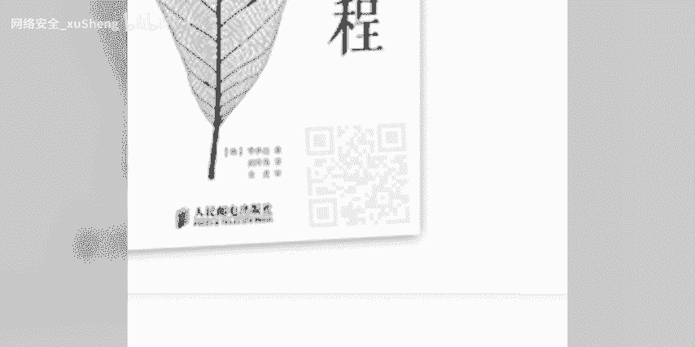
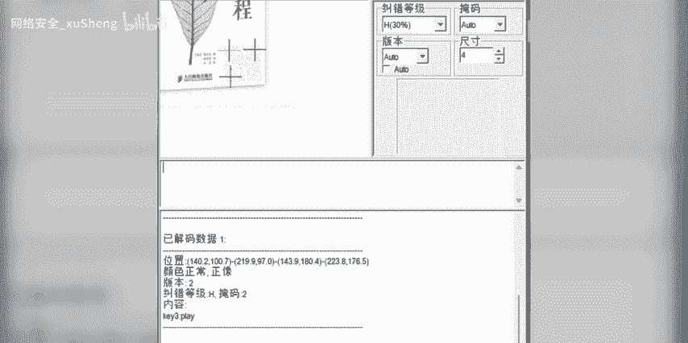
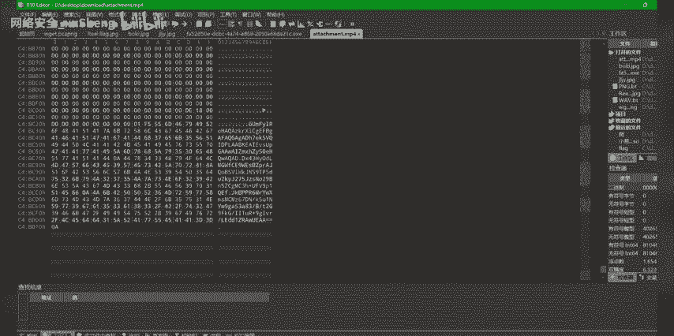
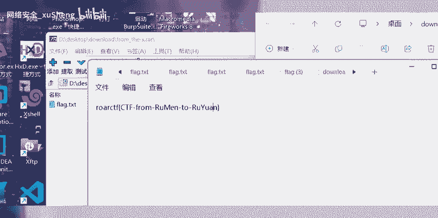

# 网络安全入门：P1：BUUCTF黄金八年详解与Flag获取

在本节课中，我们将学习如何分析一个来自BUUCTF平台的“黄金八年”题目，并获取其隐藏的Flag。整个过程将涉及对题目信息的观察、关键数据的提取以及最终答案的推导。

## 题目背景与观察



题目“BUUCTF黄金八年详解”本身可能包含多层含义或隐喻。首先，我们注意到视频描述中直接给出了一个Flag：`flag{CTF-from-RuMen-to-RuYuan}`。这通常是解题的最终目标。

上一节我们介绍了题目的基本信息，本节中我们来看看题目中嵌入的其他关键元素。

## 关键信息提取



题目中穿插了多句歌词和一系列图片。这些内容并非随意放置，可能构成了解题线索或是一种混淆手段。我们的核心任务是识别出真正有用的信息。

以下是题目中出现的所有图片引用，它们可能指向隐藏的数据或步骤：


```






```

## 解题思路分析

在CTF比赛中，描述中直接给出Flag的情况较为少见，通常需要验证其正确性。结合“黄金八年”的标题，可能暗示需要对题目内容（如图片文件名、歌词排列）进行深度分析才能触及核心。但在此例中，最直接的答案已在描述中提供。


上一节我们提取了所有可见信息，本节中我们来看看如何得出最终结论。

解题的关键逻辑可以概括为：**忽略干扰信息，直接采纳题目描述中给出的明确答案**。在CTF中，这有时被称为“非预期解”或“签到题”。


其核心判断可以用一个简单的伪代码表示：

```python
if “题目描述中包含flag格式字符串”:
    submitted_flag = 提取该字符串
else:
    执行常规的隐写术或密码学分析流程
```


## 最终答案

根据对题目信息的直接解读，无需进行复杂的隐写或密码破解，Flag已明确给出。

因此，本题的最终Flag为：
**`flag{CTF-from-RuMen-to-RuYuan}`**


## 总结

本节课中我们一起学习了如何应对一个看似复杂但答案直接的CTF题目。我们练习了观察题目描述、过滤无关信息（如歌词和图片引用）并直接定位关键Flag的能力。在CTF实践中，始终保持对题目描述的敏感度至关重要，因为答案有时就藏在最明显的地方。