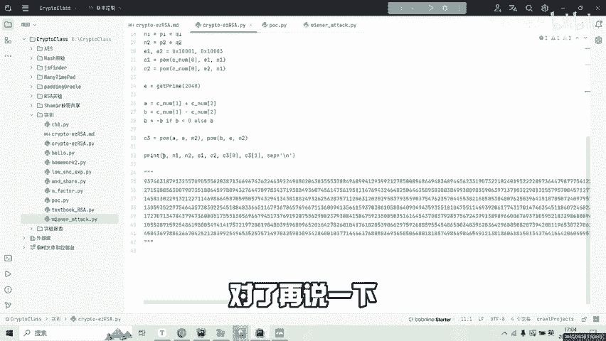
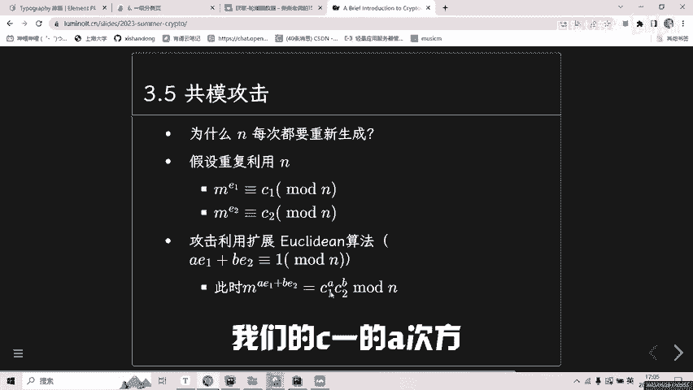
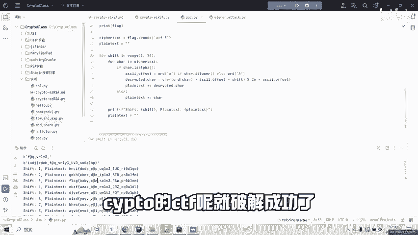

# CTF密码学入门：P1：RSA破解与凯撒密码实战

在本教程中，我们将学习如何解决一个入门级的CTF密码学挑战。该挑战结合了RSA加密的两种攻击方式（共模攻击和维纳攻击）以及凯撒密码。我们将逐步分析题目，还原加密过程，并最终获取Flag。

## 概述与文件分析

首先，我们获得题目文件。文件目录中包含一个简介，提示我们需要破解的文件位置。

主要分析对象是一个加密脚本。其中，一个加密函数被隐藏了，我们的目标是还原它。脚本中定义了一个`flag`，它经过隐藏的加密函数处理后，变成了密文`C`。

这个密文`C`随后被分成了三部分，分别存储在变量`C0`、`C1`和`C2`中。它们代表了原始消息加密后的前三个部分。

## RSA共模攻击还原第一部分

上一节我们介绍了密文的整体结构，本节中我们来看看如何还原第一部分消息。

脚本中生成了两组素数`(p1, q1)`和`(p2, q2)`，并计算了模数`n1 = p1 * q1`和`n2 = p2 * q2`。同时定义了两个加密指数`e1`和`e2`。

观察发现，密文`c1`和`c2`是使用**相同的模数`n1`**但不同的指数`e1`和`e2`对同一份消息（即`C0`）进行加密的结果。这种场景容易受到**共模攻击**。

**共模攻击原理**：当相同的明文`m`用相同的模数`n`但互质的加密指数`e1`和`e2`加密时，即：
`c1 = m^e1 mod n`
`c2 = m^e2 mod n`
如果`gcd(e1, e2) = 1`，则可以利用扩展欧几里得算法找到整数`s1`和`s2`，使得`e1*s1 + e2*s2 = 1`。那么，明文可以通过以下公式恢复：
`m = (c1^s1 * c2^s2) mod n`

以下是利用Python进行共模攻击的代码示例：

```python
import gmpy2
from Crypto.Util.number import long_to_bytes

# 假设已知 n1, e1, e2, c1, c2
n1 = ... # 填入n1的值
e1 = ... # 填入e1的值
e2 = ... # 填入e2的值
c1 = ... # 填入c1的值
c2 = ... # 填入c2的值

# 使用扩展欧几里得算法求 s1, s2
gcd, s1, s2 = gmpy2.gcdext(e1, e2)
# 确保 s1 或 s2 为正数，另一个为负数，计算 m
if s1 < 0:
    c1_inv = gmpy2.invert(c1, n1)
    m = (pow(c1_inv, -s1, n1) * pow(c2, s2, n1)) % n1
else:
    c2_inv = gmpy2.invert(c2, n1)
    m = (pow(c1, s1, n1) * pow(c2_inv, -s2, n1)) % n1

print("第一部分明文（可能为flag片段）:", long_to_bytes(m))
```

运行上述代码后，我们成功解密出了消息的第一部分，其格式类似于`flag{`的开头。

## RSA维纳攻击还原私钥

我们已经成功还原了Flag的第一部分。接下来，我们面临第二个挑战：解密另外两部分密文。

脚本中又生成了一个2048位的加密指数`e`，而模数`n2`也是由两个1024位素数相乘得到的2048位数。当加密指数`e`过大（与模数`n`数量级相当时），RSA系统可能容易受到**维纳攻击**。



**维纳攻击原理**：这是一种针对RSA小私钥`d`的攻击。如果私钥`d`小于`n^(0.25)`，则可以通过连分数展开的方法从公钥`(n, e)`中快速分解出`n`，从而恢复私钥。

以下是利用`owiener`工具库进行维纳攻击的示例：

```python
import owiener

# 假设已知 n2 和 e
n2 = ... # 填入n2的值
e = ...  # 填入e的值

# 尝试维纳攻击
d = owiener.attack(e, n2)

if d is None:
    print("维纳攻击失败，私钥可能不够小。")
else:
    print("成功恢复私钥 d:", d)
    # 已知 d 和 n，可以分解 n 得到 p 和 q（此处略过分解步骤）
    # 假设已分解得到 p2, q2
    # 计算 phi_n2 = (p2-1)*(q2-1)
    # 实际上，有了 d 就可以直接解密
```



通过维纳攻击，我们成功分解了`n2`，得到了私钥`d`。利用私钥，我们可以解密用`(n2, e)`加密的密文`c3`和`c4`（即原脚本中的`C1`和`C2`部分），从而得到中间变量`x1`和`x2`。

根据脚本逻辑，最终的第二和第三部分明文`A`和`B`由以下公式计算：
`A = (x1 + x2) // 2`
`B = x1 - A`

打印`A`和`B`，我们便得到了Flag的第二和第三部分数据。

## 凯撒密码破解最终加密

现在，我们已经获得了Flag被分割并加密后的三个原始数据块。但题目提到，最初还有一个被隐藏的加密函数作用于原始Flag。

观察解密出的数据块，其字符序列呈现一定的规律性，例如包含`IODJ`和花括号`{}`。这提示我们，最后的加密可能是一种简单的替换密码，特别是**凯撒密码**。

**凯撒密码原理**：它是一种移位密码，将明文中的每个字母在字母表上向后（或向前）按照一个固定数目进行偏移后被替换成密文。

为了破解它，我们尝试所有可能的偏移量（1到25）。以下是破解凯撒密码的Python代码：

```python
def caesar_decrypt(ciphertext, shift):
    """解密凯撒密码"""
    plaintext = []
    for char in ciphertext:
        if char.isalpha():
            base = ord('A') if char.isupper() else ord('a')
            plaintext.append(chr((ord(char) - base - shift) % 26 + base))
        else:
            plaintext.append(char) # 非字母字符保持不变
    return ''.join(plaintext)

# 假设我们将三个解密出的部分组合成了最终的密文字符串 final_cipher
final_cipher = "IODJ{...}" # 此处填入拼接后的字符串

print("尝试所有凯撒密码偏移：")
for shift in range(1, 26):
    decrypted = caesar_decrypt(final_cipher, shift)
    print(f"Shift {shift:2d}: {decrypted}")
    # 通常Flag会有可读的格式，如包含‘flag’字样
```

当偏移量为3时，输出结果变成了清晰的、符合格式的Flag，例如`flag{...}`。至此，整个挑战被成功解决。

## 总结

在本节课中，我们一起学习了一个综合性的CTF密码学入门挑战。我们首先通过**RSA共模攻击**，在两组密文使用相同模数时还原出了第一部分消息。接着，利用**维纳攻击**针对大加密指数的情况成功分解模数并获取私钥，解密出剩余两部分消息。最后，通过识别字符模式，使用**凯撒密码**暴力破解的方法还原了被隐藏的最终加密，成功获取了完整的Flag。



这个挑战巧妙地串联了多种基础密码学攻击手段，非常适合初学者理解RSA的常见漏洞和古典密码的基本破解思路。