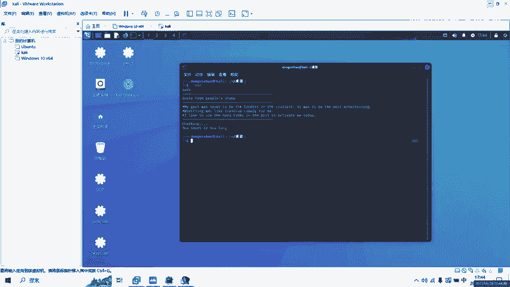
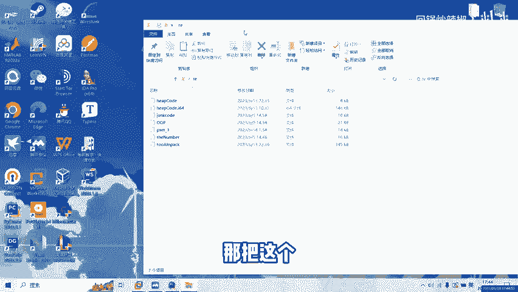
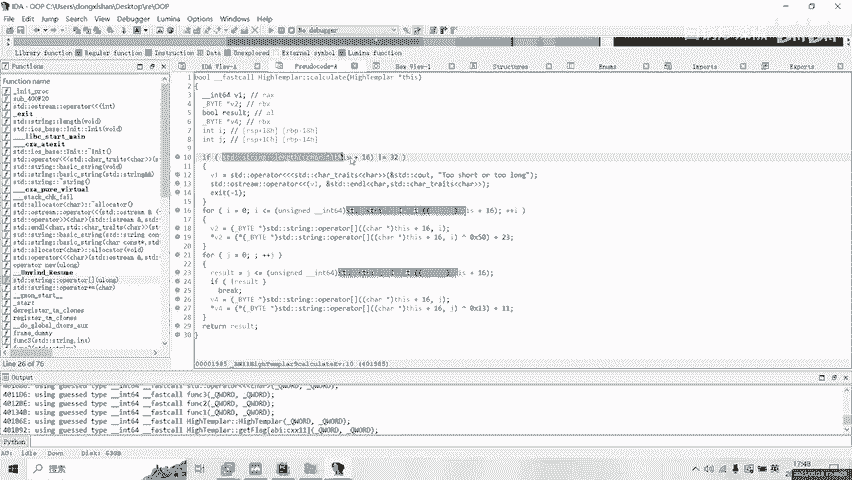
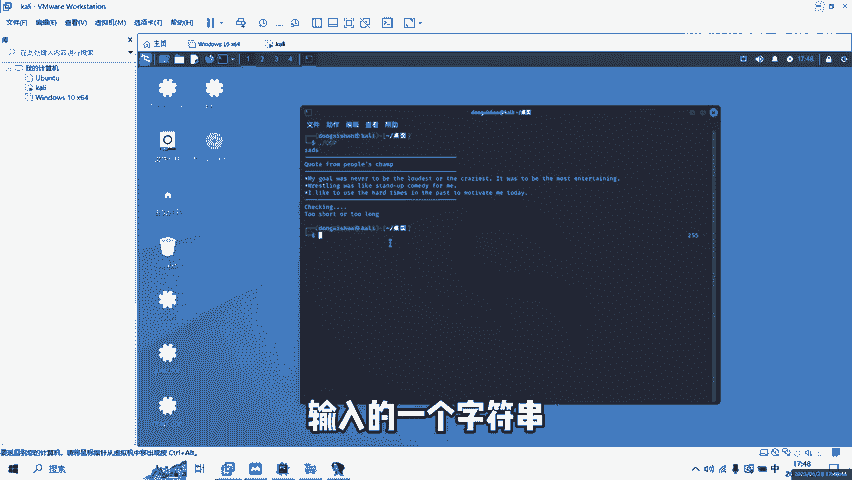
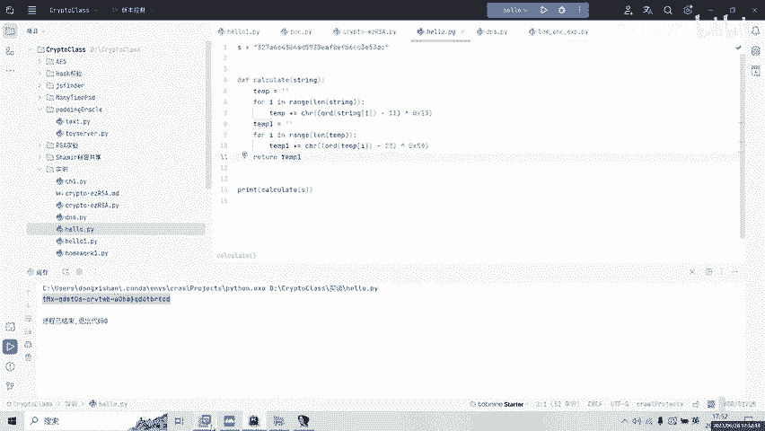
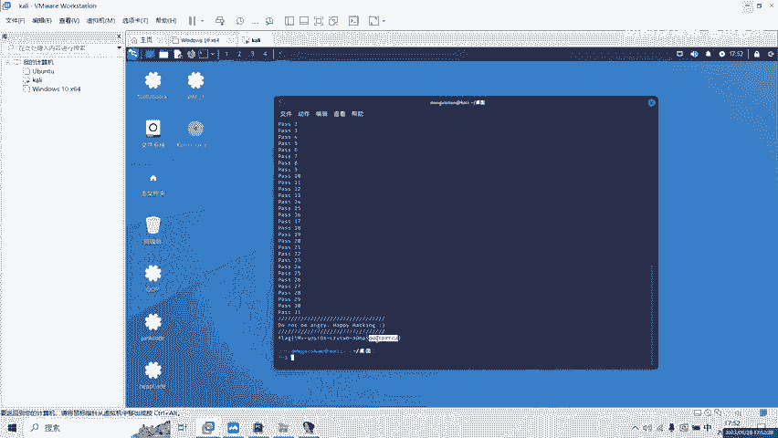

# CTF Pwn逆向：面向对象基础逆向（适用于初学者）🎯

## 概述



在本节课中，我们将学习一个简单的CTF Pwn逆向题目。我们将分析一个名为`OOP`的程序，理解其验证逻辑，并最终通过逆向计算得到正确的输入（即Flag）。整个过程将涉及静态分析、理解程序流程以及编写简单的解密脚本。

---



## 1：程序初步分析🔍

首先，我们运行目标程序`OOP`，并尝试输入一些内容。程序会提示“检查中检验失败了”，这表明我们的输入未能通过验证。

为了理解验证逻辑，我们需要对程序进行逆向分析。我们将使用IDA工具打开`OOP`文件。

在IDA中，我们定位到主函数，并使用F5键将其反编译为更易读的C伪代码。

---

## 2：定位关键输入与验证逻辑🕵️

在反编译的代码中，我们寻找处理用户输入的部分。

我们可以看到，用户输入的值被存储在变量`v18`中。随后，`v18`被传递给一个对象进行处理。

以下是输入处理的关键代码片段：
```c
v18 = user_input;
// ... v18被传递给某个对象
```

接下来，程序开始进行验证检查。初始观察发现，代码中存在一些看似复杂的赋值操作（例如`v19 = v18`, `v20 = v19`等）以及后续对这些变量的析构。对于初学者来说，这可能是一个干扰项（蜜罐）。实际上，这些操作并不影响核心验证逻辑，可以暂时忽略。

真正的关键点在于传入的对象内部执行了哪些操作。

---

## 3：深入分析对象方法🧩





我们跟进到处理输入值的对象方法中。

在该方法中，程序将我们的输入值（记为`a2`）存储在了对象内存结构的特定偏移位置（例如16和48偏移处）。同时，在80偏移处存储了一串预设的字节数组（这串数据类似于密文）。

核心验证逻辑随后启动。它首先检查我们输入字符串的长度是否为32字节。如果不是，则直接失败。

如果长度正确，程序会对输入字符串的每一个字节进行两次变换操作：
1.  第一次变换：`字节 ^ 0x50 + 0x17`
2.  第二次变换：`(上一次的结果) ^ 0x0D + 0x0B`

变换后的结果字符串（存储在对象的16偏移处）会与之前存储在80偏移处的“密文”进行逐字节比较。如果所有字节都匹配，则验证通过；否则，会提示在哪一个位置失败。

---

## 4：逆向计算与获取Flag💡

既然我们知道了程序对输入`(input)`的正向处理流程是：
`encrypted[i] = (((input[i] ^ 0x50) + 0x17) ^ 0x0D) + 0x0B`

并且我们拥有最终的`encrypted`数组（即80偏移处的“密文”），那么要得到原始的正确输入`(input)`，我们只需要执行逆向操作即可。

以下是解密过程的Python脚本：
```python
# 从IDA中提取的密文数据（80偏移处的字节数组）
ciphertext = [0x9E, 0x97, 0xA6, 0x93, 0x9D, 0xCF, 0x8C, 0x02, 0x9E, 0x90, 0x8C, 0x02, 0x8D, 0x97, 0x8C, 0x02, 0x9E, 0x92, 0x91, 0x9B, 0x02, 0x8D, 0x90, 0x8C, 0x9A, 0x02, 0x92, 0x90, 0x8F, 0x8D, 0x9E, 0x92]

flag = ''
for c in ciphertext:
    # 逆向步骤：先减0x0B，再异或0x0D
    step1 = (c - 0x0B) ^ 0x0D
    # 继续逆向：先减0x17，再异或0x50
    step2 = (step1 - 0x17) ^ 0x50
    flag += chr(step2)

print(flag)
```

运行上述脚本，我们便可以得到能够通过程序验证的正确字符串，也就是本题的Flag。



---

## 总结



本节课中，我们一起学习了一个基础的CTF逆向题目。我们通过静态分析定位了程序的输入点和核心验证逻辑，识别并忽略了代码中的干扰项，重点分析了对象方法中对输入数据的变换过程。最后，我们通过逆向该变换算法，编写解密脚本成功计算出了Flag。这个过程涵盖了逆向工程中常见的基本步骤：分析、理解、逆向计算。