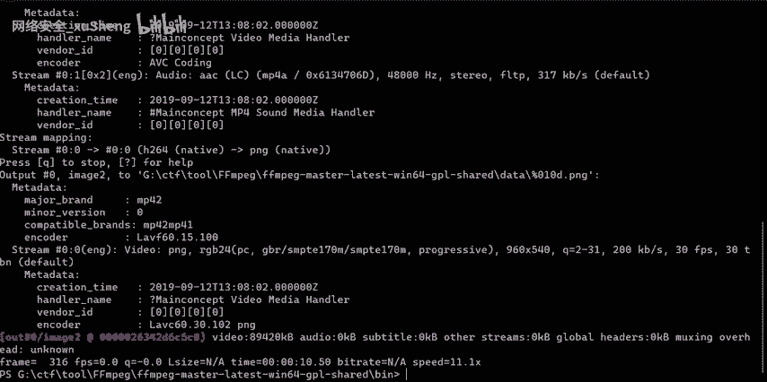
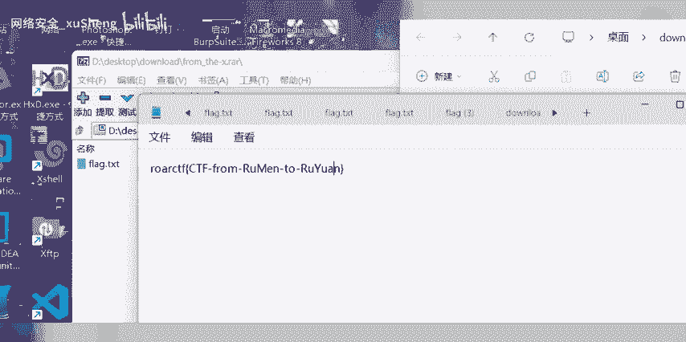

# CTF工具Ffmpeg：1：视频分帧与二维码提取教程

在本教程中，我们将学习如何使用FFmpeg工具将视频文件分解为连续的图片帧，并从中寻找隐藏的二维码信息，最终获取Flag。我们将以一道典型的CTF题目为例，演示完整的操作流程。

## 概述

FFmpeg是一个功能强大的多媒体处理工具，在CTF竞赛中常被用于处理包含隐藏信息的音视频文件。本节我们将重点学习其视频分帧功能。

上一节我们介绍了本教程的目标，本节中我们来看看具体的操作步骤和所需工具。

## 工具准备与环境搭建

首先，你需要准备FFmpeg工具。以下是获取和验证FFmpeg的方法：

*   **Windows系统**：可以从官网下载编译好的可执行文件，并确保其路径已添加到系统环境变量中。
*   **Linux/macOS系统**：通常可以使用包管理器安装，例如在Ubuntu上使用命令 `sudo apt install ffmpeg`。
*   **验证安装**：打开命令行终端，输入 `ffmpeg -version`，如果显示版本信息则说明安装成功。

准备好工具后，我们就可以开始处理目标视频文件了。

## 视频分帧操作步骤

FFmpeg的核心分帧命令非常简单。其基本命令格式如下：

`ffmpeg -i input_video.mp4 frame_%04d.png`

这个命令会将名为 `input_video.mp4` 的视频文件，按帧输出为一系列PNG图片，图片命名格式为 `frame_0001.png`, `frame_0002.png` 等。



上一节我们了解了基础命令，本节中我们来看看如何针对CTF题目进行具体应用。假设我们有一个从CTF平台下载的名为 `buuctf_video.mp4` 的视频文件。

我们需要在命令行中导航到视频文件所在目录，然后执行分帧命令。以下是详细步骤：

1.  **打开命令行终端**（如CMD、PowerShell或Terminal）。
2.  **使用 `cd` 命令切换到视频文件所在的目录**。例如：`cd C:\Users\Name\Downloads\ctf_challenge`。
3.  **执行分帧命令**。针对我们的示例文件，命令为：`ffmpeg -i buuctf_video.mp4 frame_%04d.png`。
4.  **等待命令执行完成**。完成后，当前目录下会生成大量PNG图片文件。

操作完成后，我们将得到成百上千张图片，下一步就是从这些图片中寻找线索。

## 寻找与分析二维码

视频分帧后，我们得到了大量的图片。在CTF题目中，Flag信息可能以二维码的形式隐藏在某一帧或某几帧画面里。

以下是分析图片寻找二维码的常用方法：

*   **手动浏览**：如果图片数量不多，可以使用系统自带的图片查看器快速翻阅，寻找包含二维码的帧。
*   **脚本辅助**：如果图片数量庞大，可以编写Python脚本，利用`OpenCV`或`PIL`库自动检测并识别图片中的二维码。
*   **关键帧判断**：有时二维码可能出现在视频开头、结尾或场景切换的瞬间，可以优先检查这些位置的帧图片。

假设我们在手动浏览时，发现 `frame_0123.png` 这张图片中包含一个清晰的二维码。

## 扫描二维码获取Flag



找到包含二维码的图片后，最后一步就是扫描它。你可以使用任何你喜欢的二维码扫描工具：

*   **手机扫码软件**：直接用手机摄像头扫描电脑屏幕上的二维码图片。
*   **在线解码网站**：上传图片文件到在线二维码解码网站。
*   **编程解码**：使用Python的 `qrcode` 或 `pyzbar` 库进行解码。示例代码如下：

```python
from PIL import Image
from pyzbar.pyzbar import decode

# 打开包含二维码的图片
img = Image.open('frame_0123.png')
# 解码二维码
result = decode(img)
if result:
    # 打印解码出的数据（通常就是Flag）
    print(result[0].data.decode('utf-8'))
else:
    print("未检测到二维码")
```

运行解码程序或使用扫码工具后，我们便可以得到最终的Flag字符串，例如 `flag{th1s_1s_an_example_fl4g}`。

## 总结

本节课中我们一起学习了利用FFmpeg工具解决CTF视频隐写题目的完整流程。我们首先使用 `ffmpeg -i video.mp4 frame_%04d.png` 命令将视频分解为图片帧；然后从生成的图片序列中寻找隐藏的二维码；最后通过扫描或解码二维码获取最终的Flag。掌握这个流程，你就能应对一类常见的CTF多媒体挑战。