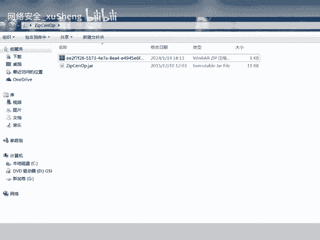
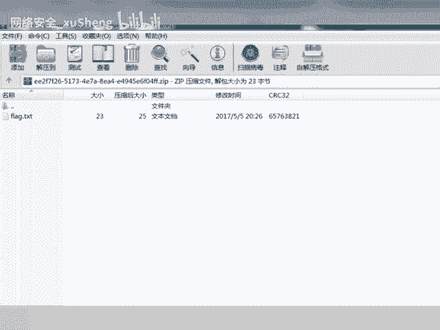

# CTF工具使用：P1：ZipCenOp.jar工具详解与Java环境配置

在本节课中，我们将学习一款名为ZipCenOp.jar的CTF工具。这款工具主要用于处理加密的ZIP文件，其速度相比传统的zipcracker工具更快。我们将重点介绍其基本用途、使用方法以及关键的Java环境配置注意事项。

## 工具概述与对比

上一节我们提到了CTF竞赛中处理加密压缩包的常见需求。本节中，我们来看看ZipCenOp.jar这款工具。

ZipCenOp.jar是一款用于破解或处理ZIP文件加密的工具。它的一个主要优点是执行速度比一些传统的ZIP密码破解工具（例如zipcracker）要快。然而，其运行高度依赖于Java环境，版本兼容性是成功使用的关键。


## Java环境配置要点

要成功运行ZipCenOp.jar，必须正确配置Java环境。使用过高的Java版本可能导致工具运行失败。

以下是配置Java环境时需要注意的几个核心事项：

1.  **确认当前Java版本**：在命令行中输入 `java -version` 可以查看当前安装的Java版本。
2.  **安装兼容版本**：如果当前版本过高，需要安装一个较旧的Java版本（例如Java 8）。可以从Oracle官网或OpenJDK项目下载。
3.  **环境变量配置**：确保JAVA_HOME环境变量指向正确的Java安装路径，并且PATH变量中包含Java的bin目录。
4.  **版本切换**：在系统中可能同时存在多个Java版本，需要确保命令行默认使用的是兼容的版本。



## 工具基本使用方法

了解了环境要求后，我们来看看如何实际使用这款工具。

ZipCenOp.jar通常通过Java命令在终端中运行。其基本命令格式如下：


```bash
java -jar ZipCenOp.jar [选项] [目标ZIP文件]
```

以下是运行工具时常见的几个步骤：

1.  打开终端或命令提示符。
2.  使用 `cd` 命令切换到ZipCenOp.jar文件所在的目录。
3.  输入上述格式的命令并执行。具体的选项（`[选项]`）需要参考该工具的使用说明，可能包括指定密码字典、攻击模式等。
4.  等待工具运行完成，查看输出结果。

**核心概念**：工具的运行依赖于Java虚拟机，其启动命令为 `java -jar`，后面跟上JAR文件的路径。



## 总结与注意事项

本节课中，我们一起学习了ZipCenOp.jar这款CTF工具。

我们首先了解了它相比zipcracker工具的速度优势。接着，重点强调了**Java环境版本**的重要性，版本过高可能导致运行不成功，因此配置一个兼容的版本是关键。最后，我们介绍了通过 `java -jar` 命令运行该工具的基本流程。

记住，在CTF竞赛或安全测试中，选择合适的工具并正确配置其运行环境，是成功解决问题的第一步。