# 001：课程介绍与安全基础

## 概述

在本节课中，我们将学习计算机安全的基本概念，了解什么是安全、为什么安全重要，以及软件漏洞是如何产生和被利用的。我们还将探讨现代黑客攻击的演变和常见攻击模式。

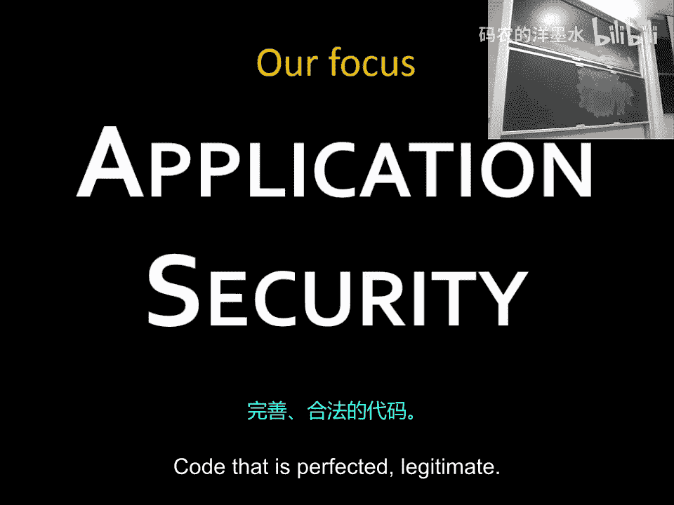

## 什么是安全？

安全是一个广泛的概念。让我们尝试定义它。安全不仅仅是维护隐私。维护隐私意味着保持机密性不被破坏。安全也关乎可用性。如果某些东西不可用，会有什么安全影响？例如，如果一个匿名组织决定让某个服务从互联网上消失，那么它就不可用了。安全还涉及完整性。完整性确保我们收到的信息确实来自其声称的来源，并且没有被篡改。如果有人篡改了数据包，即使你没有查看内部内容，完整性也已经被破坏了。

总结一下，机密性就是确保秘密保持秘密。广义上讲，我们在这门课程中主要关注的是软件安全。你也可以进一步扩展安全的定义，加入诸如真实性（确保信息确实来自你认为的人）、控制权（即使你拥有加密设备，但如果设备不在你手中，也是一种违规）等概念。

## 软件漏洞实例

现在，让我们看看软件漏洞的实际例子。我们将编写那些在过去20年里流传的黑客工具。我们将了解这些工具如何工作，如何让程序执行一些意想不到的操作。

### 示例一：银行转账漏洞

让我们以一个具体的应用程序为例，深入了解黑客的行为和常见的攻击点。假设我们有一个银行应用程序。

以下是一段用类似Java的伪代码编写的转账方法代码：

```java
void transferMoney(Account from, User to, int amount) {
    if (from.balance >= amount) {
        from.balance -= amount;
        to.account.balance += amount;
        System.out.println("Transfer successful.");
    } else {
        System.out.println("Insufficient funds.");
    }
}
```

这段代码的目的是在两个账户之间转账。程序员需要确保不会转出过多的钱，所以检查了账户余额是否足够。但这段代码有什么问题？

问题在于没有检查转账金额是否为负数。如果`amount`变量可以取负值，会发生什么？当金额为负数时，代码会从收款人账户“转出”钱到付款人账户，实际上是从对方那里偷钱。

这个例子说明了编码过程中缺失了什么。编写这段代码的程序员可能认为这没问题，但负数金额的概念根本没有进入他的脑海。这种缺乏检查的情况已经普遍存在了三十多年。我们现在有数十亿行由程序员编写的源代码，他们有时知道一些东西，有时不知道。我们所有人都依赖这些代码，而有人正在寻找其中大量的缺陷。

这是一个不会轻易消失的问题。我们也可以讨论如何改进编程语言，以减少犯这类错误的可能性。C语言在这方面是一个典型的例子，它就像拿着一把上膛的枪，允许你做任何事，但也极其危险。

### 示例二：编译器后门

另一个值得思考的安全概念是信任链。你总是需要信任某些东西。假设我们试图构建一个完美的、安全的登录程序。你可能会投入所有安全资源，认为它会坚不可摧。但考虑以下由肯·汤普森在1984年图灵奖演讲中提出的实际例子。

他演示了如何在编译器中插入特殊代码。例如，在编译登录程序时，添加一个后门。但你不能止步于此，因为如果有人查看你的编译器源代码，他们就能看到后门。所以，你还需要添加另一个检查：如果编译器正在编译它自己，那么也要添加这段后门代码。这样就有两个后门：一个在登录程序中，一个用于在编译新编译器时传播后门。

有趣的是，如果你只查看源代码，你实际上看不到这部分后门代码。因为你的编译器源代码看起来是干净的，但你必须用某个已有的二进制编译器来编译它，而那个编译器已经包含了后门，所以它会传播后门。现在，每个被编译的登录程序都包含后门。这很糟糕。

这个例子想要说明的是，你总是需要信任某些东西。在这里，你信任的根源是你获得的二进制编译器。即使查看源代码也可能不够。

### 示例三：编译器优化导致的安全漏洞

让我们看另一个来自微软的例子。微软在安全方面有过一段艰难的历史。他们知道这一点，所以投入了大量精力来改进。

这是一段尝试帮助你登录的代码。当你登录Windows时，开始输入密码。重要的是我们不能以明文形式存储你的密码。为什么这很重要？因为如果有人能访问计算机，他们就会知道你的密码。那么我们应该怎么做？我们应该对密码进行哈希处理，而不是存储明文。

哈希函数接收你的实际密码（一个字符串），并输出一个固定长度的、看起来像乱码的哈希值。当有人尝试登录时，他们输入密码，你将其通过相同的哈希函数，得到另一个哈希值。如果这两个哈希值相等，那么原始密码很可能就是相同的。这里的核心思想是，哈希函数是单向的，很难从哈希值反推出原始密码。

在微软的代码中，他们从用户那里读取密码，进行验证，然后在最后用零覆盖存储密码的缓冲区。这看起来很完美，对吗？执行完毕后，内存中应该看不到明文密码了。

但后来出现了一个漏洞报告：攻击者查看计算机内存时，仍然可以看到明文密码，即使没有在登录。你能想象微软工程师开会时的挫败感吗？你付出了努力编写这段安全代码，却收到了一个完全否定你的漏洞报告。

问题出在哪里？真正的密码存储在`pwdBuffer`缓冲区中，然后有一个`memset`调用用零覆盖整个缓冲区。但编译器在查看这段代码时会进行优化。编译器试图让代码高效运行，它会重新排列指令，删除不需要的代码。编译器看到`memset`后可能会想：“在这之后你再也用不到`pwdBuffer`了，为什么还要调用`memset`？我直接把它删掉吧。”于是，编译器出于效率原因，移除了安全清理操作。

这令人非常不满。仅仅查看代码，你无法发现这个特定问题。这就是为什么我们在这门课程中要学习很多汇编语言。

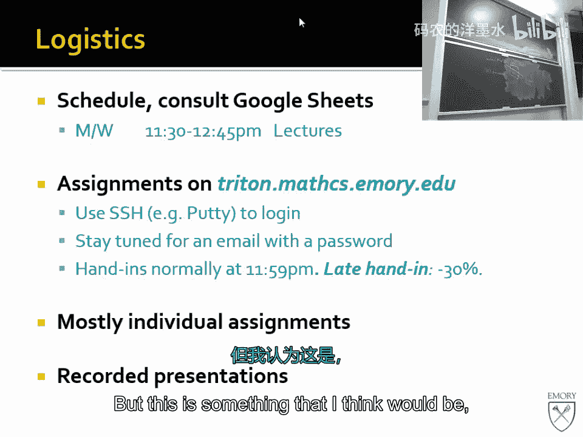

## 安全领域概览

以上是几个我们将要深入研究的漏洞示例。安全是一个广阔的领域。我们可以将其细分为几个子领域：
*   **操作系统安全**：处理操作系统层面的问题。
*   **网络安全**：涉及网络通信、流量劫持等。
*   **密码学**：非常数学化，需要专门课程。
*   **软件漏洞**：我们将主要关注的部分。

密码学是一个独立的子领域，非常数学化，需要完整的课程才能掌握。其余部分，我们可以稍微平衡一下。如果你对操作系统或网络中的特定问题有疑问，我们也可以涉及。你也有机会准备自己的视频讲座，上传到网上。如果你对某个特定主题特别感兴趣，请深入研究。

## 课程目标与期望

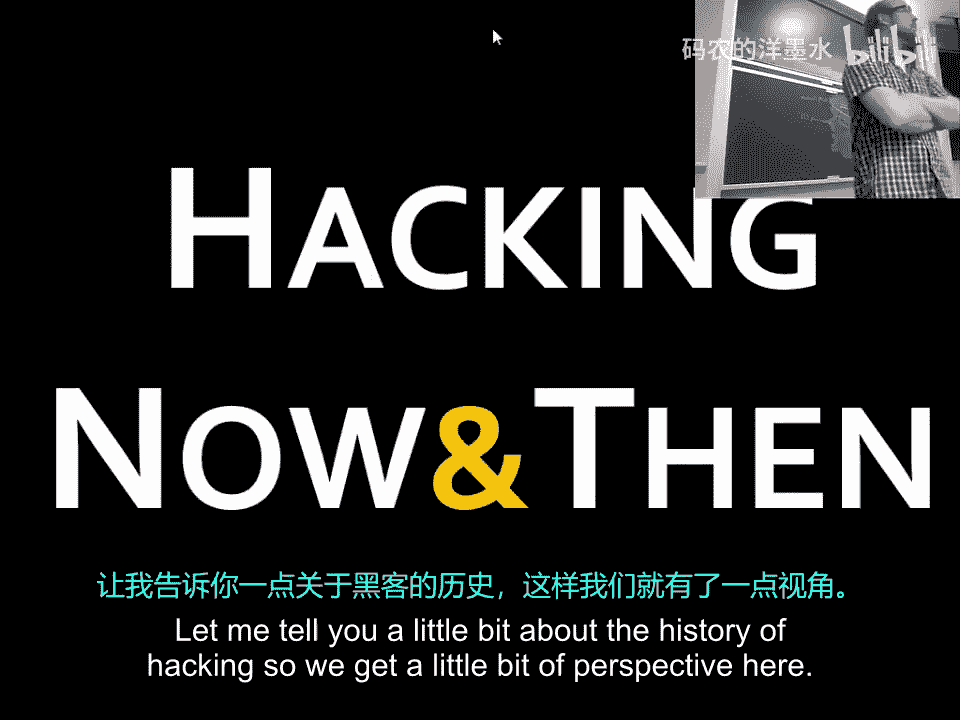

从宏观角度看，本课程将专注于软件漏洞的**检测、利用和预防**。我们将特别深入地研究内存损坏漏洞，这可以说是计算机安全中最难的部分之一。密码学也可能很难，但如果你完成了本课程的所有讲座和实验，你将对安全领域充满信心，甚至可以在黑客会议上谈论这些内容。

这是一个非常有用的技能组合。未来三年，全球将有约600万个计算机安全相关的工作岗位。目前有大约100万个职位空缺。招聘人员填补计算机安全职位的时间比其他任何技术职位都要长20%到30%。非常缺乏懂这些知识的人。

我在这里教授的内容，是关于事物如何运作的。我认为，如果你知道某些东西是如何被攻破的，你就能更好地理解如何防御它。

### 道德与法律要求

这意味着，因为你在这里学到的知识，你** implicitly **同意你不会将这些知识用于任何恶意目的。如果你想攻击某个网站，你应该获得对方的知情和同意。否则，你和我都可能陷入大麻烦。这涉及法律问题。因此，你**不得**进行未经授权的非法分析或攻击，不得在未经许可的情况下入侵系统。你也理解，我有义务报告任何我发现的非法活动。

你还应遵守以下政策：你应该独立完成作业。这是一门黑客课程，但这并不意味着你应该“黑掉”作业。你可以与同学进行高层次的讨论，因为大家起点相同，有些内容会比较难，你会从这种互动中学到很多。但这并不意味着你可以直接索要别人的代码。同时，请采取合理措施保护你自己工作的机密性。

### 课程安排与形式

我们将在每周一和周三的上午11:30到12:45上课。你将获得一个名为“Triton”的Linux机器的账户。作业截止时间定为晚上9点。关于迟交政策，我们暂定为每晚扣15%的分数，并有几天的宽限期。大部分作业是个人作业，这意味着你将掌握本课程教授的所有技能。

我会录制讲座视频，但这并不意味着你应该不来上课。上课的目的是为了互动、提问和参与。现场参与感更强。当然，如果你错过了某节课，可以看录像补上。

## 黑客的演变与动机

现在，让我们谈谈黑客。黑客是一门让事物做它们本不该做的事情的手艺。黑客的历史和动机已经发生了变化。

在2000年左右，“黑客”意味着你是一个充满好奇心的极客。你上网结识其他对技术感兴趣的人，动机主要是好奇。你想弄明白如何让广播做点意想不到的事，或者接管IRC频道。

但自那以后，情况发生了变化。现在，除了少数爱好者在摆弄东西，还出现了由不同动机驱动的黑客。他们受到金钱的诱惑。网络犯罪是增长最快的领域之一，市场规模达数百亿美元。对于罗马尼亚、台湾某些地区或俄罗斯偏远地区的人来说，从事黑客活动可能是最赚钱的选择，收入可能是合法工作的20到30倍。你几乎零风险，只需要攻击目标，然后从那些看起来可疑的人那里收取报酬。

此外，世界各地的政府也对如何利用互联网推进自身利益或进行间谍活动非常感兴趣。他们传统上缺乏技术专长，所以他们会招募那些曾因黑客行为被捕的人，或者直接组建黑客部队。这发生在以色列、俄罗斯、中国等地。美国国家安全局也需要成千上万的黑客来填补空缺职位。这是一个大规模的招募活动。

### 漏洞的价值与现状

你可能会想，漏洞的价值如此之高，是不是因为它们很稀有？一个针对Chrome的远程代码执行漏洞值多少钱？如果是完全可用的远程攻击代码，谷歌会支付6万到10万美元。如果是针对iOS的零点击远程漏洞，价值可能高达50万到200万美元。但这需要数月的工作，而且是高风险、高回报的职业。

然而，漏洞其实并不少。看看微软每月发布的严重漏洞列表就知道了，每天都有新的可以完全控制你电脑的漏洞出现。技术不断变化，即使编程水平提高了，公司仍然更注重功能。一个能煮咖啡的PDF阅读器比一个更安全但不能煮咖啡的PDF阅读器卖得更好。这就是市场的选择。

代码复杂性也爆炸性增长。你的手机里运行着天文数字般的代码行数，有无数层，没有人能完全了解自己电脑上发生的一切。代码重用也变得极其普遍。例如，2001年Netscape的JPEG库有一个漏洞，两年后Internet Explorer出现了完全相同的漏洞，因为他们重用了那个旧的库代码。这种代码重用无处不在。

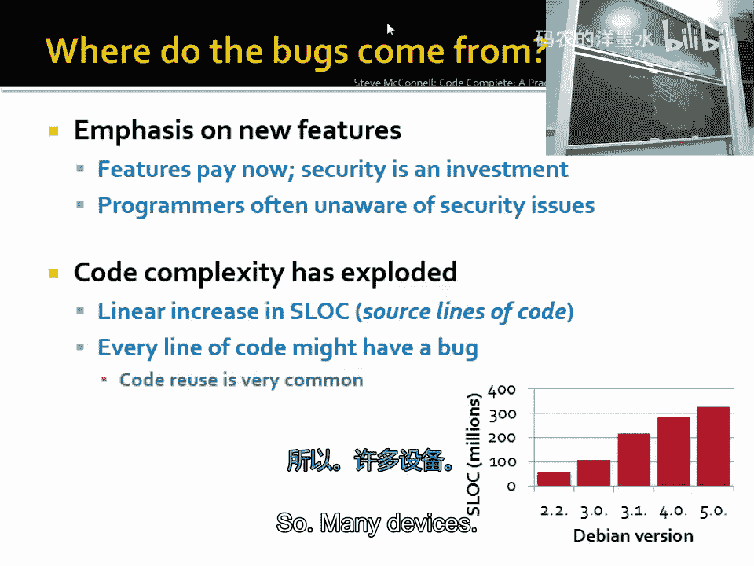

## 漏洞的利用方式

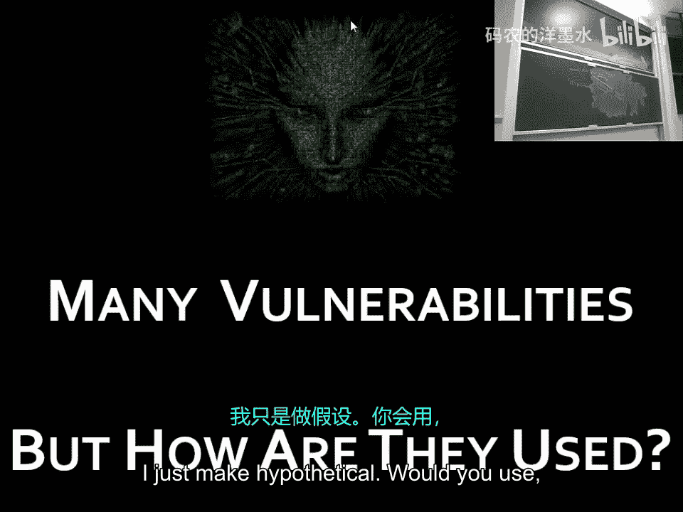

假设你绕过了本课程的道德法律约束（这只是一个假设），你会如何利用这些漏洞？人们实际上用它们来做什么？

### 僵尸网络

一种方式是创建**僵尸网络**。你的电脑在不知情的情况下加入了成千上万台电脑组成的网络。有人“牧养”着这个僵尸网络，确保有新的电脑加入，替换掉死机的电脑。然后，他们可以用这个网络发起**分布式拒绝服务攻击**。这就像通过广播呼吁所有人去堵塞一家超市的停车场，让合法顾客无法进入。公司通常会支付赎金让攻击停止。

僵尸网络也用于发送**垃圾邮件**。发送足够多的垃圾邮件，总会有人处于易受攻击的心理状态并点击链接。尽管比例很低，但基数足够大，仍然能带来可观的收入。

### 点击欺诈与勒索软件

你还可以用僵尸网络进行**点击欺诈**。你在一个无聊的网页上放上谷歌广告，然后让僵尸网络里的电脑去点击它，你就能赚取佣金。谷歌等公司虽然努力检测，但仍然因此损失大量金钱。

更直接的攻击是**勒索软件**，比如“加密锁”。它加密你硬盘上的所有文件，然后索要赎金才提供解密密钥。很多人宁愿付钱也不愿失去珍贵的照片。

### 高级持续性威胁

还有更复杂的攻击，例如“震网”病毒。据报道，这是美国和以色列联合开发的，使用了四个针对Windows的零日漏洞，每个都可能价值10万美元。它专门针对伊朗的核设施，通过U盘在隔离网络中传播，记录离心机的正常操作，然后突然改变其转速，同时向控制室显示一切正常的假数据。据报道，它摧毁了伊朗约20%的离心机，是一个非常精密的网络武器。

### 供应链攻击

另一种方式是**供应链攻击**。例如，攻击像RSA这样的安全公司。2011年，攻击者通过钓鱼邮件侵入RSA，窃取了SecurID双因素认证系统的种子信息。然后他们又利用这些信息攻击了RSA的客户，包括洛克希德·马丁等国防承包商。许多大公司，如谷歌、雅虎、Juniper都承认遭受过来自特定国家支持的高级攻击。

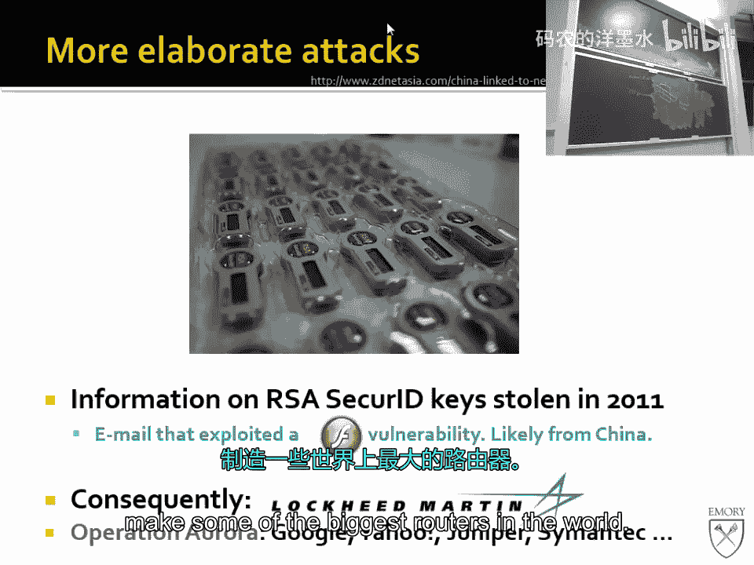

## 现代攻击入口：钓鱼攻击

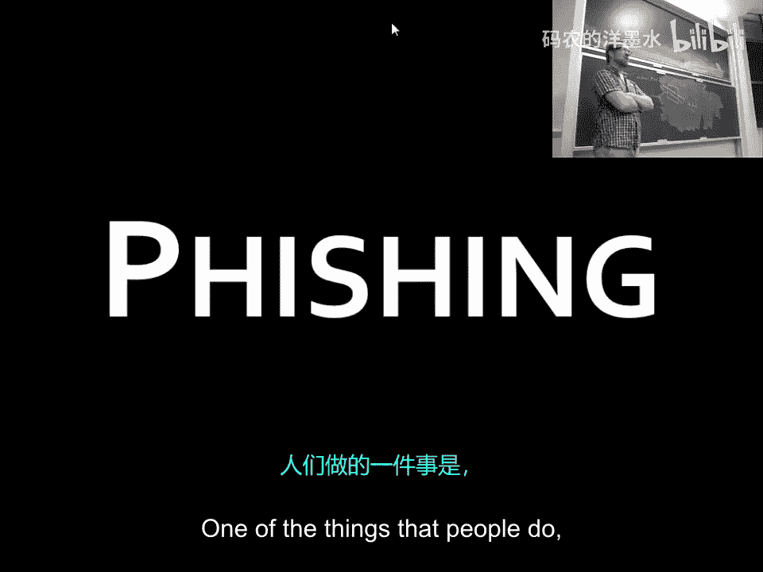

考虑到上述信息，现代黑客如何进入一个组织？如果你在枪口下被问如何进入一栋建筑，你可能会说从后门或窗户进入。这正是现代安全的情况：人们加固了前门（防火墙、入侵检测系统），但忽略了其他入口。

最常见的入口是**钓鱼攻击**。你可能会收到一封伪造的Twitter密码重置邮件，点击链接并输入凭证。如果你在所有地方使用同一个密码，那么你这个唯一的密码就泄露了。或者你收到一封冒充花旗银行的紧急邮件，告诉你必须立即点击链接，否则账户会被关闭。每天都有数百万封钓鱼邮件发出，尽管大部分被过滤，但仍有相当一部分被打开和点击，导致信息泄露。

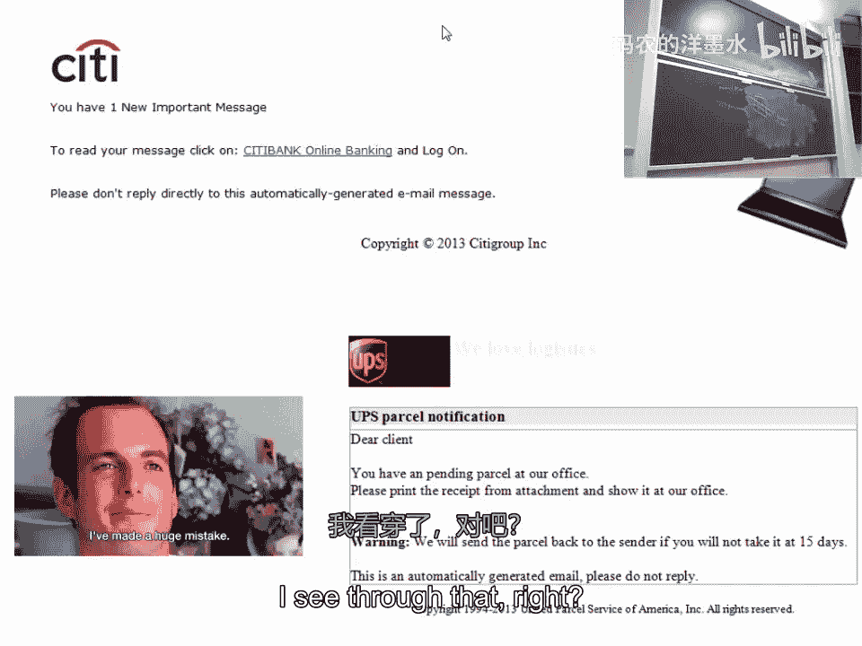

如果你有特定目标，可以进行**鱼叉式钓鱼**。这种攻击高度定制化，几乎总是有效。假设你想攻击一个防守严密的组织。直接突破防火墙很难。相反，你意识到信息存在于组织内部，而员工需要工作，工作通常包括处理电子邮件。

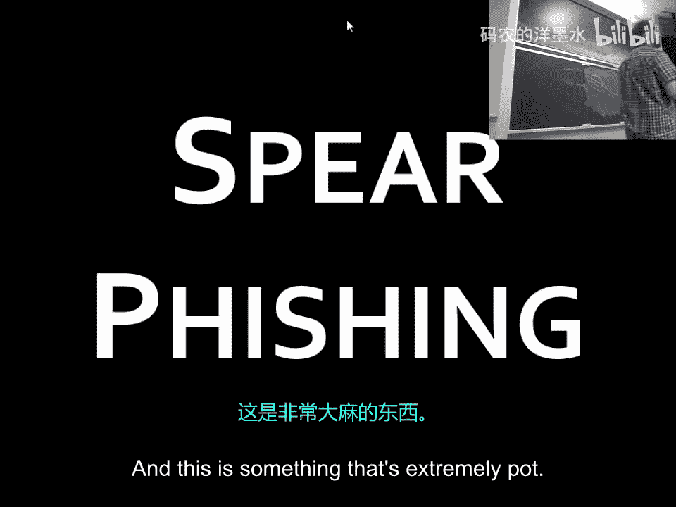

你发送一封精心制作的、针对特定员工的钓鱼邮件，附件可能是一个有趣的文档或链接。总有人会点击它。一旦点击，恶意代码就在其电脑上运行。由于这台电脑在内部网络，攻击者可以横向移动，最终可能到达系统管理员的电脑，从而获得一切访问权限。然后他们窃取数据，通过加密通道传回。这种事情一直在发生，只是大部分从未被报道，因为公司要么没发现，要么发现了但羞于承认。

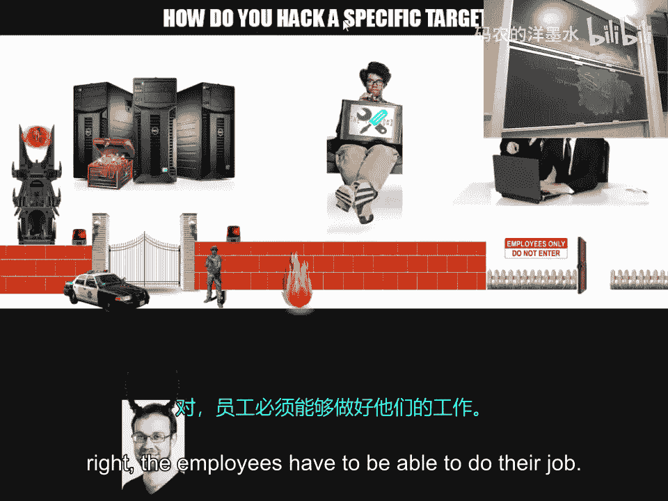

## 总结

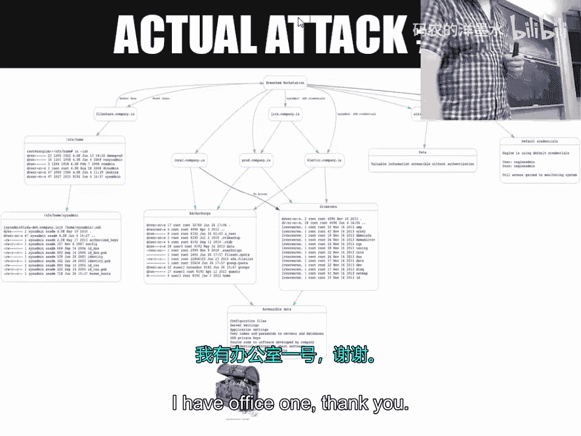

本节课我们一起学习了计算机安全的基础定义，包括机密性、完整性和可用性。我们通过银行转账、编译器后门和优化漏洞等实例，了解了软件漏洞是如何因程序员的疏忽、信任链问题甚至编译器行为而产生的。我们探讨了安全领域的广阔图景以及本课程的重点。我们还回顾了黑客动机从好奇心到金钱和地缘政治的演变，并分析了僵尸网络、勒索软件、APT攻击等现代攻击方式。最后，我们认识到，尽管技术防御在加强，但通过钓鱼攻击利用人为因素仍然是攻击者最常用的突破口。在接下来的课程中，我们将深入技术细节，学习如何发现、利用和防御这些漏洞。