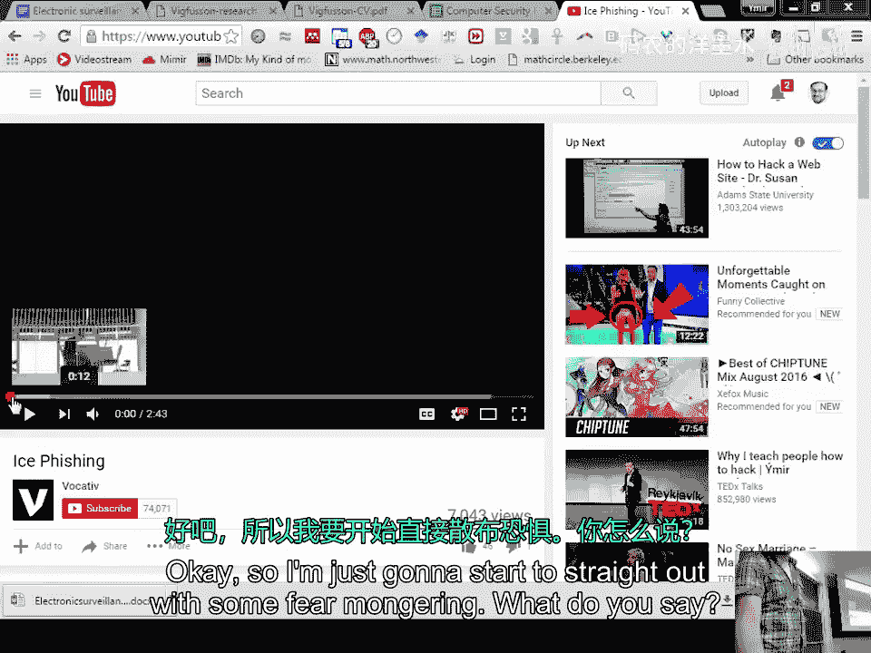
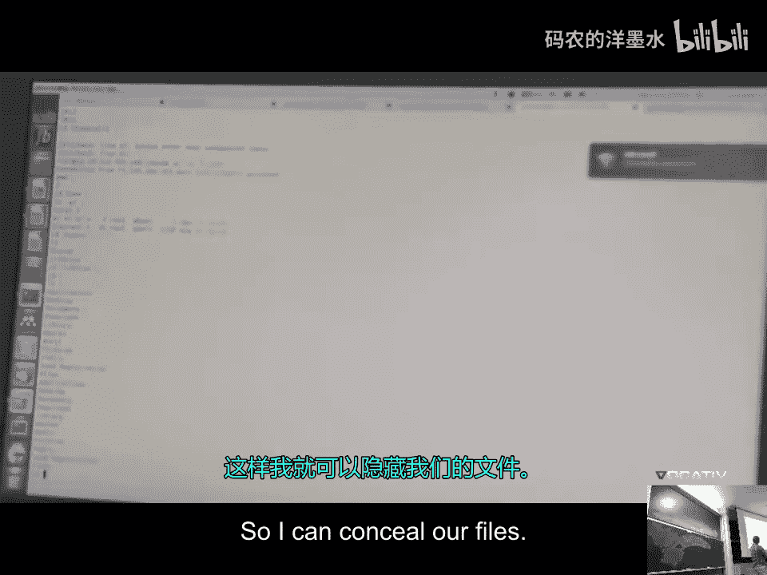
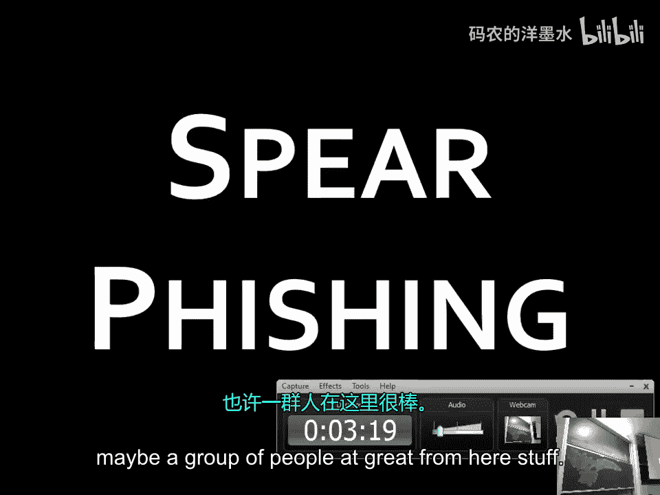
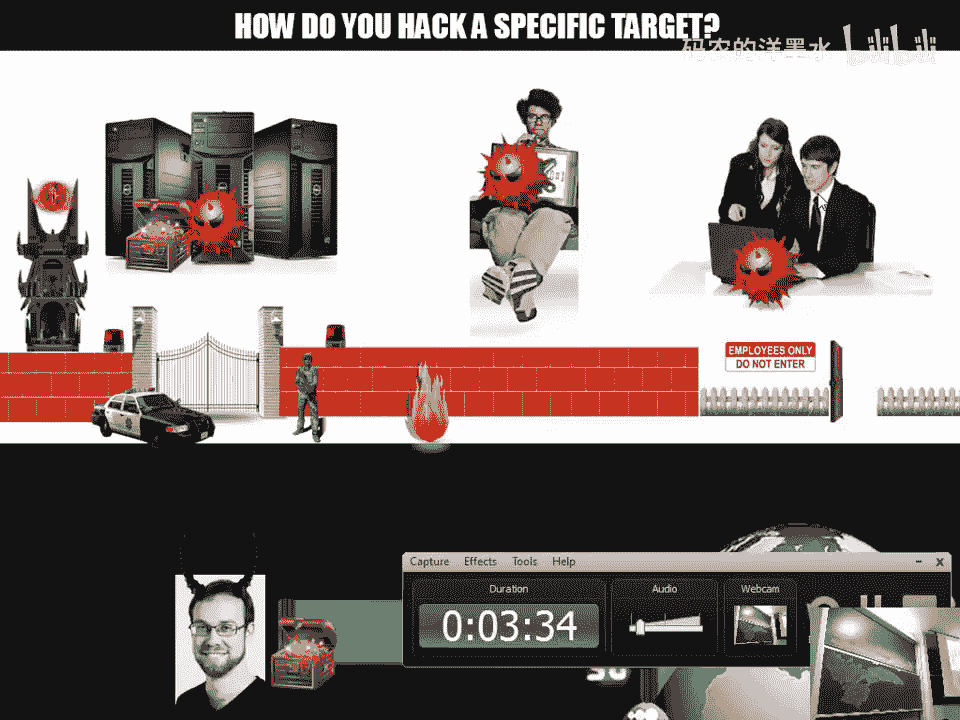
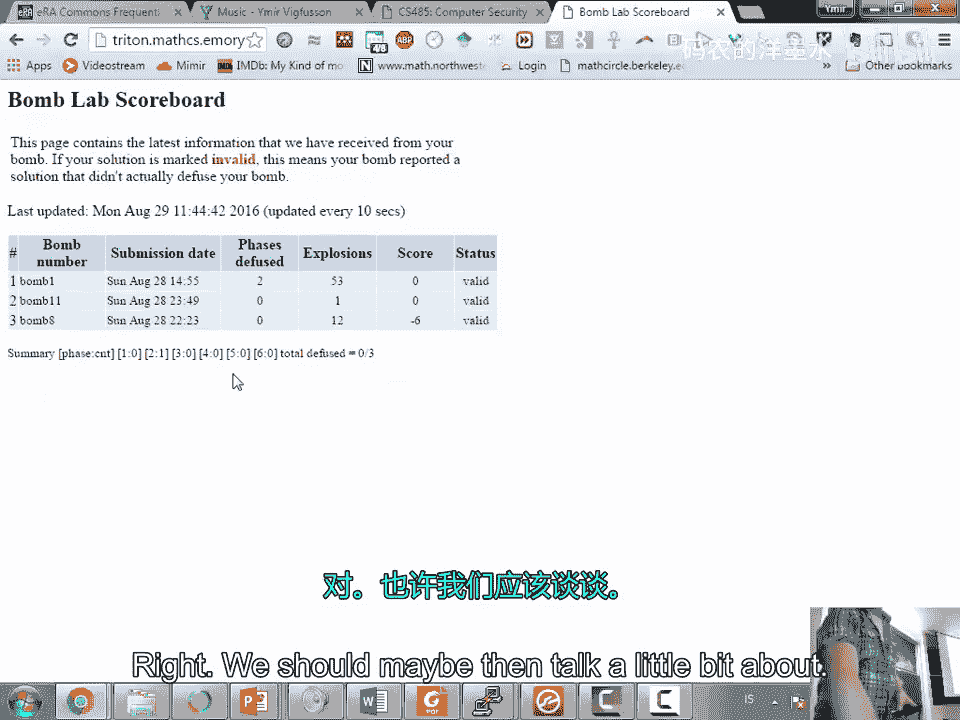
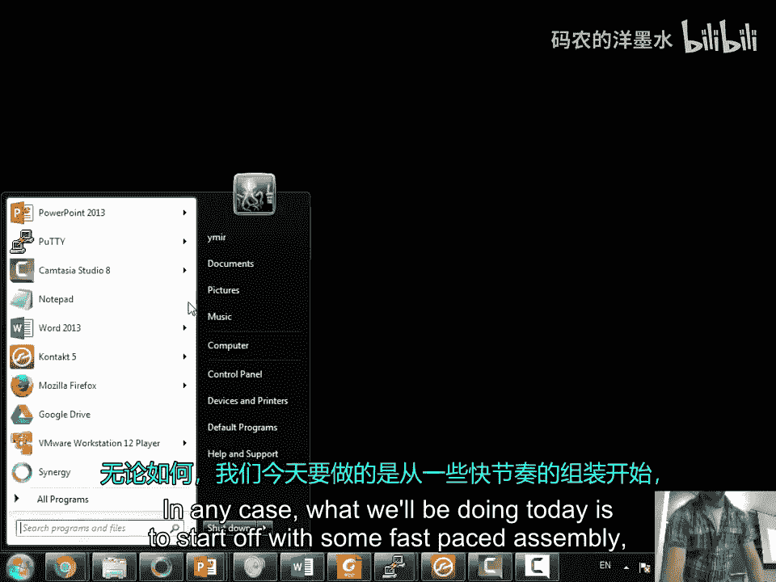
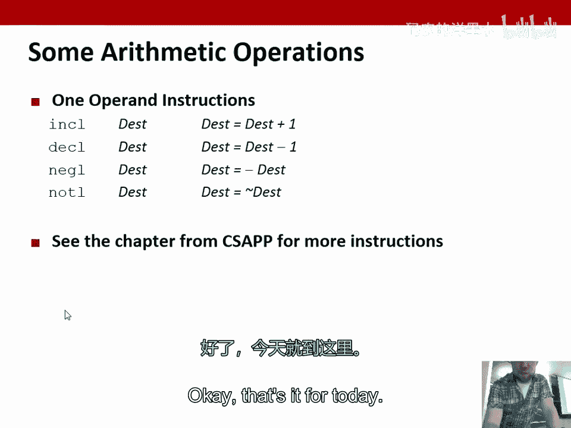

# 002：x86汇编（第一部分）🚀

在本节课中，我们将要学习计算机安全的基础，特别是通过理解底层硬件如何工作来发现和利用漏洞。我们将从一个真实的攻击案例开始，然后深入探讨x86汇编语言的基础知识，这是理解软件如何与硬件交互以及如何发现其弱点的关键。

## 概述：从社会工程到汇编语言

上一节我们介绍了课程的整体框架。本节中，我们来看看一个具体的攻击案例，并开始学习理解这些攻击所必需的核心技术——汇编语言。通过理解计算机最底层的指令，我们可以更好地理解安全漏洞是如何产生和被利用的。

## 攻击案例：鱼叉式网络钓鱼

我的名字是Eil Richardson，我是Redan大学的计算机科学助理教授。我想先分享一个故事。一些记者来采访我，讨论如何教授安全课程。之后，他们发布了一篇新闻报道。

我收到了一封看起来无害的电子邮件。它很友好，并且直接称呼我的名字。点击邮件中的链接，会打开一个看起来像是个人网站的页面。页面底部有一个PDF链接。然而，当你打开它时，它不仅仅是打开一个文件，实际上会在用户不知情的情况下在电脑上运行一个程序。

这个页面看起来像是他的简历。但实际上，我们已经通过这个链接获得了对目标计算机的远程访问。我可以查看她所有的文件，可以做很多事情。这很可怕，因为感觉就像有人在别处看着我的屏幕，或者正在看着我，这可能才是最可怕的部分——他们知道我在做什么。

这个例子展示了鱼叉式网络钓鱼攻击。攻击的薄弱环节往往是人本身。这就是大型组织如何攻击随机个人的方式。

## 内部网络渗透

这是一个我们针对某家公司进行的真实攻击。我们选择了一个目标，并试图侵入其网络的外围防线。一个网络的外围防线通常比较容易突破。如果你在一个组织里，并且想知道是否有人能突破外部防火墙和计算机，答案是肯定的。你应该始终假设有人能做到这一点。这是最容易利用的环节。

首先进行鱼叉式网络钓鱼，向目标发送针对其系统（如苹果电脑）的漏洞利用程序。一旦获得了外部工作站的访问权限，下一步就是尝试进行所谓的横向移动，以接近你的目标数据。

你可以侵入各种服务，例如查找内部管理服务、维基页面，获取有关身份验证信息等。本质上，你是在系统内部的不同部分之间移动。当你进入组织内部时，通常没有人监控任何活动。这是一个可悲的现状。

当前的现状是，人们在外部防护上投入了大量资金，但内部却疏于防范。当攻击发生时，他们甚至不知道攻击者还在内部网络中。

## 安全投资的误区与杀毒软件的局限性

以下是人们在安全产品上花费资金的分布情况。97%的资金花在了杀毒软件这类产品上。而用于审计、入侵检测系统或防火墙的资金则少得多。然而，防火墙是最容易被绕过的，绕过任何类型的入侵检测或防御软件大约只需要半小时。

我们开发了一个远程访问木马，将其放在某人的电脑上以进行渗透测试，然后将其发送到VirusTotal（一个病毒检测网站）查看是否有杀毒软件能发现它。我们不知道VirusTotal实际上与各大公司共享数据，所以很快就有针对我们木马的补丁发布。于是我们做了什么？我们重新编译了它，之后就没有任何杀毒软件能检测到它了。

杀毒软件实际上面临着一个不可能的挑战：判断某个东西是否是恶意的。如果你能做到这一点，就相当于解决了停机问题。杀毒软件需要在有限的时间内，对你打开的文件进行分析，例如判断一个压缩包内是否包含恶意软件。攻击者可以利用这种复杂性来绕过检测。

## 课程安排与二进制炸弹实验

上次我们没有讨论课程安排，现在我想给大家一个初步的计划。我们将深入探讨二进制漏洞利用，并做很多实验。

我们将发布第一个实验：二进制炸弹。这是一个二进制可执行文件，你没有源代码。如果你运行它，它就会“爆炸”并通知我。你需要做的是逆向分析它、破解它，改变其行为，使其不会爆炸。这是第一个挑战。

然后我们将从缓冲区溢出开始，讨论栈溢出和一些更有趣的堆溢出。我们将讨论针对二进制漏洞利用的一些防御措施，包括不可执行栈、地址空间布局随机化，以及更复杂的技术如控制流完整性等。

我们还会有一个关于Web安全的实验，讨论一些道德和法律问题。我们将探讨如何利用随机性的缺陷，甚至可能涉及一些加密和社会工程学的内容。

课程中，你们需要准备一个YouTube视频，向世界介绍你们精通的某个安全主题。这将是你们的口头报告部分。此外，还有期中考试和期末考试。

## 为什么学习汇编语言？

那么，我们为什么要学习汇编语言？这是为了理解计算机底层究竟在发生什么。

汇编语言本质上让我们能够理解“引擎盖下”的情况。如果你想理解你的计算机在做什么，或者想进行逆向工程（这是一个高薪职业），比如分析新出现的病毒、逆向其行为并制作补丁，那么汇编语言是必不可少的。

从图灵机的角度看，汇编语言并没有那么不同。它主要是关于对内存位置的读写操作。我们有一些寄存器（可以看作是高速口袋），用于临时存放数据，进行加减运算，然后再将结果存回内存。这就是汇编语言所做的一切。

因为直接编写汇编语言非常繁琐，所以我们有了像C这样的高级语言。C语言就像是汇编语言之上的一层外壳。然后又有更高级的语言建立在C语言之上。我们学习汇编语言，就是要绕过这些高层抽象，直接理解底层代码。

## 计算机的基本模型：CPU、寄存器和内存

让我们看看计算机的基本模型。这是CPU，它有一个程序计数器（也称为指令指针EIP），告诉你当前正在执行内存中的哪个位置。你有一些寄存器，这是CPU上少量但极快的内存单元。你与外界的所有交互都通过内存进行。

在计算机中，包括代码和数据在内的一切都是数字，它们之间没有本质区别。它们只是一系列字节。关键的一点是，如果程序计数器指向内存的某个部分，该部分就会被解释为代码。这是我们进行黑客攻击的关键：我们将混淆数据和代码。我们将把本应是数据的东西塞入程序，然后破坏程序，使其认为那是代码。

## 从C代码到汇编：一个简单的例子

通常，我们编写C程序。C编译器将程序转换为目标代码。我们可以查看中间的汇编表示。

例如，一个最简单的“Hello, World”程序。当我们编译它并查看其汇编代码时，会发现大部分代码都是各种初始化和库调用。核心部分只是调用`puts`函数来打印字符串，然后调用`exit`函数退出。

接下来，链接器将目标代码与所需的库（如`printf`的库）链接起来，最终生成可执行文件。

## 汇编语言基础：数据类型与操作

汇编语言有几种基本数据类型，主要是各种大小的整数（1字节、2字节、4字节、8字节）。所有东西在汇编层面都被视为数字，包括内存地址。我们没有字符串或对象这样的高级类型。数组和结构体只是连续的内存块。

对于这些整数，我们可以进行一些操作：加载/存储（在寄存器和内存之间移动数据）、算术运算（加、减、乘等）、控制流转移（跳转、调用函数）。这些指令足以实现所有现代软件。

指令在底层表示为二进制操作码。例如，`0x55`对应`push ebp`指令。

## 实践：查看与调试汇编代码

我们可以使用调试器（如GDB）来查看和逐步执行汇编代码。例如，我们可以编译一个带`sum`函数的程序，然后在GDB中反汇编它，查看其汇编指令，单步执行，并观察寄存器的变化。这将是你们在破解“二进制炸弹”实验时要做的事情。

## 寄存器详解

我们有多个寄存器，如EAX, EBX, ECX, EDX, ESI, EDI, EBP, ESP。它们的命名有历史原因，源于早期8位和16位CPU的扩展，并为了向后兼容而保留。在64位架构中，这些寄存器被扩展为RAX, RBX等，但旧的32位名称仍然可以访问其低32位。

## 数据移动指令

最基本的指令是`mov`，用于将数据从源移动到目标。顺序是`mov 目标, 源`。
*   可以移动立即数（常量）到寄存器：`mov $0x400, %eax`
*   可以在寄存器之间移动：`mov %edx, %esi`
*   可以访问内存：括号表示间接寻址。
    *   `mov (%eax), %ebx`：将EAX寄存器中的值作为地址，从该内存地址读取4字节到EBX。
    *   `mov %ecx, (%eax)`：将ECX的值写入EAX指向的内存地址。
    *   可以带偏移量：`mov 8(%eax), %ebx`：读取地址为`EAX值 + 8`的内存内容。
    *   更复杂的寻址模式：`位移(基址寄存器, 索引寄存器, 缩放因子)`，例如用于数组访问。

注意：x86指令不允许内存到内存的直接移动，必须通过寄存器中转。

## 地址计算指令

`lea`（加载有效地址）指令用于计算地址，而不进行内存访问。它常用于快速的算术运算，例如 `lea (%eax, %eax, 2), %edx` 可以实现 `EDX = EAX * 3`。

## 算术与逻辑运算

除了`mov`，我们还有：
*   `add`：加法
*   `sub`：减法
*   `imul`：有符号乘法
*   `shl` / `shr`：逻辑左移/右移
*   `sal` / `sar`：算术左移/右移（`sar`会保持符号位）
*   `inc` / `dec`：加一/减一
*   `neg`：取负（二进制补码）
*   `not`：按位取反

汇编语言本身不区分有符号数和无符号数，区别体现在如何使用这些数据。例如，使用`sar`通常意味着操作的是有符号数。

## 关于整数溢出的一个有趣例子

在二进制补码表示中，负数的范围比正数大一个（因为0占用了正数范围的一个表示）。最小的负数（如32位下的-2,147,483,648）取负后，其结果无法用正数表示，会导致溢出，在许多系统中结果会保持不变（或产生未定义行为）。这是一个已知的漏洞，在某些数据库软件（如MySQL）中，使用这个特定的数字可能导致问题。

## 总结

本节课中，我们一起学习了计算机安全的一个现实切入点——社会工程学攻击，并开始了我们的核心技术之旅：x86汇编语言。我们了解了为什么需要学习汇编，查看了从C代码到汇编代码的转换过程，认识了CPU、寄存器和内存的基本模型，并学习了`mov`、`lea`、`add`等基本指令及其寻址方式。理解这些底层原理是后续学习缓冲区溢出、漏洞挖掘与利用的基础。在接下来的课程中，我们将利用这些知识深入探索软件安全的世界。