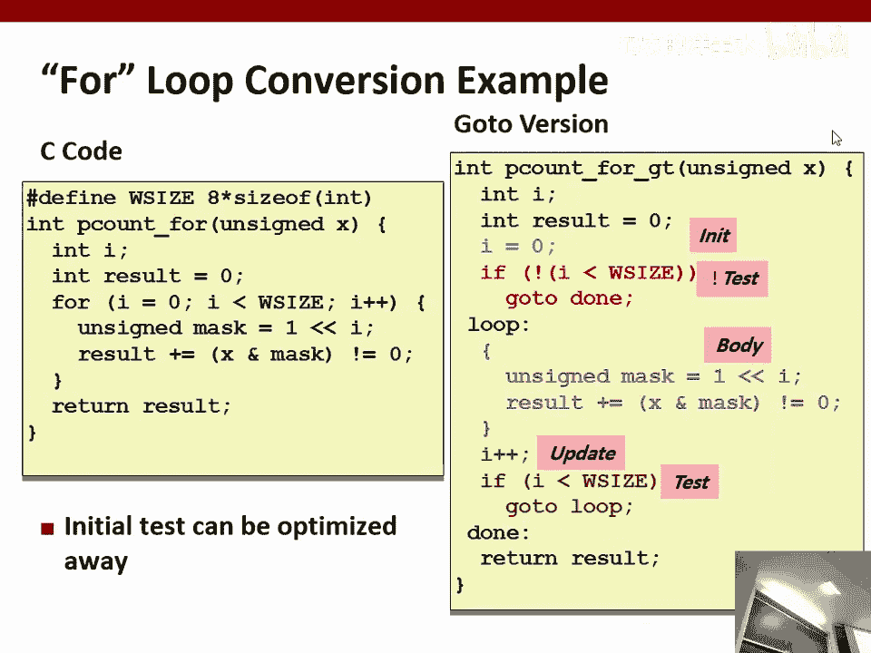
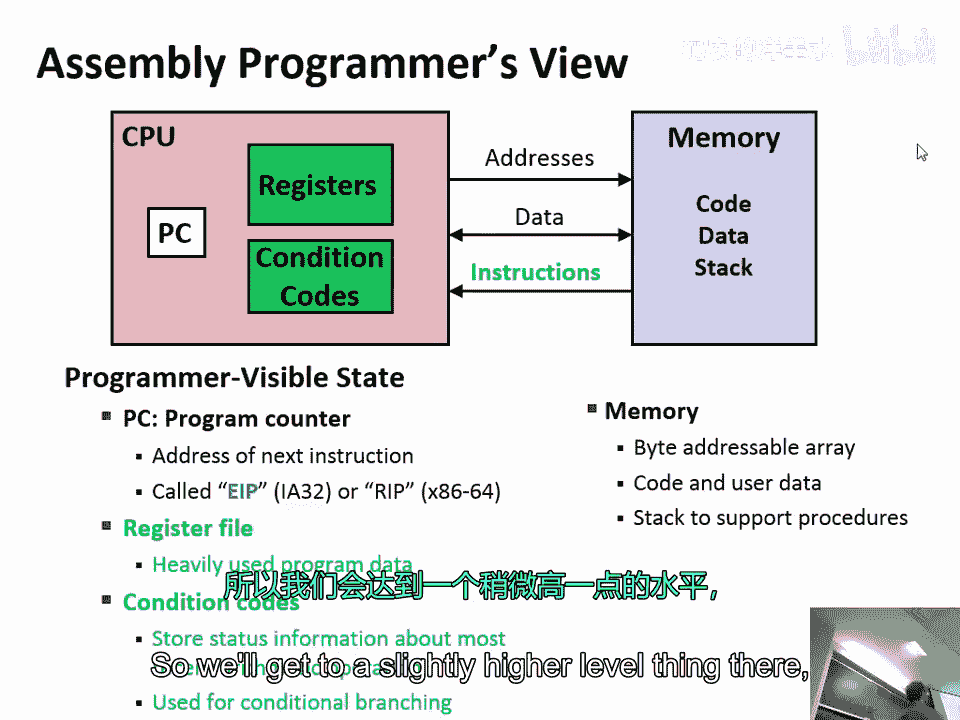
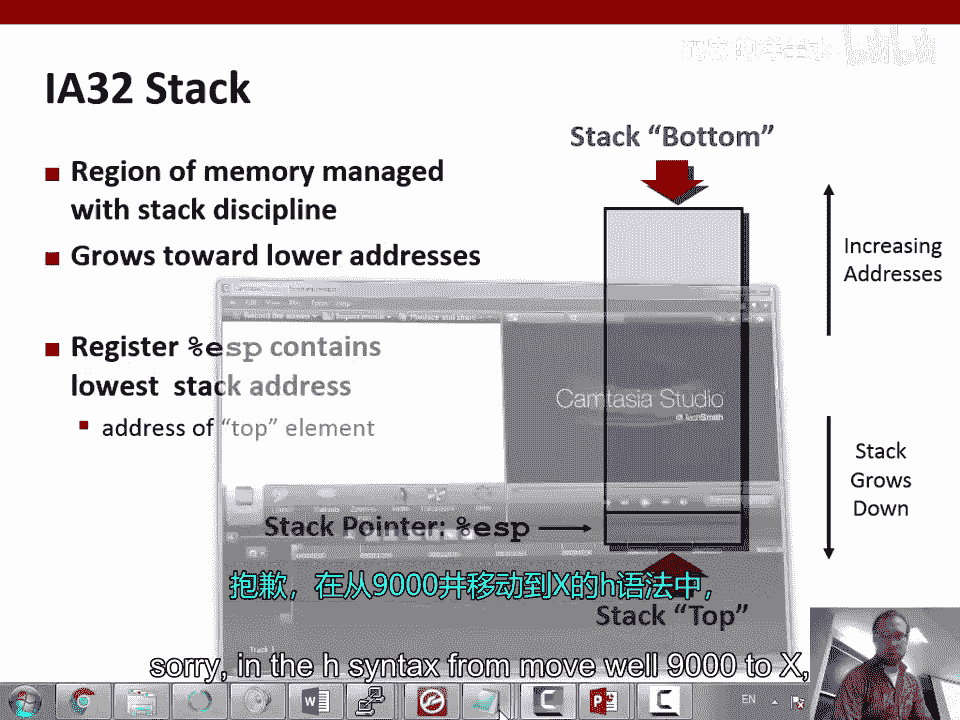
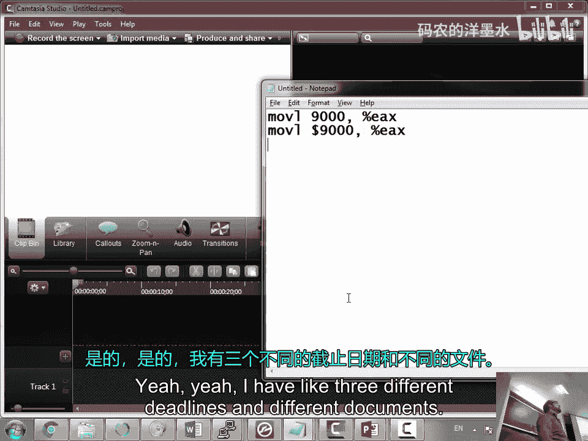

# 003：x86汇编（第二部分）🚀


在本节课中，我们将继续深入学习x86汇编语言。我们将探讨条件码、控制流（如跳转和循环）以及内存访问的基本概念。通过理解这些底层机制，我们能够更好地分析程序行为，为后续学习安全漏洞和利用技术打下坚实基础。

## 条件码与比较操作 🧮

上一节我们介绍了基本的算术和移动指令。本节中，我们来看看如何让程序根据条件做出决策，这是实现复杂逻辑的关键。

CPU中有一组特殊的单比特标志，称为**条件码**。它们记录了最近一次算术或逻辑运算的结果特征。主要的条件码有：
*   **CF（进位标志）**：记录无符号数运算的进位或借位。
*   **ZF（零标志）**：记录结果是否为0。
*   **SF（符号标志）**：记录结果的符号（最高位）。
*   **OF（溢出标志）**：记录有符号数运算是否发生溢出。

这些标志由`add`、`sub`、`mul`等算术指令自动设置。我们也可以使用`cmp`和`test`指令来显式设置它们，而不改变操作数本身。

`cmp`指令的语法是`cmp b, a`，其效果类似于计算`a - b`，并根据结果设置条件码。例如，如果`a == b`，则`ZF`会被设置为1。

`test`指令的语法是`test b, a`，其效果是计算`a & b`（按位与），并根据结果设置条件码。它常用于测试某个位是否为0。

## 条件设置与跳转指令 🔀

仅仅设置条件码还不够，我们需要根据这些标志来改变程序执行流程。这通过两类指令实现：`set`指令和`jump`指令。

`set`指令根据条件码的组合，将一个寄存器的低8位设置为0或1。例如：
*   `sete al`：如果`ZF==1`（相等），则设置`al=1`，否则`al=0`。
*   `setg al`：如果`(SF^OF)==0 && ZF==0`（有符号大于），则设置`al=1`。

`jump`指令则直接改变指令指针`EIP`的值，实现跳转。例如：
*   `je label`：如果`ZF==1`（相等），则跳转到`label`处执行。
*   `jg label`：如果有符号大于，则跳转到`label`处执行。
*   `jmp label`：无条件跳转到`label`处。

以下是一个判断`x > y`并返回布尔值的函数示例：
```assembly
cmp edx, ecx    ; 比较 y(x) 和 x(ecx)， 实际计算 ecx - edx
setg al         ; 如果有符号大于，则 al = 1
movzx eax, al   ; 将 al 零扩展到 eax，作为返回值
```

## 从高级语言控制流到汇编 🌉

理解了条件跳转，我们就可以将高级语言中的`if`和`while`语句翻译成汇编代码。其核心思想是将结构化控制流转换为带标签和跳转的“流程图”。

**`if`语句的转换：**
一个`if (condition) then-statement else else-statement`结构，通常被转换为以下模式：
1.  计算条件，并跳转到`else`标签（如果条件为假）。
2.  `then`标签：执行 then-statement。
3.  跳转到`endif`标签（跳过else部分）。
4.  `else`标签：执行 else-statement。
5.  `endif`标签：继续后续代码。

**`while`循环的转换：**
一个`while (condition) loop-body`结构，通常被转换为以下模式：
1.  `loop`标签：计算条件。
2.  如果条件为假，跳转到`endloop`标签。
3.  执行 loop-body。
4.  跳转回`loop`标签。
5.  `endloop`标签：继续后续代码。


编译器在生成汇编代码时，会进行大量优化，例如将`for`循环转换为更高效的`do-while`形式，或者消除不必要的跳转。

## 内存访问模式详解 🗃️

程序的数据不仅存储在寄存器中，更多是存储在内存里。理解如何访问内存至关重要。

内存可以看作一个巨大的字节数组，每个字节都有一个唯一的**内存地址**。在汇编中，我们通过地址来读写内存中的数据。

基本的移动指令是`mov`。根据操作数类型，`mov`有多种形式：
*   `mov eax, 0x9000`：将**立即数**`0x9000`送入寄存器`eax`。
*   `mov eax, [0x1301]`：将**内存地址**`0x1301`处存储的值（例如`0x9000`）送入寄存器`eax`。方括号`[]`表示间接寻址。
*   `mov eax, [ecx]`：将寄存器`ecx`中的值作为内存地址，将该地址处的值送入`eax`。这里`ecx`是一个**指针**。
*   `mov [eax], ecx`：将寄存器`ecx`中的值，存入`eax`所指向的内存地址处。

**关键点：** 在C语言和汇编中，直接操作指针时，复制的是地址（钥匙），而不是地址指向的数据（锁里的内容）。例如，`mov ebx, eax`（假设`eax`是一个指针）之后，`ebx`和`eax`指向同一块内存。要复制数据本身，需要显式地进行内存到内存的拷贝。

## 栈内存管理 ⚙️





程序运行时，函数调用、局部变量等需要一种结构化的内存管理方式，这就是**栈**。


栈是一段特殊的内存区域，遵循“后进先出”原则。它由两个寄存器共同管理：
*   **`ESP`（栈指针）**：总是指向栈的**顶部**（当前可用位置）。
*   **`EBP`（基址指针/帧指针）**：指向当前函数栈帧的**底部**，用于在函数内定位参数和局部变量。

栈从高地址向低地址“生长”。当一个函数被调用时：
1.  调用者将参数**压栈**（`push`）。
2.  执行`call`指令，它将返回地址压栈。
3.  进入被调用函数，它通常将旧的`EBP`压栈，然后将`EBP`设置为当前的`ESP`，建立新的栈帧。
4.  函数通过`sub esp, N`在栈上为局部变量分配空间。
5.  函数执行完毕，将`ESP`恢复为`EBP`，弹出旧的`EBP`，然后执行`ret`指令（弹出返回地址并跳转）。

这种机制使得函数调用和返回、局部变量的生命周期管理得以有序进行。

## 堆内存管理简介 🗄️

栈适用于生命周期与函数调用同步的数据。对于需要更长时间存在，或者大小动态变化的数据，我们需要**堆**。

堆是另一大片内存区域，供程序在运行时动态申请和释放。在C语言中，使用`malloc`和`free`来管理堆内存。

堆管理器负责跟踪哪些内存块是空闲的，哪些已分配。与栈的顺序分配不同，堆的分配是“随机”的，只要找到足够大的空闲块即可。

堆管理带来了一些典型问题：
*   **悬空指针**：内存被释放后，指向它的指针仍然存在，使用它会导致未定义行为。
*   **内存泄漏**：分配的内存不再使用，但忘记释放，导致可用内存逐渐减少。
*   **碎片化**：频繁分配和释放不同大小的内存，会导致堆中出现许多小的空闲碎片，无法满足大的分配请求。

操作系统和运行时库中的堆管理器非常复杂，我们后续会有专门课程深入探讨。

---





本节课中我们一起学习了x86汇编的核心控制流和内存访问机制。我们掌握了条件码如何工作，如何将`if`、`while`等高级逻辑转换为条件跳转，并理解了栈和堆这两种基本的内存管理模型。这些知识是理解程序底层行为、分析二进制文件以及后续学习缓冲区溢出等安全漏洞的基石。请务必通过实践练习来巩固这些概念。