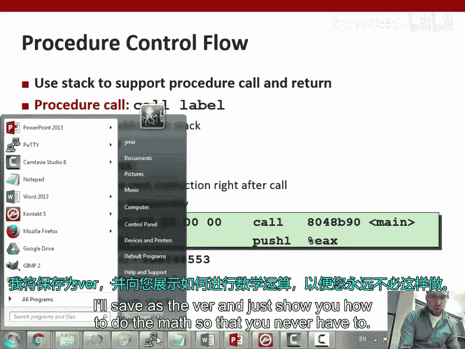
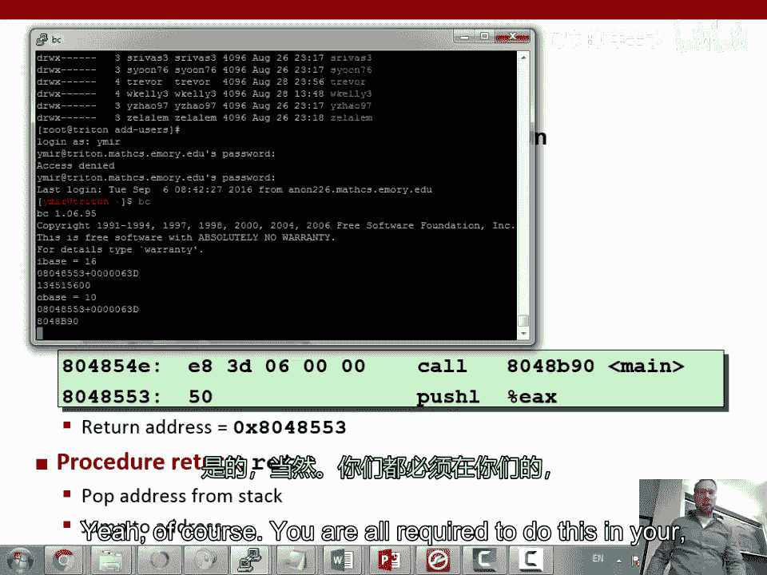
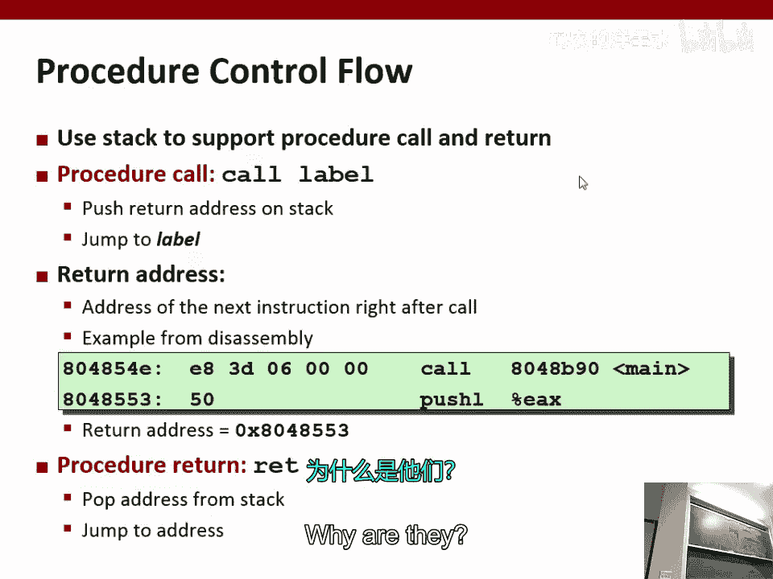
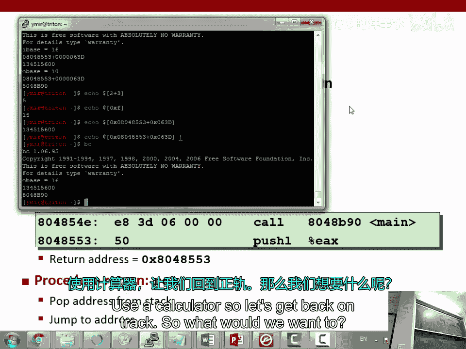
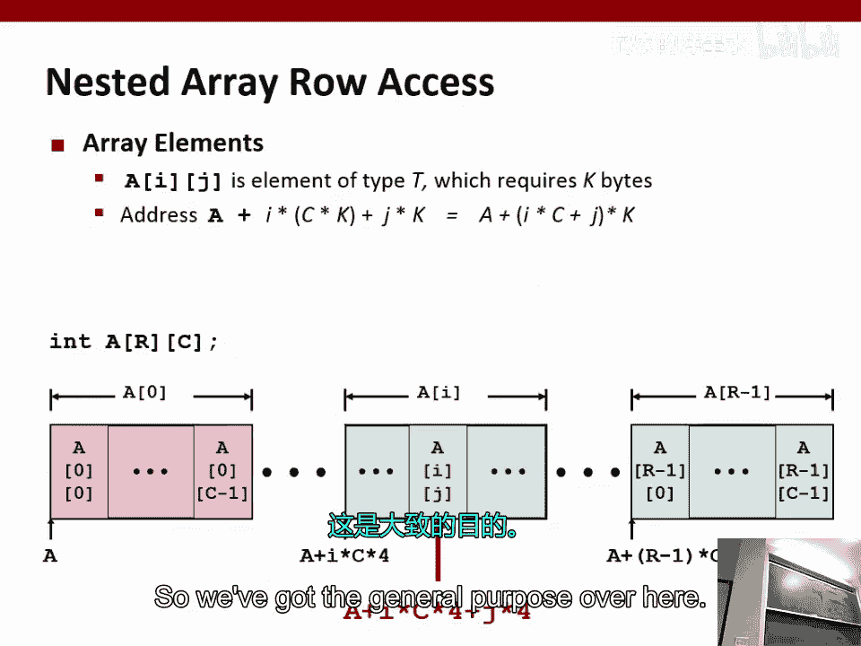
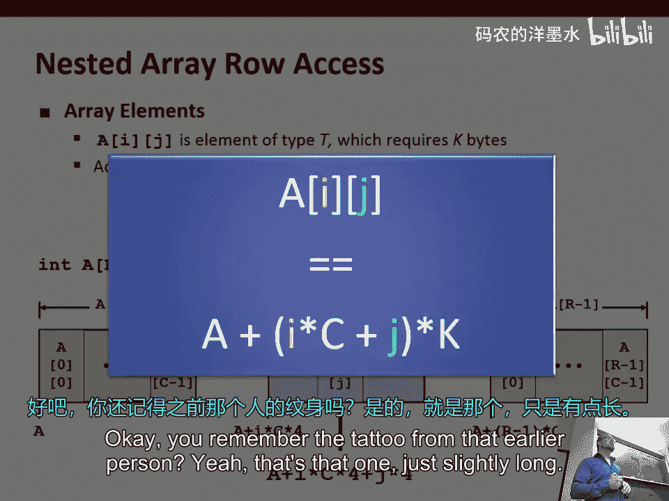
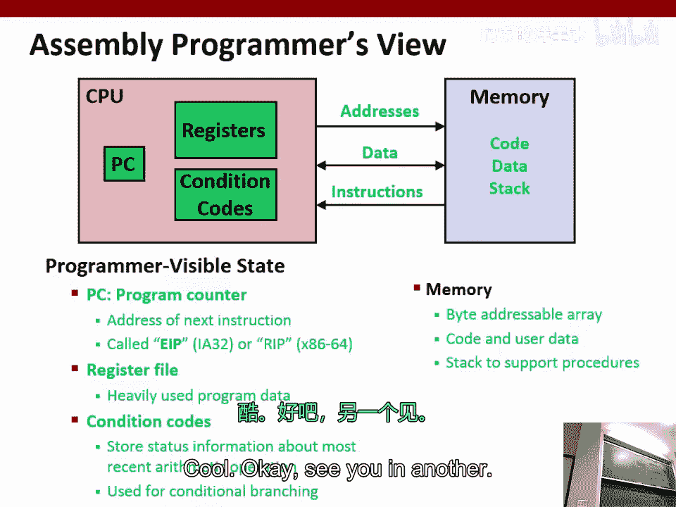

# 004：x86汇编 Part 3

在本节课中，我们将完成对x86汇编语言的学习，重点介绍栈的工作原理、函数调用约定以及数组在内存中的表示。理解这些概念对于后续学习程序漏洞利用至关重要。

## 栈与函数调用

上一节我们介绍了寄存器和基本指令，本节中我们来看看程序执行时一个关键的数据结构：栈。栈是一种后进先出的数据结构，在x86架构中，它从高地址向低地址“向下”增长。

栈指针寄存器`ESP`始终指向栈的“顶部”，即当前可用的最低内存地址。当我们需要在栈上分配空间时，就减小`ESP`的值。









以下是两个专门用于操作栈的指令：
*   **`PUSH`**：将数据压入栈顶。其操作相当于：
    ```
    sub esp, 4
    mov [esp], source
    ```
*   **`POP`**：从栈顶弹出数据。其操作相当于：
    ```
    mov dest, [esp]
    add esp, 4
    ```

函数调用是栈的核心应用场景。为了实现“调用一个函数后能正确返回”这个目标，处理器使用了`CALL`和`RET`指令。

*   **`CALL`**：调用函数。它会将**下一条指令的地址**（返回地址）压入栈，然后跳转到目标函数。
*   **`RET`**：从函数返回。它会从栈顶弹出返回地址，并跳转到那里。

这里存在一个根本性的设计问题：**控制流数据**（如返回地址）和**普通数据**（如函数参数、局部变量）被混合存放在同一块内存（栈）中。如果程序处理数据时出现错误，意外修改了控制流数据，就会导致程序执行流程被劫持。这类漏洞被称为**控制流漏洞**，是我们后续课程的重点。

## 栈帧与调用约定

为了在函数调用中保持清晰的上下文，编译器遵循一套严格的规则来使用栈，这被称为**调用约定**。每个函数都会在栈上拥有一块属于自己的区域，称为**栈帧**。

帧指针寄存器`EBP`通常用于指向当前栈帧的底部。一个典型的栈帧结构如下（从高地址到低地址）：
```
... (调用者的栈帧) ...
参数 N
...
参数 2
参数 1          <--- 被调用函数通过 EBP+8, EBP+12... 访问
返回地址        <--- EBP+4 指向这里
旧的 EBP 值     <--- EBP 指向这里
保存的寄存器
局部变量        <--- 通过 EBP-4, EBP-8... 访问
...             <--- ESP 指向栈顶
```

一个函数的标准开头（序言）和结尾（尾声）代码如下：
```assembly
; 函数序言
push ebp        ; 保存旧的帧指针
mov ebp, esp    ; 建立新的帧指针
sub esp, N      ; 为局部变量分配 N 字节空间
push edi        ; 按需保存其他寄存器
push esi

; ... 函数主体 ...

; 函数尾声
pop esi         ; 恢复保存的寄存器
pop edi
mov esp, ebp    ; 释放局部变量空间（恢复栈顶）
pop ebp         ; 恢复旧的帧指针
ret             ; 返回到调用者
```

**调用者保存**和**被调用者保存**寄存器是约定的一部分，用于明确函数调用前后哪些寄存器的值必须保持不变，从而避免寄存器被意外覆盖。

## 数组在内存中的表示

理解了栈之后，我们来看看另一种重要的数据结构——数组在内存和汇编中是如何表示的。

在C语言中，数组是一段连续的内存空间。例如，`int arr[5];`声明了一个包含5个整数的数组，在32位系统上占用20个连续字节。数组名`arr`本质上是一个指向这段内存起始地址的指针。

访问数组元素`arr[i]`的地址计算公式为：
```
地址 = arr + i * sizeof(int)
```
在汇编中，这通常通过类似`mov eax, [esi + edi*4]`的寻址方式实现，其中`ESI`是数组基址，`EDI`是索引`i`，比例因子`4`是`int`类型的大小。

指针运算和数组索引是等价的。`*(arr + i)` 和 `arr[i]` 在汇编层面会产生相同的代码。



对于二维数组（如`int matrix[3][4]`），它在内存中按**行优先**顺序连续存储。访问元素`matrix[i][j]`的地址计算公式为：
```
地址 = matrix + (i * 列数 + j) * sizeof(int)
```
其中`列数`是第二维的大小（本例中为4）。



## 总结



本节课中我们一起学习了x86汇编的核心收尾内容。我们深入探讨了栈的工作原理、函数调用的详细过程（包括`CALL`/`RET`指令和栈帧结构），以及数组在内存中的布局和访问方式。理解数据（尤其是数组）和控制流信息（如返回地址）如何在内存中共存，是理解后续软件漏洞原理的基础。下一节课，我们将开始进入激动人心的实际漏洞利用环节。