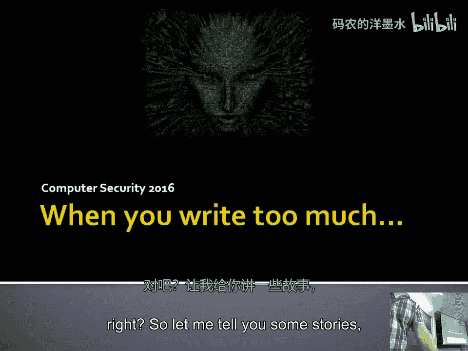
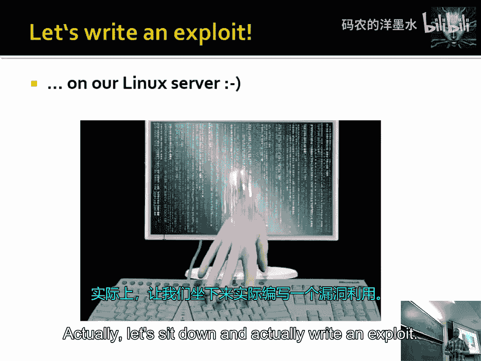
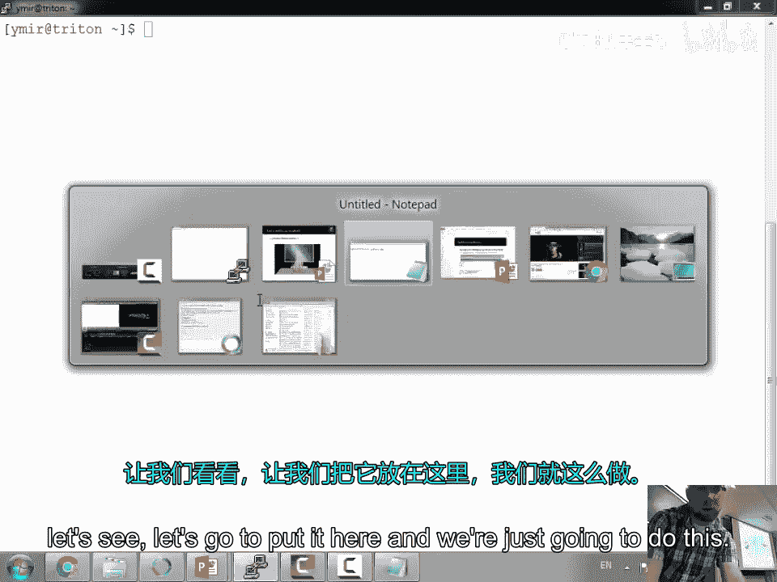
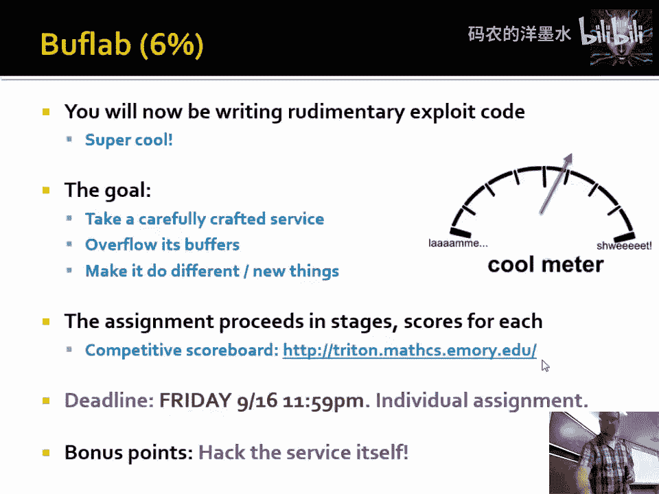

# 005：缓冲区溢出 🛡️💥



在本节课中，我们将要学习计算机安全领域一个经典且基础的概念：**缓冲区溢出**。我们将通过历史上的真实案例来理解其原理，并动手实践一个简单的溢出攻击。

## 概述

缓冲区溢出是一种常见的安全漏洞，它允许攻击者通过向程序输入超出其预期长度的数据，来覆盖相邻的内存区域，从而可能执行任意代码或导致程序崩溃。本节课我们将深入探讨其工作原理、历史案例以及如何利用它。

## 历史故事与背景

上一节我们介绍了安全漏洞的基本概念，本节中我们来看看几个利用缓冲区溢出的著名历史事件。

### 罗伯特·莫里斯与互联网蠕虫

1988年，康奈尔大学的研究生罗伯特·莫里斯发现了一种方法，可以侵入当时互联网上的几乎所有计算机。他利用的正是缓冲区溢出漏洞。

他创建了世界上第一个自我传播的蠕虫病毒。该蠕虫会询问目标计算机是否运行一项名为 `Finger` 的服务。在发送请求时，他发送了一个超大的数据载荷，覆盖了目标程序的内存，从而接管了对方的机器。被感染的机器会复制蠕虫并继续传播，最终导致当时大部分互联网瘫痪。

有趣的是，莫里斯后来成为了麻省理工学院的终身教授，并在分布式系统领域做出了重要贡献。

### AOL 与 MSN Messenger 之争

在即时通讯软件AIM流行的时代，微软推出了MSN Messenger，并试图让其客户端能够连接到AOL的服务器。AOL为了阻止微软，在其服务器端添加了验证机制，检查连接过来的客户端是否是真的AOL客户端。

微软的应对策略是，让MSN客户端在内存中模拟整个AOL客户端的行为，以通过验证。这场“战争”的核心，也涉及对客户端内存布局和行为的精细探测与利用。

### Code Red 蠕虫

2001年出现的Code Red蠕虫利用了微软IIS Web服务器中的缓冲区溢出漏洞。它会在特定日期进行传播，并在其他日期对特定网站发起拒绝服务攻击。调查人员通过蠕虫代码中的语言特征，推测其开发者可能来自俄罗斯。

所有这些攻击的共同点在于，它们都利用了**不进行边界检查的库函数**，这就是缓冲区溢出的核心。

## 缓冲区溢出原理详解

上一节我们回顾了历史，本节中我们来看看缓冲区溢出的技术原理。关键在于程序如何管理内存中的字符串。

### 字符串的表示与问题

在C语言等编程语言中，字符串通常以字符数组的形式存储，并以一个空字符（`\0`）作为结束标记。这种设计允许字符串是任意长度的。

**代码示例：字符串表示**
```c
char str[] = "Hello"; // 内存中存储为：'H','e','l','l','o','\0'
```

然而，问题在于许多处理字符串的库函数（如 `strcpy`, `gets`）只信赖这个结束符，而不检查目标缓冲区是否有足够的空间。如果源字符串过长，就会发生溢出。

### 栈内存布局与溢出

当一个函数被调用时，它的局部变量（包括缓冲区）会被分配在称为“栈”的内存区域。栈中同时还保存着函数的返回地址（告诉函数执行完毕后回到哪里）等重要信息。

以下是栈的简化布局：
```
[ 局部变量（如缓冲区） ] [ 保存的帧指针 ] [ 返回地址 ] [ 其他... ]
```
地址增长方向通常是向下的。

如果一个缓冲区被写入过多数据，超出其边界，就会覆盖其后的内存内容，首先是保存的帧指针，接着就是至关重要的**返回地址**。

### 控制程序执行流

通过精心构造输入数据，攻击者可以覆盖返回地址，使其指向攻击者注入到缓冲区中的代码（称为 **shellcode**）。当受害函数执行完毕并试图返回时，它就会跳转到shellcode并执行它。

**公式：溢出的目标**
```
覆盖后的返回地址 = 攻击者控制的代码地址
```

Shellcode 通常是一小段机器指令，用于打开一个系统 shell，从而让攻击者获得对机器的控制权。

## 实战：编写一个简单的缓冲区溢出攻击

理论已经清晰，本节中我们通过一个简单的例子来实践缓冲区溢出攻击。





### 目标程序


我们有一个简单的C程序 `target.c`，其中包含一个易受攻击的函数 `copy_arg`，它使用不安全的 `strcpy` 函数。

**关键代码：**
```c
void copy_arg(char *string) {
    char buffer[128];
    strcpy(buffer, string); // 危险！没有检查长度
}
```

### 攻击步骤

以下是构造攻击载荷的基本步骤：

1.  **确定偏移量**：首先需要确定需要多少字节的填充数据才能恰好覆盖到返回地址。这通常通过调试或试错来完成。对于 `buffer[128]`，可能需要 128字节（缓冲区） + 4字节（帧指针） = 132字节的填充才能触及返回地址。
2.  **构造Payload**：Payload 由以下几部分组成：
    *   **NOP雪橇**：一系列无操作指令（`0x90`）。只要EIP跳转到这片区域的任何地方，都会“滑行”到后面的shellcode。
    *   **Shellcode**：实现特定功能（如启动shell）的机器码。
    *   **返回地址**：覆盖原返回地址，指向NOP雪橇或shellcode在内存中的地址。

**攻击载荷结构示意：**
```
[ 132字节填充（如'A'） ] [ 4字节返回地址 ] [ NOP雪橇 ] [ Shellcode ]
```

3.  **实施攻击**：将构造好的Payload作为输入传递给目标程序。
    ```bash
    ./target $(python -c 'print "A"*132 + "\xef\xbe\xad\xde"')
    ```
    这里的 `\xef\xbe\xad\xde` 是一个假设的返回地址（0xdeadbeef的little-endian格式）。

### 绕过安全机制

现代操作系统部署了多种安全机制来防御缓冲区溢出，例如：
*   **地址空间布局随机化**：随机化栈和库的加载地址，使攻击者难以预测返回地址。
*   **数据执行保护**：将栈和堆内存标记为不可执行，防止直接执行shellcode。

攻击者需要采用更高级的技术（如ROP攻击）来绕过这些保护。

## 易受攻击的函数列表

了解哪些函数是危险的至关重要。以下是C语言中一些常见的不安全函数，它们不检查目标缓冲区大小：

*   `gets(char *str)`：从标准输入读取一行到 `str`，直到遇到换行符或EOF，极其危险。
*   `strcpy(char *dest, const char *src)`：将 `src` 复制到 `dest`，直到遇到空字符。
*   `strcat(char *dest, const char *src)`：将 `src` 追加到 `dest` 末尾。
*   `sprintf(char *str, const char *format, ...)`：根据格式字符串输出到 `str`。
*   `scanf`, `sscanf`, `fscanf` 系列：在使用 `%s` 等格式符时，如果不指定宽度，也可能导致溢出。

**安全建议**：始终使用这些函数的“n”版本（如 `strncpy`, `snprintf`, `fgets`），并明确指定最大字符数。

## 总结

本节课中我们一起学习了**缓冲区溢出**这一基础而强大的安全漏洞。

我们首先通过莫里斯蠕虫、AOL与MSN之争等历史案例，看到了它的实际影响。然后，我们深入其技术原理，理解了由于字符串处理函数缺乏边界检查，导致数据覆盖栈上的返回地址，从而劫持程序控制流的过程。最后，我们动手实践，构造了一个简单的攻击载荷，并了解了现代防御机制。



理解缓冲区溢出是学习系统安全的重要一步。在后续的课程和实践中，你将学习如何防御此类攻击，以及如何利用更复杂的技术在存在防护的环境中进行利用。