# 007：NOP雪橇与返回到Libc

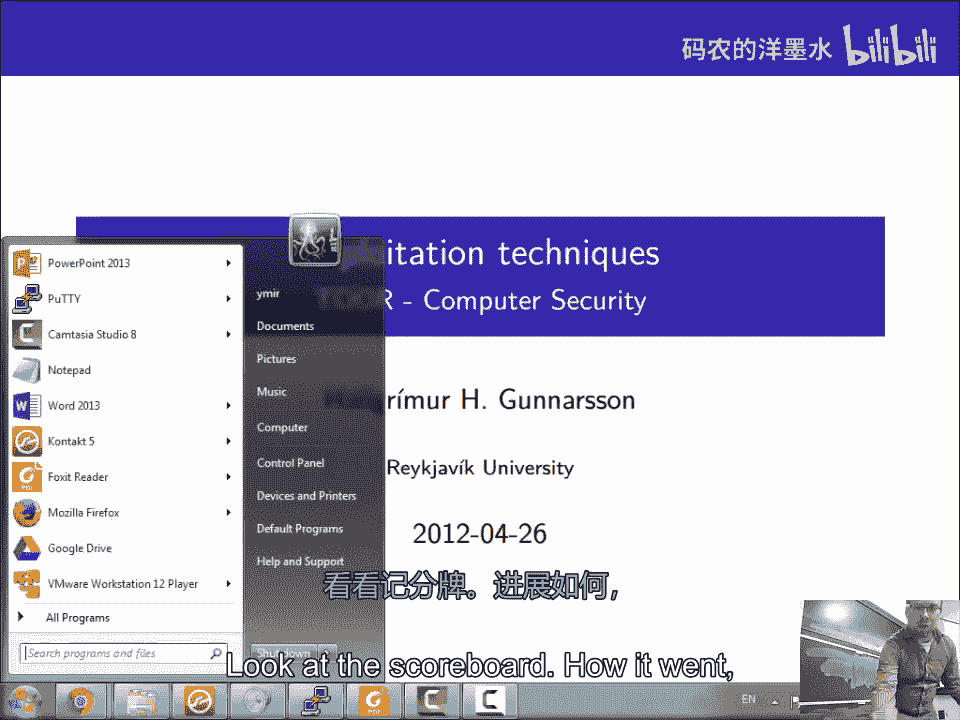

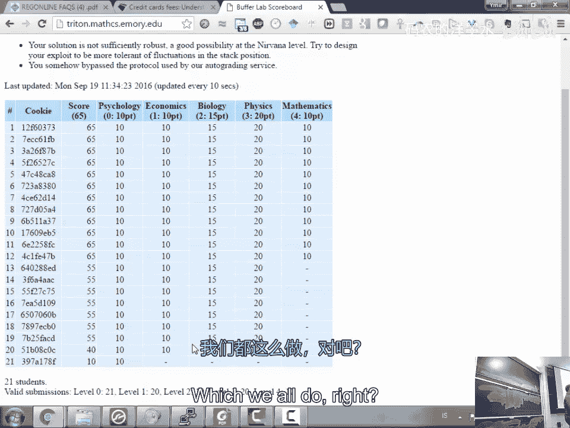

## 概述

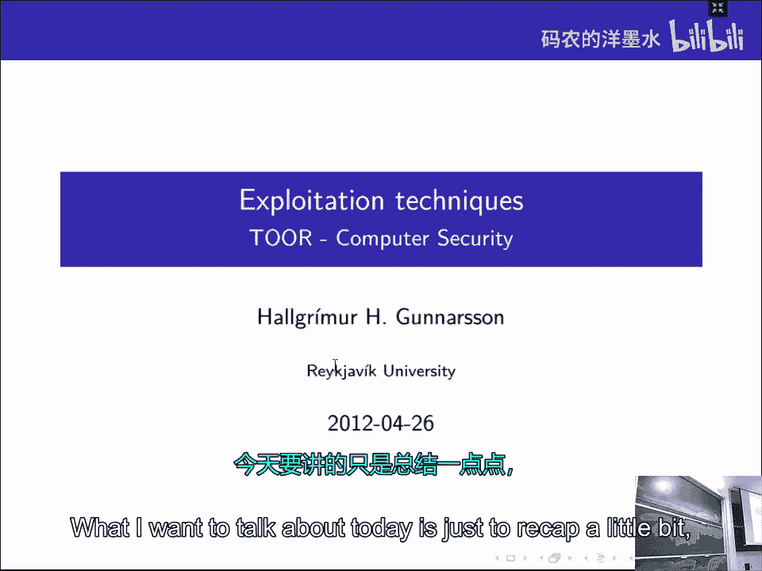

在本节课中，我们将要学习两种关键的漏洞利用技术：NOP雪橇和返回到Libc。这两种技术旨在克服现代操作系统安全防御机制带来的挑战，特别是地址空间布局随机化。我们将探讨它们的工作原理、应用场景以及如何在实际攻击中组合使用。

上一节我们介绍了基础的缓冲区溢出和返回地址覆盖。本节中我们来看看当面临地址随机化等防御时，如何提高攻击的可靠性和成功率。

## 地址空间布局随机化的挑战

现代操作系统，如Linux，采用了一种称为地址空间布局随机化的防御技术。ASLR使得每次程序运行时，其栈、堆和共享库在内存中的基地址都是随机变化的。这使得攻击者难以预测关键代码或数据的准确位置，从而增加了漏洞利用的难度。

我们可以通过检查 `/proc/self/maps` 文件来查看当前进程的内存布局。当ASLR启用时，每次运行程序，这些地址都会改变。

```bash
cat /proc/self/maps
```

为了演示，我们可以通过写入 `/proc/sys/kernel/randomize_va_space` 文件来控制系统级的ASLR设置。

```bash
echo 2 | sudo tee /proc/sys/kernel/randomize_va_space
```
*   `0`： 关闭ASLR。
*   `1`： 保守随机化（栈和库）。
*   `2`： 完全随机化（包括堆）。

这种随机化意味着，传统的、依赖固定地址的漏洞利用代码将变得不可靠。

## NOP雪橇技术

为了应对栈地址的不可预测性，我们引入了NOP雪橇技术。其核心思想是在shellcode之前放置大量无操作指令。

NOP指令的机器码是 `0x90`。CPU执行NOP时，除了将程序计数器加一，不做任何操作。

攻击流程如下：
1.  用大量NOP指令填充缓冲区的一部分。
2.  将shellcode放在NOP指令之后。
3.  覆盖返回地址，使其指向NOP区域的**中间某个地址**，而不是精确的shellcode起始地址。
4.  当程序返回时，会“滑过”这些NOP指令，最终执行到shellcode。

**公式化描述**：假设缓冲区起始地址为 `B`，NOP区域长度为 `L_nop`，shellcode起始地址为 `B + L_nop`。我们选择的返回地址 `R` 满足 `B <= R <= B + L_nop`。只要 `R` 落入NOP区域，攻击就会成功。

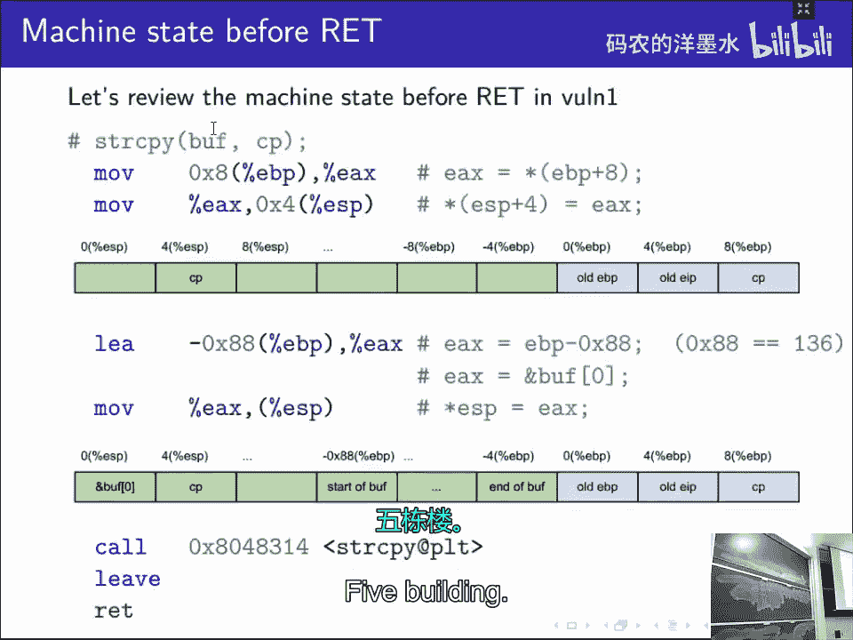

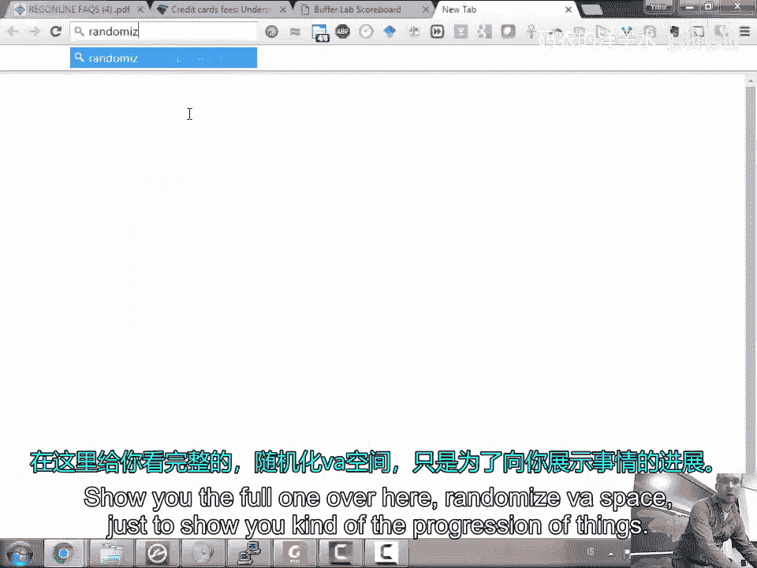

这种方法显著增大了命中的目标范围，提高了在地址稍有偏差情况下的攻击成功率。

## 跳转到寄存器技术

当栈地址完全随机，且NOP雪橇的目标范围仍然不够大时，我们可以利用另一种技术：跳转到寄存器。

其关键在于观察漏洞函数的行为。例如，`strcpy` 函数在复制完成后，会将其目标缓冲区的地址（即我们输入的起始地址）存储在 `EAX` 寄存器中。如果我们能在内存的固定位置（例如未随机化的程序主二进制代码段）找到一条 `jmp eax` 或 `call eax` 指令，就可以实施攻击。

攻击流程如下：
1.  用shellcode填充缓冲区。
2.  覆盖返回地址，使其指向那条固定的 `jmp eax` 指令的地址。
3.  函数返回后，执行 `jmp eax`，而 `EAX` 正好指向我们的缓冲区，从而开始执行shellcode。

这种方法巧妙地绕过了对栈地址的猜测，转而利用一个固定的、已知的代码片段作为“跳板”。

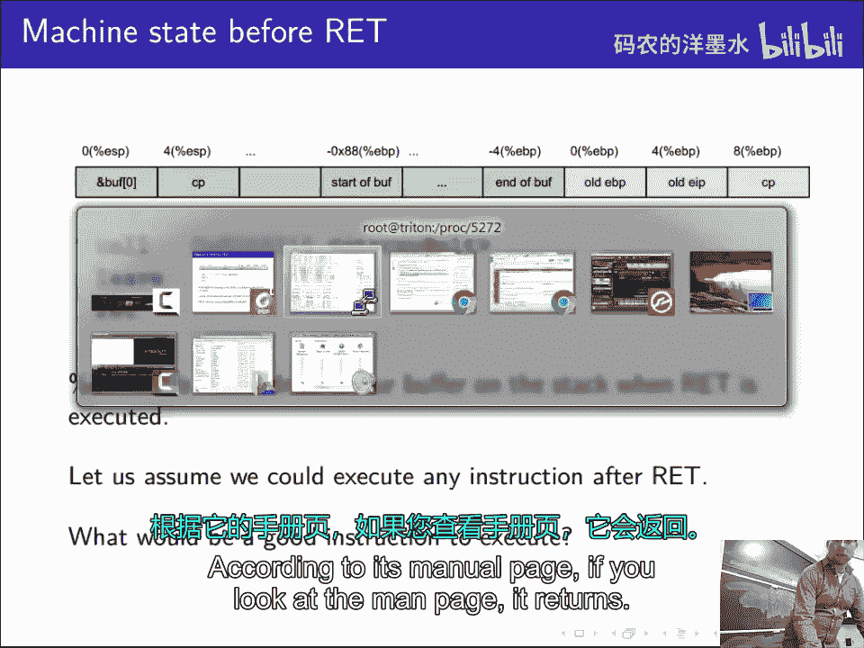

我们可以使用工具（如 `msfelfscan`）在二进制文件中搜索这类有用的指令片段。

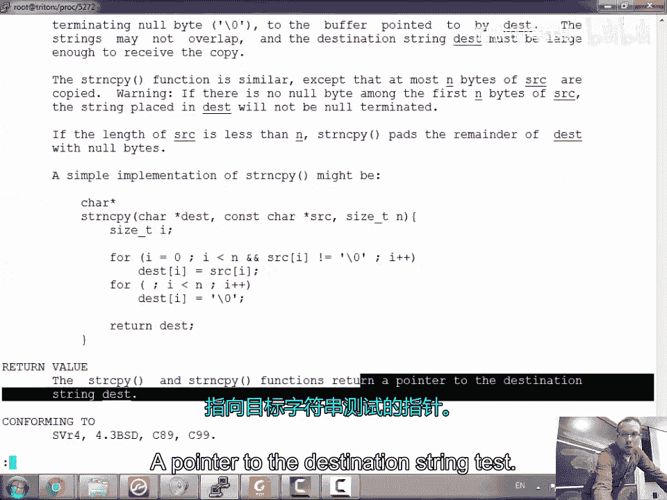

```bash
msfelfscan -j eax target_program
```

## 返回到Libc攻击

当目标内存区域被标记为不可执行时，注入的shellcode将无法运行。此时，“返回到Libc”攻击成为一种强大的替代方案。这种技术不注入新代码，而是重用目标程序中已存在的库函数代码，例如 `system()` 函数。

攻击的核心是模拟函数调用的栈帧结构。当一个函数被 `call` 指令调用时，其栈帧布局如下：

```
| ... |
| 参数n |
| ... |
| 参数2 |
| 参数1 |
| 返回地址 | <-- 调用后的 ESP
| 旧的EBP | <-- 被调用函数的 EBP
| ... |
```

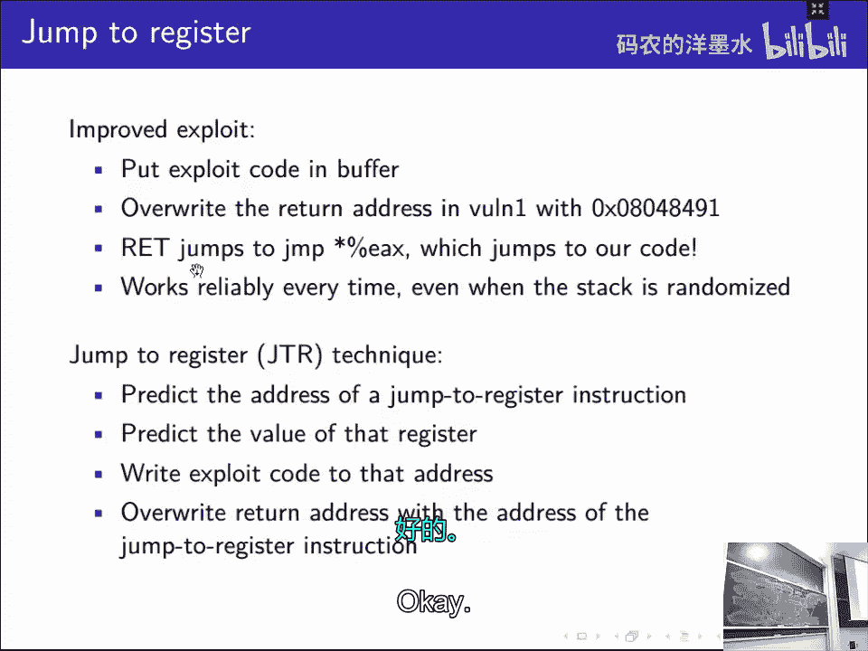

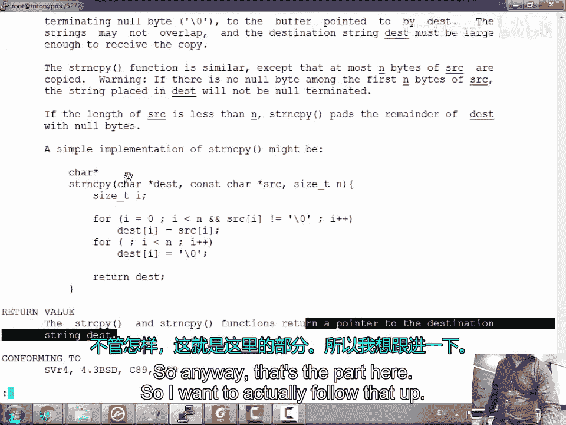

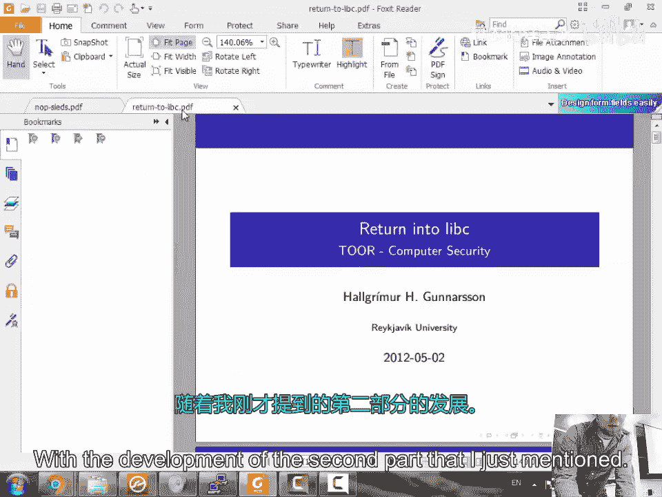

在“返回到Libc”攻击中，我们通过溢出覆盖返回地址，使其不是跳转到shellcode，而是跳转到 `system()` 函数的地址。同时，我们需要在栈上精心布置数据，使其看起来像一个正常的 `system()` 函数调用帧。

一个典型的攻击载荷结构如下：

```
[缓冲区填充][system()地址][虚假返回地址][system()的参数]
```

例如，为了执行 `system("/bin/sh")`，我们需要：
1.  找到 `system()` 函数在内存中的地址。
2.  找到字符串 `"/bin/sh"` 在内存中的地址（可以存在于环境变量、库中，或由我们放入缓冲区）。
3.  构造溢出数据：填充字节 + `system_addr` + `fake_ret_addr` + `binsh_addr`。

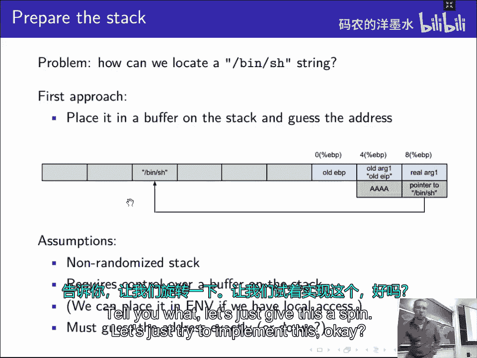

当漏洞函数返回时，它会跳转到 `system()`。`system()` 函数会从栈上读取它的返回地址（即我们放置的`fake_ret_addr`）和参数（即 `binsh_addr`），从而执行 `/bin/sh`。

以下是构造此类攻击的简化步骤：

```python
# 假设的地址
system_addr = 0xb7e12345
binsh_addr = 0xb7f56789

# 构造载荷
payload = b'A' * 136          # 填充至返回地址
payload += p32(system_addr)   # 覆盖返回地址为 system()
payload += p32(0xdeadbeef)    # system()执行后的“返回地址”，可任意
payload += p32(binsh_addr)    # system()的第一个参数
```

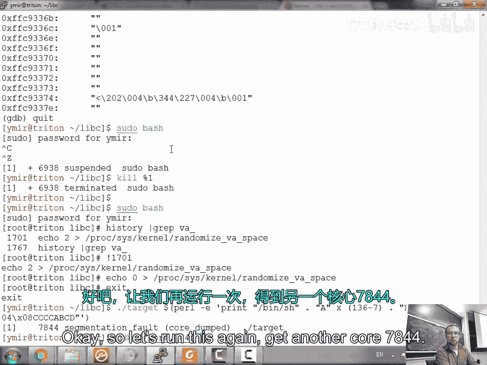

## 总结

本节课中我们一起学习了两种高级的漏洞利用缓解技术。
*   **NOP雪橇**通过扩大命中区域来对抗栈地址的不确定性。
*   **跳转到寄存器**利用固定的指令片段和寄存器的值，实现到可控缓冲区的跳转。
*   **返回到Libc**攻击则在无法执行注入代码的环境中，通过重用现有的库函数（如 `system()`）来实现攻击目标，这标志着利用技术从代码注入转向代码重用。

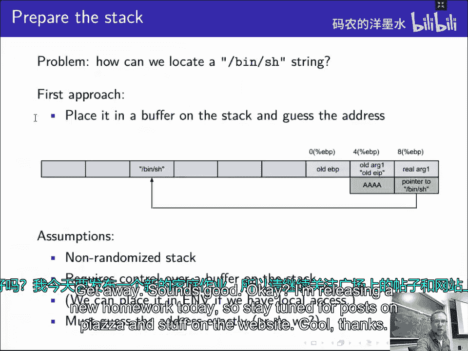

这些技术展示了攻击者如何适应并绕过诸如ASLR和NX等安全防御机制，是理解现代漏洞利用与防御对抗的关键。