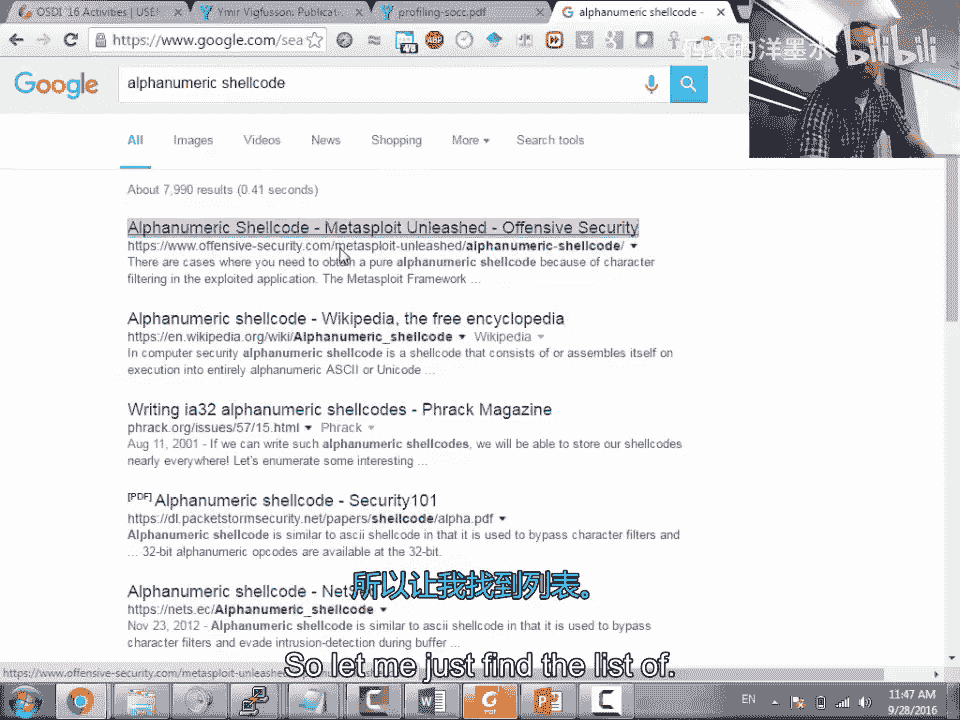
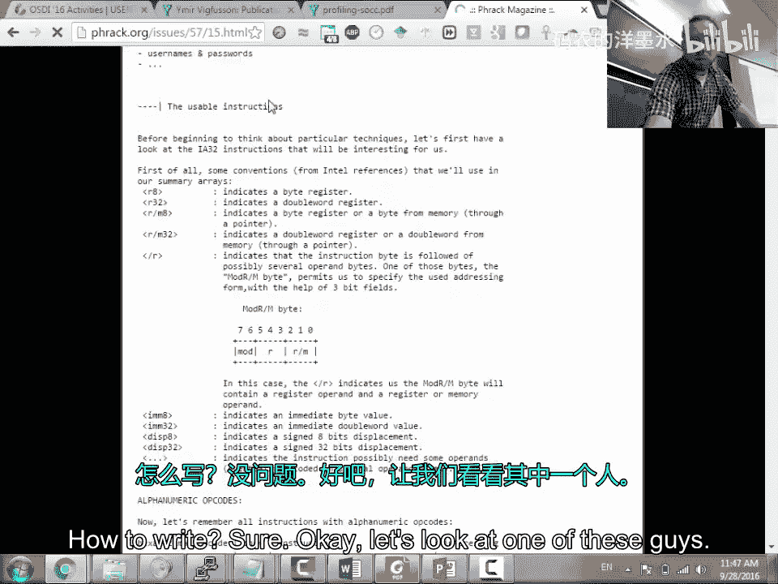
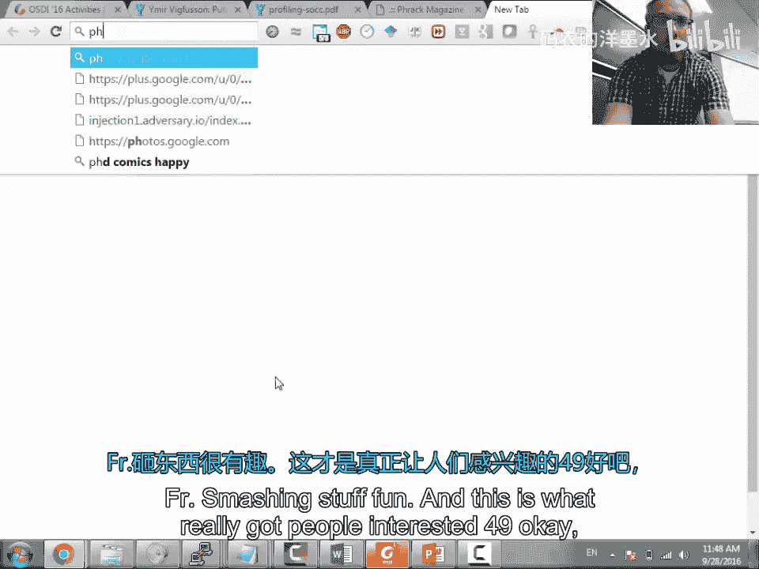
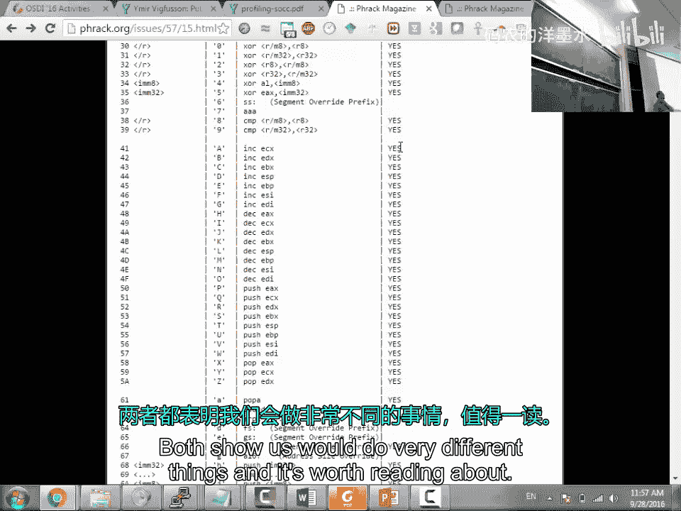
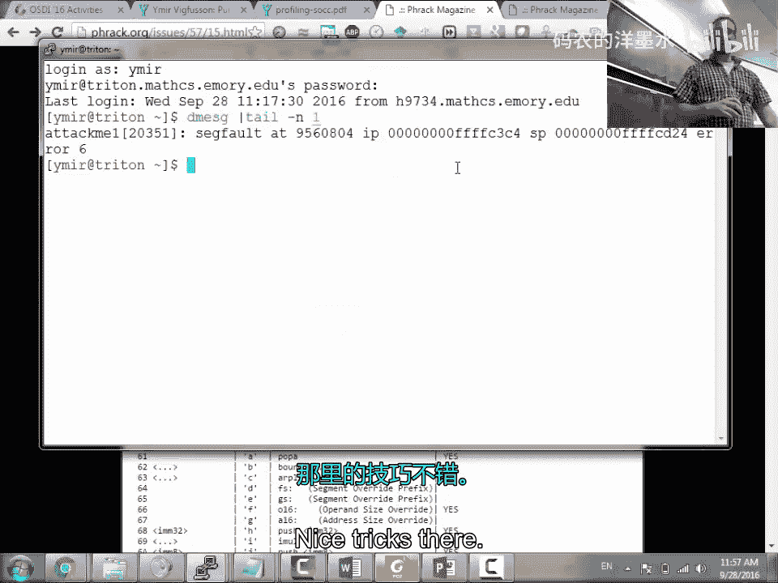
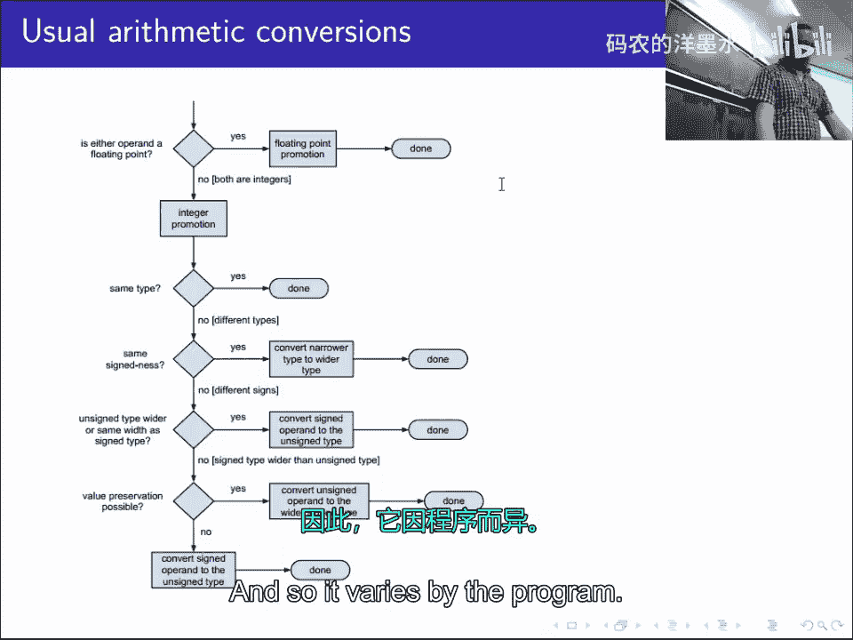
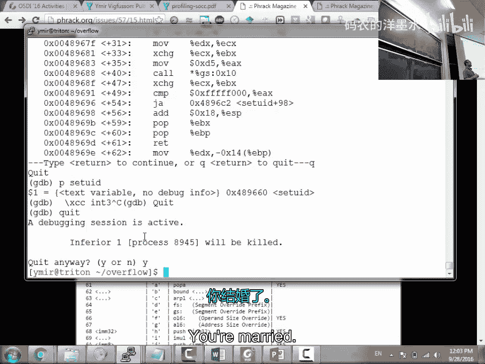
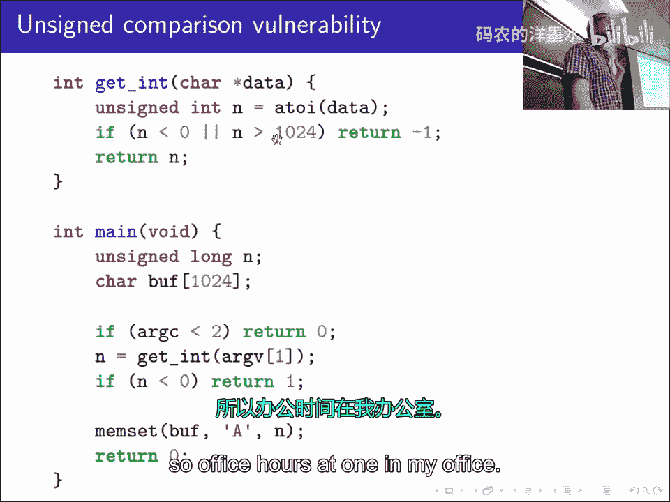

# 010：整数漏洞

在本节课中，我们将要学习整数漏洞，这是一种在编程中常见的安全问题，尤其在使用C语言时。我们将探讨整数类型转换、符号扩展、截断等概念如何导致缓冲区溢出等安全漏洞，并通过实际代码示例来理解攻击原理和防御方法。

## 概述

整数漏洞源于编程语言（如C语言）在处理不同大小和符号的整数类型时，隐式进行的类型转换和提升。这些转换可能导致数值被意外地解释为极大或极小的值，从而绕过安全检查，引发缓冲区溢出等严重安全问题。理解这些机制对于编写安全的代码和进行漏洞利用都至关重要。

## 整数提升与转换





上一节我们介绍了整数漏洞的基本概念，本节中我们来看看C语言中整数运算时的类型提升规则。当操作符两边的操作数类型不同时，编译器会进行隐式转换，将它们提升为共同的类型。



以下是C语言中整数类型提升的基本规则：
*   如果操作数中有一个的类型等级高于另一个，较低等级的操作数会被转换为较高等级的类型。
*   整数类型的等级从低到高大致为：`char` -> `short` -> `int` -> `long` -> `long long`。
*   如果两个操作数类型相同但符号不同（一个有符号，一个无符号），则有符号类型通常会被转换为无符号类型。

考虑以下代码：
```c
unsigned char a = 200;
unsigned char b = 100;
unsigned char c = a + b; // c 的值是多少？
```
`a + b` 的结果 `300` 超出了 `unsigned char` 能表示的最大值 `255`。在赋值给 `c` 时会发生截断，最终 `c` 的值为 `300 % 256 = 44`。这可能导致程序逻辑错误。

## 符号扩展与漏洞







理解了基本规则后，我们来看看符号扩展如何制造安全漏洞。符号扩展发生在将有符号的短整数类型（如 `signed char`, `signed short`）赋值或提升到更大的整数类型时。

一个典型的漏洞模式如下：
```c
char length = some_user_input(); // 假设用户输入了 -1
if (length < MAX_BUFFER_SIZE) {
    char buffer[MAX_BUFFER_SIZE];
    read(fd, buffer, length); // 问题所在！
}
```
这里，`length` 是 `signed char` 类型。如果用户输入 `-1`，其二进制表示为 `0xFF`。当它作为参数传递给 `read` 函数时（该函数期望一个 `size_t`，即无符号整数），`-1` 会被符号扩展为一个非常大的无符号数（在32位系统上是 `4294967295`），导致 `read` 函数试图向缓冲区写入海量数据，造成缓冲区溢出。



## 截断漏洞

与符号扩展相反，截断发生在将较大的整数类型赋值给较小的整数类型时。高位数据被丢弃，只保留低位数据，这同样可能被利用。

以下是截断漏洞的一个著名实例（简化版）：
```c
unsigned int n = packet_length; // 假设 packet_length 为 65536 (0x10000)
unsigned short len = n; // 发生截断，len 变为 0
if (len > 0) {
    buffer = malloc(len);
    memcpy(buffer, packet, len); // len 为 0，但实际要拷贝的数据很大
}
```
攻击者可以构造一个长度为 `65536` 的数据包。当将其赋值给 `unsigned short len` 时，发生截断，`len` 变为 `0`。后续的 `if (len > 0)` 检查通过，但 `memcpy` 使用了原始的、未截断的大长度 `packet_length` 进行拷贝，导致堆溢出。

## 比较操作中的陷阱

整数比较是程序流程控制的基础，但在混合符号类型的比较中，也可能隐藏漏洞。编译器会将操作数转换为同一类型后再进行比较。

请看以下有问题的检查：
```c
int len = get_user_input(); // 有符号整数
unsigned int max_len = BUFFER_SIZE;
if (len < max_len) { // 潜在问题
    // 执行操作
}
```
如果 `len` 是负数（例如 `-1`），在比较 `len < max_len` 时，根据C语言规则，有符号的 `len` 会被转换为无符号整数，`-1` 变成了一个巨大的正数（`4294967295`），导致条件判断为假，从而可能绕过本应执行的安全检查。

## 作业与实战技巧

在实战中，利用整数漏洞通常需要精心构造输入。对于课程作业，目标是利用具有特殊权限（如SGID位）的漏洞程序，通过溢出获得shell，并执行特权操作。

以下是进行漏洞利用调试的一些实用技巧：
*   使用 `gdb` 分析核心转储文件（core dump），查看程序崩溃时的状态。
*   在shellcode开头插入断点指令 `\xCC`（`int 3`），以便在调试器中捕获执行流。
*   注意环境变量和调试器本身可能会影响栈布局，需要在真实环境和调试环境中进行测试和调整。
*   对于限制字符集的shellcode（如纯字母数字），需要编写解码器（decoder stub），将编码后的有效载荷在内存中解码并执行。

## 总结

本节课中我们一起学习了整数漏洞的成因与利用方式。我们了解到：
1.  **隐式类型转换**：C语言在整数运算和比较时会自动进行类型提升和转换，这是许多漏洞的根源。
2.  **符号扩展**：将有符号负数转换为更大的无符号类型时，会变成一个巨大的正数，常被用于绕过长度检查。
3.  **截断错误**：将大整数赋值给小整数类型时，高位丢失，可能导致长度计算错误，引发溢出。
4.  **比较的陷阱**：混合符号类型的比较可能产生违反直觉的结果，使安全检查失效。

防御整数漏洞的关键在于：
*   使用正确的类型（如处理长度时始终使用 `size_t`）。
*   在进行运算或比较前，显式检查数值范围。
*   避免在有符号和无符号类型之间进行隐式转换。
*   使用现代的安全函数和编译器保护机制（如 `-Wconversion` 警告）。



理解这些底层细节不仅能帮助我们发现和利用漏洞，更能指导我们编写出更健壮、更安全的代码。