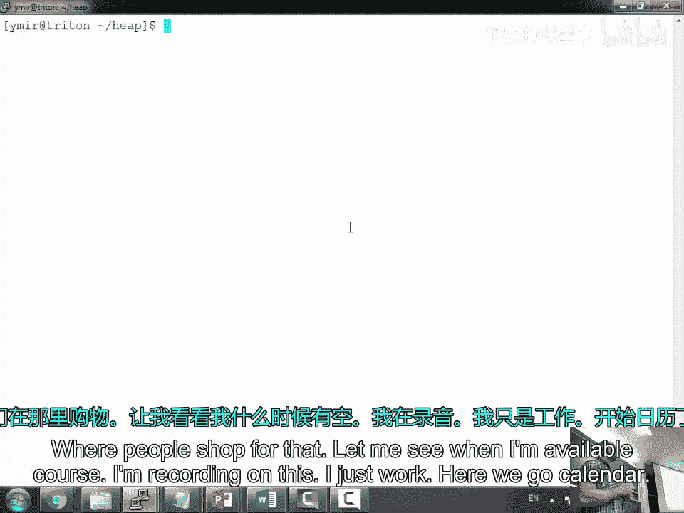
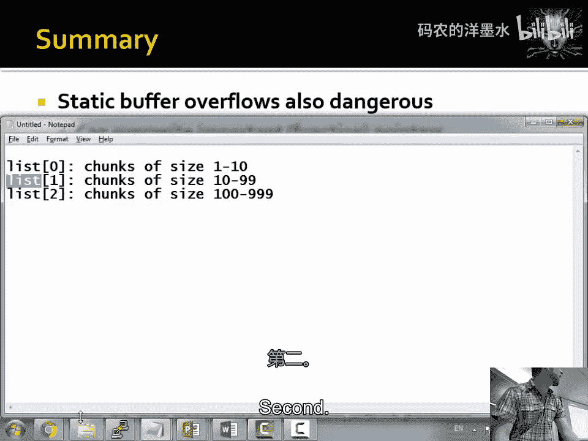

# 011：堆溢出 🧠




在本节课中，我们将要学习一种不同于栈溢出的内存攻击方式——堆溢出。我们将探讨静态缓冲区溢出和动态内存分配（`malloc`/`free`）机制中的漏洞，并理解攻击者如何利用这些漏洞控制程序执行流程。


## 课程概述与作业回顾

上一节我们介绍了栈溢出攻击。本节中，我们来看看另一种常见的内存攻击面：堆。

首先，回顾一下当前的作业进度。部分同学在完成第三个攻击实验时遇到了困难，例如，使用与第一个攻击相同的shellcode却无法成功获得shell，程序只是静默退出。一个有效的调试方法是在shellcode中插入断点指令（如`0xCC`），以检查它是否真的被执行。此外，需要注意栈空间的使用，如果shellcode执行时进行压栈操作，可能会覆盖到自身正在执行的代码。

## 静态缓冲区溢出

当程序使用静态缓冲区（例如在函数内声明为`static`的数组或全局变量）时，它们被存储在内存的数据段（`.bss`或`.data`），而非栈上。溢出这类缓冲区无法直接覆盖返回地址，但可以覆盖同一内存区域的其他重要数据。

以下是内存布局的简化视图：
```
高地址
+-------------------+
|       栈         |
+-------------------+
|       堆         |
+-------------------+
|   未初始化数据   | <-- 静态缓冲区位于此区域
|   (.bss段)       |
+-------------------+
|   已初始化数据   |
|   (.data段)      |
+-------------------+
|      代码段      |
|   (.text段)      |
+-------------------+
低地址
```

静态数据区存放着许多程序内部使用的数据结构，例如：
*   `stdio`库中`printf`、`scanf`等函数使用的内部状态变量。
*   文件目录操作（如`opendir`）的状态信息。
*   图形界面（如X Window）的事件回调函数指针。
*   网络远程过程调用（RPC）的回调函数指针。
*   程序退出处理函数（`atexit` handlers）。
*   内存分配器（`malloc`）的调试钩子和环境变量表。

这些数据结构中可能包含**函数指针**。如果通过溢出静态缓冲区覆盖了这些函数指针，当程序后续调用该指针时，控制流就会被劫持。例如，将一个指向`printf`内部结构的函数指针覆盖为攻击者shellcode的地址。

**核心概念**：覆盖静态数据区的函数指针。
```c
// 假设存在一个静态缓冲区和一个函数指针
static char buffer[64];
static void (*callback_func)(void);

// 溢出buffer可能覆盖callback_func
strcpy(buffer, attacker_controlled_input); // 溢出发生
callback_func(); // 控制流被劫持
```

## 动态内存分配（malloc）机制

现代程序更频繁地使用堆（通过`malloc`、`new`等）来分配内存。要理解堆溢出，首先需要了解`malloc`和`free`的工作原理。

`malloc`从操作系统内核获取大块内存（通过`brk`或`mmap`系统调用），然后管理这些内存，处理用户程序的小块分配请求。`free`则释放内存，使其可供后续`malloc`重用。

一个简单的内存块（chunk）设计可能如下：
```
+----------------------+
| 块大小 (size)       | <-- 头部 (header)
+----------------------+
| 用户数据 (data)     |
| ...                 |
+----------------------+
| 块大小 (size)       | <-- 尾部 (footer，用于向前合并)
+----------------------+
```

为了高效管理不同大小的空闲内存块，分配器会维护多个**空闲链表（free lists）**，每个链表链接大小相近的空闲块。

### 空闲块结构与链表

当一个块被释放（`free`）时，它会被添加到相应的空闲链表中。此时，该块的用户数据区域会被分配器复用，用于存储链表指针：
```
空闲块结构：
+----------------------+
| 前一个块的大小      |
| (prev_size)         |
+----------------------+
| 当前块的大小和状态  |
| (size & flags)      |
+----------------------+
| 前向指针 (fd)       | <-- 指向链表中下一个空闲块
+----------------------+
| 后向指针 (bk)       | <-- 指向链表中上一个空闲块
+----------------------+
| ... (未使用空间)    |
+----------------------+
| 块大小 (size)       | <-- 尾部
+----------------------+
```
其中，`fd`（forward pointer）和`bk`（backward pointer）用于将空闲块连接成双向链表。

### 块合并（Coalescing）

为了减少内存碎片，当释放一个块时，分配器会检查其**物理相邻**的前后块是否也是空闲的。如果是，就会将它们合并成一个更大的空闲块。这个过程涉及将相邻的空闲块从它们各自的空闲链表中“解链”（unlink），然后将合并后的大块加入新的空闲链表。

## 利用堆溢出进行攻击

现在，我们来看攻击者如何利用堆溢出漏洞。假设存在一个堆缓冲区溢出：
```c
char *p = malloc(24);
strcpy(p, attacker_controlled_input); // 溢出发生
```

攻击者可以覆盖相邻下一个内存块的头部信息。一个关键的攻击手法是伪造块信息，诱使`free`机制执行“解链”（unlink）操作，从而向任意地址写入任意值。

### 攻击场景

假设我们有两个相邻的堆块，`P`（易受溢出攻击）和`Q`（正常块）。
```
内存布局：
+------------------------+
| 块P头部 (size)        |
+------------------------+
| 块P数据 (24字节)      | <-- 从这里开始溢出
| ...                   |
+------------------------+
| 块Q头部 (prev_size)   | <-- 被溢出数据覆盖
| 块Q头部 (size & flags)| <-- 被溢出数据覆盖
| 块Q的fd指针           | <-- 被溢出数据覆盖
| 块Q的bk指针           | <-- 被溢出数据覆盖
+------------------------+
```

攻击步骤：
1.  **溢出伪造**：通过溢出`P`，覆盖`Q`块的头部，将其`size`字段中的“使用中”标志位设为0（假装`Q`是空闲的），并伪造`fd`和`bk`指针。
2.  **触发unlink**：随后，当程序`free(P)`时，分配器检查到“下一个块”（即我们伪造的`Q`）是“空闲”的，便会尝试将`P`和`Q`合并。合并需要先将伪造的`Q`从它所在的空闲链表中解链，于是调用`unlink`宏。
3.  **控制写操作**：`unlink`宏的操作逻辑类似于：
    ```c
    // 假设 Fake_Q->fd 和 Fake_Q->bk 是攻击者控制的指针
    FD = Fake_Q->fd;
    BK = Fake_Q->bk;
    FD->bk = BK; // 向 (FD + 12) 地址写入 BK 的值
    BK->fd = FD; // 向 (BK + 8) 地址写入 FD 的值
    ```
4.  **劫持控制流**：攻击者可以将`fd`设置为某个函数指针地址（如全局偏移表GOT项）减去12，将`bk`设置为shellcode的地址。这样，`unlink`操作最终会向那个函数指针地址写入shellcode的地址，从而在后续函数调用时劫持控制流。

**核心攻击代码逻辑**：
```c
// 攻击者构造的伪代码
Fake_Q->size = <size>; // 确保“非使用中”标志位为0
Fake_Q->fd = (void *)(&target_function_pointer - 3); // 例如 GOT entry - 12
Fake_Q->bk = (void *)shellcode_address;

// unlink 宏执行后，效果等价于：
*(&target_function_pointer) = shellcode_address;
```

### 现代防护与变体

现代`malloc`实现（如glibc的`ptmalloc`）包含了针对`unlink`攻击的缓解措施，例如对前后指针进行完整性检查。然而，攻击技术也在演进，出现了如“Use After Free”（UAF）、“Double Free”等变体，它们通过混淆分配器的内部状态来达到类似目的。

## 总结与课后安排

本节课中我们一起学习了堆溢出攻击的基本原理。我们首先对比了静态缓冲区溢出与栈溢出的不同，了解了静态数据区中可能被覆盖的关键目标（如函数指针）。然后，我们深入探讨了动态内存分配器（`malloc`/`free`）的工作机制，包括内存块结构、空闲链表和块合并操作。最后，我们分析了经典的“unlink”堆溢出利用技术，展示了攻击者如何通过伪造堆块元数据，诱使分配器执行任意内存写操作，从而劫持程序控制流。

堆溢出是现代软件中非常常见且危险的一类漏洞。理解这些底层机制对于编写安全代码和进行安全审计至关重要。



**作业提醒**：当前作业将于今晚截止。如有问题，可以在办公室时间（今日下午3:30至4:15）进行咨询。接下来的课程将探讨更多利用技术。