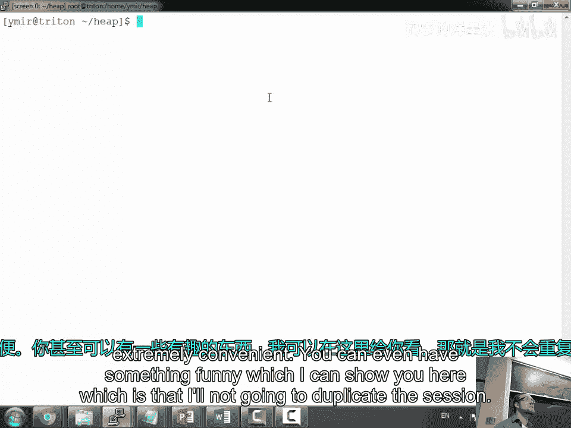
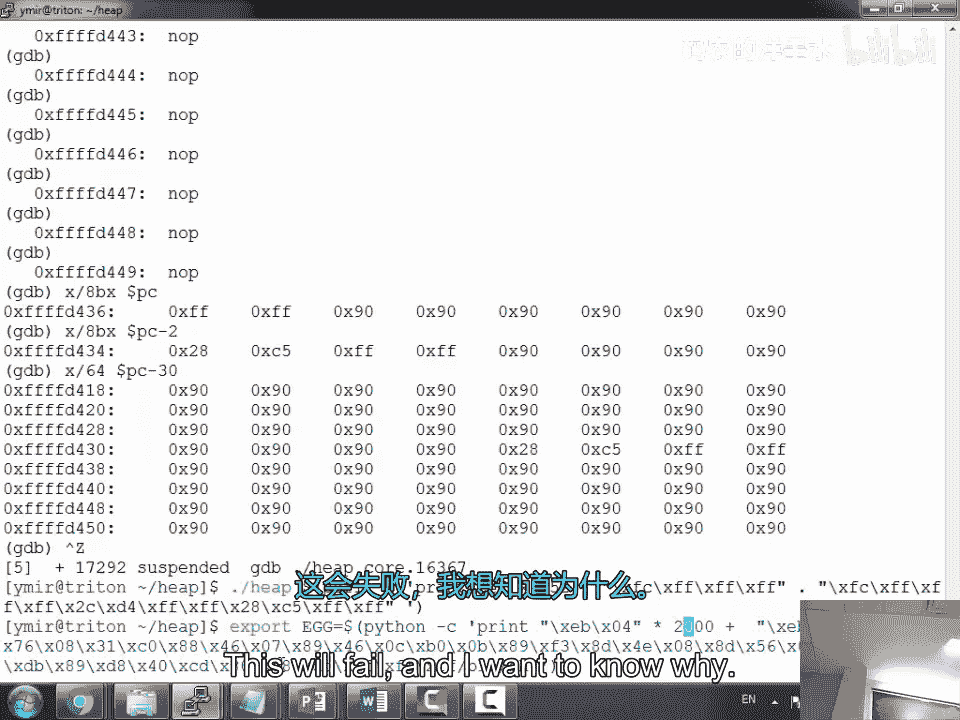
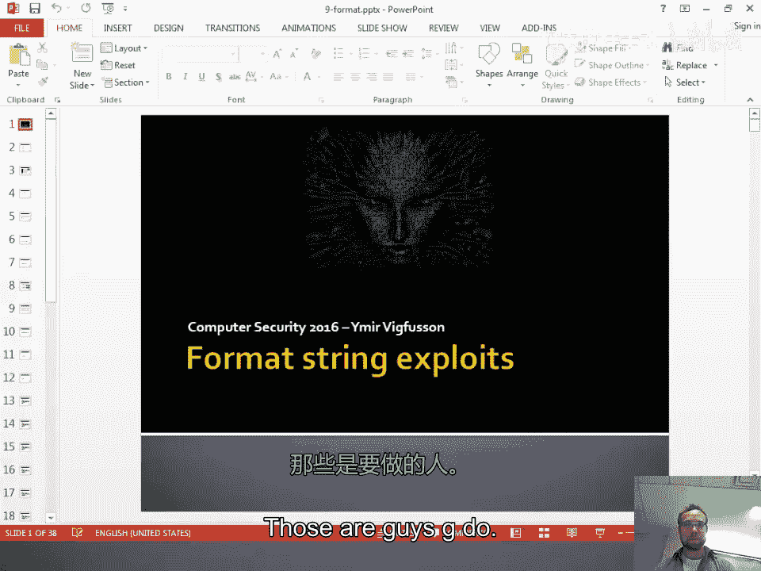
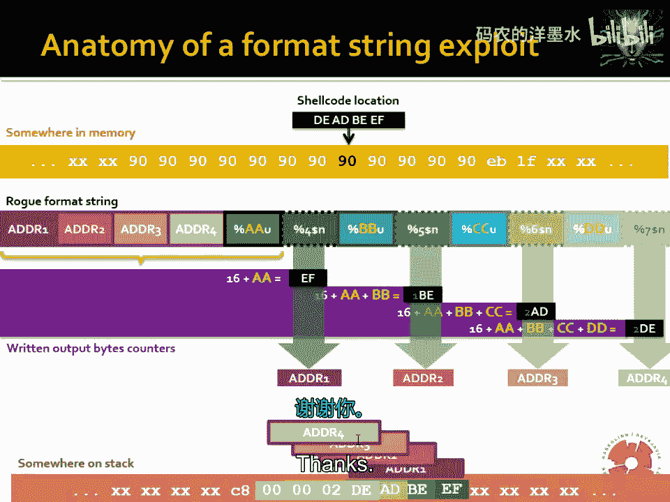

# 012：堆溢出实例与格式化字符串漏洞利用


在本节课中，我们将学习两种关键的软件漏洞利用技术：堆溢出和格式化字符串漏洞。我们将通过一个具体的堆溢出实例，演示如何利用内存分配器的内部机制来劫持程序控制流。随后，我们将探讨格式化字符串漏洞的原理，并展示如何利用它来读取和写入任意内存地址。




## 课程概述与作业预告

首先，我们有一个简短的公告。下一次作业即将发布。虽然即将进入秋假，但这也意味着你们有机会回顾并整合到目前为止在所有课程中学到的知识。你们已经掌握了成为一名黑客所需的一半技能。

接下来的作业将包含四个部分，工作量会比较大。它涵盖了诸如格式化字符串漏洞、面向返回的编程（ROP）以及堆溢出等有趣的内容。这与上次作业类似，需要运用多种不同的技术，但可能会更具挑战性。请务必尽早开始。

由于秋假，周一的课程将暂停，周三恢复。因此，你们有一整周的时间来消化今天的内容。

## 堆溢出漏洞利用实例

上一节我们预告了课程内容，本节中我们来看看一个具体的堆溢出漏洞利用实例。我们将尝试编写一个堆溢出漏洞利用程序。

### 目标程序分析

我们当前的工作目录中有一个名为 `heap` 的程序。其中包含一个名为 `heap.c` 的源代码文件。让我们查看其中的关键函数 `copy_argument`。

```c
void copy_argument(char *arg) {
    char *buff = malloc(128);
    char *buff2 = malloc(64);
    strcpy(buff, arg);
    free(buff);
}
```

这个函数分配了两个缓冲区：`buff`（128字节）和 `buff2`（64字节）。它将参数 `arg` 复制到 `buff` 中，然后释放 `buff`。这里存在一个明显的缓冲区溢出漏洞：如果 `arg` 的长度超过128字节，`strcpy` 会溢出 `buff`，覆盖其后的内存，包括 `buff2` 的堆块头部信息。

### 堆内存布局与漏洞原理

在典型的堆内存分配器（如 `malloc` 的实现）中，每个内存块（chunk）都包含一个头部（header），其中存储了块的大小和前一块的分配状态等信息。当调用 `free` 释放一个块时，分配器会检查相邻的块是否也是空闲的。如果是，它会将这两个（或更多）相邻的空闲块合并（coalesce）成一个更大的空闲块。这个过程涉及更新空闲链表（free list）中的指针。

我们的溢出目标是覆盖 `buff2` 块的头部信息，特别是其“分配状态位”（allocated bit）。如果我们能将该位设置为0（表示空闲），那么当 `free(buff)` 被调用时，分配器会认为 `buff` 和 `buff2` 都是空闲的，并尝试合并它们。合并操作会调用一个名为 `unlink` 的宏，该宏会执行类似以下的操作：

```c
// 伪代码，表示从空闲链表中移除一个块
FD = P->fd; // 前向指针
BK = P->bk; // 后向指针
FD->bk = BK;
BK->fd = FD;
```

如果我们通过溢出控制了 `P->fd` 和 `P->bk` 指针，我们就可以让程序向任意地址（`FD->bk` 和 `BK->fd`）写入我们控制的数据（分别是 `BK` 和 `FD` 的地址）。这为我们提供了写入原语（write primitive），可以用来覆盖关键数据，例如函数的返回地址。

### 构造漏洞利用

以下是构造漏洞利用的关键步骤：

1.  **确定偏移量**：首先，我们需要精确计算从 `buff` 的起始位置到 `buff2` 块头部中 `fd` 和 `bk` 指针位置的偏移量。这需要通过调试或分析内存布局来完成。
2.  **准备 shellcode**：我们需要一段执行特定操作（如启动一个shell）的机器代码（shellcode）。我们可以将其放置在环境变量或堆上的某个位置。为了便于定位，我们可以在 shellcode 前加上一个独特的“蛋”（egg），例如一连串的 `0x90`（NOP指令）或特定的标记字节。
3.  **获取关键地址**：我们需要知道两个地址：
    *   **写入目标地址**：例如，栈上某个函数的返回地址的位置。
    *   **shellcode 地址**：我们放置 shellcode 的内存地址。
4.  **构造 payload**：我们的 payload 结构如下：
    *   足够多的填充字符（如 ‘A’）以填满 `buff` 并到达 `buff2` 的头部。
    *   覆盖 `buff2` 的 `size` 字段，确保其最低位（分配位）为0。
    *   将 `buff2` 的 `fd` 指针设置为 **目标地址 - 偏移量**（因为 `unlink` 操作会向 `fd+偏移量` 处写入）。
    *   将 `buff2` 的 `bk` 指针设置为 **shellcode 地址**。
5.  **处理写入对称性**：由于 `unlink` 操作会进行两次写入（`FD->bk = BK` 和 `BK->fd = FD`），我们需要确保第二次写入不会破坏我们的利用（例如，不会覆盖 shellcode 的开头）。一种常见的方法是将 shellcode 地址指向一个包含跳转指令（如 `jmp`）的位置，跳过可能被破坏的几个字节。

在实践过程中，我们需要使用调试器（如 GDB）反复试验，检查内存状态，修正偏移量和地址，并处理对齐等问题。成功利用后，程序的控制流将被重定向到我们的 shellcode。

## 格式化字符串漏洞利用

上一节我们深入探讨了堆溢出，本节中我们来看看另一种常见的漏洞：格式化字符串漏洞。

### 漏洞原理

格式化字符串漏洞源于程序员错误地使用像 `printf`、`sprintf`、`fprintf` 这样的变参函数。当程序将用户输入直接作为 `printf` 等函数的格式化字符串参数时，就会产生此漏洞。



例如，考虑以下有漏洞的代码：
```c
printf(user_input); // 错误！用户输入被直接用作格式化字符串
```
正确的做法应该是：
```c
printf(“%s”, user_input); // 正确
```

当攻击者控制 `user_input` 时，他可以输入像 `%x`、`%p`、`%s`、`%n` 这样的格式化符号。
*   `%x`、`%p`：会从栈上读取本不属于它的“参数”并打印出来，导致信息泄露（如栈内容、内存地址）。
*   `%s`：会尝试将栈上某个值解释为指针，并读取该指针指向的字符串，可能造成读取任意内存。
*   `%n`：这是一个特殊的格式化符，它**不输出内容**，而是将**到目前为止已输出的字符数**写入一个指针参数所指向的整数变量中。这提供了一个**内存写入原语**。

### 利用方式



利用格式化字符串漏洞通常分为几个阶段：

1.  **信息泄露**：使用 `%p` 或 `%x` 泄露出栈上的内容。这可以帮助我们了解栈的布局，找到关键的地址，如返回地址、libc 函数地址等。
2.  **任意内存读取**：结合信息泄露得到的地址，使用 `%s` 可以读取指定地址的内存内容。
3.  **任意内存写入**：这是最强大的部分，通过 `%n` 格式化符实现。我们可以控制写入的地址和写入的值。
    *   **控制地址**：通过将目标地址（如某个函数的全局偏移表 GOT 项地址或栈上的返回地址）放入格式化字符串本身，并配合使用直接参数访问（如 `%7$n` 表示使用栈上的第7个参数作为 `%n` 的指针参数），我们可以指定写入位置。
    *   **控制值**：`%n` 写入的值是已输出的字符数。我们可以通过在前面的格式化字符串中插入特定数量的字符（如使用 `%100x` 来输出100个字符宽的十六进制数，用空格填充）来精确控制这个计数。为了写入一个较大的值（如内存地址），可以分多次、每次写入1或2个字节，使用 `%hn`（写入2字节）或 `%hhn`（写入1字节）来避免输出海量字符。

一个典型的利用链可能是：泄露地址 -> 计算 system 函数地址 -> 将某个函数的 GOT 表项覆盖为 system 地址 -> 当原函数被调用时，实际执行 system(“/bin/sh”)。

### 简单演示

考虑一个简单的有漏洞程序：
```c
int main(int argc, char **argv) {
    char buf[100];
    strcpy(buf, argv[1]);
    printf(buf); // 格式化字符串漏洞
    return 0;
}
```
攻击者可以这样利用：
```bash
./vulnerable_program “AAAA%x%x%x%x” # 泄露栈数据
./vulnerable_program “\xef\xbe\xad\xde%7$n” # 尝试向地址 0xdeadbeef 写入一个小数字
```
在实际利用中，构造 payload 需要精心计算偏移、地址和输出字符数。

## 总结

本节课中我们一起学习了两种高级的漏洞利用技术。

我们首先通过一个堆溢出实例，演示了如何利用内存分配器的 `unlink` 操作来获得任意地址写入能力，并最终劫持程序控制流执行 shellcode。这个过程涉及对堆布局的深刻理解、精确的偏移计算和地址操控。

随后，我们探讨了格式化字符串漏洞。这种漏洞源于不当使用格式化输出函数，它不仅能泄露内存信息，更能通过 `%n` 格式化符实现任意内存写入，为攻击者提供了强大的能力。我们分析了其原理，并概述了从信息泄露到覆盖关键内存地址的完整利用链。



掌握这些技术需要大量的实践和调试。在接下来的作业中，你们将有机会亲自动手尝试这些利用方法，加深对计算机系统安全底层机制的理解。