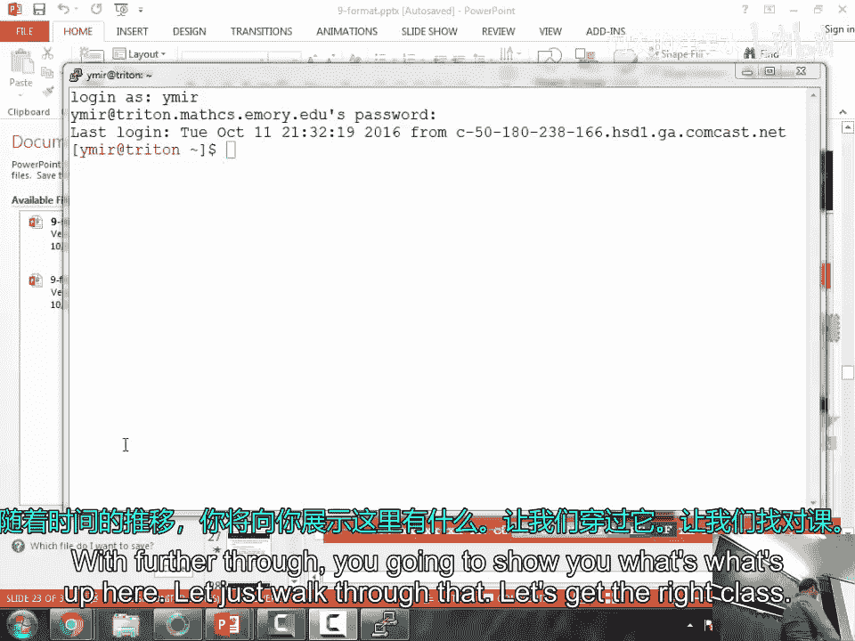
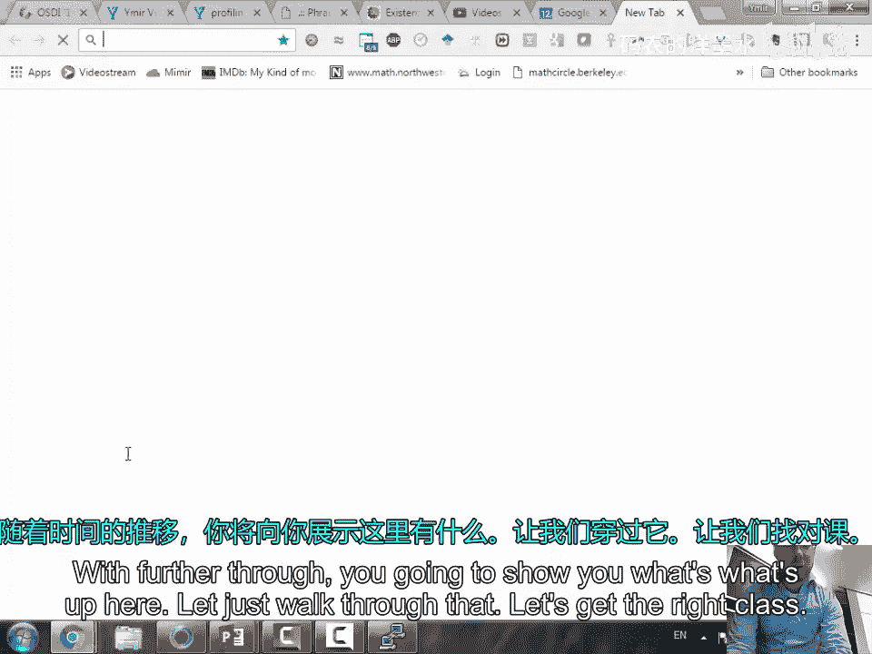
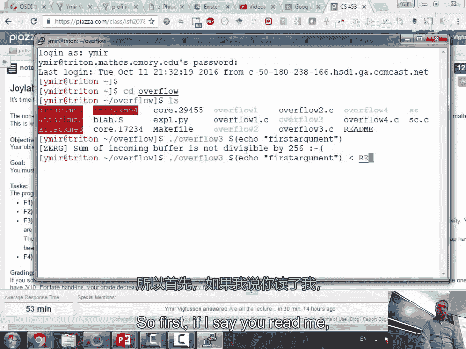
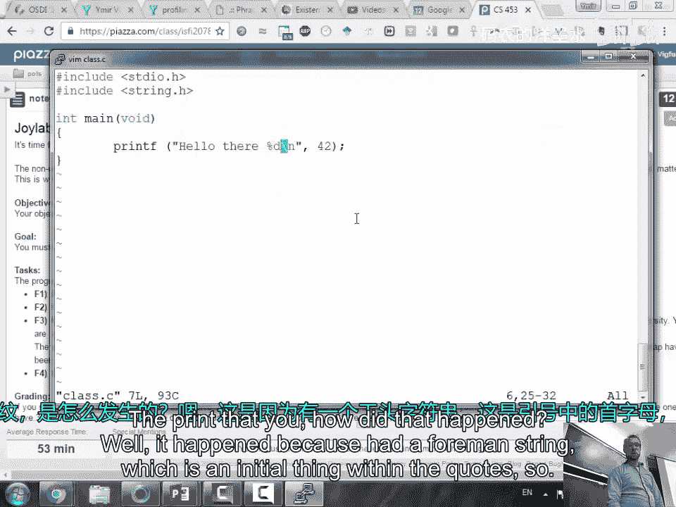
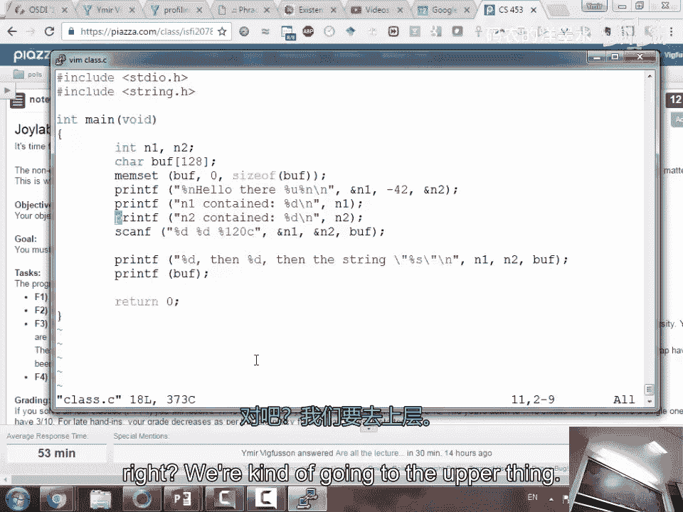
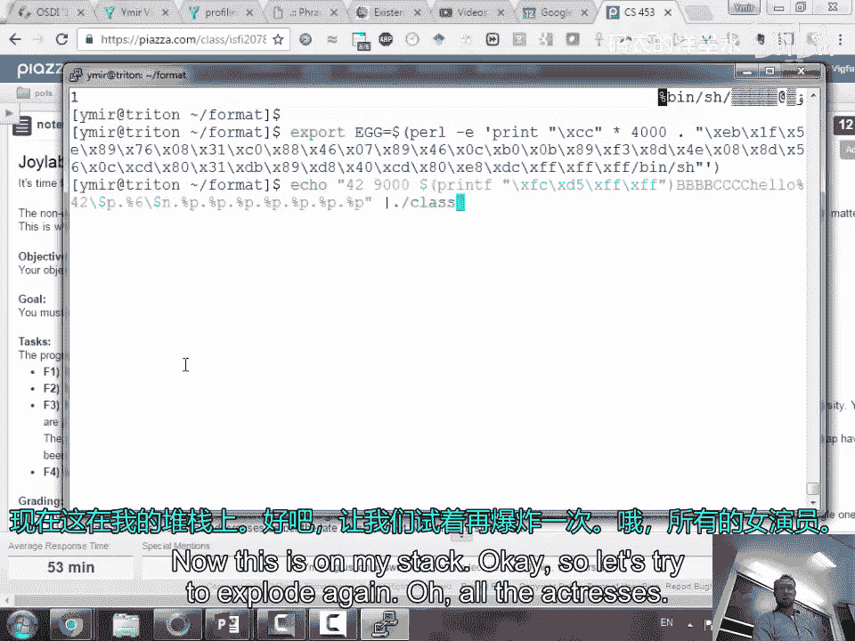
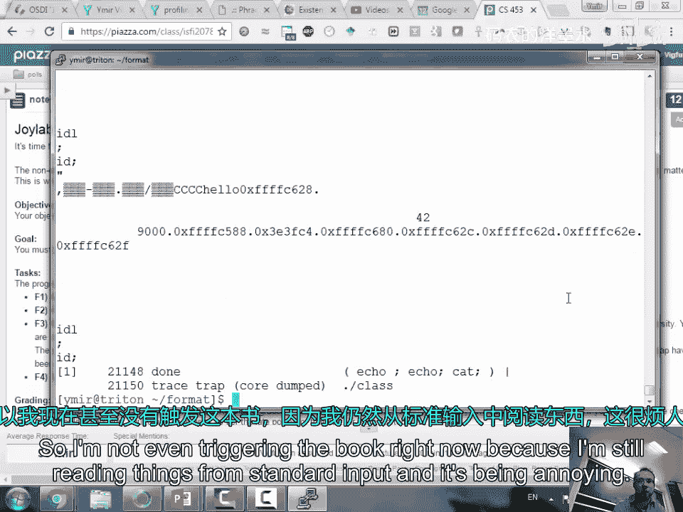
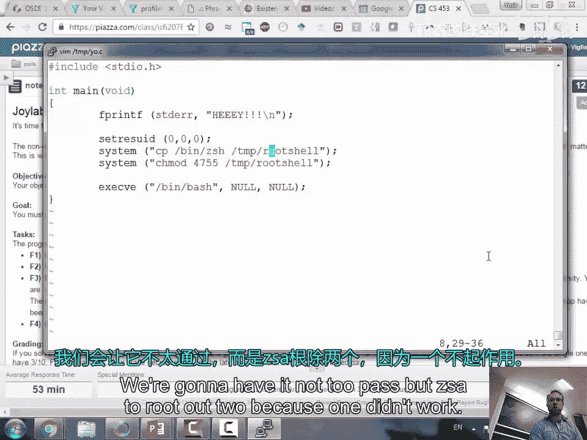

# 013：格式化字符串攻击与实例演示 🛡️💻





在本节课中，我们将要学习格式化字符串漏洞的原理与利用方法。这是一种常见的安全漏洞，攻击者可以通过控制格式化字符串参数，读取或写入任意内存地址，从而可能劫持程序的控制流。



## 课程概述

上一节我们介绍了缓冲区溢出等内存破坏漏洞。本节中，我们来看看另一种危险的漏洞类型：格式化字符串漏洞。我们将通过编写和分析简单的C程序，理解`printf`等函数如何处理格式化字符串，并演示如何利用此漏洞读取栈内存和向任意地址写入数据。

## 格式化字符串基础



首先，我们回顾一下C语言中`printf`函数的基本用法。`printf`的第一个参数是格式化字符串，它包含普通字符和以`%`开头的格式说明符。

```c
printf("数字：%d\n", 42);
```

上面的代码中，`%d`是一个格式说明符，它告诉`printf`将下一个参数（42）以十进制整数的形式输出。

格式说明符可以控制输出的格式，例如：
*   `%d`：输出有符号十进制整数。
*   `%u`：输出无符号十进制整数。
*   `%x`：输出十六进制整数。
*   `%s`：输出字符串。
*   `%p`：输出指针地址。
*   `%n`：这是一个特殊的说明符，它**不输出内容**，而是将**截至目前已输出的字符数量**写入到对应的指针参数所指向的内存地址中。

`%n`说明符是后续攻击演示的关键。

## 漏洞的产生

当程序员错误地将**用户输入**直接作为`printf`等函数的格式化字符串参数时，漏洞就产生了。

考虑以下有漏洞的代码：
```c
char user_input[100];
scanf("%99s", user_input); // 用户控制输入
printf(user_input); // 危险！用户输入被直接当作格式化字符串
```

如果用户输入的不是普通字符串，而是包含`%`格式说明符的字符串，`printf`就会按照说明符的含义去栈上寻找对应的参数。由于程序并未提供这些额外的参数，`printf`就会将栈上现有的数据当作参数来使用，从而导致信息泄露或更严重的后果。

## 利用漏洞读取内存（信息泄露）



攻击者可以通过输入一系列的`%p`来让`printf`将栈上的内容作为地址打印出来。

例如，如果用户输入字符串`"%p %p %p %p"`，`printf`会连续将栈上的4个数据当作指针输出。这可能泄露返回地址、栈帧指针或其他敏感信息，有助于攻击者了解内存布局，绕过地址空间布局随机化等保护机制。

## 利用漏洞写入内存

更危险的是利用`%n`说明符进行任意地址写。`%n`会将其对应的参数视为一个指针，并将已输出的字符数写入该指针指向的地址。



攻击思路通常分为几步：
1.  **定位目标地址**：利用`%p`等信息泄露手段，找到栈上存储的返回地址或其他关键数据结构的地址。
2.  **构造写入内容**：通过精心构造输入的字符串，控制已输出的字符数，从而控制写入的值。例如，输出大量字符可以使计数器变大。
3.  **分字节写入**：由于一次`%n`写入可能是一个4字节整数，要精确写入一个目标地址（如`0x080492a0`），可能需要多次写入，每次修改地址的一部分（例如先写低字节`0xa0`，再写高字节`0x0804`）。
4.  **覆盖返回地址**：最终目标往往是覆盖函数的返回地址，将其指向攻击者放置在内存中的shellcode或现有的有利函数（如`system(“/bin/sh”)`），从而获得shell或执行任意命令。

以下是利用过程的一个概念性步骤：

1.  确定栈上某个位置存储着我们想要覆盖的返回地址。假设其地址是`0xffffd5cc`。
2.  在输入字符串的合适位置放入这个目标地址`0xffffd5cc`。
3.  使用格式字符串如`“AAAA%6$n”`，其中`AAAA`用于对齐，`%6$`表示使用第六个参数（通过之前的泄露确定），`$n`表示向该参数指向的地址（即`0xffffd5cc`）写入已输出的字符数（4）。
4.  通过添加更多的字符或使用`%<number>u`（输出指定宽度的数字）来控制写入的数字，逐步将返回地址修改为攻击者控制的地址。

## 实例演示与挑战

在实际作业（如`Jolab`）中，同学们将面对具有格式化字符串漏洞的二进制程序。目标是通过构造特定的输入，利用该漏洞提升权限或执行特定代码。作业可能包含多个不同内存分配器版本的挑战，但只需完成其中一个即可。

在利用过程中可能会遇到一些技术细节问题，例如：
*   **输入传递**：当exploit需要与漏洞程序进行复杂交互（例如先传递exploit代码，再希望获得一个交互式shell）时，可以使用管道和`cat`命令组合来维持标准输入流的打开。
    ```bash
    (cat exploit_payload; cat) | ./vulnerable_program
    ```
*   **坏字符处理**：地址中可能包含像`\x0c`（换页符）这样的特殊字符，它们可能在输入/输出过程中被解释，导致地址错位。需要通过添加填充字符等方式来绕过。
*   **精确计算**：为了写入特定的值，需要精确计算已输出的字符数。可以利用脚本或命令行计算器进行辅助。



## 总结



本节课我们一起学习了格式化字符串漏洞。我们理解了其根源在于将不可信的用户输入直接作为格式化字符串使用。我们探讨了如何利用`%p`泄露内存信息，以及如何利用`%n`向任意地址写入数据，最终可能实现控制流劫持。这种攻击展示了即使没有直接的缓冲区溢出，不安全的编程习惯也能导致严重的安全问题。在后续的实践中，你将有机会亲自利用这些知识去完成漏洞利用挑战。