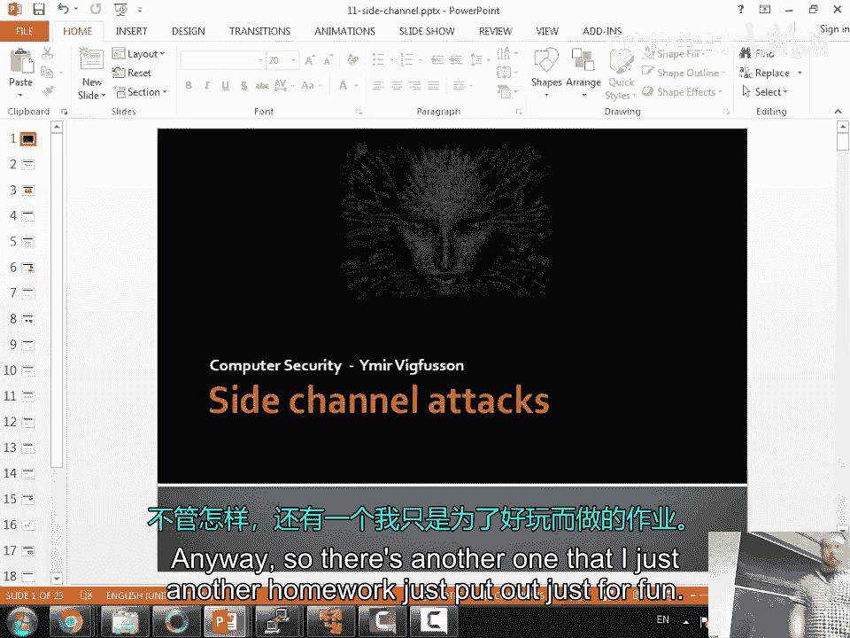
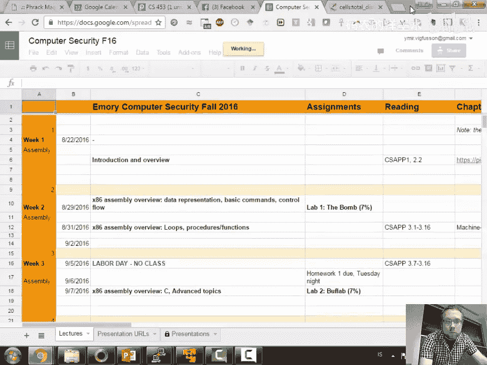
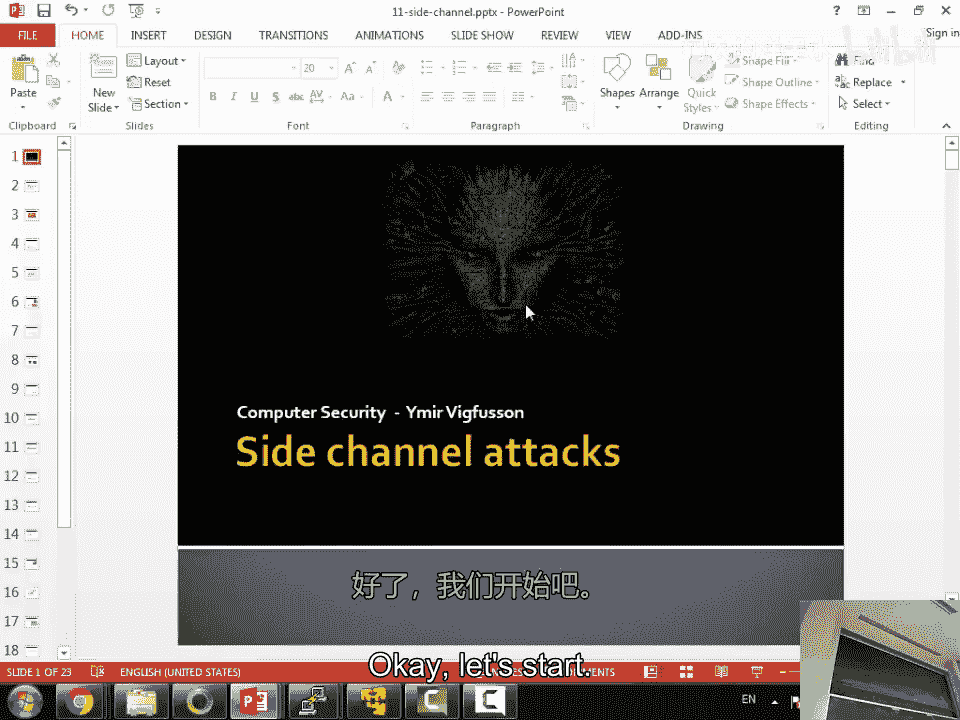
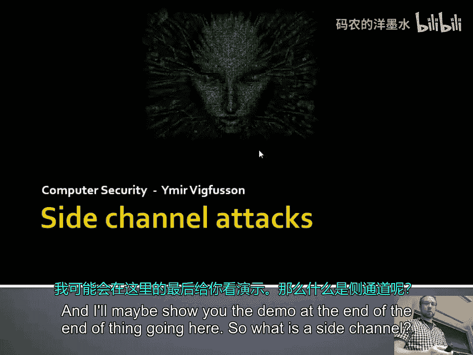
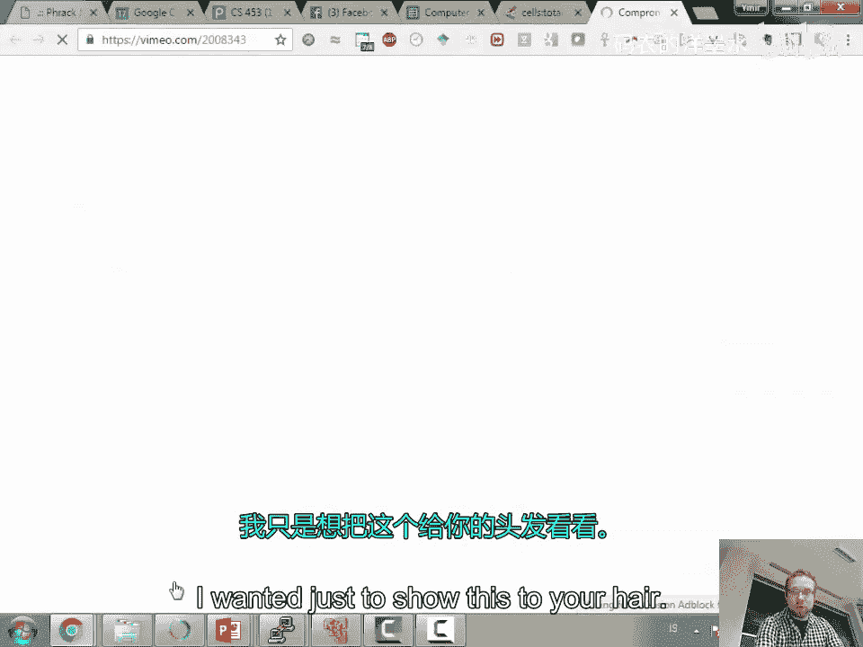
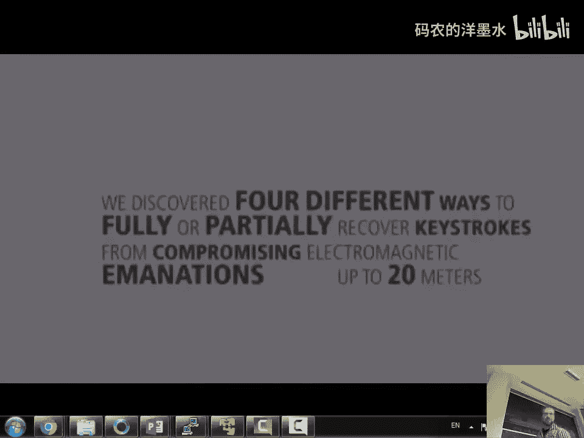
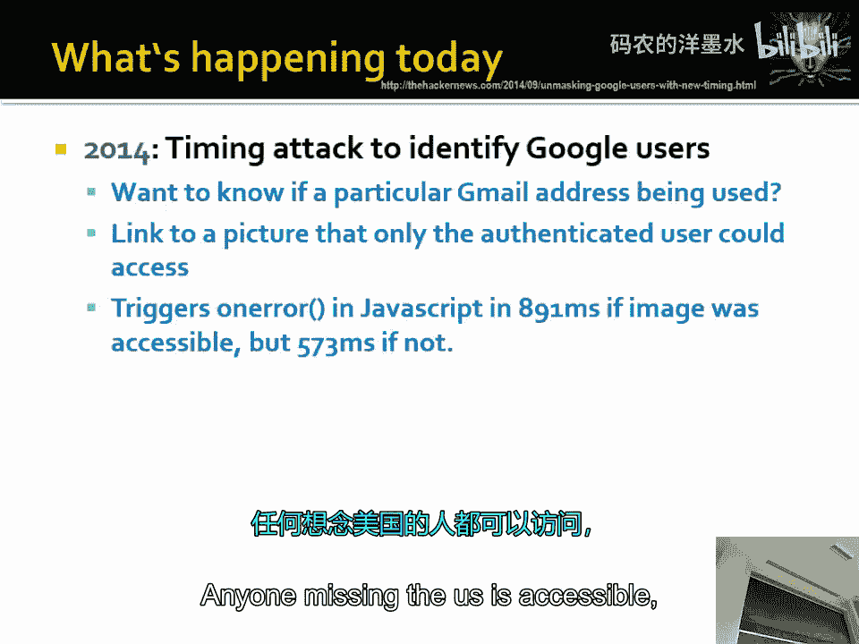
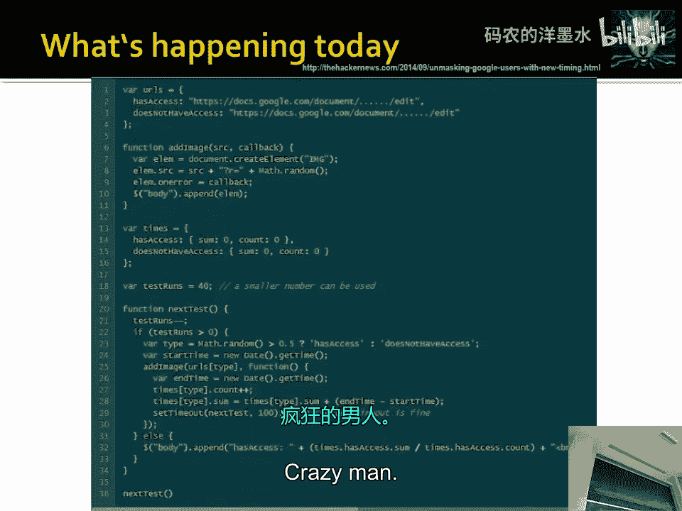
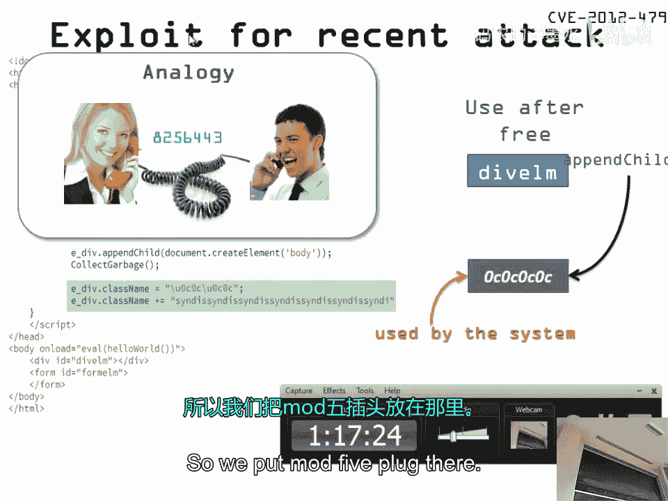

# 014：侧信道攻击与针对 Windows 7 下 IE 浏览器的攻击演示 🎯





在本节课中，我们将要学习侧信道攻击的基本概念，并通过一个针对旧版 Internet Explorer 浏览器的实际漏洞利用演示，来理解攻击者如何绕过现代安全防护机制。

## 概述

侧信道攻击不直接攻击算法或代码的逻辑漏洞，而是通过分析系统物理实现的副作用（如执行时间、功耗、电磁辐射或声音）来窃取信息。这是一种非常强大且往往被忽视的攻击方式。





上一节我们介绍了缓冲区溢出等内存破坏漏洞，本节中我们来看看如何利用系统的物理特性作为信息泄露的渠道。

## 什么是侧信道攻击？🔍

在安全领域，我们通常在一个理想的模型内讨论安全性。例如，我们可以证明某个加密算法在数学模型下是安全的。然而，当这些理论模型在现实中实现时，物理设备会引入新的信息泄露渠道。侧信道攻击正是利用了这些物理实现上的差异。

简单来说，侧信道攻击通过关联计算机算法状态与某些物理测量值来获取信息。

以下是侧信道攻击的一些常见类型：

*   **时序攻击**：测量不同操作之间的时间差。例如，检查电子邮件是否存在的响应时间可能泄露该邮箱地址是否有效。
*   **功耗分析**：监控计算机的功耗变化，可以推断出正在执行的运算类型。
*   **电磁攻击**：捕获设备（如显示器）发出的电磁辐射，可能重建屏幕上显示的内容。
*   **声学攻击**：监听设备（如键盘、CPU）发出的声音，分析其模式。
*   **差分故障分析**：通过故意引入故障（如电压波动），观察输出差异来推断内部信息。
*   **数据残留**：恢复已被“删除”但仍物理存在于存储介质上的数据。

## 历史案例 📜

侧信道攻击并非新概念，在历史上早有应用。

*   **1956年：英格玛密码机监听**：英国军情五处（MI5）在埃及大使馆的密码机内安装了监听设备，并非直接窃听明文，而是记录密码机转子转动的声音，从而破译加密信息。
*   **1946-1952年：美国大使馆的“金唇”窃听器**：苏联赠送美国大使馆一个手工木制美国国徽，内部藏有一个无源共鸣腔窃听器（“金唇”）。外部用特定频率的无线电波照射它，其内部会随房间声波振动，从而反射回被调制的信号，实现窃听。这个设备持续工作了近6年。
*   **1947年：激光麦克风**：利用激光照射房间窗户等平坦表面，检测因室内声音引起的微小振动，从而在远处进行监听。
*   **1980年代：打印机攻击**：通过监听点阵打印机打印头的移动声音，可以推断出打印的内容。
*   **1990年代：Tempest 技术**：研究发现，可以从CRT显示器发出的电磁辐射中，在远处重建屏幕图像。这催生了严格的电磁屏蔽标准（TEMPEST）。
*   **2004年：键盘声学攻击**：研究表明，不同键盘按键会产生略微不同的声音，通过机器学习分析，可以高准确率地还原键入内容。
*   **2004年：CPU功耗/声学分析**：通过分析CPU执行加密操作时的功耗或发出的超声波，可以提取出RSA私钥。
*   **2011年：热成像攻击**：使用热成像相机拍摄刚输入完密码的键盘，通过残留的热量痕迹推断按键顺序。

## 现代示例与防御 💡

侧信道攻击在当今依然活跃且形式多样。

*   **网络时序攻击**：即使流量被加密（如SSH），攻击者通过分析数据包间的发送时序，可以推断密码长度甚至部分内容。防御方法是**在输入完成后一次性发送整个密码数据包**。
*   **移动设备传感器**：手机上的加速度计等传感器可能捕捉到用户键入时的微小振动，结合输入法模型，可能推断输入内容。
*   **缓存时序攻击**：通过测量数据访问时间，判断目标数据是否在CPU缓存中，从而泄露信息。

针对侧信道攻击的防御思路主要包括：
1.  **消除信道**：使执行路径不依赖于秘密信息（恒定时间算法）。
2.  **增加噪声**：在信道中引入随机延迟或干扰，使信号难以提取。
3.  **隔离与屏蔽**：对关键设备进行物理屏蔽（如法拉第笼）。

## 返回导向编程（ROP）简介 ⚙️

在进入演示前，我们需要简要了解一种现代漏洞利用技术——返回导向编程。它是一种代码复用攻击。

当攻击者能够控制程序的执行流（例如通过缓冲区溢出），但现代防御机制（如数据执行保护 DEP/NX）阻止执行注入到内存中的恶意代码时，ROP 提供了一种解决方案。

ROP 的核心思想是：在现有程序代码中寻找一系列以 `ret` 指令结尾的短代码片段（称为“gadget”），然后通过精心构造的栈数据，将这些 gadget 的地址串联起来。当函数返回时，就会按顺序执行这些 gadget，从而组合成复杂的恶意功能。公式化描述如下：

`恶意功能 = Gadget1地址 + Gadget2地址 + ... + GadgetN地址`



攻击链成功的概率随着程序代码量的增加而快速上升，因为可用的 gadget 更多。







## 针对 Windows 7 IE 浏览器的攻击演示 🖥️💥

现在，我们将看到一个结合了信息泄露、堆风水（Heap Feng Shui）和ROP链技术的实际攻击演示。此演示针对旧版 Windows 7 上的 Internet Explorer 8 浏览器。

**攻击场景**：现代浏览器具有 DEP（防止执行堆栈上的代码）和 ASLR（随机化内存地址）等防护。我们的目标是绕过它们。

**攻击思路**：
1.  **信息泄露**：首先利用漏洞泄露某些关键模块的地址，从而绕过 ASLR。
2.  **堆喷射**：使用 JavaScript 大量分配内存并填充包含 shellcode 和 ROP 链的数据，目的是让这些数据出现在可预测的内存地址。
3.  **触发漏洞**：利用一个“释放后重用”漏洞。我们创建一个按钮元素，然后将其删除，但保留一个指向它的引用。当程序后续使用这个已释放的内存时，我们通过堆喷射已控制该区域。
4.  **执行控制**：被控制的区域包含ROP链。ROP链的作用是调用 `VirtualProtect` 等函数，将存放 shellcode 的内存区域标记为“可执行”，然后跳转到 shellcode 执行。
5.  **获得权限**：最终，shellcode（例如弹出一个计算器）得以执行，标志着攻击成功。

以下是演示中关键步骤的简化代码逻辑示意：

```javascript
// 1. 堆喷射：填充大量内存，包含 NOP 滑梯、Shellcode 和 ROP 链
var spray = new Array();
for (var i = 0; i < 1000; i++) {
    spray[i] = padding + rop_chain + shellcode;
}

// 2. 创建并释放对象，制造“释放后重用”条件
var obj = document.createElement('button');
document.body.appendChild(obj);
document.body.removeChild(obj); // 对象被释放，但可能有引用残留

// 3. 通过漏洞（例如，某个方法调用）重新操作已释放的 obj 内存
// 此时，攻击者控制的数据（来自堆喷射）可能已占据该内存块
vuln_func(obj); // 此函数内部会使用 obj，触发预设的 ROP 链
```

**核心绕过**：
*   **绕过 DEP**：使用 ROP 链调用系统 API 改变内存属性。
*   **绕过 ASLR**：通过信息泄露或利用未启用 ASLR 的模块（如旧版 Flash 插件）作为 ROP 链的起点。

这个演示展示了攻击者如何将多个简单的弱点（信息泄露、UAF漏洞）串联起来，突破层层防御，最终实现代码执行。

## 总结



本节课中我们一起学习了侧信道攻击的原理与历史案例，认识到安全不仅关乎逻辑正确，也关乎物理实现。随后，我们通过一个针对旧版IE浏览器的综合漏洞利用演示，直观了解了现代攻击如何结合信息泄露、堆操作和ROP链技术来绕过 DEP 和 ASLR 等高级安全防护。这提醒我们，安全是一个整体，任何一环的薄弱都可能被攻击者利用，形成完整的攻击链。