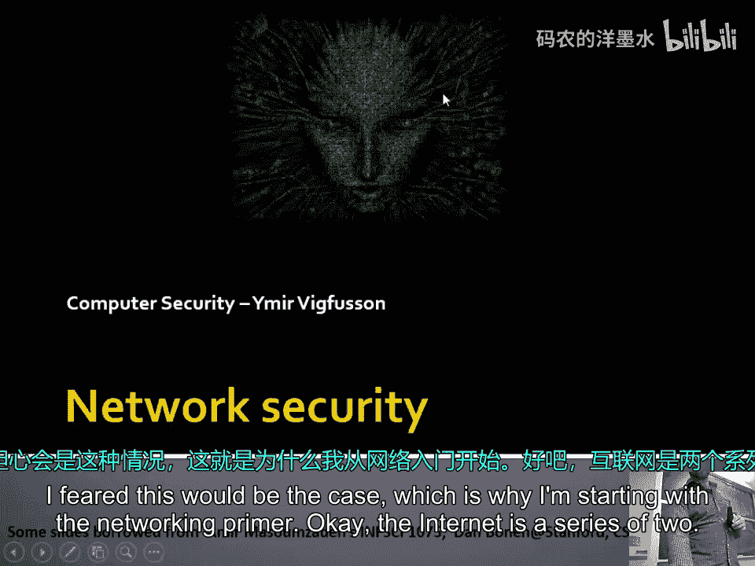
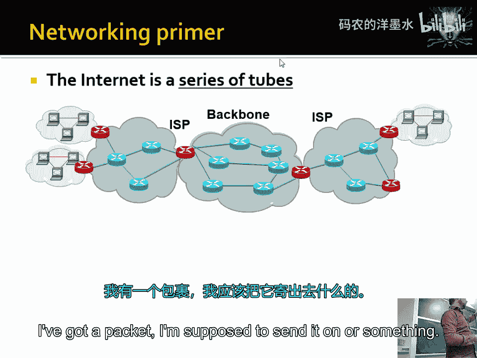
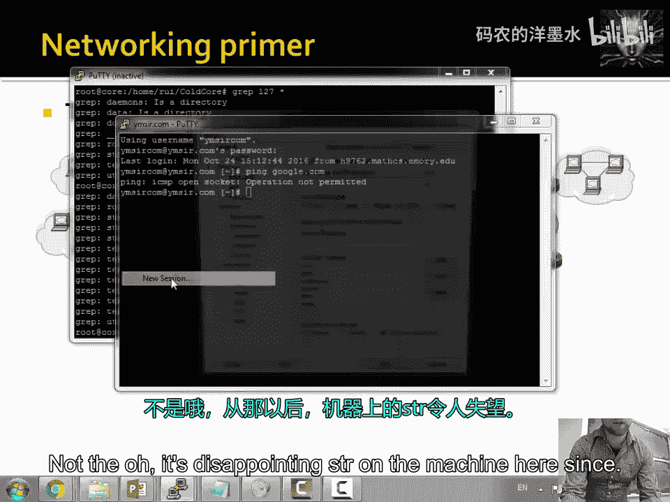
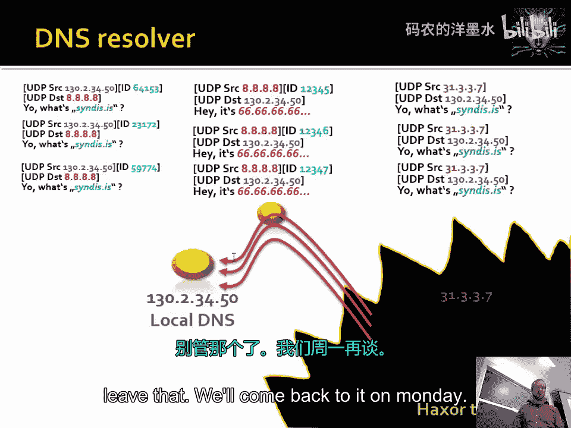

# 017：网络安全

## 概述

在本节课中，我们将要学习网络安全的基础知识。我们将从互联网的基本结构开始，了解数据包如何在网络中传输，并深入探讨TCP/IP协议栈、ARP欺骗、TCP扫描技术以及DNS的工作原理和潜在的安全漏洞。这些知识是理解网络攻击与防御的基础。

## 互联网是什么？🌐

互联网是一系列通过各种线路（部分为无线）连接起来的计算机（包括路由器等设备）的集合。我们可以将其想象成一个分层结构，就像从家中的车道连接到街道，再连接到高速公路一样。

在互联网中，用户设备通过无线连接到家庭路由器，家庭路由器再通过物理线路连接到互联网服务提供商（ISP）。ISP拥有内部网络，并通过光纤连接到更大的骨干网节点。这些大型骨干网之间通过高速链路连接。因此，当你发送一个数据包时，它实际上会经过许多不同的“跳”（即中间计算机）。

## 数据包路由与延迟

数据包在网络中传输时，会经过一系列路由器。每个路由器根据数据包的目的地IP地址，决定将其转发到哪个下一跳。这个过程类似于使用地图导航。

网络性能有两个关键指标：**带宽**和**延迟**。带宽指单位时间内可以传输的数据量，可以通过铺设更粗的电缆、建立更短的路径来提升。延迟指数据包从发送到接收所需的时间，它受到物理距离和光速的限制。

为了降低延迟，大型服务商会使用**内容分发网络**，将数据副本存放在地理上靠近用户的位置。

## 网络协议栈：OSI模型

为了处理各种不同的应用需求，网络设计采用了分层模型，即OSI七层模型。这种设计使得每一层只需关注特定的功能，简化了复杂性。

1.  **物理层**：负责在物理媒介（如网线、无线信号）上传输原始比特流。
2.  **数据链路层**：负责在直接相连的节点间传输数据帧，处理介质访问控制（如以太网的冲突检测）。
3.  **网络层（IP层）**：这是协议栈的“窄腰”。它的核心功能是给数据包加上源和目的IP地址，然后将其发送到网络上。它不关心数据包是否丢失，也不关心上层应用是什么。其核心是IP协议。
4.  **传输层（TCP/UDP层）**：负责端到端的通信。
    *   **TCP**：提供可靠的、面向连接的通信。它确保数据包按序到达，处理丢失重传，并进行拥塞控制。其连接通过“三次握手”建立。
    *   **UDP**：提供无连接的、不可靠的通信。它只是发送数据包，不保证到达或顺序，开销小，常用于游戏、视频流等实时应用。
5.  **应用层**：包含具体的应用协议，如HTTP（网页）、SMTP（邮件）、DNS（域名解析）等。

这种分层设计，特别是“端到端原则”，意味着智能（如错误检查、安全）应该放在通信的端点（应用程序），而不是中间节点（路由器）。这使得网络核心保持简单和高效。

## 数据包结构与ARP协议

一个数据包在发送时，会被层层封装。例如，一个应用层数据会被加上TCP头、IP头，最后加上以太网头和尾。

*   **IP地址**：是网络层（第3层）的地址，用于在全球互联网中定位主机。
*   **MAC地址**：是数据链路层（第2层）的地址，是网络接口卡（如网卡）的唯一硬件标识，用于在本地网络段中定位设备。

要在本地网络中发送数据包，设备需要知道目标IP地址对应的MAC地址。这是通过**ARP协议**完成的。

ARP协议的工作方式如下：当设备A想知道设备B（IP地址为`192.168.1.100`）的MAC地址时，它会向本地网络广播一个ARP请求：“谁的IP是`192.168.1.100`？请告诉我你的MAC地址。”设备B收到后，会单播回复：“是我，我的MAC地址是XX:XX:XX:XX:XX:XX。”

## ARP欺骗攻击

ARP协议是完全信任的，没有任何认证机制，这导致了**ARP欺骗**攻击的可能。

攻击者可以：
1.  响应一个未被请求的ARP请求，声称自己是某个IP（如网关）的所有者。
2.  主动发送ARP广播，更新其他设备的ARP缓存表。

这样，攻击者就能将自己置于受害者与网关之间，成为“中间人”。所有流向互联网的流量都会先经过攻击者的机器，攻击者可以窃听、篡改数据，然后再转发给真正的网关。受害者对此毫无察觉。

## TCP协议与扫描技术

TCP使用序列号和确认号来保证可靠传输。建立连接时的初始序列号应该是随机的，以防止攻击者预测并伪造数据包。

黑客在攻击前需要进行侦察，**端口扫描**就是常用手段，目的是发现目标主机上开放了哪些可能存在漏洞的服务。

以下是几种扫描技术：

*   **SYN扫描**：发送SYN包，根据返回的SYN-ACK（端口开放）或RST（端口关闭）来判断。
*   **隐蔽扫描**：
    *   **圣诞树扫描**：发送所有标志位都置位的非法数据包，观察不同响应。
    *   **FIN扫描**：发送FIN包，开放端口可能不响应，关闭端口会返回RST。
    *   **NULL扫描**：发送没有任何标志位的包。
*   **空闲扫描**：利用一台“僵尸主机”的IPID（IP标识符）递增特性，间接探测目标端口状态，实现高度隐蔽。

此外，由于不同操作系统对异常TCP数据包的处理方式存在细微差异，攻击者可以通过发送特殊构造的数据包来**进行操作系统指纹识别**，从而更精确地定位攻击方式。

## DNS原理与缓存投毒攻击

DNS将人类可读的域名（如`google.com`）转换为机器可读的IP地址。它是一个分布式、层次化的系统。

解析过程大致如下：用户向本地DNS解析器查询，如果解析器缓存中没有记录，它会从根域名服务器开始，逐级向下查询，直到获得权威答案。

DNS查询通常使用UDP协议，而UDP是无连接、无状态的，数据包容易被伪造。这导致了**DNS缓存投毒攻击**。

攻击原理如下：
1.  攻击者向目标DNS服务器发送大量查询，请求解析一个它不知道的域名。
2.  同时，攻击者伪造大量来自上级权威DNS服务器的响应包，试图猜测DNS查询中的**事务ID**。如果猜中，伪造的响应（例如，将`bank.com`指向攻击者控制的IP）就会被目标DNS服务器接受并缓存。
3.  此后，所有用户向该DNS服务器查询`bank.com`，都会得到错误的IP地址，从而被导向攻击者的钓鱼网站。

## 总结

本节课我们一起学习了网络安全的核心基础。我们了解了互联网的分层结构和数据包路由机制，深入探讨了TCP/IP协议栈中IP、TCP、UDP等协议的作用。我们分析了ARP协议的缺陷及其导致的中间人攻击，并介绍了多种TCP端口扫描技术和操作系统指纹识别方法。最后，我们探讨了DNS系统的工作原理以及UDP协议无状态特性所引发的DNS缓存投毒攻击风险。理解这些网络基础协议和它们的安全隐患，是进行有效网络防御和深入安全研究的第一步。