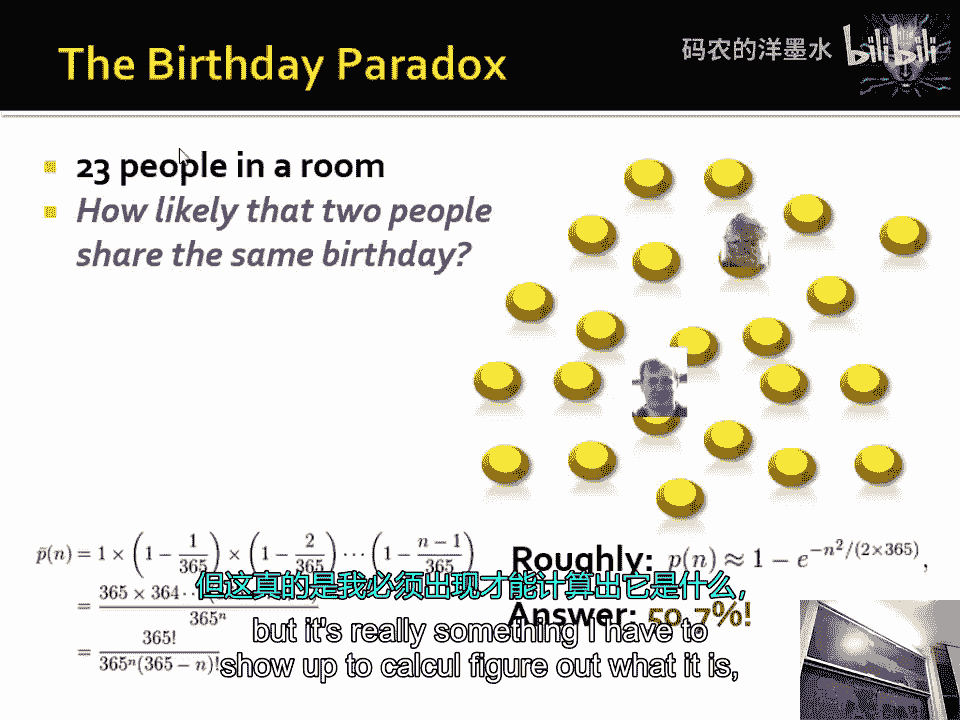
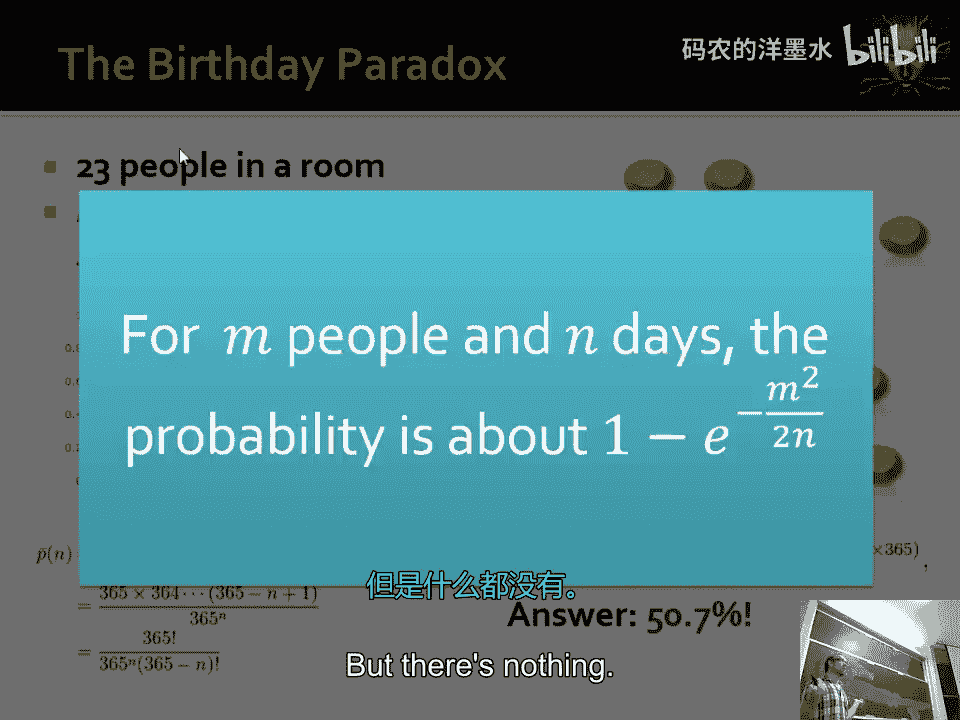
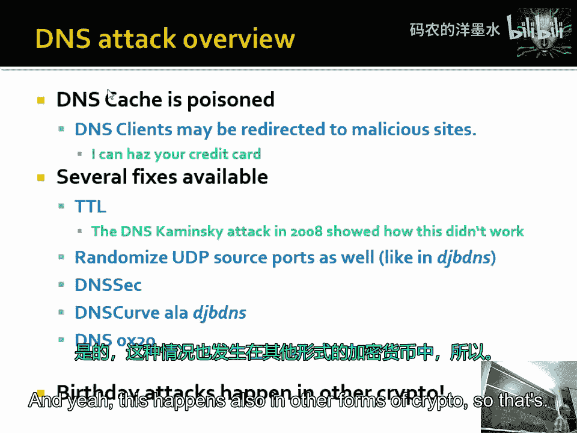
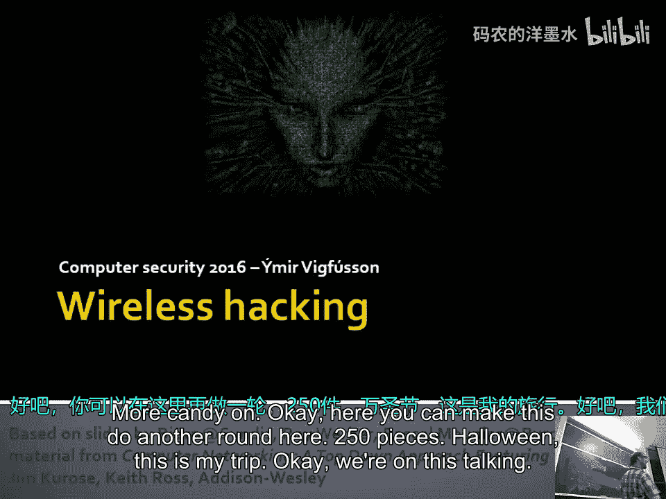
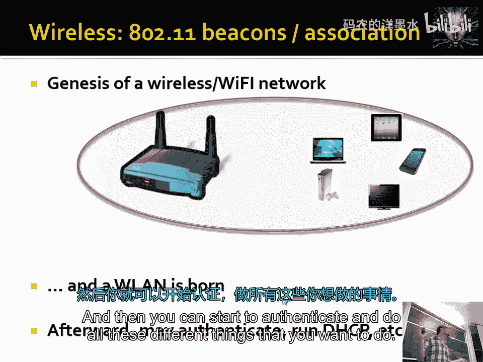
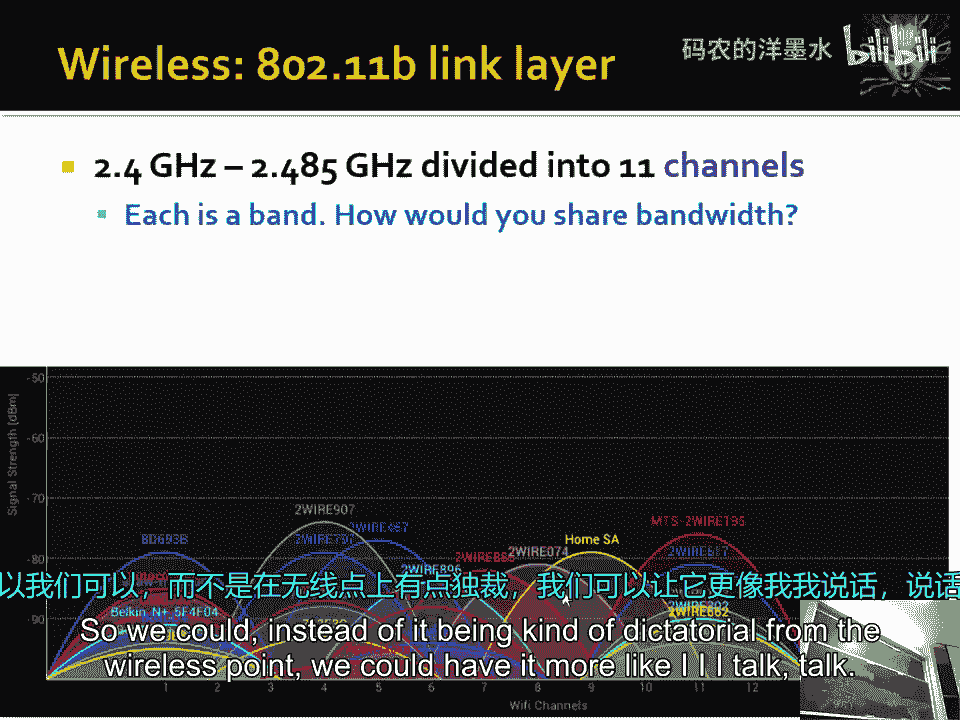
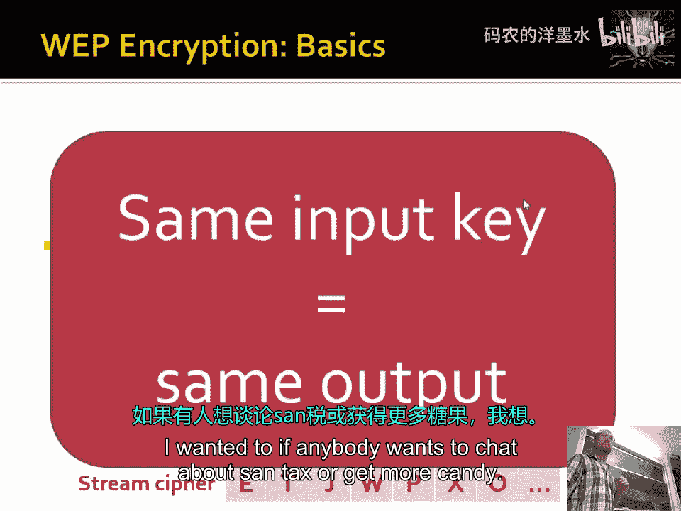

# 018：无线安全（第一部分）

在本节课中，我们将要学习无线网络的基础知识。我们将从回顾上一节课的DNS安全内容开始，然后深入探讨无线通信的频谱、协议架构以及基本的安全机制，特别是WEP（有线等效加密）的工作原理。

---

上一节我们介绍了DNS投毒攻击及其背后的生日悖论原理。本节中，我们来看看无线网络的世界。

## 无线频谱概述

无线通信依赖于电磁频谱。以下是一些常见的频段及其用途：

*   **2.4 GHz频段**：这是一个无需许可的频段，被Wi-Fi、蓝牙、微波炉和无绳电话等设备广泛使用。
*   **5 GHz频段**：同样用于Wi-Fi，通常能提供更快的速度和更少的干扰。
*   **蜂窝网络频段**：例如GSM使用的900 MHz和1.8 GHz，以及CDMA使用的频率，用于手机通信。
*   **权衡关系**：通常，较低的频率传播距离更远但数据速率较低；较高的频率能提供更高的数据速率但覆盖范围较小。

## 无线网络架构

无线网络主要有两种组织模式：

1.  **基础设施模式**：这是最常见的形式。设备（如笔记本电脑、手机）连接到**接入点**，接入点再通过有线方式连接到更大的网络（如互联网）。所有通信都通过接入点进行。
2.  **自组织模式**：设备之间直接相互通信，无需中央接入点。这适用于临时网络。

在基础设施模式中，一组连接到同一接入点的设备形成一个**基本服务集**。接入点的作用是在无线帧和传统有线以太网帧之间进行转换，使得有线网络上的设备意识不到无线部分的存在。

## 802.11 帧结构

为了让无线设备与有线网络兼容，IEEE 802.11标准在数据链路层（第二层）进行操作。一个802.11数据帧包含比以太网帧更多的地址信息，因为它需要处理无线媒介的特殊性。

一个802.11帧的关键字段包括：
*   **三个MAC地址**：源地址、目的地址和**接入点地址**。需要接入点地址是为了在多个接入点共存的环境中明确目标。
*   **帧控制字段**：包含诸如帧类型（是去往接入点、来自接入点还是管理帧）、是否加密等信息。
*   **序列号**：用于管理重传。
*   **帧校验序列**：用于检测传输错误。

接入点收到无线帧后，会剥离802.11头部，将其转换为标准的以太网帧，然后转发到有线网络。这个过程对通信两端是透明的。

## 媒介访问控制：CSMA/CA

在有线以太网中，我们使用CSMA/CD（载波侦听多路访问/冲突检测）。但在无线环境中，设备难以在传输的同时检测冲突（因为信号衰减和自身发射功率的影响）。因此，Wi-Fi使用**CSMA/CA（载波侦听多路访问/冲突避免）**。

其基本流程如下：
1.  设备在发送前先监听信道是否空闲。
2.  如果信道空闲，设备会等待一个随机的时间段（避免多个设备同时开始发送），然后发送一个很短的**请求发送**帧给接入点。
3.  接入点回复一个**允许发送**帧，授予该设备发送权限。
4.  设备发送数据帧。
5.  接收方（通常是接入点）在成功接收后回复一个**确认**帧。

这种方法有助于减少冲突，但无法完全消除。

## 无线安全简介：认证与加密

无线信号是广播性质的，任何在范围内的人都可以监听到传输的数据。因此，安全机制至关重要。早期的Wi-Fi安全标准称为**WEP**。

WEP试图提供两个主要安全服务：
1.  **认证**：验证用户是否知道共享密钥（密码）。
2.  **加密**：使用共享密钥对传输的数据进行加密。

### 认证过程

简单的密码传输是危险的。WEP使用一种**挑战-响应**机制：
1.  接入点向客户端发送一个随机数（挑战）。
2.  客户端将这个随机数与共享密钥组合，进行哈希运算，然后将结果（响应）发送回接入点。
3.  接入点进行相同的计算。如果结果匹配，则认证成功。

这种方式避免了在网络上直接传输密钥。

### 加密过程

WEP的加密使用流密码。其基本思想是：
*   双方共享一个密钥。
*   将这个密钥和一个初始化向量输入一个伪随机数生成器，生成一个密钥流。
*   将明文数据与这个密钥流进行**异或**运算，产生密文。
*   接收方使用相同的密钥和初始化向量生成相同的密钥流，将密文再次异或，即可恢复明文。

公式表示为：
`密文 = 明文 ⊕ 密钥流`
`明文 = 密文 ⊕ 密钥流`

其中 `⊕` 代表异或运算。

---

本节课中我们一起学习了无线网络的基础。我们了解了无线频谱的划分、802.11网络的两种模式（基础设施和自组织）、无线帧的结构、用于共享信道的CSMA/CA协议，并初步探讨了WEP协议如何通过挑战-响应进行认证以及使用流密码进行加密。下一节课，我们将深入分析WEP协议中存在的严重安全漏洞。