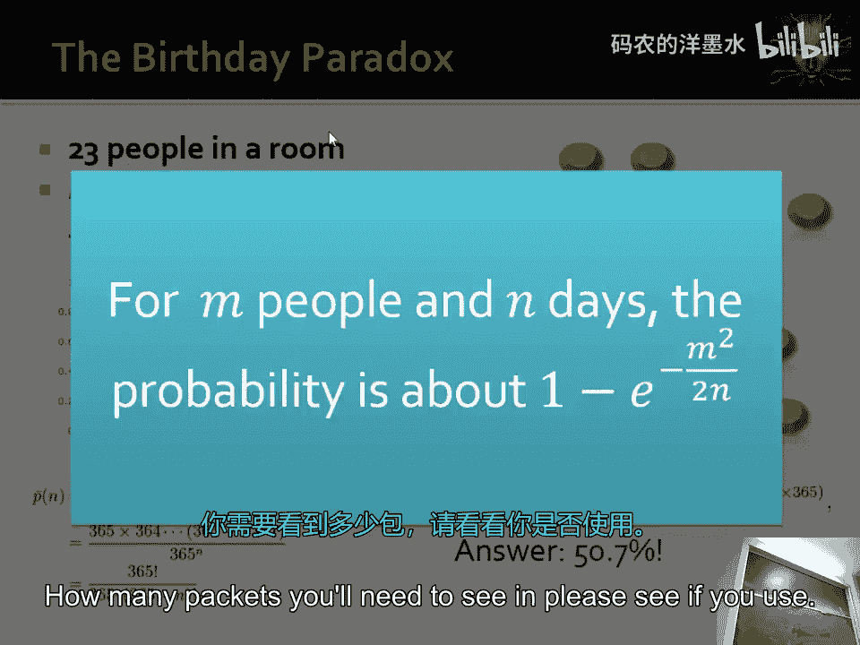
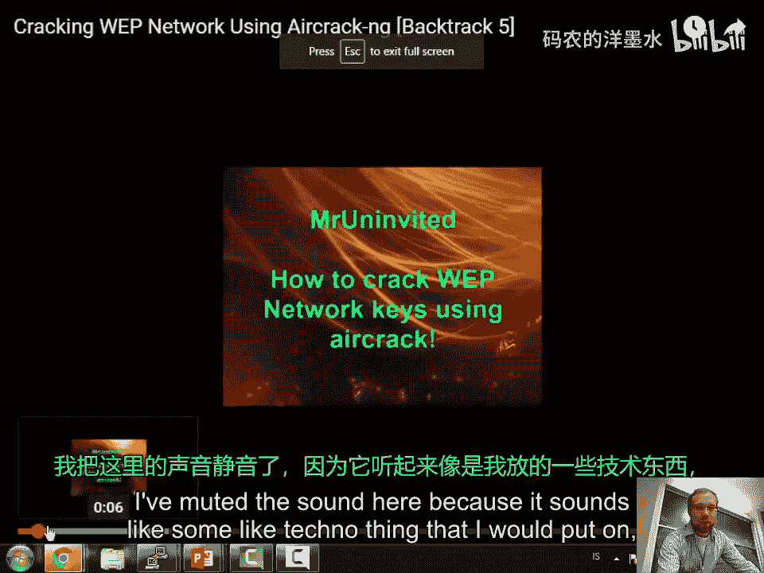
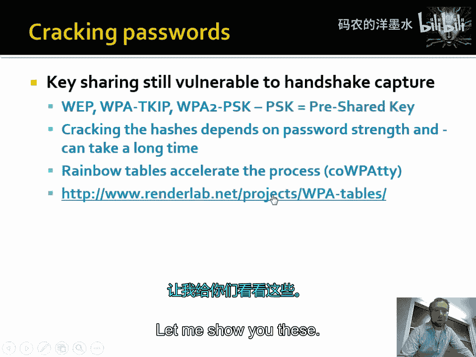
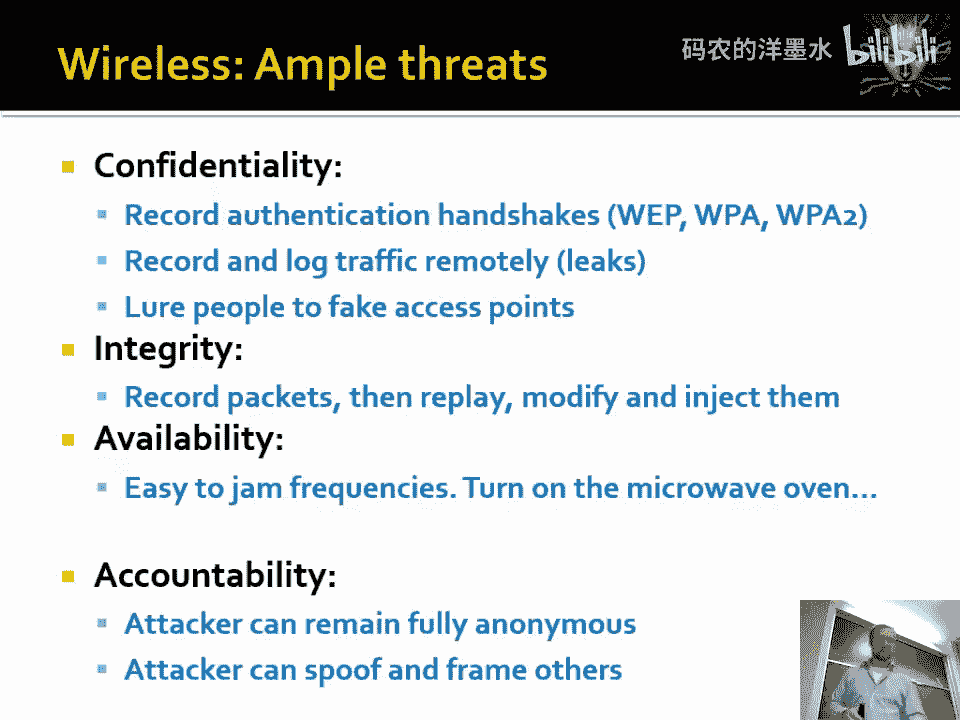
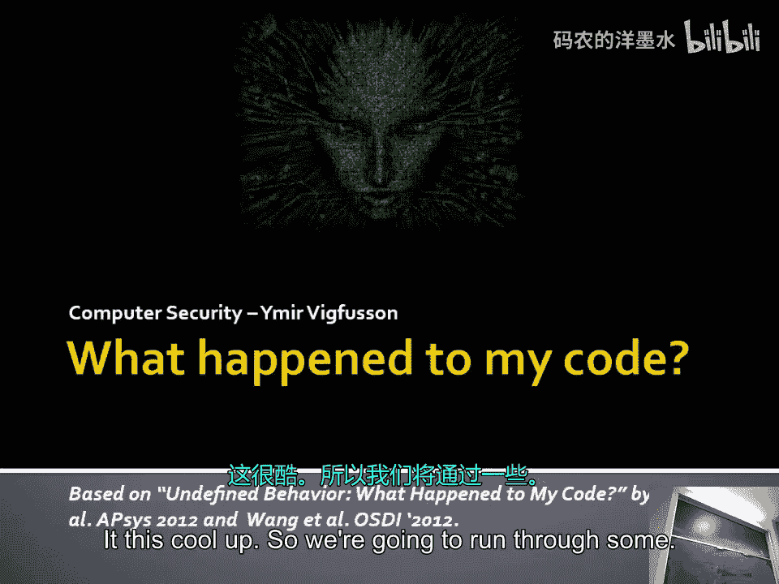
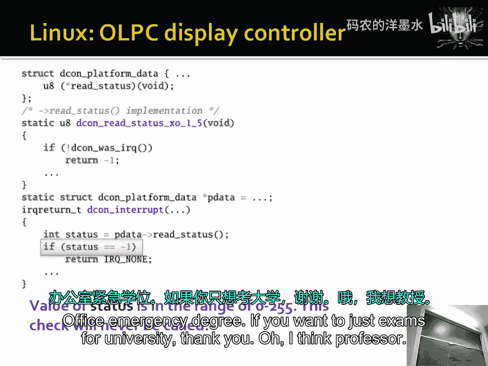

# 019：无线安全（第二部分）🚀

在本节课中，我们将深入学习无线网络安全的第二部分，重点探讨WEP协议的缺陷、WPA/WPA2的改进，以及针对企业级无线网络（如WPA2-Enterprise）的攻击方法。我们将从核心概念入手，逐步分析攻击原理，并理解为何强密码和正确的配置至关重要。

上一节我们介绍了无线安全的基本概念和WEP协议的初步握手过程。本节中，我们来看看WEP加密的具体实现及其致命弱点。

## WEP加密机制与流密码

WEP协议使用RC4流密码算法进行加密。其核心思想是：通信双方共享一个短密钥（如“hamster”），并利用一个初始化向量（IV）来生成一个长的密钥流，用于加密数据。

**核心公式**：
`密文 = 明文 ⊕ RC4(IV, 共享密钥)`

这里的`⊕`代表异或（XOR）操作。由于异或操作是对称的，接收方使用相同的IV和共享密钥生成相同的密钥流，即可解密：
`明文 = 密文 ⊕ RC4(IV, 共享密钥)`

整个系统的安全性完全依赖于密钥的强度。如果攻击者能猜出密钥，就能解密所有通信。

## WEP协议的主要漏洞

WEP协议的设计存在多个严重缺陷，使其极易被攻破。

以下是WEP协议的几个关键漏洞：

1.  **弱密钥与IV空间过小**：WEP的共享密钥通常很短（如40位），且IV只有24位。这意味着只有大约1600万个（2^24）可能的IV。在现代计算机的计算能力下，暴力破解IV空间是可行的。
2.  **IV重用导致密钥流重用**：由于IV空间小，在繁忙的网络中，IV很快就会重复使用。如果两个数据包使用了相同的IV（和相同的密钥），那么它们的密钥流就相同。
    *   **攻击原理**：根据异或的性质，如果 `密文1 = 明文1 ⊕ 密钥流`，`密文2 = 明文2 ⊕ 密钥流`，那么 `密文1 ⊕ 密文2 = 明文1 ⊕ 明文2`。攻击者通过分析两个密文的异或结果，可以推断出原始明文的某些信息，甚至恢复出密钥。
3.  **完整性校验脆弱**：WEP使用的CRC校验仅用于检测意外错误，无法防止恶意篡改。攻击者可以修改加密数据并相应地调整CRC值，而接收方无法察觉。
4.  **认证过程可被嗅探与重放**：WEP的认证握手过程可以被攻击者捕获并用于离线破解，或进行重放攻击。

## 从WEP到WPA/WPA2

由于WEP的严重缺陷，Wi-Fi联盟推出了WPA（Wi-Fi Protected Access）和WPA2作为替代方案。

上一节我们看到了WEP的脆弱性。本节中我们来看看旨在修复这些问题的WPA和WPA2协议。

WPA引入了两项关键改进：

*   **临时密钥完整性协议（TKIP）**：它动态生成每个数据包的加密密钥，并使用了更强大的消息完整性检查（MIC），有效防止了IV重用和重放攻击。
*   **更强的认证机制**：WPA-Personal使用预共享密钥（PSK），并通过一种名为PBKDF2的密钥派生函数将密码短语与SSID混合，生成更复杂的加密密钥，增加了暴力破解的难度。

WPA2则用更安全的**CCMP**协议（基于AES加密算法）取代了TKIP，提供了企业级的强度。

## 针对WPA2-Enterprise的攻击

WPA2-Enterprise使用802.1X标准和RADIUS服务器进行认证，用户使用用户名和密码登录。这听起来很安全，但仍存在攻击面。

以下是针对WPA2-Enterprise网络的一种常见攻击——邪恶双子（Evil Twin）攻击的步骤：

1.  **部署邪恶接入点**：攻击者设置一个无线接入点，其SSID与目标企业网络（如“Company-Secure”）完全相同。
2.  **解除客户端认证**：攻击者向已连接目标网络的合法客户端发送“解除认证”数据包，强制其断开连接。
3.  **诱骗连接**：客户端的设备会自动尝试重新连接。由于邪恶接入点的信号可能更强，设备会连接到它。
4.  **伪造证书与窃取凭证**：当客户端尝试通过邪恶接入点认证时，攻击者会提供一个伪造的证书。如果用户忽略了证书警告（或设置中禁用了警告），其用户名和密码哈希就会被发送到攻击者的服务器。
5.  **中间人攻击**：攻击者可以充当中间人，将用户的认证请求转发给真正的RADIUS服务器，从而在用户不知情的情况下窃取其凭证。

这种攻击之所以可能成功，很大程度上是因为用户对证书警告的忽视和设备的自动连接行为。

## 彩虹表与密码安全

无论是WPA-Personal的PSK还是企业网络的密码，其安全性最终都依赖于密码的强度。

攻击者会使用“彩虹表”来加速破解。彩虹表是预先计算好的密码与其对应哈希值（加密后的形式）的庞大数据库。攻击者获得一个密码哈希后，只需在彩虹表中查找，即可快速找到对应的原始密码。

**核心概念**：这解释了为什么不能使用常见密码，以及为什么在不同网站必须使用不同的密码。一旦一个网站的密码数据库泄露，攻击者就可以用这些密码尝试登录你的其他账户。

## 总结与最佳实践

本节课中我们一起学习了无线网络安全的核心挑战与演进。

我们分析了WEP协议因IV重用和弱加密而被轻易破解的原理。接着，探讨了WPA/WPA2如何通过TKIP/CCMP和更强的密钥管理来弥补这些缺陷。最后，我们揭示了即使像WPA2-Enterprise这样看似坚固的系统，也可能通过社会工程（如邪恶双子攻击）和弱密码被攻破。

**关键要点**：
*   **绝对不要使用WEP**。
*   **使用WPA2（AES）** 作为个人网络的最低安全标准。
*   **为企业网络配置证书验证**，并教育用户不要忽略证书警告。
*   **使用强且唯一的密码**，避免密码复用，以防御彩虹表攻击。
*   意识到在公共Wi-Fi环境中，即使连接显示为“安全”，也可能存在风险。

无线网络带来了巨大的便利，但也扩展了攻击面。理解其底层协议和常见攻击方法，是构建安全数字环境的第一步。