# 020：RSA与随机性 🔐

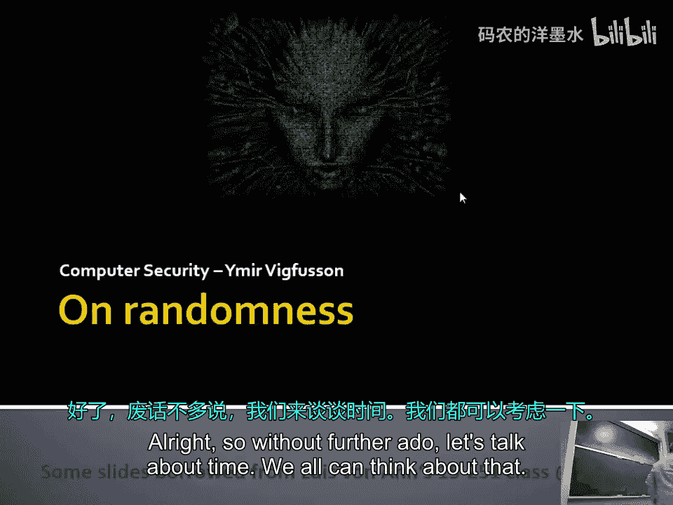

在本节课中，我们将要学习RSA加密算法的基本原理，以及计算机如何生成用于加密的随机数。我们将从假设拥有完美随机数开始，探讨如何实现安全的密钥交换，然后深入探讨计算机生成伪随机数的机制及其潜在的安全隐患。

---

## 假设拥有完美随机数

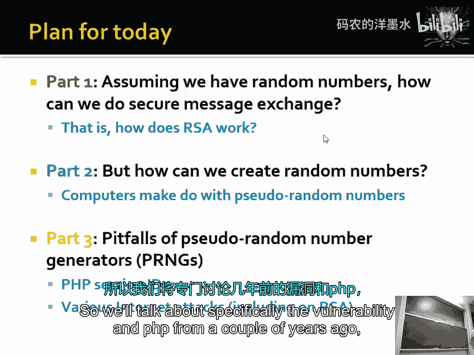

上一节我们介绍了安全通信的基本需求。本节中我们来看看，如果假设我们拥有一个能提供完美随机比特的“神谕”（例如一个真正的随机源），我们如何利用它来实现安全的密钥交换。

### RSA算法概述

RSA是一种非对称加密算法，它基于大数分解的困难性。其核心在于使用一对密钥：公钥用于加密，私钥用于解密。

以下是RSA密钥生成的核心步骤：

1.  **选择两个大质数**：`p` 和 `q`。
2.  **计算模数**：`n = p * q`。
3.  **计算欧拉函数**：`φ(n) = (p-1) * (q-1)`。
4.  **选择公钥指数**：选择一个整数 `e`，满足 `1 < e < φ(n)` 且 `e` 与 `φ(n)` 互质。
5.  **计算私钥指数**：计算 `d`，使得 `(d * e) % φ(n) = 1`。即 `d` 是 `e` 在模 `φ(n)` 下的乘法逆元。

**公钥** 是 `(e, n)`，可以公开。**私钥** 是 `(d, n)`，必须保密。

### 加密与解密过程

以下是加密和解密的数学描述：

*   **加密**：对于明文 `m`（需满足 `0 <= m < n`），计算密文 `c = m^e % n`。
*   **解密**：对于密文 `c`，计算明文 `m = c^d % n`。

其正确性基于欧拉定理：若 `m` 与 `n` 互质，则 `m^φ(n) % n = 1`。因此，`c^d % n = (m^e)^d % n = m^(e*d) % n = m^(k*φ(n)+1) % n = (m^φ(n))^k * m % n = 1^k * m % n = m`。

### 一个简单的计算示例

让我们通过一个小数字的例子来演示RSA：

1.  **密钥生成**：
    *   选择 `p = 11`, `q = 3`。
    *   计算 `n = 11 * 3 = 33`。
    *   计算 `φ(n) = (11-1)*(3-1) = 10*2 = 20`。
    *   选择 `e = 3`（与20互质）。
    *   计算 `d`，使得 `(d * 3) % 20 = 1`。`d = 7` 满足条件（`7*3=21, 21%20=1`）。
    *   公钥：`(e=3, n=33)`。私钥：`(d=7, n=33)`。

2.  **加密过程**：
    *   假设Bob想发送消息 `m = 7` 给Alice。
    *   Bob使用Alice的公钥加密：`c = 7^3 % 33`。
    *   计算 `7^2=49, 49%33=16`。
    *   计算 `c = 16 * 7 % 33 = 112 % 33 = 13`。
    *   Bob发送密文 `c=13`。

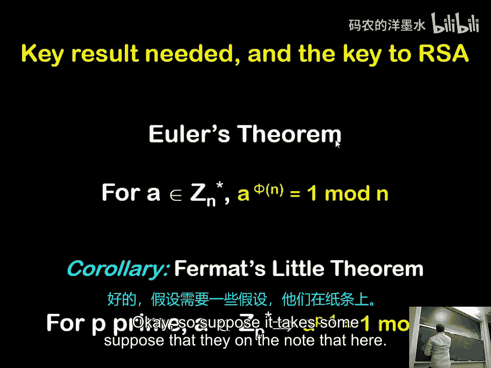

3.  **解密过程**：
    *   Alice收到密文 `c=13`。
    *   Alice使用自己的私钥解密：`m = 13^7 % 33`。
    *   利用模幂运算简化计算（例如，`13^2 % 33 = 169 % 33 = 4`，然后计算 `4^3 * 13 % 33` 等）。
    *   最终计算得到 `m = 7`，成功恢复原始消息。

### RSA的安全性

RSA的安全性依赖于从公钥 `(e, n)` 推导出私钥 `d` 的困难性。这本质上需要分解大整数 `n` 为 `p` 和 `q`，从而计算出 `φ(n)`。对于足够大的 `n`（例如2048位或更长），使用当前最好的算法和计算机进行分解在实践上是不可行的。

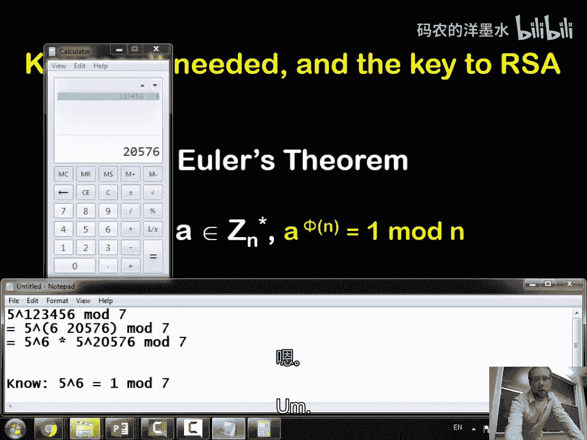

---

## 计算机如何生成随机数

上一节我们探讨了在拥有完美随机数的理想情况下如何使用RSA。本节中我们来看看现实中的计算机如何生成这些关键的随机数，因为计算机本质上是确定性的。

### 真随机数与伪随机数生成器

*   **真随机数**：来源于不可预测的物理过程，如电子噪声、放射性衰变、用户鼠标移动间隔等。这些序列是**非确定性**的，无法重现。
*   **伪随机数**：由称为**伪随机数生成器** 的确定性算法生成。给定一个初始值（称为**种子**），算法会生成一个看似随机的数字序列。**相同的种子总是产生相同的序列**。

### 伪随机数生成器的工作原理

以下是PRNG的基本工作流程：

1.  从一个**真随机源**获取一个初始种子（例如当前时间的毫秒数、收集的设备噪声熵）。
2.  将种子输入一个确定性算法（例如线性同余生成器）。
3.  算法输出一个“随机”数，并将该输出作为新的内部状态，用于生成下一个数。
4.  重复此过程。

**关键点**：PRNG的“随机性”完全取决于其种子的随机性和算法的设计。如果种子空间太小或可预测，那么整个输出序列也是可预测的。

### 种子空间与安全性

假设一个PRNG使用一个4位十进制数（0000-9999）作为种子。那么它最多只能产生10,000种不同的序列。与所有可能的20位随机序列（`26^20`，这是一个天文数字）相比，这个种子空间**极其微小**。

因此，对于密码学用途，PRNG必须：
1.  使用一个足够长、足够随机的种子，使得攻击者无法在合理时间内穷举所有可能的种子。
2.  其算法产生的序列在统计上与真随机序列无法区分。

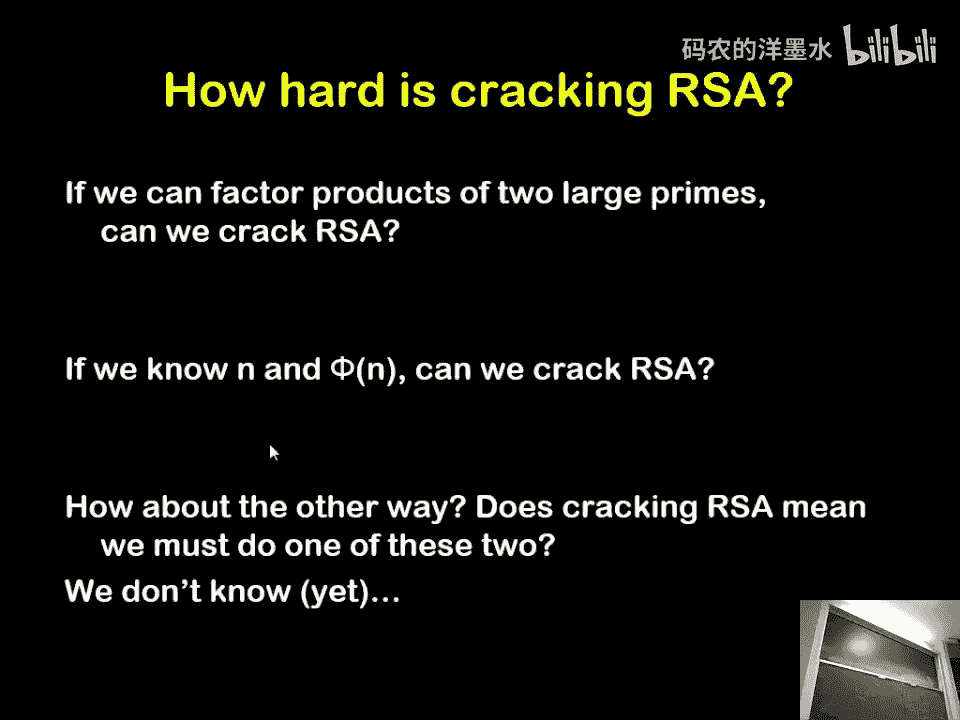

---

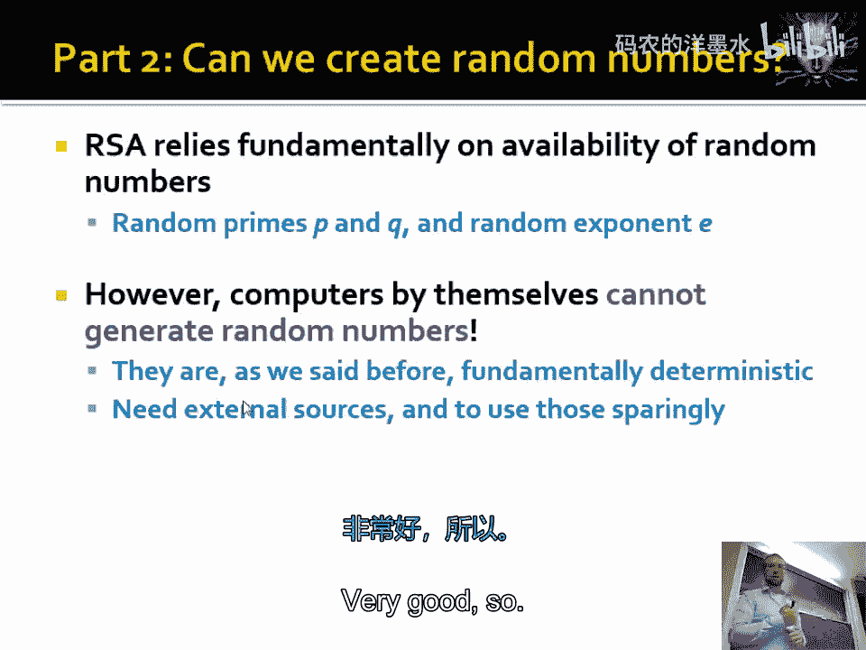

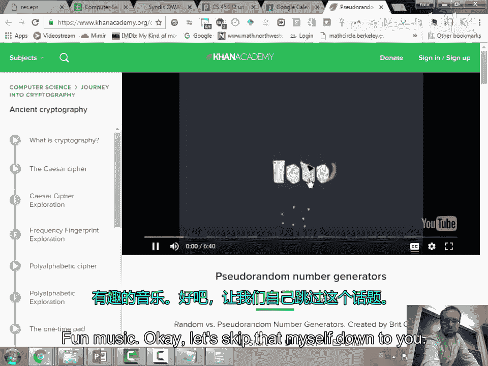

## 随机数生成中的安全陷阱

上一节我们介绍了PRNG的原理。本节中我们来看看在实际应用中，由于随机数生成不当导致的严重安全漏洞。

### 弱熵源与重复随机数

许多嵌入式设备（如路由器、防火墙）在启动时可能缺乏足够的熵源（如键盘输入、网络流量）。它们可能使用当前时间等可预测值作为种子。如果两个设备在相同状态下生成RSA密钥，它们可能意外地选择了相同的质数 `p` 或 `q`。

**攻击方法**：
1.  收集大量设备的RSA公钥 `(e, n)`。
2.  计算这些 `n` 值之间的最大公约数。
3.  如果两个 `n` 共享一个质因子 `p`，则 `gcd(n1, n2) = p`。
4.  一旦得到 `p`，就可以轻松分解 `n`，计算出私钥 `d`，完全破解RSA。

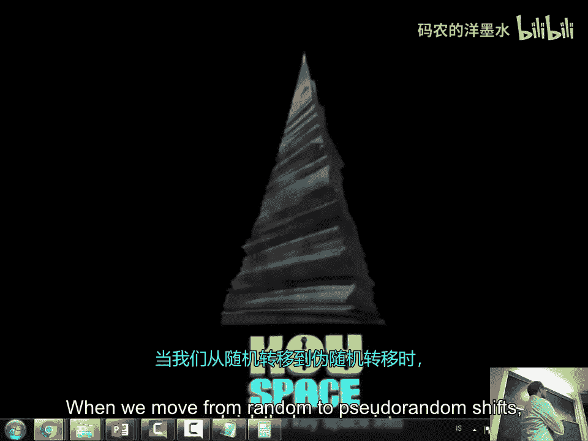

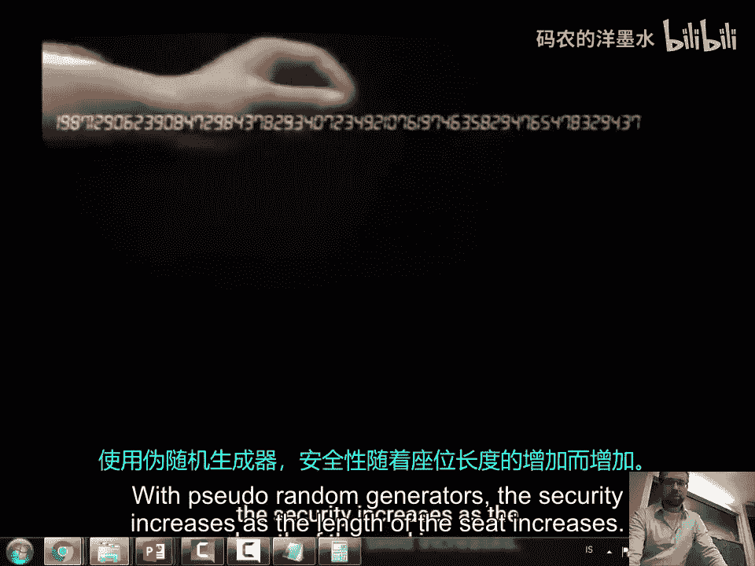

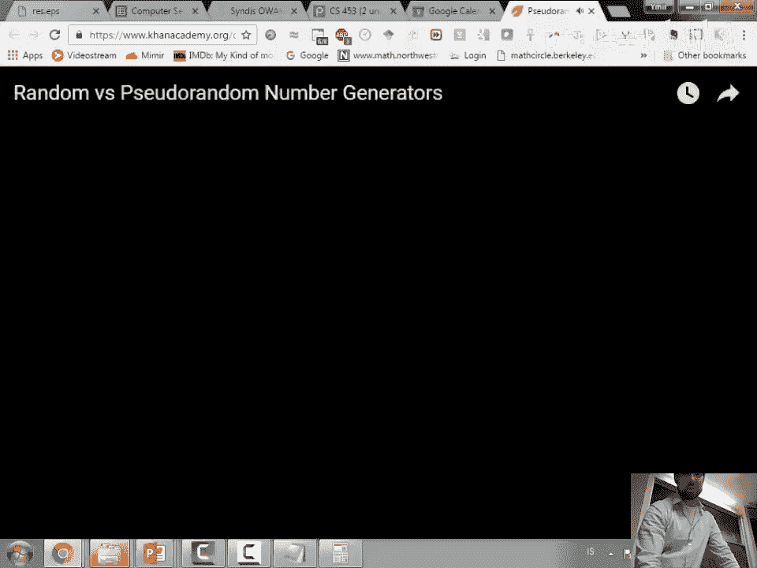

历史上，大规模互联网扫描已发现大量设备因弱随机数生成而存在此类漏洞。

### 伪随机数生成器的后门

更隐蔽的攻击是在标准化的伪随机数生成算法中植入后门。如果算法中的某些常数（如初始向量、模数）是由攻击者精心挑选的，那么攻击者可能在只知道少量输出字节的情况下，就能推算出整个内部状态和所有未来的输出。

著名的案例包括对双椭圆曲线确定性随机比特生成器标准的质疑，以及某些公司被指控接受资金以将弱化算法设为默认选项。这强调了使用“Nothing-up-my-sleeve numbers”（如π或自然常数e的位数）作为算法常数的重要性，以证明其没有恶意构造的后门。

---

## 总结

本节课中我们一起学习了：
1.  **RSA加密算法**：基于大数分解困难性的非对称加密系统，使用公钥 `(e, n)` 加密，私钥 `(d, n)` 解密。
2.  **随机数的必要性**：密码系统的强度依赖于其随机性的质量。
3.  **伪随机数生成**：计算机使用确定性算法和随机种子来模拟随机性。其安全性取决于种子的熵值和算法的强度。
4.  **实际安全风险**：弱熵源导致可预测的随机数，可能使RSA密钥被破解；标准算法中可能被植入后门。这提醒我们在实现和选择密码学组件时必须保持警惕。

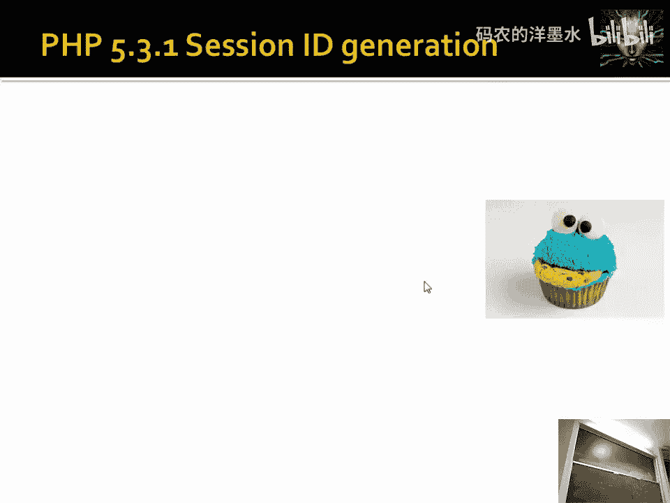

理解这些基础概念对于评估系统安全性和理解真实世界中的攻击至关重要。