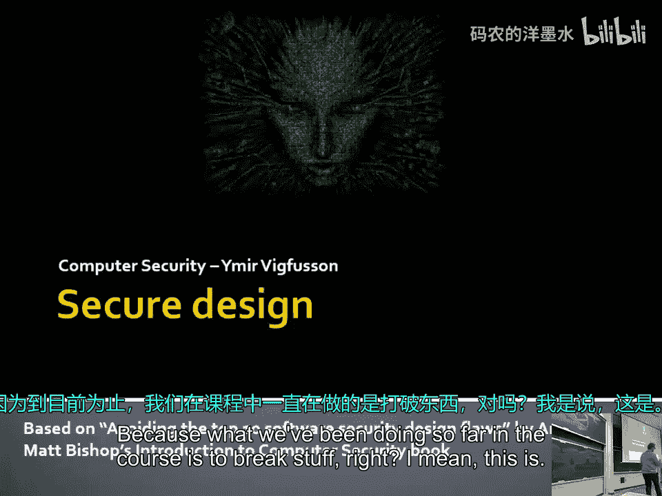

# 021：安全设计 🛡️

在本节课中，我们将要学习安全设计的基本原则。这些原则源于业界在应对安全威胁过程中积累的宝贵经验。理解并应用这些原则，有助于我们在构建系统时，从一开始就考虑安全性，而不是将其作为事后补救措施。

---

## 安全是一种权衡

上一节我们介绍了安全设计的背景，本节中我们来看看其核心本质：安全是一种权衡。

我们无法创造出绝对安全的程序。追求完美安全需要投入不成比例的巨大努力，这在现实中并不实用。安全讨论的核心在于，投入一定成本（时间或金钱）来建立某种程度的防御，与攻击者愿意为突破这些防御所付出的成本之间，存在一种平衡。



在组织中思考安全时，你需要评估：
*   **攻击者的动机与资源**：攻击者愿意花费多少时间和金钱？
*   **防御的价值**：这项防御措施能多大程度上保护你的核心资产？
*   **被绕过的代价**：对攻击者而言，绕过这项防御的价值有多大？

安全投入的收益曲线是一条渐近线：初期投入能显著提升安全性，但越接近完美，所需投入就越大，且永远无法达到绝对安全。你需要持续投入以维持当前的安全水平。

---

## 缺陷与设计漏洞

我们之前课程中讨论的许多漏洞都属于软件缺陷。但除此之外，还存在另一类问题：设计漏洞。

*   **缺陷**：指代码实现时出现的错误，例如缓冲区溢出。这是编程时的疏忽。
*   **设计漏洞**：指系统设计概念上的错误。即使所有代码都正确实现了设计，但由于设计本身存在逻辑缺陷，系统仍可能被利用。

一个自然的问题是：能否通过改进开发流程来减少缺陷和漏洞？现实是，商业压力通常偏向快速交付功能，而非构建安全软件。安全往往被视为一种“保险”，在出事之前容易被忽视。

研究表明，不同编程语言中的缺陷类型不同：
*   在C/C++等语言中，常见的是内存管理错误。
*   在Java/Python等语言中，更多是API误用、访问控制错误等问题。

选择更安全的语言和框架是减少特定类型缺陷的有效手段。

---

## 最小化信任

在系统设计中，一个核心原则是：**最小化信任**。

传统上，开发者可能信任客户端环境。例如，在游戏开发中，开发者信任玩家会运行未经篡改的客户端二进制文件。但现实是，任何运行在用户设备上的东西都是不可信的。用户（或攻击者）可以逆向工程、修改内存、拦截网络流量。

因此，你必须假设：
*   **客户端是完全不可信的**。
*   **所有来自客户端的数据和声明都可能被篡改**。

以下是应对策略：
*   **将关键逻辑和状态放在服务端**：客户端仅负责展示。
*   **进行服务端验证**：不依赖客户端的任何声明。
*   **使用混淆等技术**：这只能增加攻击难度，延迟而非阻止攻击。
*   **设计健壮的系统**：即使部分客户端被攻破，系统整体仍能运行。

---

## 认证与授权

上一节我们讨论了信任，本节我们来看看如何确认身份和分配权限，即认证与授权。

**认证**是验证“你是谁”的过程。常见方式包括：
*   **你知道什么**：如密码。
*   **你拥有什么**：如手机、安全令牌。
*   **你是什么**：如指纹、面部识别（生物特征）。

多因素认证结合以上多种方式，能显著提高安全性。

认证成功后，服务器会颁发一个**凭证**（如`session token`）。设计凭证时需注意：
*   **难以预测**：不能使用简单递增的数字（如`token = 1, 2, 3...`）。
*   **有限生命周期**：设置合理的过期时间。
*   **可撤销**：在凭证泄露或用户权限变更时能够使其失效。

**授权**是确定“你能做什么”的过程。应遵循**最小权限原则**：只授予用户完成其任务所必需的最低权限。这能限制漏洞或恶意行为造成的损害。

此外，应考虑上下文授权。例如，如果用户通常在本地白天登录，突然在深夜从国外IP登录并尝试敏感操作，系统应要求额外的认证。

---

## 纵深防御与安全层次

不要依赖单一的安全防线（如防火墙）。攻击者一旦突破外围防御，内部可能毫无戒备。

应在系统内部建立多层次的安全防护：
*   **网络隔离**：将关键系统（如支付数据库）与其他网络隔离开。
*   **权限分层**：不同应用和服务拥有不同的权限等级。
*   **持续监控与测试**：定期进行渗透测试和安全审计，以发现并修复弱点。
*   **员工培训**：让员工成为安全防线的一部分，积极报告可疑活动。

安全是一个持续的过程，需要不断适应新的威胁。

---

## 分离数据与控制

许多安全漏洞源于混淆了“数据”和“控制指令”。

例如，在SQL注入中，用户输入的数据被错误地解释为SQL命令的一部分：
```sql
-- 预期：数据是 'Alice'
SELECT * FROM users WHERE name = 'Alice';
-- 攻击：数据 ' OR '1'='1 被解释为控制逻辑
SELECT * FROM users WHERE name = '' OR '1'='1';
```
同样的问题也出现在命令注入、格式化字符串漏洞以及某些动态代码执行（如`eval()`）中。

解决方案是：
*   **使用参数化查询或预编译语句**。
*   **对输入进行严格的验证和净化**。
*   **避免将用户输入直接传递给解释器或执行引擎**。
*   **使用结构化的数据交换格式**（如JSON、XML），并确保解析器安全。

---

## 验证输入与使用前置条件

所有来自用户或外部源的数据都不可信，必须进行严格验证。

建议建立一个**集中的验证机制**，尽早将输入转换为**规范形式**。例如，收到一个日期字符串，立即将其解析并转换为内部的标准日期对象，后续所有逻辑都使用这个对象，而不是原始的、可能格式各异的字符串。

编写代码时，明确使用**前置条件**。前置条件是指在方法执行前必须为真的条件。将其文档化甚至用断言（`assert`）实现，有助于在开发和测试阶段发现逻辑错误，避免安全漏洞。
```python
def transfer_funds(amount, from_account, to_account):
    # 前置条件
    assert amount > 0, "转账金额必须为正数"
    assert account_exists(from_account), "源账户必须存在"
    assert account_exists(to_account), "目标账户必须存在"
    assert has_sufficient_balance(from_account, amount), "源账户余额必须充足"
    # ... 执行转账逻辑
```

---

## 密码学的正确使用

密码学很难正确实现。首要原则是：**不要自己发明加密算法**。

应遵循**柯克霍夫原则**：假设攻击者完全了解你的系统，唯一需要保密的是密钥。系统的安全性应完全依赖于密钥的保密性。

如果需要使用密码学：
*   **使用经过广泛审查的标准库和算法**。
*   **考虑咨询专家**。
*   **妥善管理密钥**：包括生成、存储、分发、轮换和撤销。
*   **理解算法的适用场景和限制**。

---

## 考虑用户与默认安全

安全措施最终需要用户来配合。糟糕的用户体验会导致用户规避安全措施，从而降低整体安全性。

设计时应考虑：
*   **用户友好性**：避免过于繁琐的流程（如频繁更换复杂密码）。
*   **合理的默认设置**：系统的默认配置应该是尽可能安全的。例如，新安装的Wi-Fi路由器不应默认开放网络。
*   **安全失败**：当系统出现故障或错误时，应进入一个安全的状态，而不是开放权限。例如，认证失败应拒绝访问，而不是默认授予访客权限。
*   **平衡安全与可用性**：提供清晰的安全选项，但避免给用户过多复杂的选择。

---

## 第三方组件的风险管理

现代软件开发大量依赖第三方库和组件。使用它们的同时，你也继承了其潜在的安全风险。

你需要：
*   **评估组件的威胁模型**：它是否会扩大你的受攻击面？
*   **信任来源**：组件来自可信的、维护积极的来源吗？
*   **最小化功能**：禁用你不需要的组件功能。
*   **保持更新**：制定计划，以便在组件出现漏洞时能快速更新或修补。
*   **隔离运行**：将第三方组件放在沙箱或容器中运行，限制其权限。
*   **设计灵活性**：确保在组件不再满足安全要求时，可以相对容易地替换它。

---

## 为未来设计

威胁环境在不断变化。今天安全的系统，明天可能因为新攻击技术的出现而变得脆弱。

设计时应考虑：
*   **可更新性**：是否有机制可以安全地更新软件和配置？
*   **可适应性**：当安全需求变化时，系统能否调整？
*   **可废止性**：能否撤销已颁发的凭证或证书？
*   **可降级**：能否在紧急情况下关闭某些高风险功能？

---

## 总结

本节课中我们一起学习了安全设计的多项核心原则。从理解安全是一种权衡开始，我们探讨了最小化信任、正确实施认证与授权、建立纵深防御、分离数据与控制、严格验证输入、谨慎使用密码学、设计用户友好的安全体验、管理第三方组件风险，以及为未来变化做好准备。


记住，安全不是产品的一个功能，而是贯穿于整个系统设计和开发生命周期的一种属性。将这些原则融入你的思考和实践，将有助于构建出更健壮、更可信赖的系统。