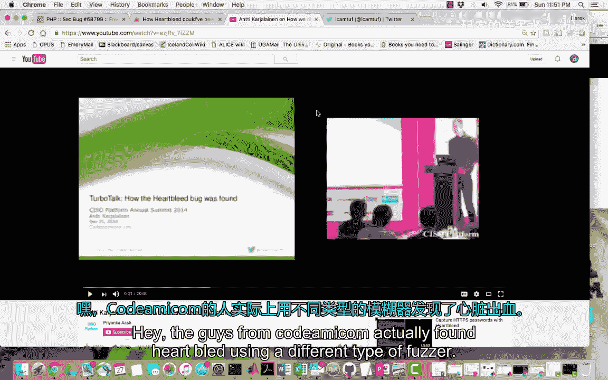
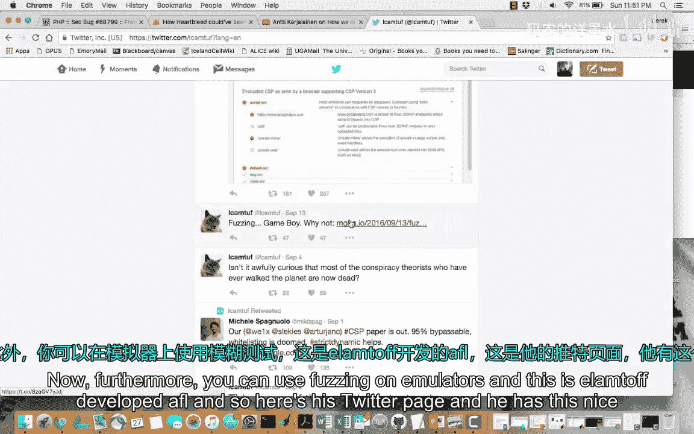
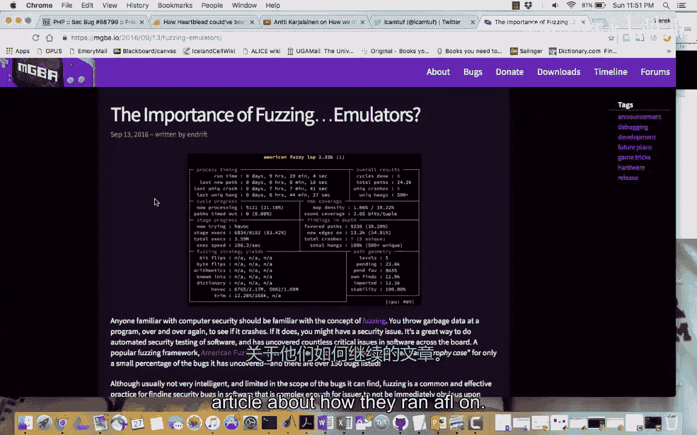
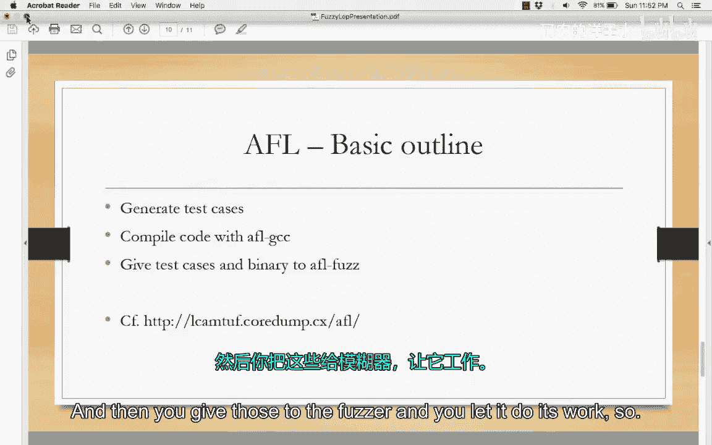
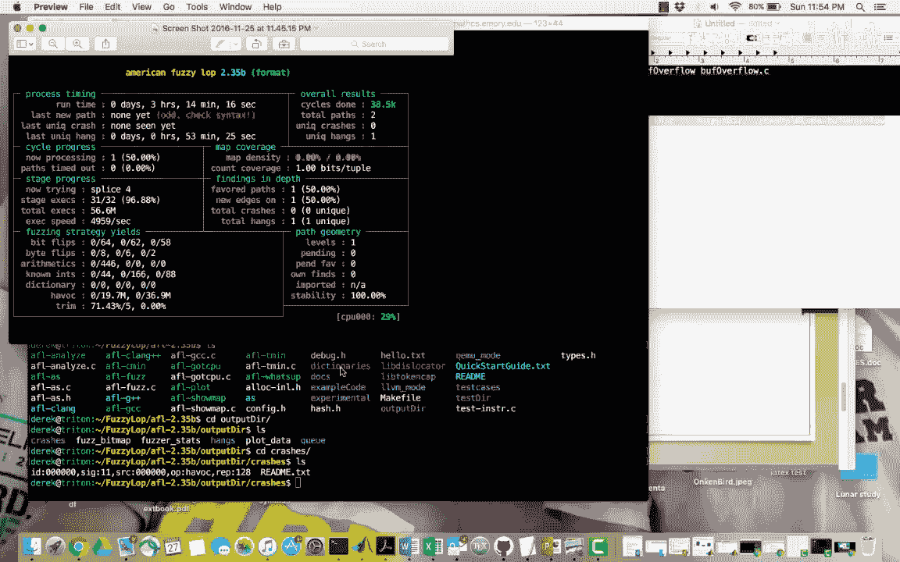

# 022：使用American Fuzzy Lop进行模糊测试 🐇

在本节课中，我们将要学习模糊测试的基本概念，并重点介绍如何使用一个名为American Fuzzy Lop（AFL）的强大工具来发现软件中的漏洞。

## 什么是模糊测试？

模糊测试是一种自动化的黑盒测试技术，用于检测代码中的漏洞。其核心思想是，在你开发了源代码之后，为了确保其健壮性，可以通过向程序注入大量畸形数据的方式进行攻击测试。这通常以某种自动化的方式完成。

这是一种随机化测试，它使用无效、意外或随机的数据来改变计算机程序的输入，以期引发程序崩溃或断言失败。从技术上讲，你当然希望程序没有崩溃，因为这表明你的程序足够健壮。但为了证明模糊测试正在工作，你会希望看到这些崩溃，并找出是哪些输入信号导致了这些崩溃。

## 模糊测试的起源

模糊测试的创始人可以说是威斯康星大学的米勒教授。他表示，其最初的工作灵感来源于在一次暴风雨中通过调制解调器登录时遇到的大量线路噪声。这些线路噪声产生了看似会导致程序崩溃的垃圾字符，这种“噪声”启发他提出了“模糊测试”这个术语。

他利用这个想法，为他的Unix程序编写了基本的命令行模糊测试工具。现在，你同样可以编写简单的模糊测试工具，例如，只需将 `/dev/random` 的输出通过管道传递给目标函数，观察会发生什么。

## 模糊测试能发现什么？

模糊测试器可以发现大多数类型的错误，其中最常见的是内存泄漏和断言失败。它有不同的攻击方法：

以下是几种主要的模糊测试类型：

*   **应用程序攻击**：对于桌面程序，这通常指攻击其I/O接口，如用户界面、命令行或导入/导出功能。对于Web程序，则可能是URL、表单、RPC请求或任何用户生成的内容。
*   **协议攻击**：更多地涉及发送伪造的数据包，尝试进行某种代理模糊测试。
*   **文件格式攻击**：创建畸形的文件样本，然后让程序打开并解析，期望引发崩溃。当然，如果测试的是你自己的程序，你并不希望它崩溃。你可以攻击文件格式的约束、结构、惯例、字段大小、标志位等。

## American Fuzzy Lop（AFL）简介

AFL有一个“战利品陈列柜”，展示了它发现的许多漏洞。例如，这里有一个它发现的漏洞，程序收到了段错误信号。

## 智能与“笨”模糊测试

模糊测试有“智能”和“笨”之分。智能模糊测试主要依赖于某种模板或背景知识。例如，如果一个程序的输入需要某个姓名字段，你会知道所需的长度，并确保所有测试用例都符合该规范，这就是智能模糊测试。

在“笨”模糊测试中，你只是发送随机数据。在这个分类下，还有不同的具体类型：

以下是几种模糊测试策略：

*   **变异测试**：主要适用于“笨”模糊测试，你只是不断地对输入进行随机变异。
*   **回放测试**：保存你输入的内容，然后进行微小的变异，一个接一个地尝试。
*   **代理测试**：也是一种变异测试，被称为“中间人”攻击。其基本思想是位于客户端和服务器之间，这对于网络程序非常有效。你拦截请求，可能进行变异，然后转发出去。
*   **生成测试**：基于生成的模糊测试器是从头开始生成测试用例，而不是从现有测试用例进行变异。
*   **进化测试**：这是一种非常先进的技术，允许模糊测试器从每个测试用例中获得反馈，并对输入格式进行机器学习。

## 模糊测试的成功案例

模糊测试在发现“心脏滴血”漏洞中起到了很大作用。Codenomicon公司实际上就是使用了模糊测试器发现了这个漏洞。有研究人员在其博客中展示了如何应用AFL来发现心脏滴血攻击。经过一天11小时的运行，他发现了四个独特的崩溃案例。他指出，原本可以使用这个模糊测试器来发现心脏滴血漏洞。而下面也显示，Codenomicon的人确实使用了另一种模糊测试器发现了心脏滴血。

此外，模糊测试还可以用在模拟器上。例如，Elcomsoft公司的研究员开发了AFL，并在其文章中介绍了他们如何在Visual Boy Advance模拟器上运行AFL，发现了一个栈缓冲区溢出漏洞，并在这个YouTube视频中演示了如何利用它。

## 如何使用AFL进行模糊测试

上一节我们了解了模糊测试的威力，本节中我们来看看如何使用AFL工具进行实际操作。

使用AFL的流程通常如下：首先，生成初始测试用例。然后，使用AFL包含的GCC编译器来编译你的源代码。接着，将这些测试用例和编译好的程序交给模糊测试器，让它开始工作。

以下是使用AFL的基本步骤：

1.  **准备测试环境与代码**：确保你有一个可以测试的程序。例如，这里有一段简单的缓冲区溢出代码。
2.  **编译目标程序**：使用AFL提供的GCC编译器（`afl-gcc`）来编译你的源代码。编译器可能会警告某些函数（如`gets`）不安全，但这正是我们要测试的。
3.  **准备初始测试用例**：创建一个目录，里面放一些初始的测试文件。例如，一个文本文件写着“hello”，另一个包含一些格式字符串攻击的文本。
4.  **运行AFL**：使用`afl-fuzz`命令启动模糊测试，指定输入测试用例目录、输出目录以及要测试的二进制程序路径。
5.  **分析结果**：AFL运行后，会将发现的崩溃、超时等用例保存在输出目录中。你可以查看这些文件来分析导致程序异常的具体输入。

例如，在一个简单的缓冲区溢出程序上，AFL几乎立即发现了一个导致段错误的独特崩溃用例。它使用了“Havoc”（ havoc，混乱）和“Splice”（ splice，拼接，即组合两次havoc攻击）等策略进行测试。在输出目录的`crashes`文件夹中，可以找到导致崩溃的输入文件。

同样，在一个早期的格式字符串漏洞实验程序上运行AFL，经过几个小时后，它发现了一个独特的程序挂起案例。

## 总结

本节课中，我们一起学习了模糊测试的核心概念。我们了解到模糊测试是一种通过注入随机或畸形数据来自动化测试程序健壮性的方法。我们重点介绍了American Fuzzy Lop（AFL）这一强大工具，它通过智能的遗传算法来高效地发现内存破坏类漏洞。从“心脏滴血”这样的重大安全漏洞到模拟器中的缺陷，AFL都证明了其价值。最后，我们通过一个简单的示例， walkthrough了使用AFL进行模糊测试的基本步骤：准备代码、使用`afl-gcc`编译、提供初始测试用例、运行`afl-fuzz`并分析结果。掌握模糊测试是安全研究人员和开发人员构建更安全软件的重要技能。