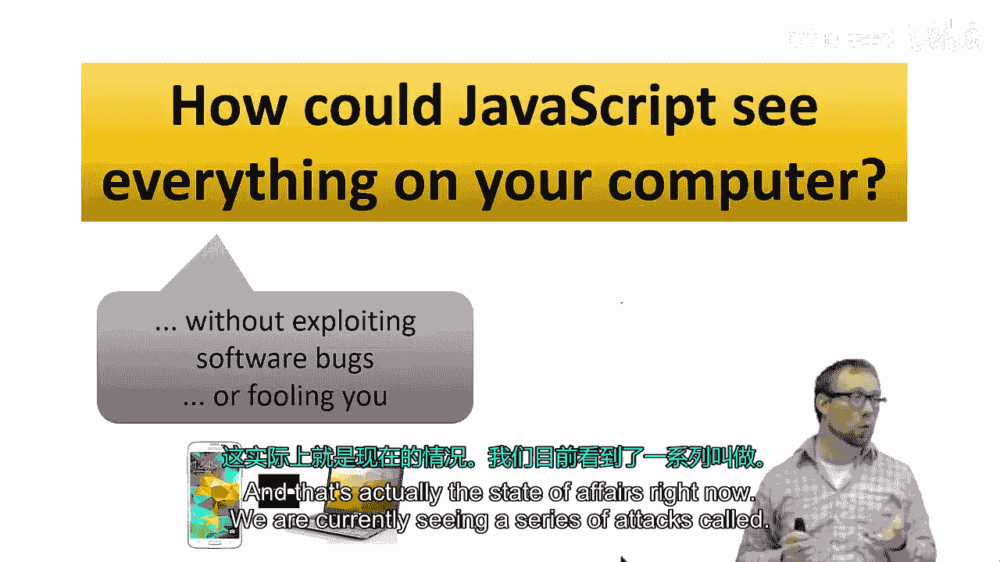
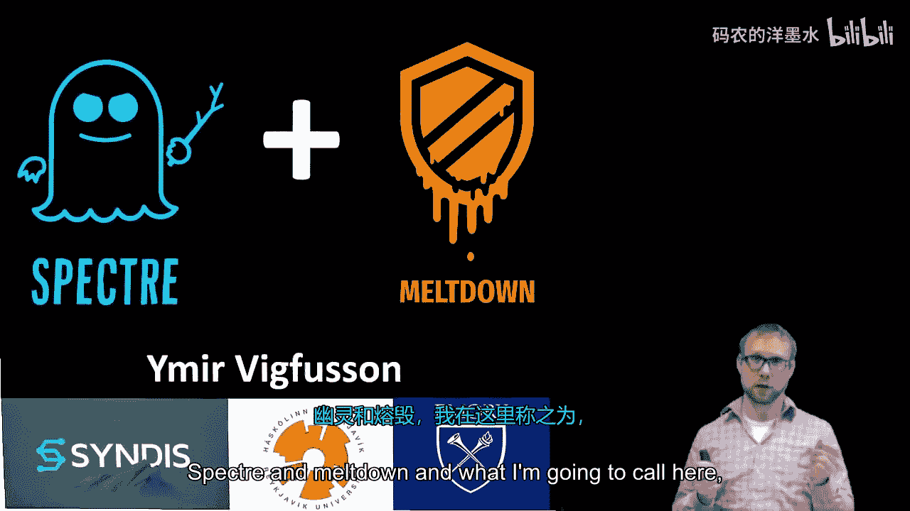
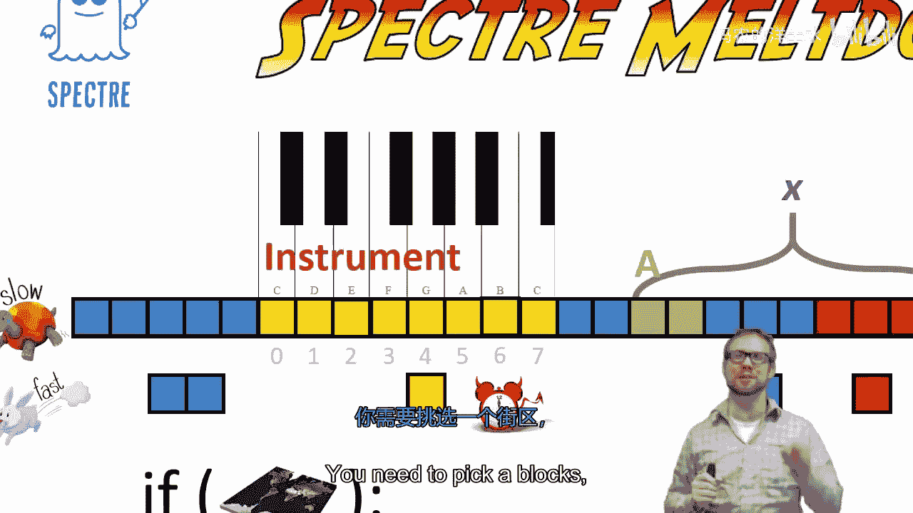
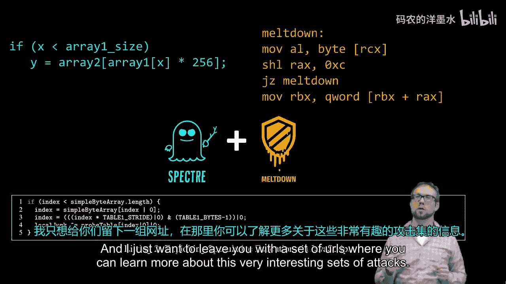

# 023：幽灵(Spectre)与熔毁(Meltdown)攻击通俗讲解 🧠💥

在本节课中，我们将要学习两种影响深远的硬件安全漏洞：幽灵(Spectre)与熔毁(Meltdown)攻击。我们将了解它们如何利用现代CPU的设计特性，绕过操作系统的内存隔离保护，从而可能窃取敏感信息。





---

## 概述：问题的严重性

设想一下，如果一段JavaScript代码能够读取您计算机上的任何信息，例如浏览器的一个标签页可以访问您的所有密码或窥探其他程序的运行状态，这将是极其危险的。这里的“计算机”泛指包括智能手机在内的任何计算设备。

更令人担忧的是，如果这种攻击无需利用任何软件漏洞，也无需诱骗用户执行任何操作就能实现。这正是我们当前面临的现实情况。目前出现了一系列被称为“幽灵”(Spectre)和“熔毁”(Meltdown)的攻击，我将它们统称为“幽灵熔毁”攻击。我的目标是向更广泛的受众解释这些漏洞的核心原理。

我是Ima Recoan，埃默里大学的计算机科学助理教授。在开始之前，我想向发现这些漏洞的研究团队致敬。他们是各自独立、同时发现这些漏洞的，并在技术细节的撰写上做了出色的工作，我鼓励大家去查阅他们的论文。

为了理解这些攻击，我们需要了解三个核心概念。首先，我们需要理解内存的工作原理。其次，需要理解CPU的**推测执行**机制。第三，是一种被称为**侧信道攻击**的技术。幽灵和熔毁攻击正是这些新型攻击与同样令人担忧的硬件错误相结合的产物，这是我们未来需要警惕的交叉领域。

---

## 第一部分：计算机如何工作？💻

让我们从一个非常宏观、简化的视角来看计算机。计算机本质上是由一系列相互连接的组件构成的。这些组件包括用于输入/输出的设备，如显示器、键盘和鼠标；中间是负责所有处理的**中央处理器(CPU)**；最后是**内存**，我将硬盘或固态硬盘也视为内存的一部分。

当您在计算机上执行操作时，基本流程是：从磁盘加载程序，由CPU执行，CPU进行一系列涉及内存的读写计算，最后可能产生输出到显示器或通过网络发送。这就是现代计算机执行程序的基本过程。

---

## 第二部分：深入内存与缓存

让我们聚焦于CPU和内存。内存中存储着您当前运行的所有程序的内容，包括程序本身、程序相关的数据、操作系统（如Linux、Windows或Mac）的数据以及用户数据。内存是所有这些东西的混合体，同时也用于存储CPU的中间计算结果。

更详细地看内存：我们可以将内存想象成一长串可以打开的盒子，每个盒子包含一个比特的信息。实际上，内存有多个层级。这里我画的是**主内存(RAM)**，它容量大但速度慢，CPU从中获取数据需要等待一段时间。因此，我们还有几层更快的**缓存(Cache)内存**。

假设我想打开其中一个盒子（比如这个橙色的），从主内存获取会很慢。但如果我尝试打开另一个盒子，我可以先询问非常快的缓存内存，而缓存里恰好有我需要数据的副本。缓存的工作原理是：当你检索某些数据时，通常会复制一份放入缓存，这样下次你可能需要时，就能快速获取。但缓存容量小且昂贵，所以当新数据进入时，必须将一些旧数据“踢出去”。

---

## 第三部分：什么是侧信道攻击？🎯

让我用一个例子来说明。假设你要求计算机进行身份验证，而计算机知道一个特定的密码（比如“Hunter2”）。这在一些路由器上确实发生过，这是一种被称为**定时攻击**的侧信道攻击。

你可能会开始猜测密码。你猜“A”，计算机运行检查，发现第一个字符“A”与密码的第一个字符“H”不匹配，于是返回“错误”。你猜“B”，同样不匹配。当然，你可以尝试指数级数量的可能性，但这会非常困难，这也是密码通常安全的原因。

然而，在这种特定攻击中，你继续猜测。当你猜到“H”时，你可能会注意到计算机的响应时间稍微长了一点。这是因为计算机检查了字母“H”，发现匹配，然后不得不继续检查后续字母，发现不匹配（因为你只猜了一个字母，而密码更长）。仅仅通过观察**时间信息**这个侧信道，你就能相当确信第一个字符是“H”。然后你可以继续猜测“HA”，发现响应时间和最初一样快，再猜“HB”，以此类推。

这使得破解密码的复杂度从指数级降低到了线性级，这是非常糟糕的。这里的侧信道就是**时间信息**，你利用了密码验证算法物理实现上的一个特性——时间差异。

---

## 第四部分：推测执行与漏洞根源 🏃‍♂️💨

当CPU执行一系列指令时，会遇到内存速度慢的问题。CPU速度极快（以千兆赫兹运行），但程序最终需要从内存中获取数据，而内存访问是瓶颈，CPU会花费大量时间等待内存响应。

大约20年前，人们提出了**推测执行**来解决这个问题。意思是：假设你的程序有一个分支（比如一个`if`语句），其条件依赖于某个内存值。结果只有两种可能：从内存获取的值是0，或者不是0。

那么，CPU可以在等待内存响应的同时，先猜测一个最可能的结果（比如是0），并提前执行该分支路径后的指令。如果猜对了，CPU就抢占了先机，可以从指令D之后继续执行，非常高效。如果猜错了（内存值不是0），CPU必须**回滚**它所做的所有更改，因此它必须非常小心，不能改变程序或内部寄存器的状态，以便能够返回到另一个分支路径。

幽灵和熔毁攻击利用的漏洞在于：当CPU因推测错误而中止一个分支时，其状态（特别是**缓存状态**）实际上已经发生了微妙的变化。现在，我们已经具备了在高层解释幽灵和熔毁攻击的所有要素。

---

## 第五部分：攻击原理详解 ⚔️

我们这里有我们的慢速主内存。如前所述，操作系统内核负责将内存分配给不同的应用程序，或者在云环境中分配给不同的虚拟机。这意味着内存中可能相邻的部分被分配给了不同的“受害者”。我现在主要描述幽灵攻击，但熔毁的核心概念是相似的。

这里有一部分我们称之为“受害者内存”，我们想要探查它里面有什么（比如一个我们想要的密码）。正常情况下，操作系统会确保你的程序（包括浏览器中的JavaScript）无法访问别人的内存，进程之间存在隔离。因此，尝试读取右侧的红色内存将是一个非法操作。

我们要做的是利用这里还存在快速缓存的事实。假设我们想读取这里的蓝点，前面有一个快速缓存，保存着内存中部分数据的副本。

我们将实施以下技巧：
1.  我们在这里设置一个数组，称之为`A`。这是我们控制的一小部分内存。
2.  我们不会去读取数组`A`中的那两个元素，而是会**越界访问**，去读取`A[x]`，其中`x`是一个非常大的索引。

通常，当你在CPU上执行此操作时，CPU或操作系统会触发一个错误，并终止该程序，因为它执行了非法操作。但是，我们将通过**推测执行**来触发它。

我们来看这是如何实现的。我还会设置一个称为“乐器”的内存区域。这是另一部分我们特意不让CPU缓存的内存，它全部在慢速内存中。你可以把它想象成一个有不同音符的键盘。

假设我们执行的代码如下：
```c
if (world_is_flat) {
    // 正常情况下，CPU会忽略这个分支，因为它在等待计算 world_is_flat 的结果
    // 但由于推测执行，分支内的指令有可能被提前执行
    access_value = A[x]; // 越界读取！x 来自受害者内存
    play_note(instrument[access_value]); // 根据读取的值访问“乐器”数组
}
```

现在，我们想要探查的受害者内存（蓝点）包含数字4（我们不知道，但想找出它）。当CPU推测性地执行上述代码时，它会想：“好吧，我应该看看`A[x]`。我还不知道它越界了（这是内核的职责，稍后会处理）。作为推测执行引擎，我先看看那里有什么。” 它发现是数字4。

然后，它会去“乐器”数组中查找位置4（或者对应的音符G），并“演奏”它。**攻击的关键部分在于**：这个操作会将“乐器”数组的第4个元素**带入缓存**。

现在，攻击的最后一步是：你遍历“乐器”数组的每一个音符。你“演奏”第0个音符，速度慢；第1个，也慢；但当你“演奏”到第4个音符时，速度会非常快，因为它来自快速缓存。为什么？因为当推测执行发生时，CPU回滚了所有的寄存器状态，但**没有回滚缓存访问**。信息从推测执行中泄漏了出来，并且这种推测跨越了管理边界（如进程隔离）。

因此，你就能发现受害者内存中包含数字4。当然，我们可以扩展这个探测范围（比如256字节甚至更大），因为缓存的实际工作方式更复杂（需要更大的块，这是技术细节）。这就是幽灵和熔毁攻击的核心。

---

## 第六部分：现实影响与演示 🚨

正如我最初提出的问题：如果JavaScript能读取任意内存会怎样？事实证明，你可以在JavaScript中模拟上述一系列指令。这意味着，一个你访问的网站，可能试图读取内核内存的某些部分。这非常糟糕，因为内核内存包含包括密码在内的私人信息。

发现这些漏洞的研究者已经实际演示了如何读取例如存储的密码。这相当可怕。关于此攻击的后果以及如何应对，我将留给其他人去解释。



---

## 总结

在本节课中，我们一起学习了：
1.  **计算机基本架构**：CPU、内存和缓存的分层结构。
2.  **侧信道攻击**：通过时间差等物理实现特性来推断信息，例如定时攻击。
3.  **推测执行**：CPU为了提升性能，预测分支结果并提前执行指令的机制。
4.  **幽灵与熔毁攻击原理**：攻击者利用推测执行机制，通过精心构造的代码，诱使CPU在推测执行时访问受保护的内存数据，并通过侧信道（缓存状态变化）将数据泄露出来，从而绕过系统的内存隔离保护。



这两种攻击揭示了现代处理器性能优化特性中存在的深刻安全挑战，需要硬件、操作系统和软件开发者共同应对。