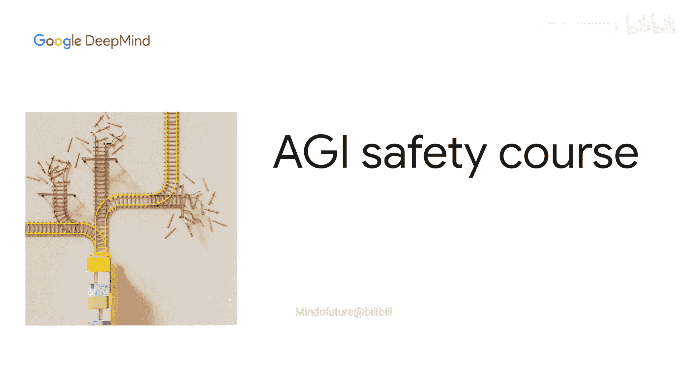
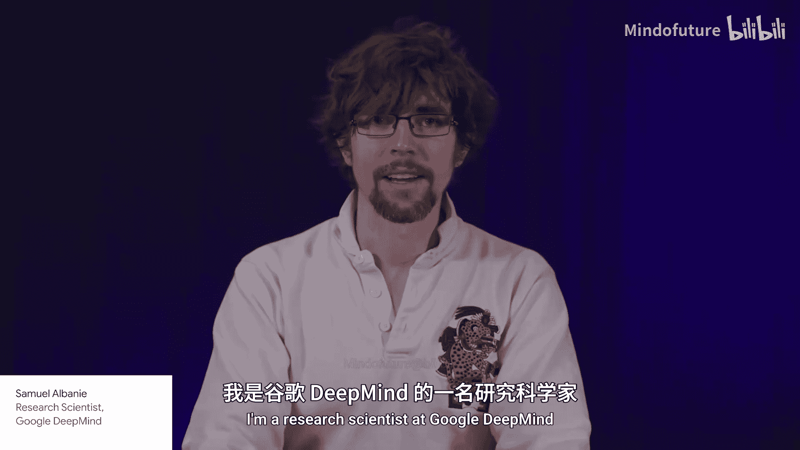
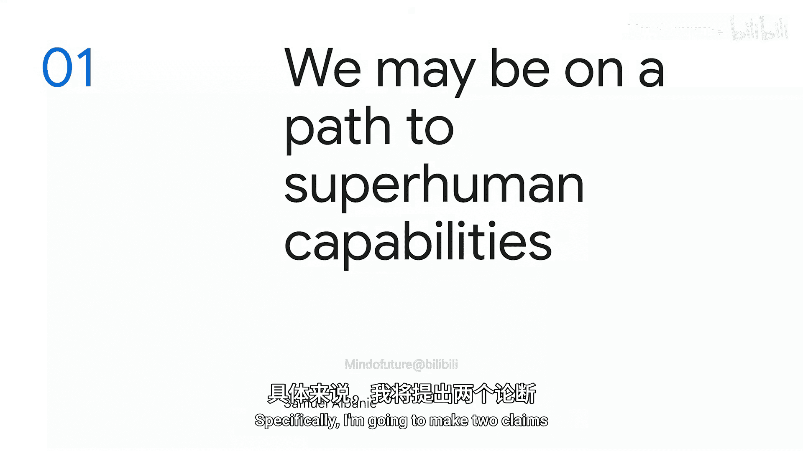
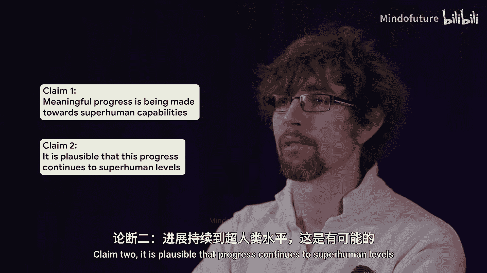
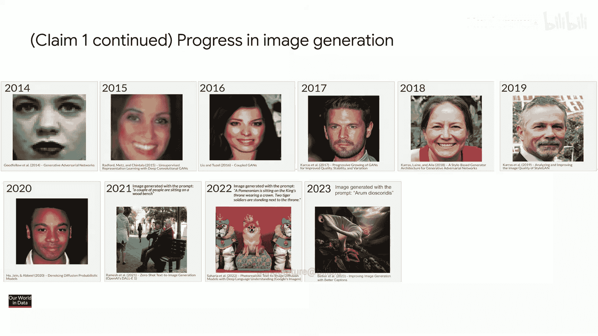
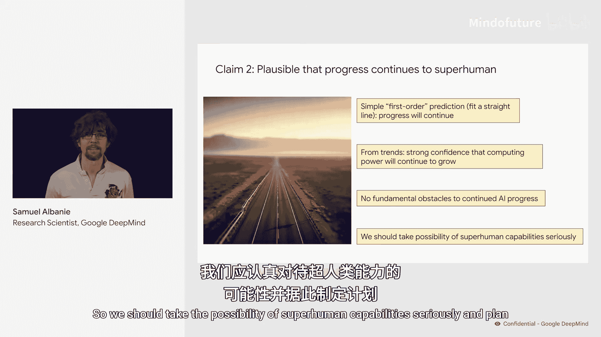

# 002：迈向超人类能力之路 🚀

在本节课中，我们将探讨人工智能领域的发展现状，并分析我们是否正走在通往超人类能力的道路上。我们将通过具体证据来审视两个核心主张，并理解其背后的逻辑。

## 主张一：我们在能力上取得了实质性进展 📈

上一节我们概述了课程目标，本节中我们来看看第一个核心主张：人工智能在多个特定领域正取得有意义的进步。以下是一些关键领域的进展示例：

*   **数学领域**：AI证明模型在国际数学奥林匹克竞赛中获得了银牌，这意味着它在全球顶尖的数学人才库中名列前茅。
*   **软件开发**：AlphaCode 2 在竞争性编程挑战中的表现，从之前超越46%的人类参赛者，提升到了超越87%的人类参赛者。
*   **图像生成**：从2014年生成的简单图像，到2020年难以分辨真伪的人像，再到如今能生成复杂场景的高质量图片，进步显著。例如，由 Imagen 3 生成的图像已难以与照片区分。
*   **视频生成**：通过增加计算量，视频生成质量得到了巨大提升。例如，将计算量增加32倍后，生成的视频内容已相当逼真。这遵循一个常见模式：`性能提升 ∝ 计算规模扩大`。
*   **语言模型**：从2011年几乎无法连词成句，到2019年能生成简单故事，再到2024年可以分析复杂的科学图表并总结要点，语言理解与生成能力飞速发展。

## 主张二：进步持续到超人类水平是合理的 🤔

既然我们已经看到了持续的、有意义的进步，接下来我们探讨第二个主张：这种进步持续发展到超越人类能力的水平是合理的。

首先，一个简单的线性外推预测表明，基于现有趋势，进步将会持续。其次，计算能力是驱动AI进步的关键因素，而根据现有趋势，我们有充分理由相信计算能力将继续增长。最重要的是，目前我们并未发现阻碍人工智能持续进步的根本性障碍。

因此，综合这些因素，认为进步可能持续到超人类水平是合理的。这意味着我们应该认真对待出现超人类能力的可能性，并据此进行规划和准备。

## 总结与展望 🎯

本节课中，我们一起学习了两个核心观点。我们通过数学、编程、图像与视频生成以及语言模型等领域的实例，论证了人工智能正在取得实质性进展。基于此，我们分析了进步持续到超人类水平的合理性，这主要源于趋势的外推、计算能力的持续增长以及未发现根本性障碍。

综上所述，我们正处在一个能力快速提升的轨道上，认真考虑并规划应对超人类人工智能的出现，是一项审慎而必要的工作。