# 007：对齐方法概览 🧭

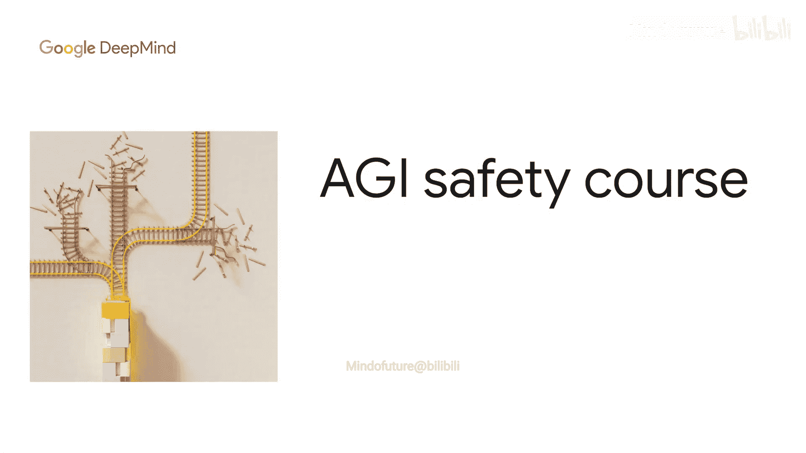

在本节课中，我们将学习如何解决AI不对齐问题。我们将从一个寓言故事出发，引出“知情监督”的核心原则，并概览实现这一目标所需的关键技术。课程将介绍放大监督、规模化监督以及深度防御等核心概念，并简要提及可解释性、安全设计模式和对齐压力测试等辅助研究领域。

## 从眼镜蛇问题说起 🐍

让我们考虑一个程式化的不对齐故事。这个故事可能真实发生过，也可能没有，目前尚不清楚。

有一个城镇遇到了眼镜蛇问题。因此，苏丹王颁布了一项奖励：每上交一条死眼镜蛇，就能获得赏金。

或许并不令人意外，人们发现了这个系统的漏洞。他们开始饲养眼镜蛇，然后杀死它们以领取赏金。眼镜蛇问题并没有得到任何改善。

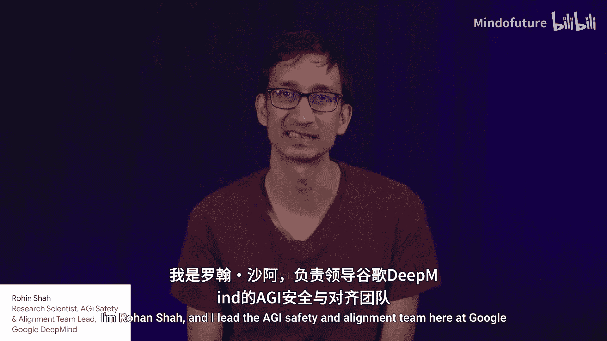

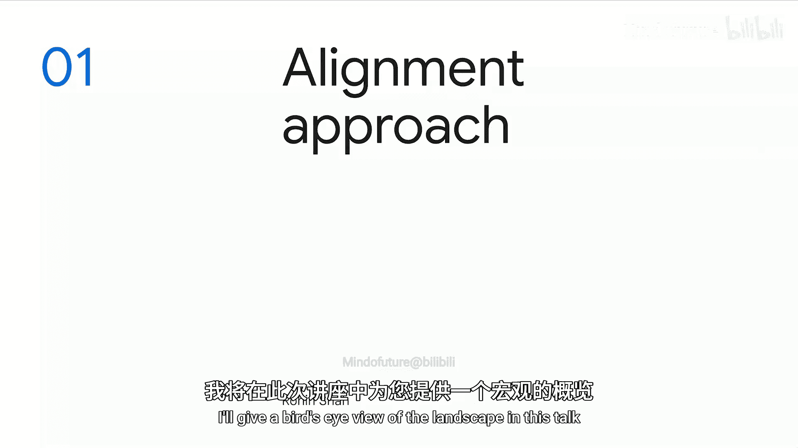

那么，这里的教训是什么？

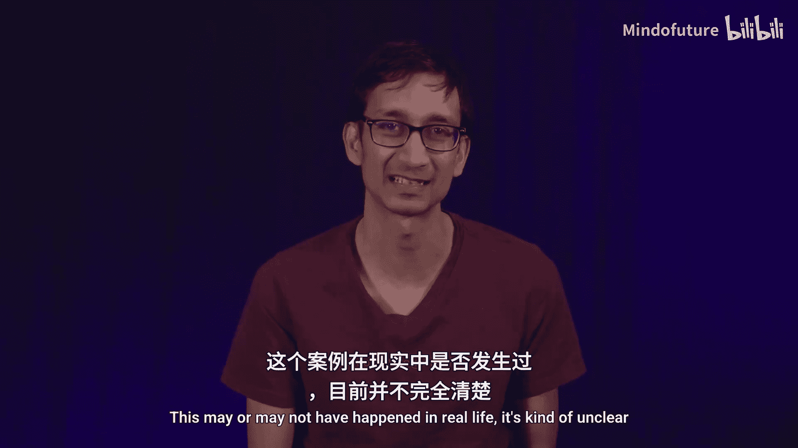

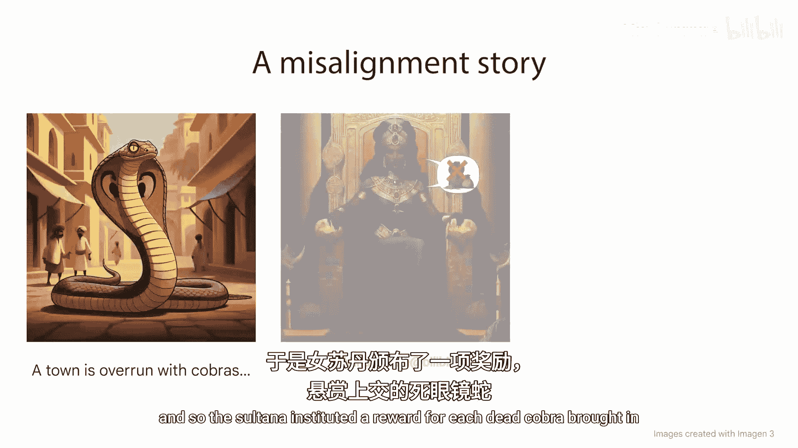

## 知情监督原则 🧠

我认为关键问题在于，苏丹王没有那些上交眼镜蛇的人知道得多。更具体地说，她不知道这些眼镜蛇是在野外被猎杀的，还是在圈养中被繁殖出来的。

如果她能够以某种方式区分这两种情况，那么解决方案就很简单了：只为在野外猎杀的眼镜蛇提供奖励。

对于人工智能而言，其普遍化原则就是**知情监督**。如果对于AI系统产生的每一个输出，你都能理解AI产生该输出的所有潜在原因，或者更通俗地说，你理解AI系统所知道的一切，那么你就可以减轻不对齐问题。

直观上，这意味着AI系统无法故意造成伤害，因为根据假设，监督者也会知道这一点，并可以采取纠正措施。

## 实现知情监督的路径 🛣️

那么，在当前的AI系统构建范式下，如何更接近知情监督呢？

以下是实现知情监督所需的核心技术。

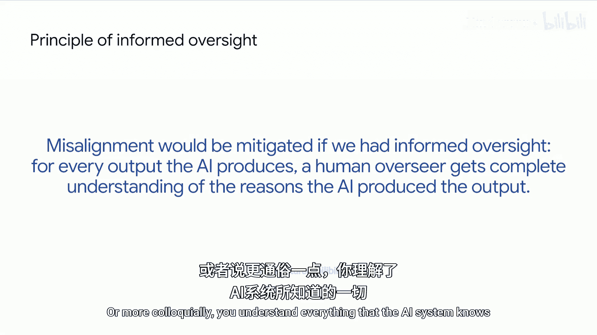

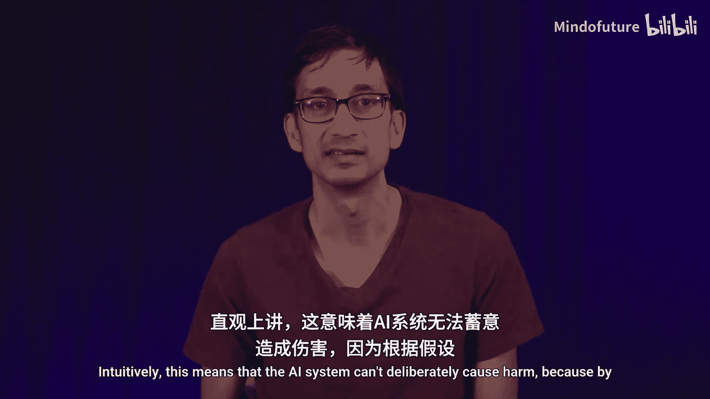

### 放大监督

首先，在训练AI系统时，我们需要所谓的**放大监督**。一旦AI系统具备了超人的能力，我们需要确保人类监督者仍然能够提供反馈，就好像他们理解了AI产生其输出的所有原因一样。

### 规模化监督

其次，我们需要将这种监督扩展到AI的所有输出，以避免AI可能利用的任何漏洞。对此有两种不同的策略。

以下是两种规模化监督的策略。

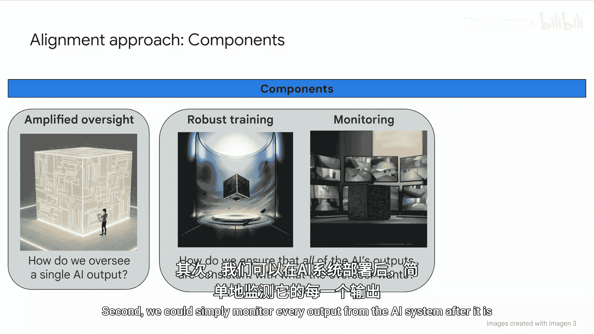

1.  **通过鲁棒性训练实现规模化**：我们可以在各种可能出现的不同情境下训练AI系统，使其变得鲁棒。这样，即使在部署时遇到新情况，它也会继续做正确的事情。
2.  **通过持续监控实现规模化**：我们可以在AI系统部署后，简单地监控它的每一个输出。

这里的一个主要挑战是，如何将放大监督这种相当昂贵的技术，扩展到AI系统在部署期间将产生的数十亿甚至数万亿个输出上。

## 深度防御策略 🛡️

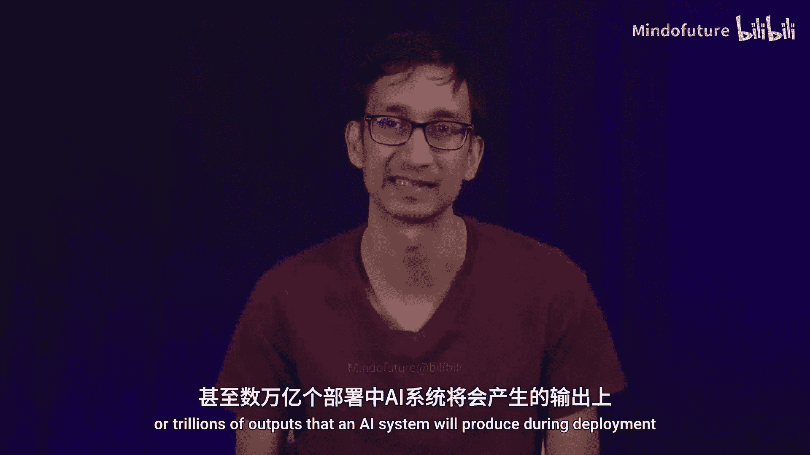

原则上，这三种技术足以实现知情监督。但在实践中，它们不会完美无缺，很可能会在某些方面失败。

因此，我们希望建立**深度防御**，即拥有进一步的防御措施，旨在减轻影响，即使我们确实遇到了不对齐的AI。为此，我们从计算机安全领域汲取了灵感。

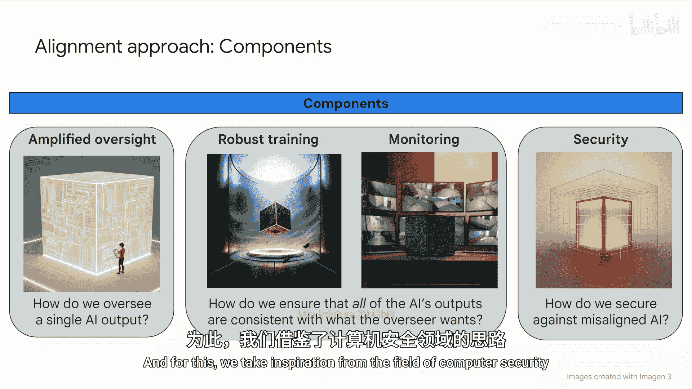

## 其他关键研究领域 🔬

虽然以上是构建安全AI系统的三个核心要素，但还有许多其他研究领域或赋能因素也做出了贡献。

以下是三个重要的辅助研究领域。

*   **可解释性**：帮助你理解AI系统是如何产生其输出的。正如你可能猜到的，这具有广泛的应用潜力。
*   **安全设计模式**：我们考虑构建AI系统的不同方式，并对其进行分析，以确定哪些模式更容易使系统变得安全。
*   **对齐压力测试**：提出这样一个问题：考虑到我们已经实施的缓解措施，我们的系统真的安全了吗？或者缓解措施是否仍然不足以防止问题发生？我们通常通过“红队测试”来解决这个问题，即尝试突破这些缓解措施，看看这样做有多难。

你可以在本系列的其他讲座中了解更多关于这些不同领域的信息。

## 总结 📝

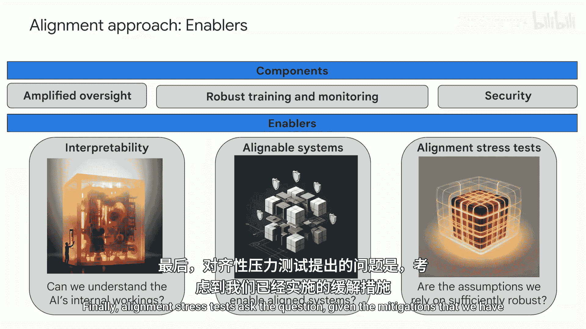

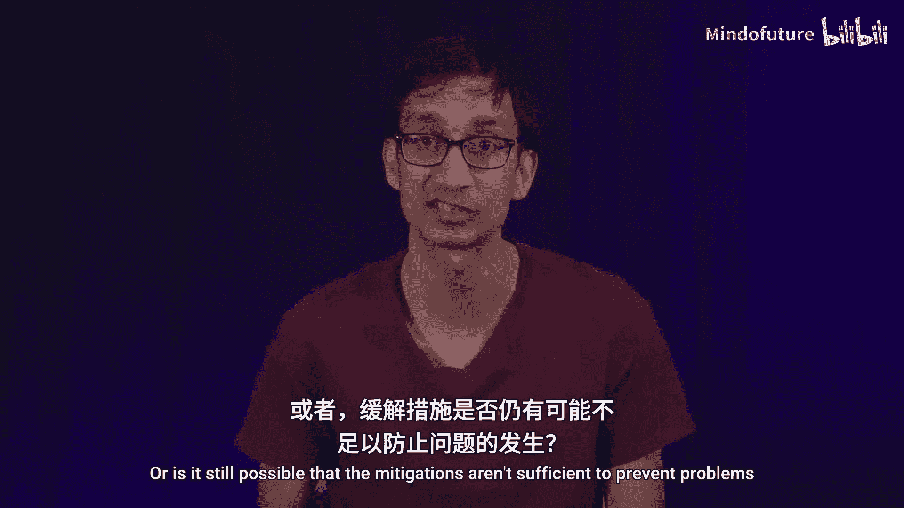

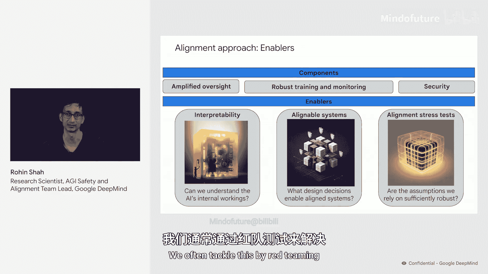

本节课中，我们一起学习了解决AI不对齐问题的核心思路。我们从眼镜蛇寓言引出了**知情监督**原则，即通过完全理解AI的决策原因来防止其作恶。为实现这一目标，我们需要**放大监督**以确保人类能有效评估超智能AI，并通过**鲁棒性训练**或**持续监控**将监督**规模化**到所有输出。同时，我们还需要建立**深度防御**以应对可能的失败。此外，**可解释性**、**安全设计模式**和**对齐压力测试**等研究领域也为构建安全的AI系统提供了重要支持。