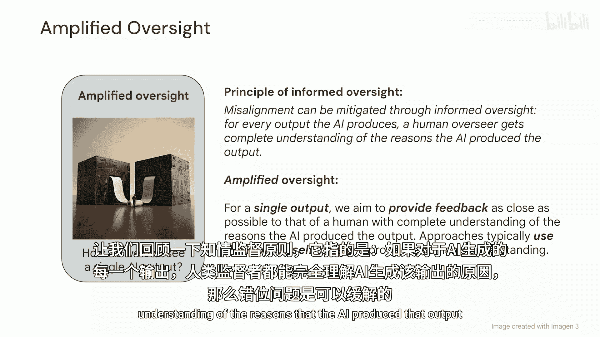
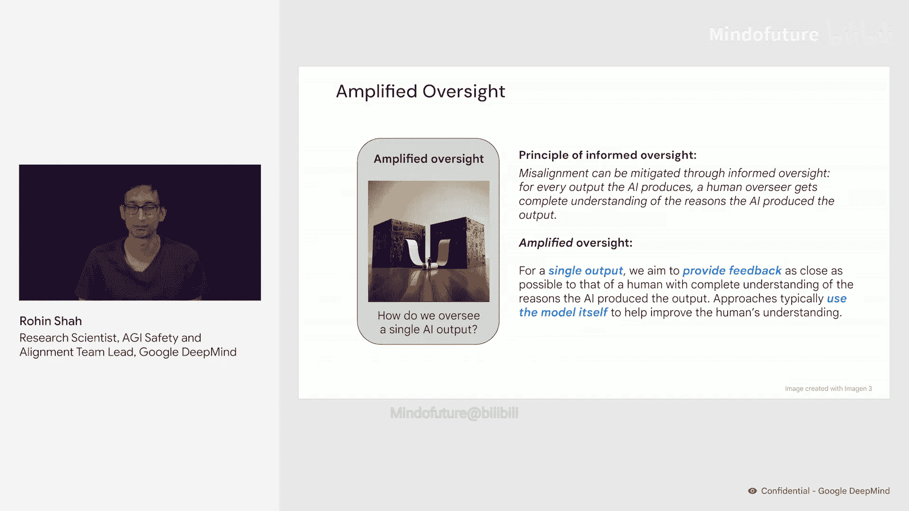
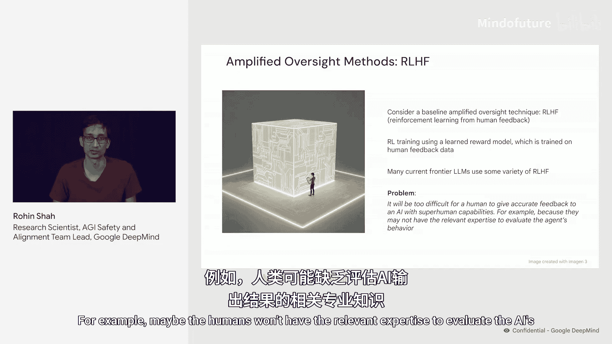
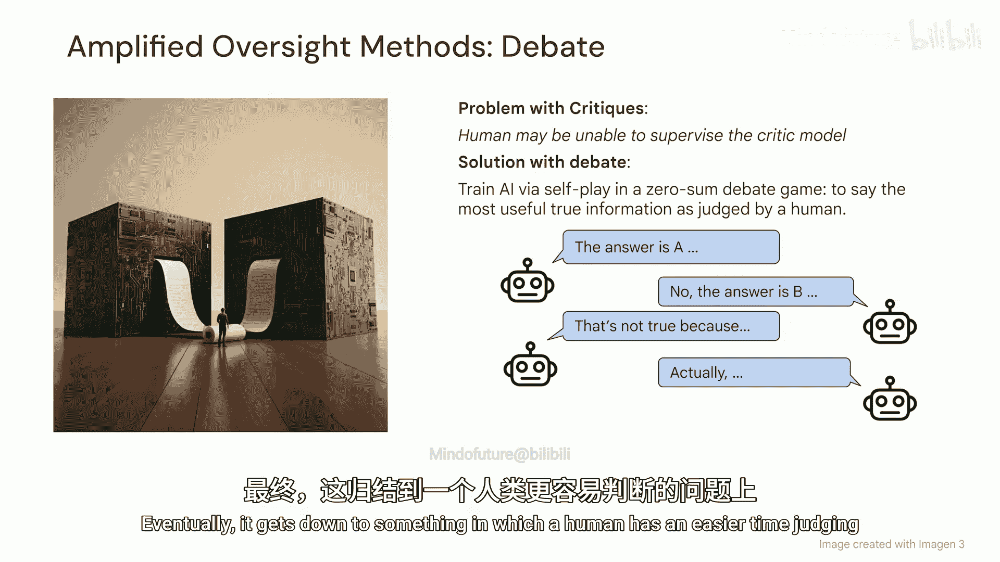
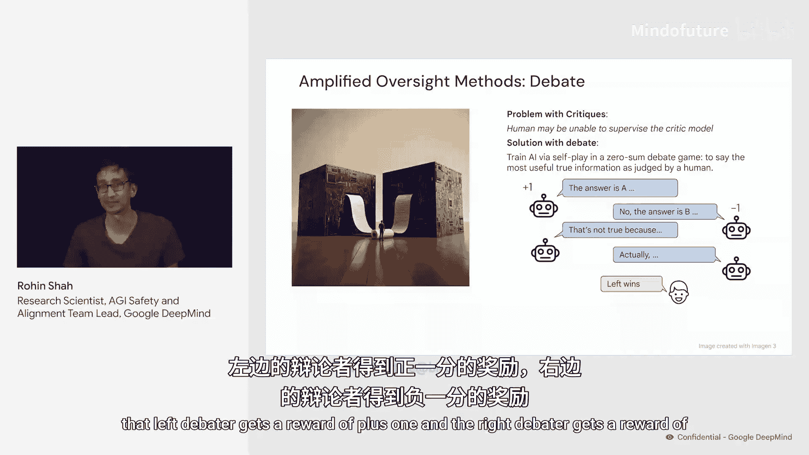
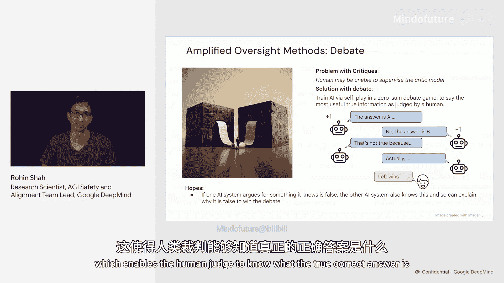
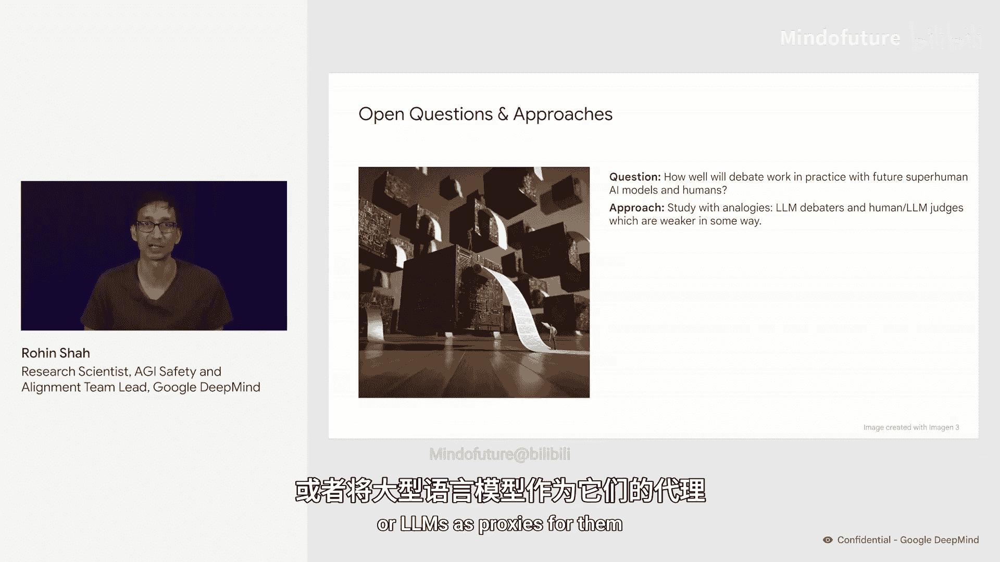
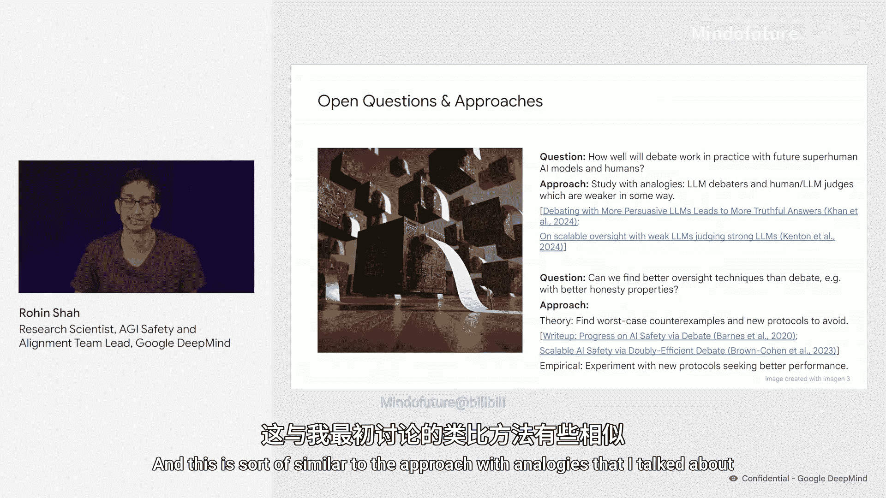
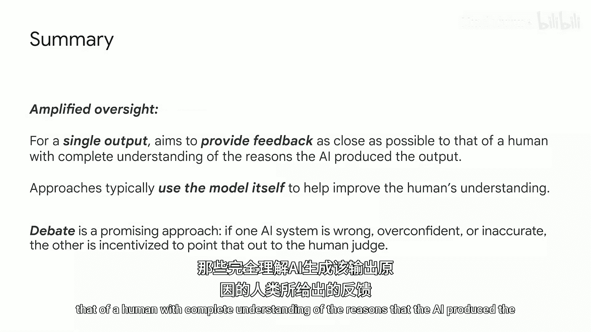
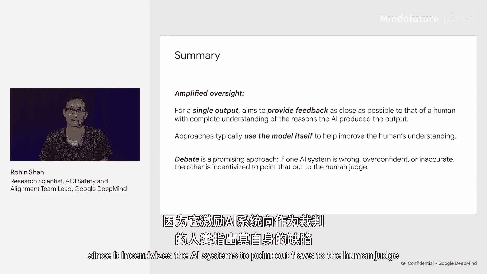

# 008：强化监督（第二部分）


在本节课中，我们将深入探讨“强化监督”这一概念。强化监督致力于解决一个核心问题：我们如何监督单个AI模型的输出？我们将从基础概念出发，逐步介绍其背后的原理、现有方法的局限性以及未来的研究方向。

## 概述：知情监督原则

首先，让我们回顾“知情监督”原则。该原则指出，如果AI产生的每一个输出，人类监督者都能完全理解AI产生该输出的原因，那么错位问题就能得到缓解。

强化监督是实现知情监督的途径之一。其基本思路是，我们试图解决一个比“完全知情监督”更简单的问题。具体来说，我们允许自己使用一些成本高昂、仅适用于监督少量输出的技术。




这引出了强化监督的定义：**对于单个输出，我们的目标是提供尽可能接近“完全理解AI输出原因的人类”所能给出的反馈**。

强化监督的方法通常利用模型本身来帮助提升人类的理解能力，即让模型“放大”人类的监督能力，这也是其名称的由来。

## 基线方法：基于人类反馈的强化学习

上一节我们介绍了强化监督的目标，本节中我们来看看一个基线方法——基于人类反馈的强化学习。




在RHF中，流程通常分为两步：
1.  首先，在人类反馈数据上训练一个奖励模型。
2.  然后，使用该奖励模型生成的奖励，通过强化学习来训练最终的AI系统。





许多当前的前沿大语言模型都使用了某种形式的RHF，并且目前效果很好。

然而，我们预计随着AI能力不断增强，未来会出现问题。在某个时刻，人类将难以对能力极强的AI系统给出准确的反馈。例如，人类可能不具备评估AI输出所需的相关专业知识。

一旦到达那个阶段，AI很可能开始产生那些对人类“看起来”很好，但实际上并不好的输出。

## 进阶方法：批评与辩论


基于RHF中“人类难以给出准确反馈”的问题，一个可能的解决方案是引入“批评”机制。

在批评方法中，我们训练一个批评模型来批评原始模型的回答。训练方式可以是让批评模型模仿人类演示的批评，或者对批评模型产生的批评使用RHF进行人类评估。

一旦我们有了训练好的批评模型，就可以将其提供给正在对原始AI系统进行反馈的人类。这可以帮助人类给出比原本更好的反馈。

但即使采用了批评方法，如果AI系统足够强大，更多问题仍可能出现。具体来说，人类可能也无法监督批评模型。判断一段批评是否驳斥了原始回答的核心观点，或者是否存在对批评的反驳使得原始答案再次显得正确，这可能非常困难。

因此，自然的解决方案是进行多轮批评，这就是“辩论”。







在辩论中，我们通过在一个零和辩论游戏中进行自我对弈来训练一个AI系统。在辩论结束时，由人类判断哪位辩手提供了最真实、最有用的信息，并据此提供奖励。



例如，第一位辩手可能声称用户问题的答案是A，对手辩手则可能说答案是B并给出一些理由。然后第一位辩手回应并反驳。如此反复，直到辩论深入到人类更容易判断的层面，此时人类可以裁定左边辩手获胜。获胜方获得+1奖励，失败方获得-1奖励。

以下是辩论方法所关联的一些关键期望：
*   由于我们进行自我对弈训练，两位辩手是同一AI系统的副本。因此，如果一个AI系统为其明知错误的事情辩护，那么另一个AI系统也应该知道那是错误的，并可以解释原因。
*   辩手有动机找出论证的关键点。这自然会将复杂问题分解为更简单的部分，使人类裁判更容易给出准确的反馈。

## 开放问题与研究展望

尽管辩论是一个有前景的方向，但关于强化监督的研究仍有许多工作要做。




一个问题是，辩论在未来非常强大的AI系统中实际效果如何。一种研究方法是使用类比进行研究。目前我们没有超人的强大AI系统，但可以使用大语言模型作为代理。例如，让LLM作为辩手，人类或较弱的LLM作为裁判，并尝试在他们之间制造某种不对称性（使裁判在某些方面更弱），然后研究LLM辩手能否从这种较弱的裁判那里被训练出来。


另一个开放问题是，我们能否找到比辩论更好的监督技术，例如具有更好诚实属性的方法？这里有两种研究路径：
1.  **理论研究**：这类工作主要是寻找最坏情况的反例，然后提出新的协议或游戏来避免这些反例。
2.  **实证研究**：对新协议（无论是理论提出的还是我们认为在实践中有效的）进行实验，并寻求更好的性能。这与之前提到的类比研究方法类似。

## 总结

本节课中我们一起学习了“强化监督”这一AGI安全领域的重要方向。

强化监督作为一个研究领域，其目标是为单个AI输出提供尽可能接近“完全理解AI输出原因的人类”所能给出的反馈。其方法通常利用模型本身来提升人类的理解，从而放大人类的监督能力。






辩论是一个有前景的方法示例，因为它激励AI系统向人类裁判指出彼此的缺陷。




---
**核心概念公式/代码表示**：
*   **强化监督目标**：`人类反馈 ≈ 完全知情人类的反馈`
*   **RHF流程**：
    ```python
    # 1. 训练奖励模型
    reward_model = train_on_human_feedback(feedback_data)
    # 2. 使用RL训练最终AI
    ai_system = train_with_rl(reward_model)
    ```
*   **辩论奖励**：`胜者奖励 = +1`， `败者奖励 = -1`