# 009：鲁棒性训练与监控 🛡️

在本节课程中，我们将学习鲁棒性训练与监控。核心目标是：当模型的行为可能有害时，我们希望**要么能识别其危害性，要么对其安全性保持不确定**。我们要避免的是，错误地认为一个实际上有害的行为是安全的。

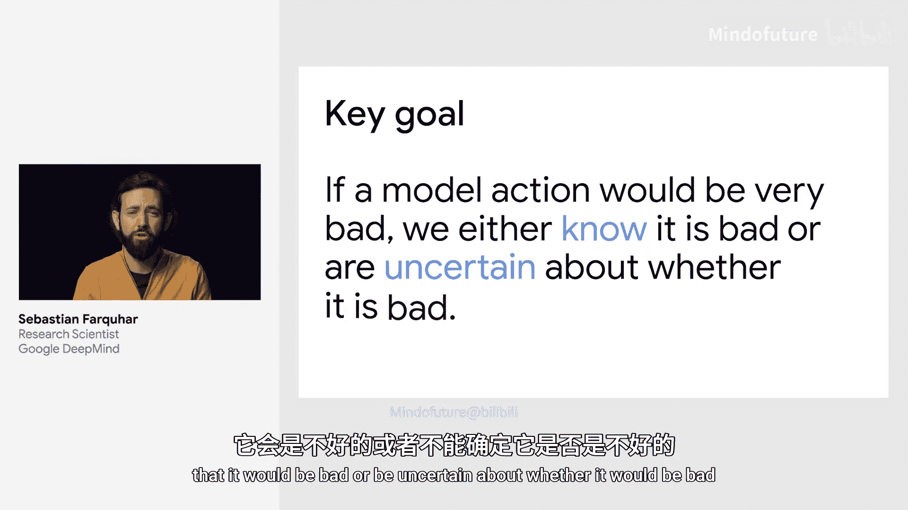

为实现这一目标，监控和鲁棒性训练都至关重要。两者都需要优先关注**有害且后果严重**的行为。

## 监控的核心目标

上一节我们介绍了总体目标，本节中我们来看看监控的具体任务。

监控的目标是评估系统部署后**实际发生的每一个可能的动作、输出或事件**。虽然我们无法评估所有理论上可能发生的情况，但评估实际发生的有限数量事件是可行的。

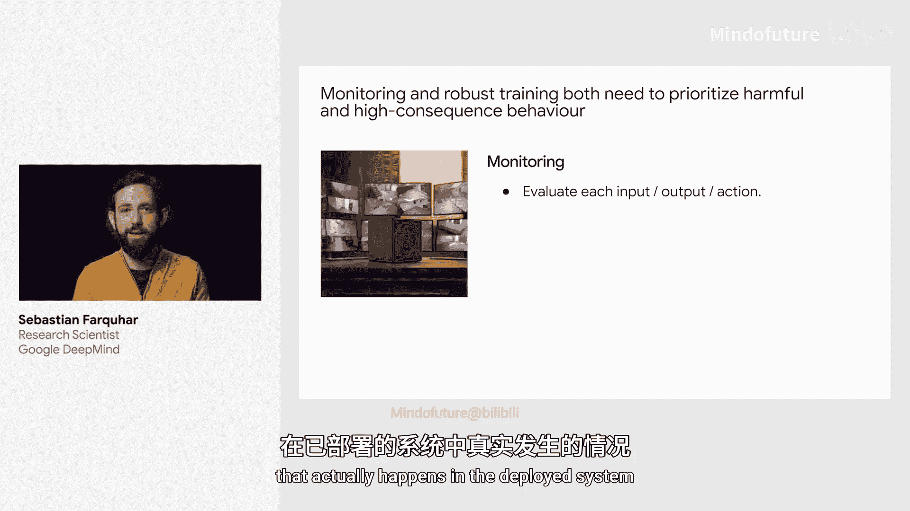

我们需要大量**廉价的启发式方法**来应对大多数情况，因为大多数事件无关紧要。当需要时，我们可以按需部署**更昂贵或更强大的评估方法**。大多数时候，我们只使用非常廉价的扫描来检查模型输出，将资源留给重要情况。

## 鲁棒性训练的核心目标

与监控不同，鲁棒性训练试图覆盖**所有可能的训练数据空间**。我们无法覆盖所有数据，只能基于有限的数据点进行训练，因此需要进行优先级排序。

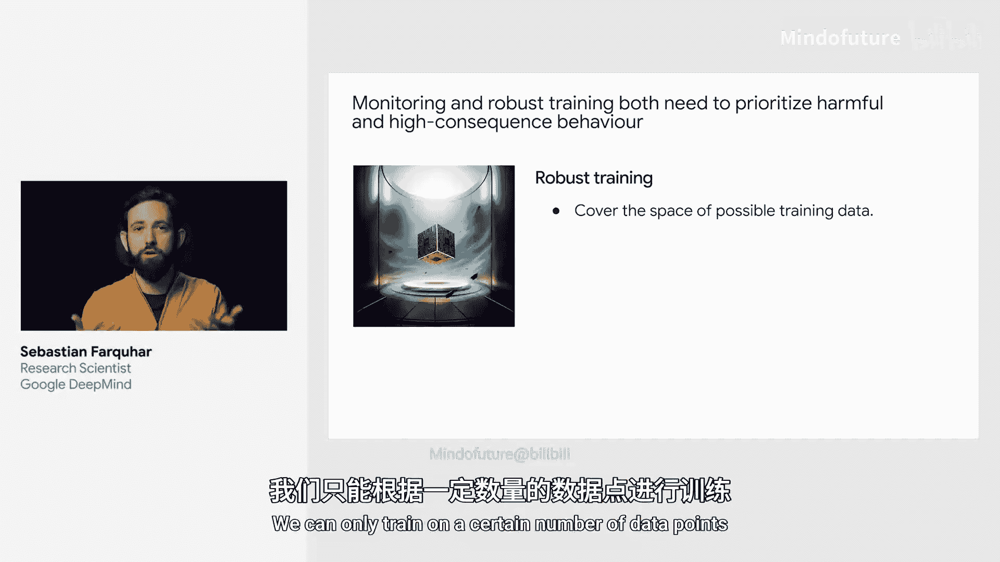

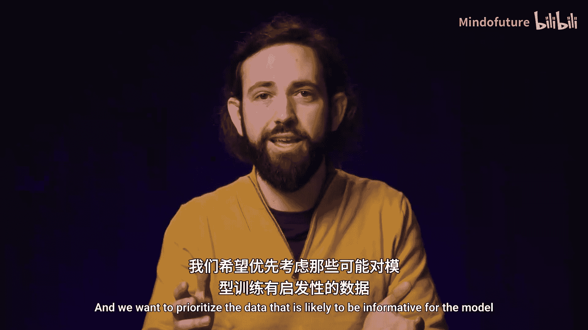

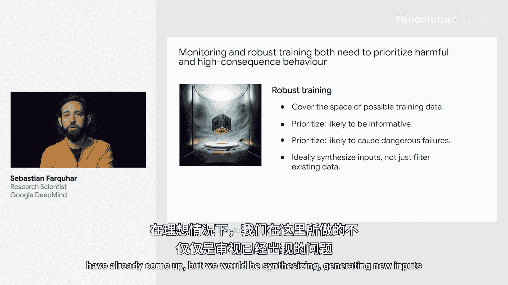

以下是鲁棒性训练需要优先考虑的数据类型：
*   **对模型训练有信息量的数据**：能帮助模型有效学习的数据。
*   **可能导致危险失败的数据**：那些可能实际造成伤害的设定或输入。

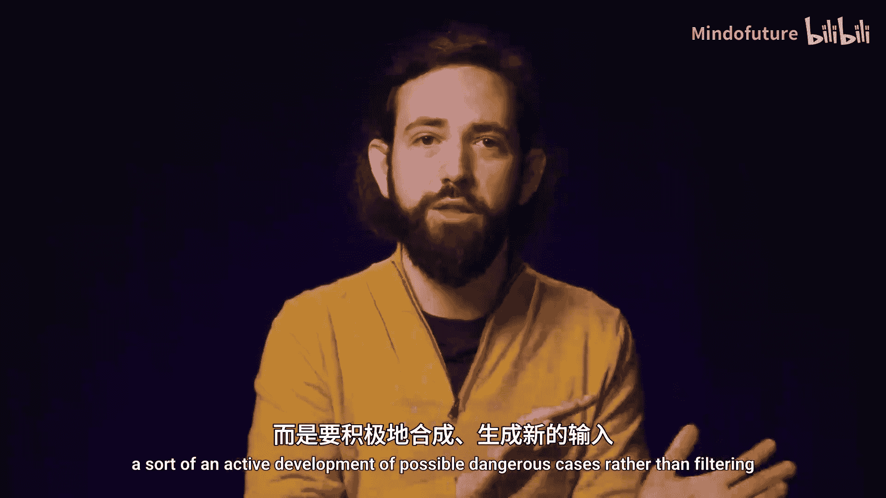

理想情况下，我们不应只关注已出现的数据，而应主动**合成或生成新的输入**，即主动开发可能出现的危险案例，而不是仅仅筛选现有数据。

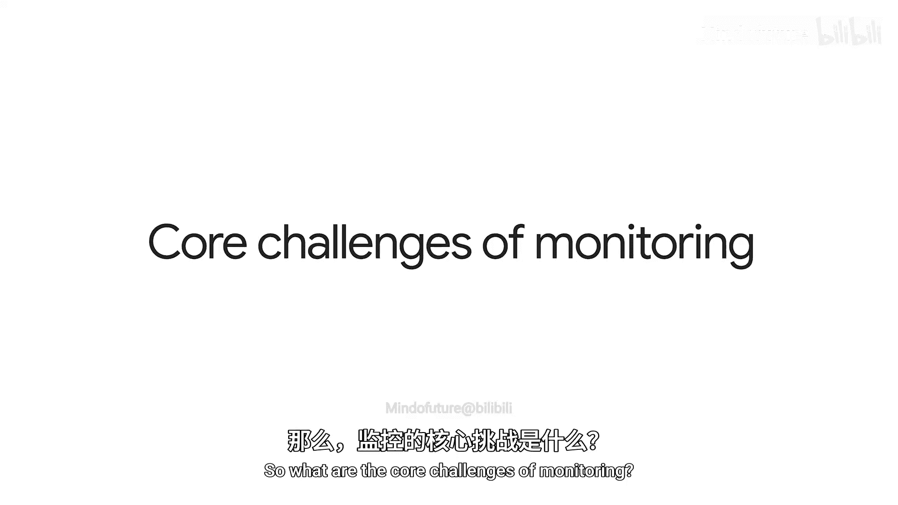

## 监控的核心挑战

监控面临的核心挑战在于，我们需要在庞大的可能输出空间中进行有效评估。我们可以从两个维度来划分这个空间：

1.  **后果是否明显**：行为的后果是显而易见的，还是难以察觉的？
2.  **后果是否重要**：行为的影响是重大的，还是可以忽略的？

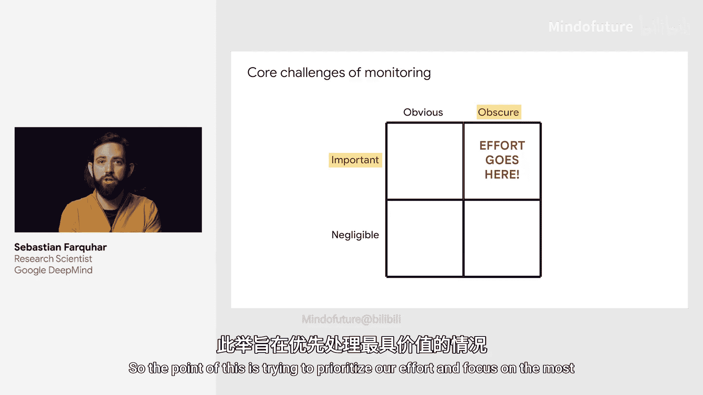

我们希望将监控和评估工作的重点放在**后果重要且难以察觉**的象限。我们不想在无关紧要的行为上浪费精力，也不想在危害显而易见的行为上过度投入。

这里有一个重要前提：我们假设在原则上，只要我们投入足够多的实际努力，就能够识别行为是否有害。但这对于足够先进的AI或足够复杂的情况来说，并非显而易见。我们依赖“放大监督”来提供这种指导（这将在其他讲座中讨论）。

那么，在假设原则上可以做到的前提下，我们如何避免在不重要的决策上浪费精力？又如何避免在显而易见的危害上过度投入？

以下是监控所依赖的研究领域：
*   **不确定性量化**：自动判断我们对“是否存在危害”的置信度。
*   **异常检测**：发现新颖或异常的情况。
*   **分层决策**：特别是在线分层决策和自适应计算，旨在恰当时机投入恰好的计算量，避免在显而易见的决策上过度工作。

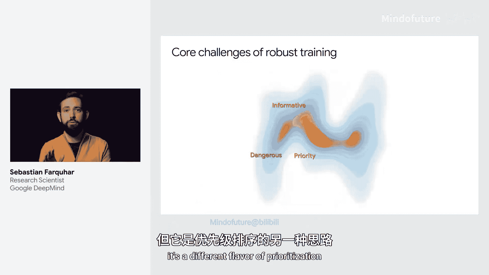

## 鲁棒性训练的挑战

另一方面，鲁棒性训练也需要优先级排序，但侧重点不同。因为其空间要大得多，它涵盖的是**所有可能发生**的事情，而不仅仅是已经发生的事情。

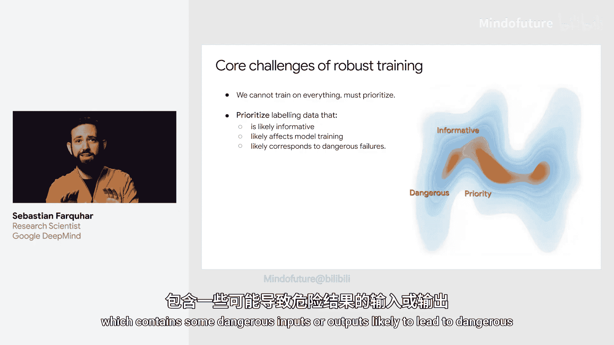

我们需要优先获取那些**可能对模型训练有信息量**的标注数据或监督，这些数据也应与**危险且重要的失败案例**相对应。

我们想象一个巨大的空间，其中包含：
*   一些可能导致危险结果的输入或输出。
*   一些可能产生信息量事件的输入（即我们尚未掌握大量数据的情况）。

我们试图优先关注这两类情况的**交集**。理想情况下，我们希望过滤掉普通数据，专注于**高影响、可学习但潜在危险**的事件。

以下是鲁棒性训练所依赖的研究领域：
*   **主动学习**：旨在寻找最具信息量的数据进行训练。
*   **主动模型评估**：将上述研究专门用于评估模型表现的好坏。
*   **红队测试或对抗训练**：专注于寻找可能“攻破”你的模型、导致其表现不佳的危险案例。
*   **损失校准的不确定性**：尝试估计不确定性，但重点在于估计那些**会造成损失**的情况下的不确定性，而非对所有情况都进行估计。

## 总结

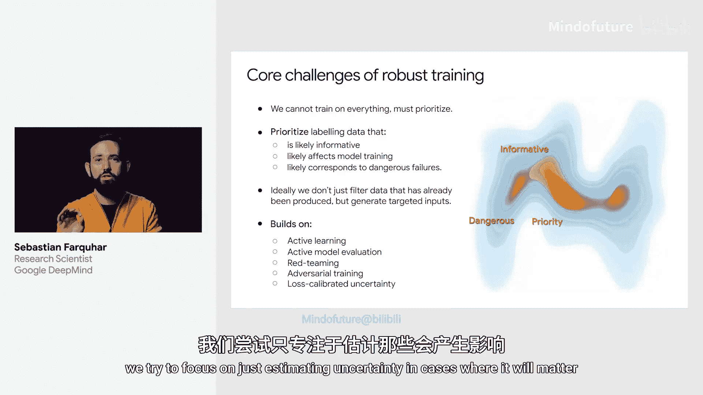

本节课中，我们一起学习了鲁棒性训练与监控。我们了解到，监控旨在评估实际发生的事件，需要结合廉价扫描和按需的深度评估。鲁棒性训练则需在庞大的可能数据空间中，优先选择对训练有信息量且可能导致危险失败的数据。两者都面临优先级排序的挑战，并依赖于不确定性量化、异常检测、主动学习、对抗训练等多个前沿研究领域，以确保AI系统在部署时的安全性。