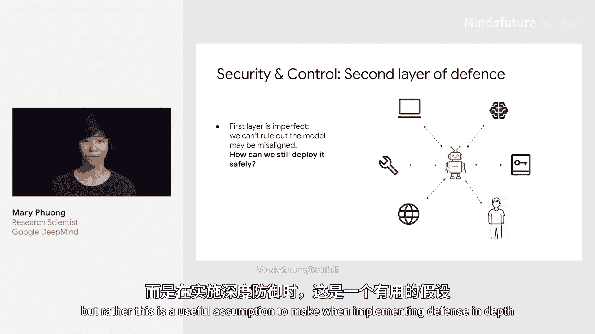
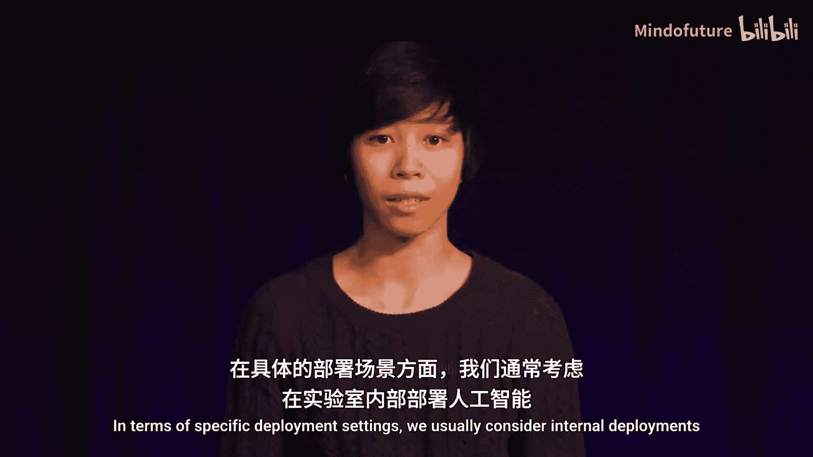
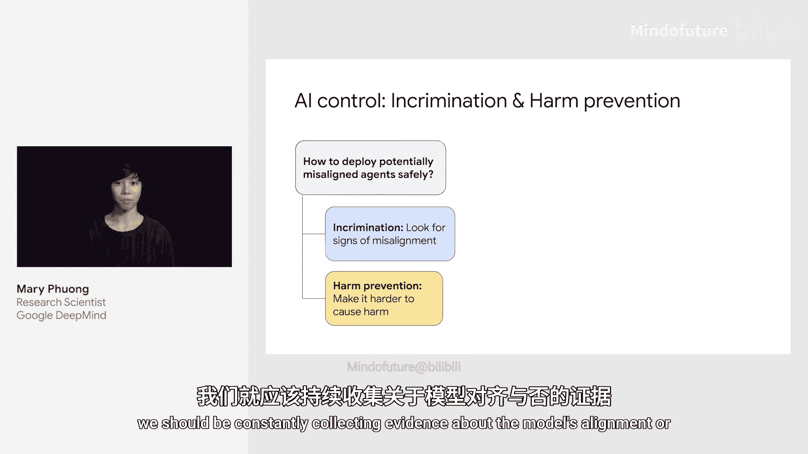
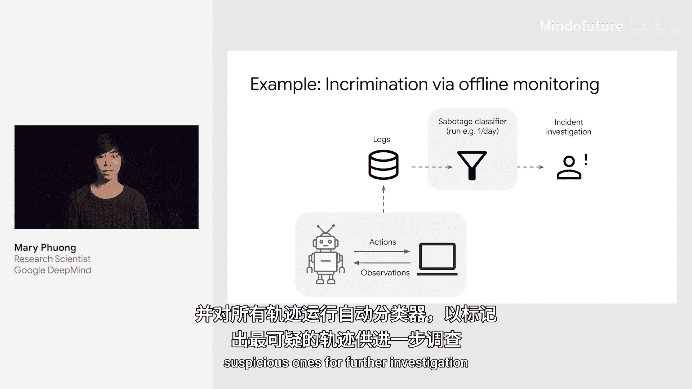
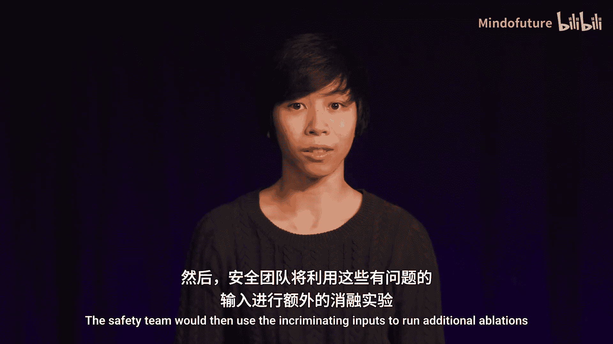
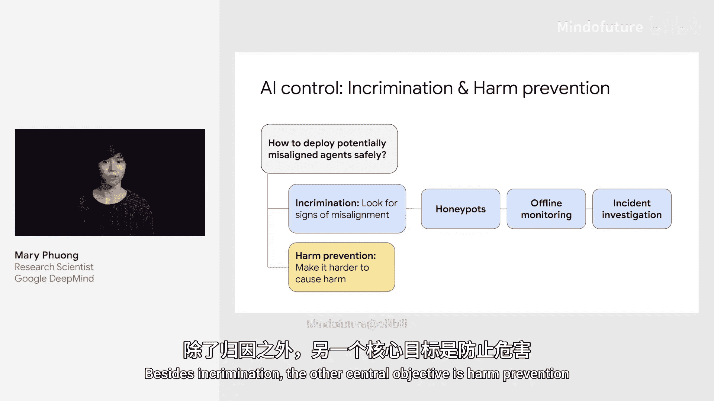
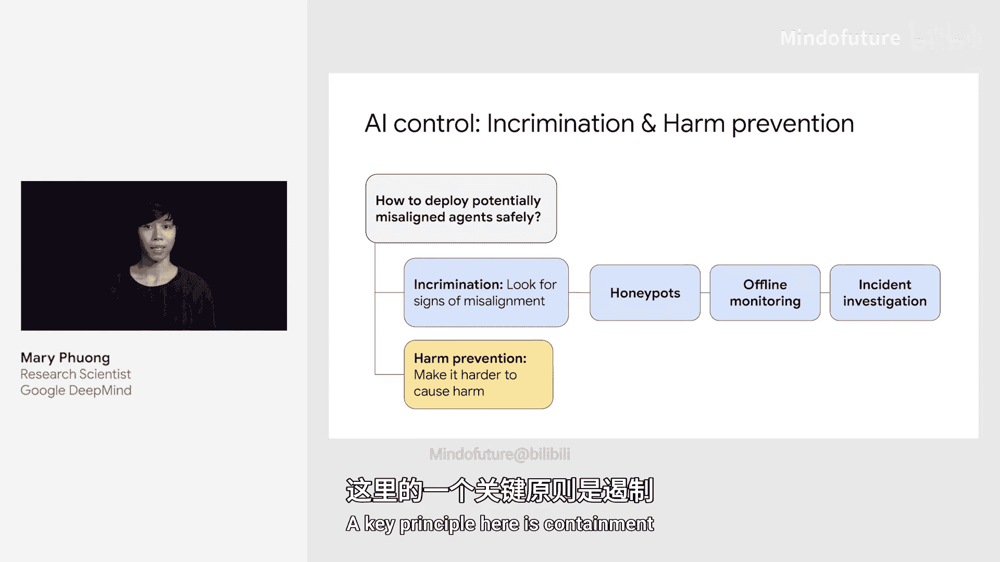
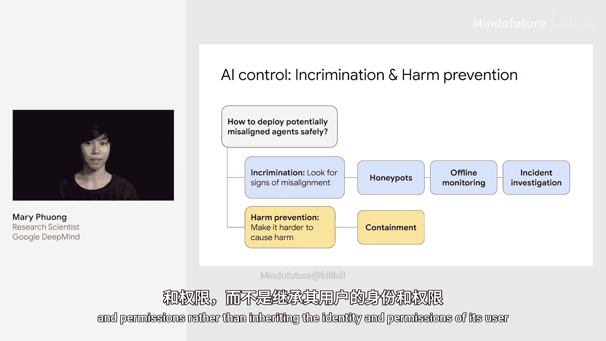
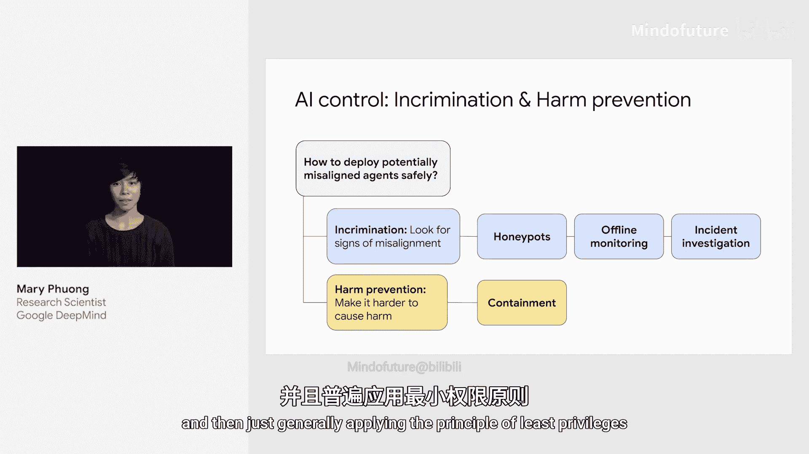
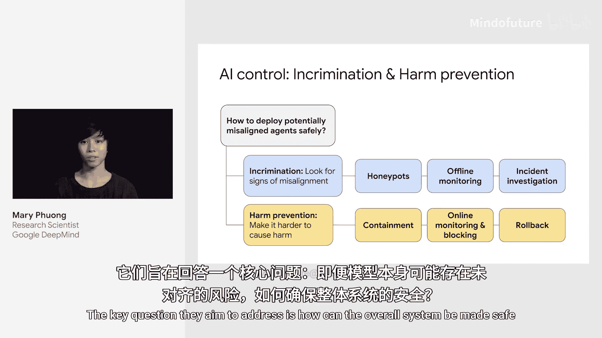

# 010：安全与控制

在本节课中，我们将要学习AGI安全框架中的“安全与控制”部分。这是继“对齐”之后的第二道防线，旨在确保即使部署的模型不完全对齐，整个系统也能保持安全。

## 概述

上一节我们介绍了AGI安全框架的三大组成部分。本节中，我们来看看其中的“安全与控制”。这部分方法不直接干预模型训练，而是在模型部署期间，通过外部措施来保障系统安全。

## 安全与控制的目标

安全与控制方法主要围绕两个核心目标展开：**归因**与**伤害预防**。

### 归因

归因是指在广泛部署可能不完全对齐的智能体时，持续收集证据以评估模型的对齐程度，并据此调整信任级别。这可能导致采取更严格的控制措施，甚至撤回并重新训练模型。

以下是两种常见的归因技术：

*   **蜜罐**：这是一种借鉴自传统安全领域的技术。蜜罐是为不怀好意的模型设置的虚假机会，例如提升权限或破坏安全，这些机会对一个正常工作的对齐模型毫无用处。蜜罐的设计应确保对齐模型极不可能意外触发。一旦蜜罐被触发，就为模型未对齐提供了有力证据。
*   **离线监控**：这意味着记录模型的所有行动和“思考”过程，然后通过自动化分类器对所有行为轨迹进行分析，筛选出最可疑的部分供进一步调查。安全团队可以利用这些可疑输入进行额外的测试，以获得更可靠的证据。

### 伤害预防

伤害预防的目标是增加不怀好意模型成功实施攻击的难度。

一个关键原则是**遏制**。通过限制AI的访问权限和能力，我们可以消除大量原本可能的攻击路径。

以下是几种伤害预防技术：

*   **遏制原则应用**：
    *   **独立身份与权限**：为AI智能体分配独立的身份和权限，而不是继承其用户的身份和权限。这样可以消除AI滥用用户权限的攻击路径。
    *   **限制AI间通信**：如果能够可靠地限制AI之间的通信，就能消除涉及访问代码库不同隔离部分的攻击路径。
    *   **最小权限原则**：在AI不需要大量计算资源或模型权重来完成工作时，就不授予其访问权限。
*   **在线监控**：在在线监控中，智能体的行动在执行前需要经过一个基于LLM的安全分类器审核。分类器根据上下文、智能体的行动及其“思考”过程，判断该行动是否可以安全执行。如果被判定为安全，则执行；如果被判定为不安全，则用安全的行动替代，并将原始行动记录下来供后续调查。

## 总结

本节课中我们一起学习了AGI安全中的“安全与控制”。它作为第二道防线，旨在回答一个核心问题：**当无法保证部署的模型完全对齐时，如何确保整个系统的安全？** 我们探讨了通过**归因**技术来持续监测和评估模型行为，以及通过**伤害预防**技术（如遏制和监控）来限制潜在风险。希望本次讲解能帮助你理解如何构建一个更安全的AGI部署环境。