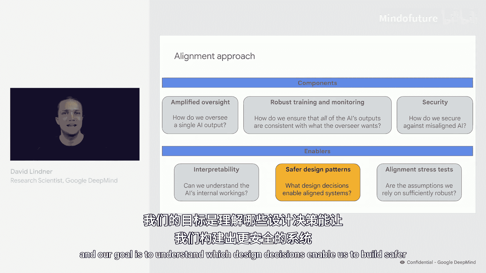
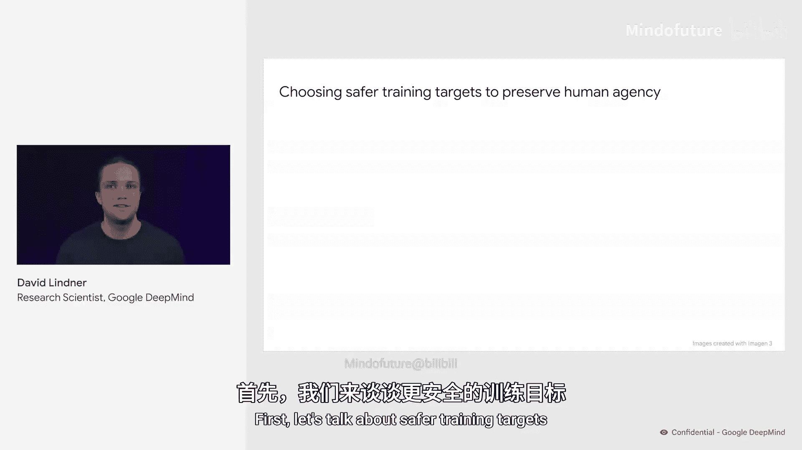
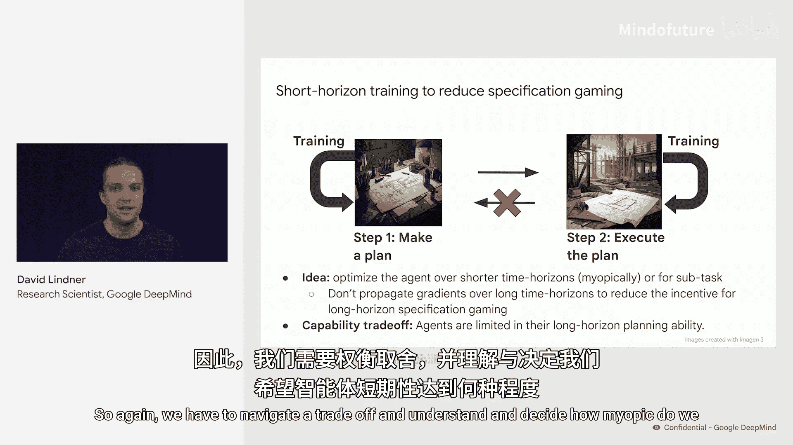
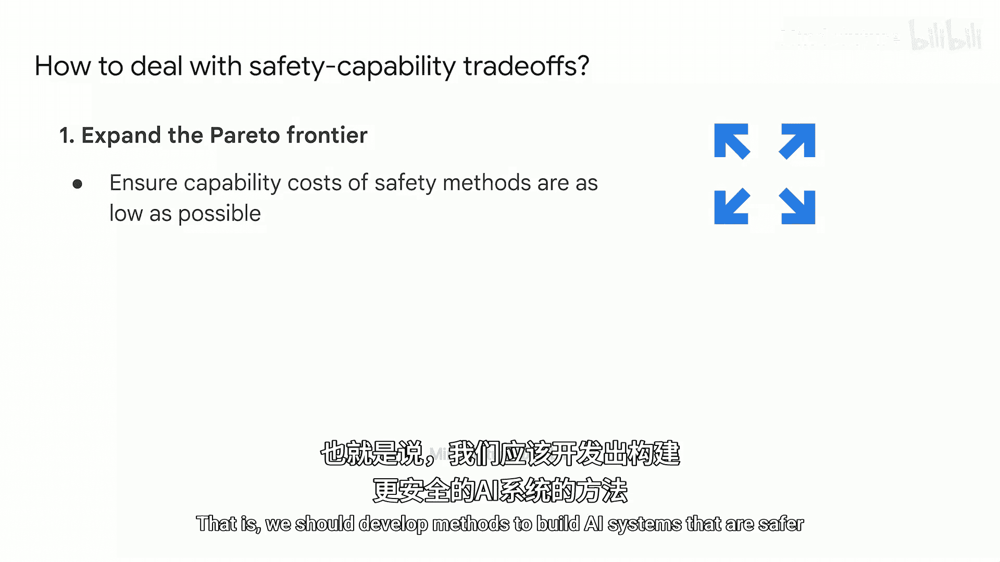
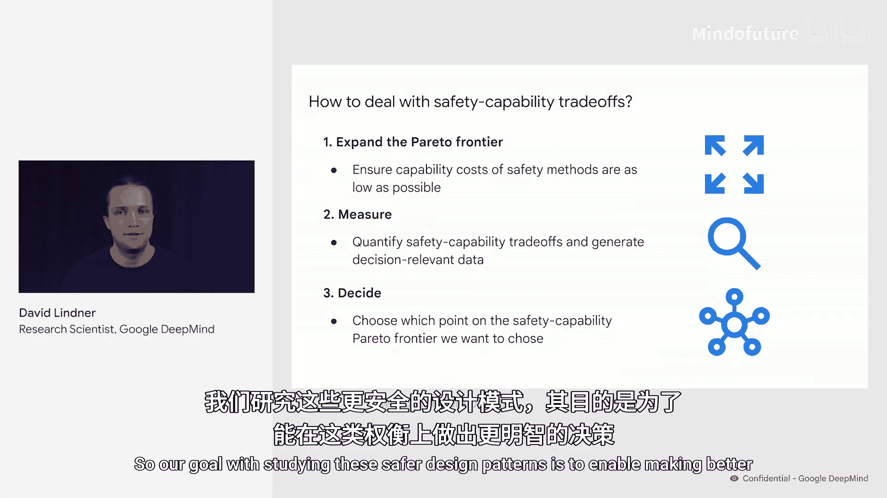

# 012：更安全的设计模式 🛡️

在本节课中，我们将探讨在构建AI系统时可以采取的不同设计决策。我们的目标是理解哪些设计决策有助于构建更安全的系统，并了解其中涉及的权衡取舍。理想情况下，我们希望尽可能选择能提升安全性的设计。同时，我们也希望结合多种安全技术，以防其中一种失效。

然而，许多安全技术会带来能力上的权衡，我们必须思考如何在安全性与能力之间取得恰当的平衡。接下来，我将介绍三种我们正在研究、有助于构建更安全AI系统的方法：选择更安全的训练目标、短视训练与模块化、以及添加可解释的瓶颈。我们将看到，每种方法也都伴随着能力上的权衡。

## 选择更安全的训练目标 🎯

首先，让我们谈谈更安全的训练目标。训练AI系统有多种方式。

例如，我们可以奖励AI尽可能高效、尽可能自主地完成任务，甚至可能因为其过于频繁地寻求帮助而惩罚它。另一方面，我们可以构建“人在回路”的AI系统，让其在面临高风险情况或对决策不确定时寻求人类帮助。

我们认为后一种训练目标更安全，因为它能通过更仔细地审查AI的决策来帮助预防高风险事故。更广泛地说，“人在回路”的AI系统通过询问人类更倾向于哪种路径，可能有助于保持人类的能动性。

但这带来了能力上的权衡，因为AI需要确保人类理解并批准其决策，从而减慢了速度。因此，我们必须在从完全自主的智能体到完全“人在回路”系统的光谱上，决定我们最终希望处于哪个位置。

## 短视训练与模块化 🔍

上一节我们讨论了训练目标的选择，本节中我们来看看另一种方法：短视训练。

许多任务可以自然地分解为不同的步骤，例如制定计划然后执行计划。因此，我们可以训练智能体完整地解决此类任务。

但这种做法的缺点是，它可能导致智能体产生制定欺骗性计划的动机，这些计划起初看起来不错，但实际上是为了在未来利用你。这是一种长期规范博弈。

我们可以通过分别训练这两个步骤，并且不将“执行计划”步骤的训练信号反向传播到“制定计划”步骤，从而在一定程度上避免这种动机。这可以避免制定易于在未来被利用的计划的动机。

但另一方面，这种短视训练的智能体可能在长期规划能力上受到限制，可能无法充分考虑其计划的所有后果。因此，我们再次需要权衡，并理解和决定我们希望智能体有多“短视”。

我们可以将这种情况视为构建模块化智能体，其中一个制定计划的智能体与一个执行计划的智能体是分离的。为了进一步增强这种情况下的安全性，我们可以强制这两个智能体仅通过人类可读的计划进行通信。

例如，如果计划智能体必须用自然语言将其计划传达给执行智能体，那么人类就可以审查该计划并确保其安全性。如果我们将此与前面提到的短视训练相结合，那么我们还有望避免智能体之间进行非预期的隐蔽通信的动机。

然而，这里再次存在权衡，因为如果我们强制智能体使用人类可读的计划，会使智能体之间的通信效率低于我们优化后的可能效率。

## 处理安全与能力的权衡 ⚖️

那么，我们应如何总体处理这些安全与能力的权衡呢？

以下是几个关键步骤：

1.  **扩展帕累托前沿**：我们应该开发方法，以尽可能低的能力成本构建更安全的系统。对于我提到的许多方法，我们正在研究相应的技术提案。
2.  **量化权衡**：我们需要生成实证数据，以帮助我们决定部署哪些方法以及如何部署。
3.  **做出决策**：我们将不得不就这些权衡以及在帕累托前沿上希望处于哪个位置做出决策。这些决策必须纳入许多具有不同观点的利益相关者，并需要基于我们收集的实证数据。

我们研究这些更安全设计模式的目标，正是为了能够在这些权衡上做出更明智的决策。

## 总结 📝

本节课我们一起学习了三种构建更安全AI系统的设计模式：选择更安全的训练目标（如“人在回路”系统）、采用短视训练与模块化设计、以及通过可解释的瓶颈（如人类可读的计划）进行通信。每种方法都在提升安全性的同时，对系统的能力（如速度、效率、长期规划）提出了挑战。关键在于通过技术研究扩展安全与能力的帕累托前沿，量化权衡，并基于实证数据与广泛共识做出审慎的决策。