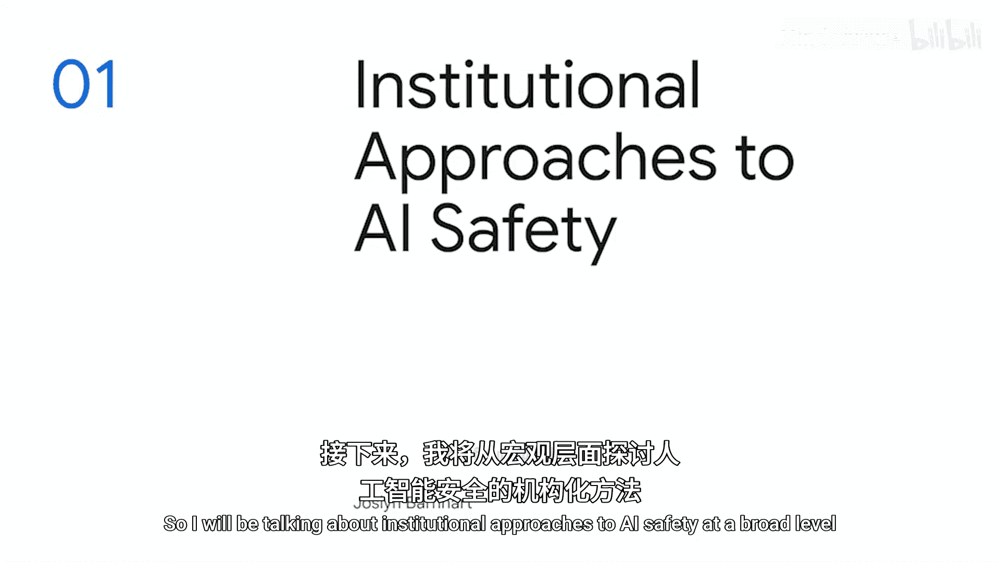
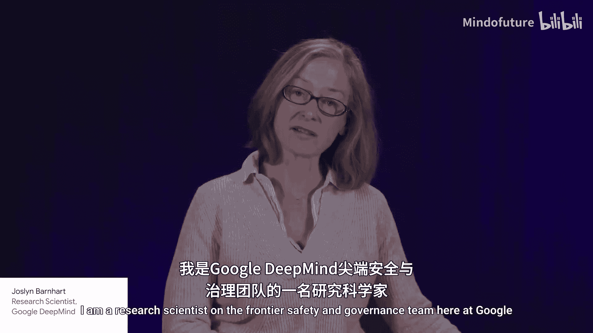
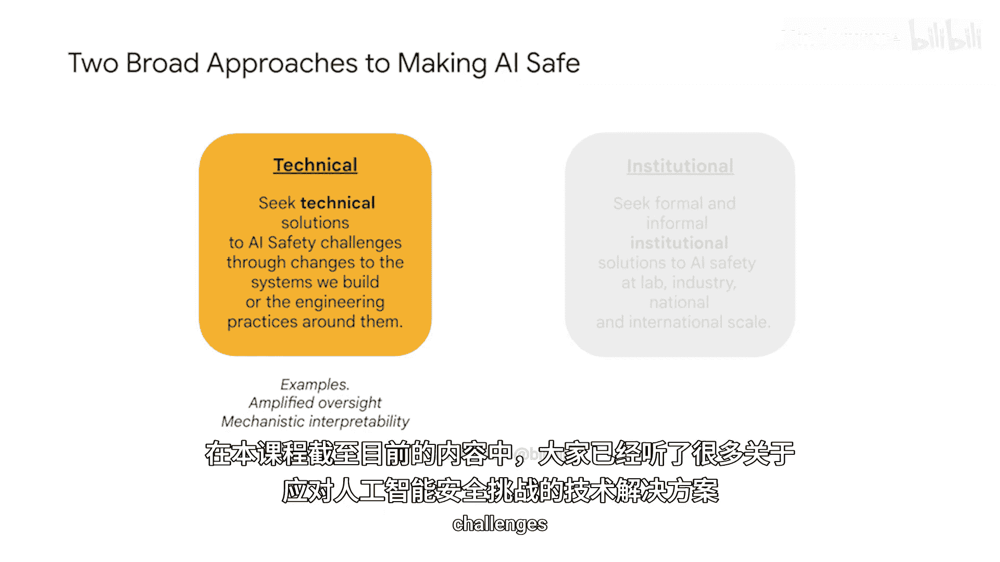
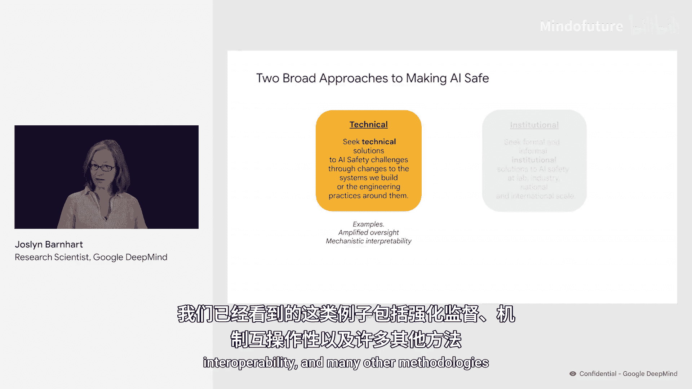
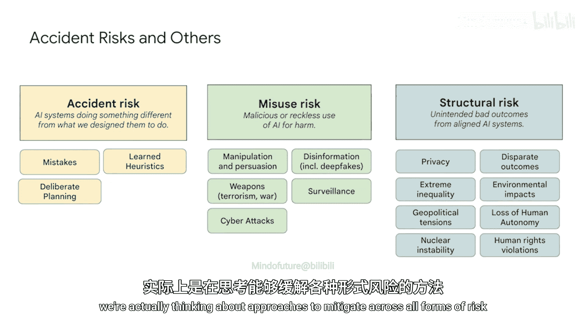
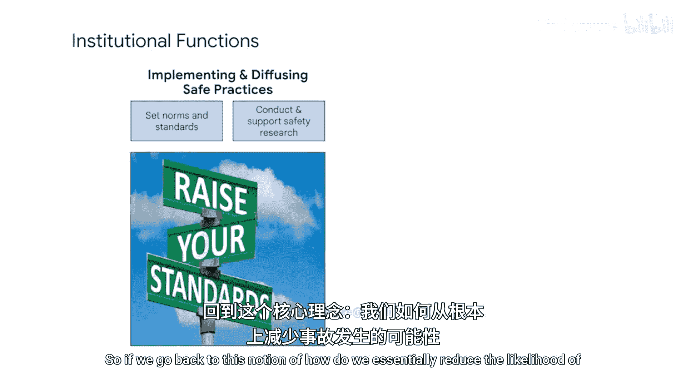
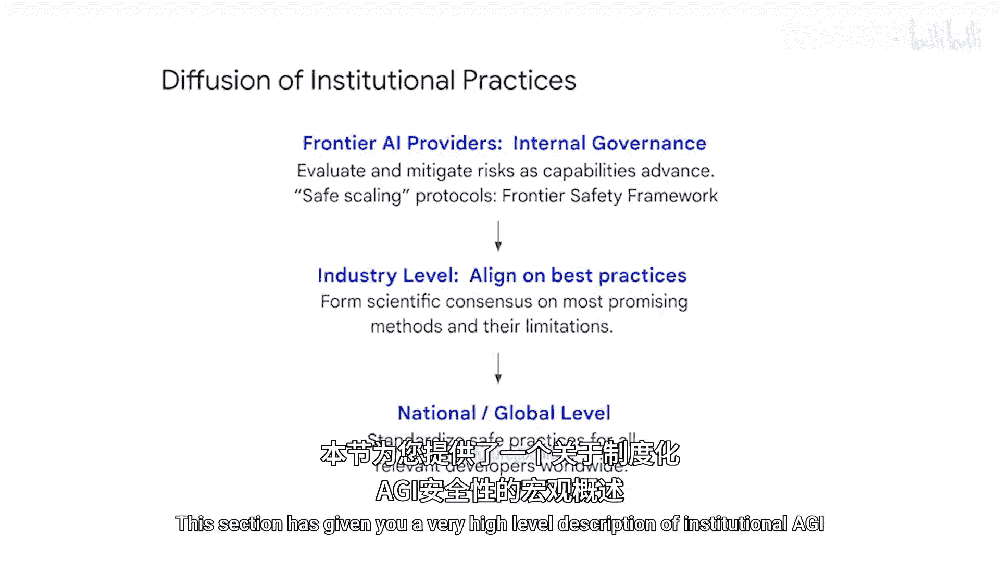
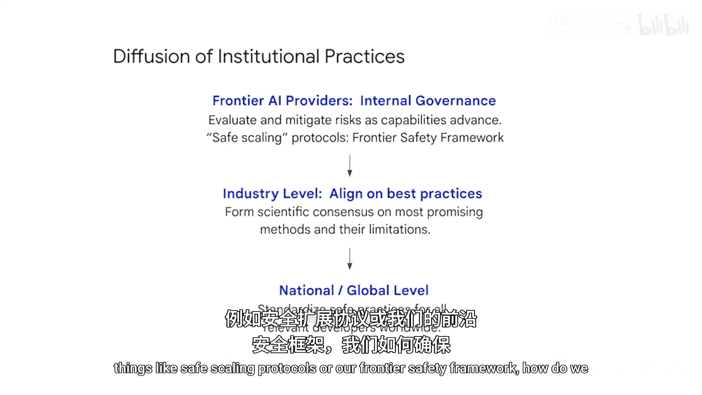
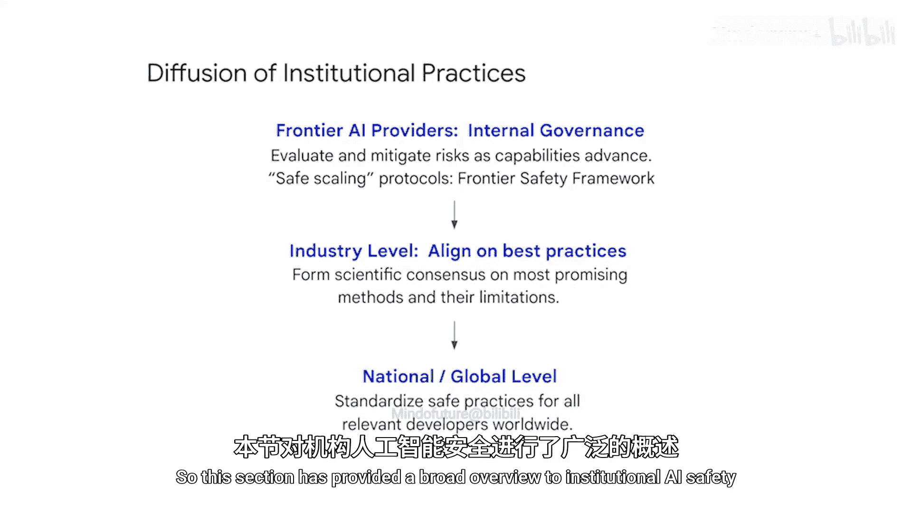

# 014：AI安全的制度性方法 🏛️

在本节课程中，我们将学习一种与之前不同的AI安全方法——制度性方法。我们将探讨如何通过建立正式与非正式的社会制度，在实验室、行业乃至国家与国际层面，来促进安全实践的传播与采纳，从而应对AI发展中的各类风险。

---

欢迎来到我们关于治理方法的课程第三部分。

本节将包含三个不同的演讲。

第一个演讲将探讨AI安全的制度性方法及其含义。

第二个演讲将更详细地介绍我们在Google DeepMind内部的尖端安全实践。

第三个演讲将深入探讨作为这些尖端安全实践核心的危险能力评估。

我将从宏观层面讨论AI安全的制度性方法。

我是Jocelyn Barnhardt，是Google DeepMind尖端安全与治理团队的一名研究科学家。

---

在本课程中，你们已经了解了许多应对AI安全挑战的技术解决方案。

这指的是我们构建和设计系统时所采用的技术方法，以及围绕这些系统所包含的实践，其根本目的是实现更安全的模型开发和部署。

我们已看到的例子包括**放大监督**、**机制可解释性**以及其他许多方法。

---

本节将探讨另一种实现AI安全的方法，即制度性方法。

这里所说的“制度”，实际上是一个非常广泛的概念，包括非正式和正式的社会制度。我们可以在实验室层面、行业层面，甚至国家和国际层面来思考这些制度。

非正式制度可以指行为规范、行业预期行为标准等。正式制度则包括我们通常理解的**法律**和**组织**。

本节的关键要点是：技术解决方案通常需要制度来促进其传播。如果没有社会制度来帮助传播安全实践，很难完全实现安全的结果。

---

以**安全带**为例，这项技术本身的发明，远早于所有驾驶员及相关人员普遍使用安全带这一实践的完全普及。

我们需要思考的是，如何通过**法律**、**制度**、**规范**和**标准**来确保所有相关行为者都参与到安全实践中。

---

在本课程中，我们目前主要讨论了一种广泛的风险类型：**事故风险**。

正如我们所知，事故风险是指AI系统的行为与我们设计意图不符的情况。这是第一和第二部分重点讨论的内容。

但这并非先进AI模型可能带来的唯一风险形式。

我们还需要考虑**滥用风险**，即恶意或鲁莽地使用AI造成伤害。

以及**结构性风险**，即AI系统完全按照我们意图行事时，却意外产生并出现的糟糕结果。这些可能是更宏观、甚至全球层面的问题，例如可能引发的地缘政治紧张局势、人权侵犯、环境影响等。

---

当我们思考制度性安全时，我们实际上是在考虑如何减轻所有形式风险的方法。

让我们更详细地看看一些制度性功能。

回到如何从根本上降低事故风险、滥用风险以及恶意行为者利用先进AI模型做有害事情的可能性这个问题上。

在这种情况下，制度在实施和传播安全实践方面发挥着重要作用。制度既可以帮助开展和支持安全研究，也可以为这些实践应如何传播和采纳设定规范和标准。

这可以在多个不同层面发生。

---

在接下来的演讲中，我们将听到关于AI实验室内部可以采取的治理方法和制度性方法。

我们将了解Google DeepMind的**尖端安全框架**，该框架旨在评估和减轻开发和部署过程中的风险。

这是一种制度性方法，通过它，我们在整个开发和部署生命周期中建立一致且稳健的预期。

这为开发者层面本身的最佳实践或安全实践提供了一个范例。

但当然，这很可能不足以实现完全安全的AI。我们需要确保这些安全实践能够传播到所有其他相关行为者。

---

因此，我们需要在行业层面思考制度。这指的是行业参与者集体合作，分享和推进安全实践本身。

在国家层面，我们有像**国家标准与技术研究院**这样的机构，负责制定技术标准，以确保对这些安全实践有广泛的理解。

在区域和全球层面，我们有国际标准组织，如**国际标准化组织**或**经济合作与发展组织**，它们可以帮助在所有相关的AI提供者之间传播对这些安全实践的理解、实施和采纳。

---

如果我们思考在通往高度有益的通用人工智能道路上可能需要的制度性功能，我们很可能不仅需要制度来帮助我们实施和传播安全实践。

我们可能还需要制度来帮助我们传播强大AI带来的益处。

例如，我们如何思考确保获取这些模型或开发这些模型所带来的益处，能够以有助于减少经济不平等的方式传播？

我们也可以思考如何通过制度性方法，来最小化先进AI可能带来的全球性威胁。

我们如何确保各国以可信赖和安全的方式使用AI系统？或许可以通过参与条约来实现。我们如何监督对这些条约的遵守情况？

---

我们可以设想，在通往通用人工智能的道路上，全球层面可能采取的一系列制度性方法。

本节为你提供了一个关于制度性AI安全的非常宏观的描述。

再次强调，如果我们思考如何传播制度性实践，这确实是一个关键维度。

回到我们将在下一节中更详细讨论的例子，比如**安全扩展协议**或我们的**尖端安全框架**，我们如何确保这些实践在我们不断演进和更新的过程中，能够传播到所有相关的全球行为者？

我们需要在行业层面思考，就这些最佳实践达成一致，然后确保它们也在国家和全球层面得到传播。

---

本节对制度性AI安全进行了广泛的概述。

在下一节中，我的同事Lewis Ho将更详细地介绍Google DeepMind自己的尖端安全框架。

非常感谢。