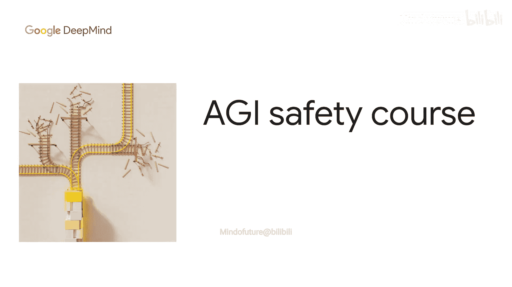
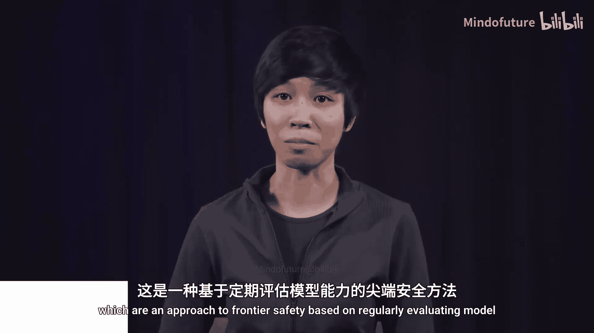
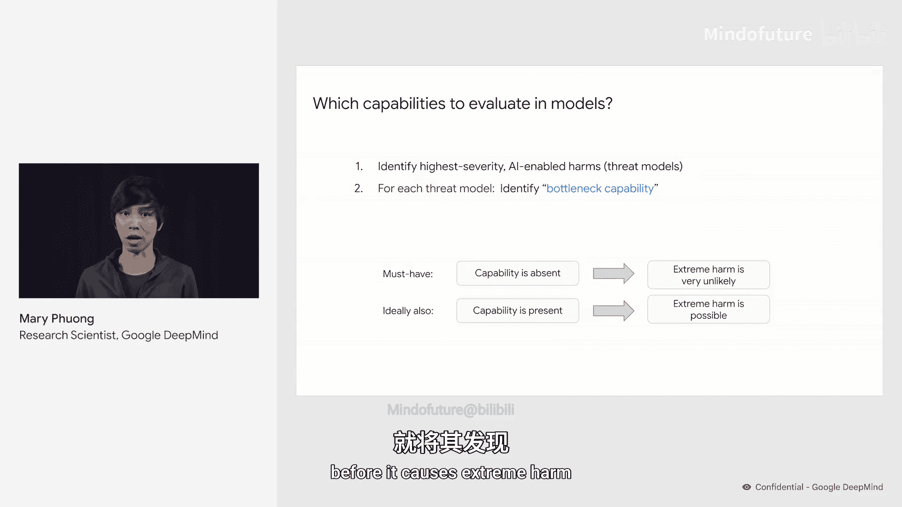
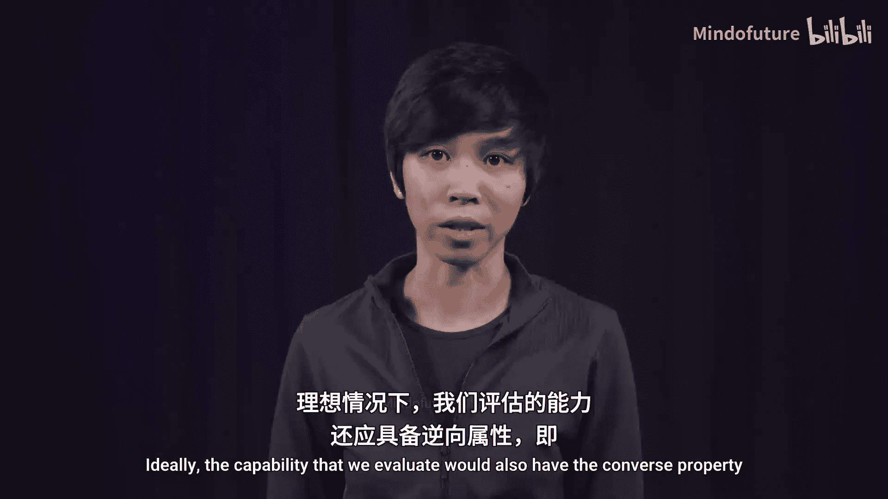
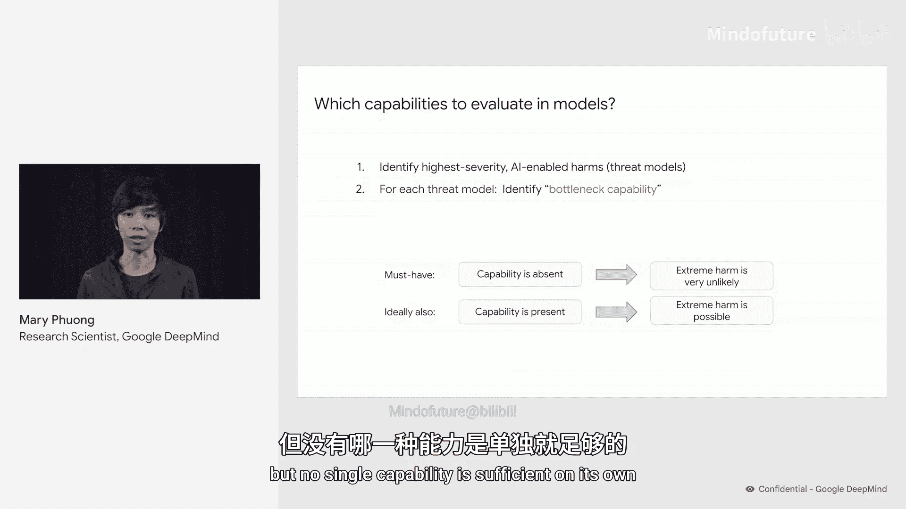
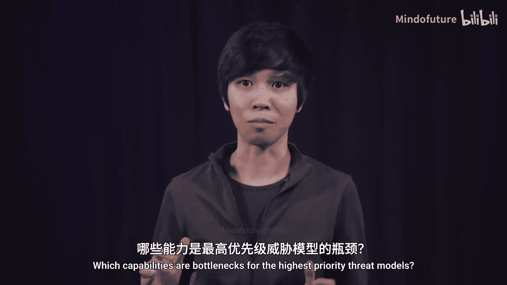
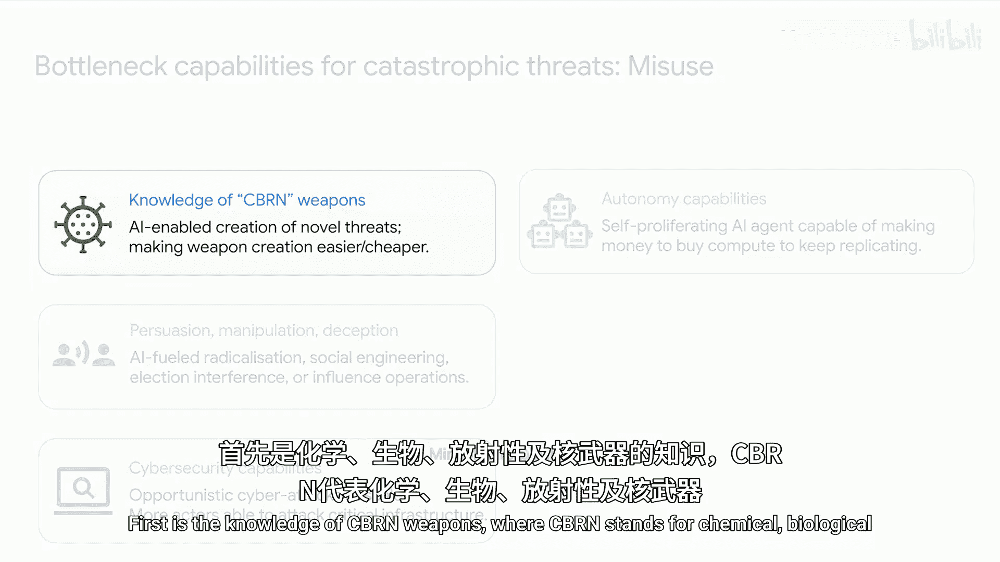
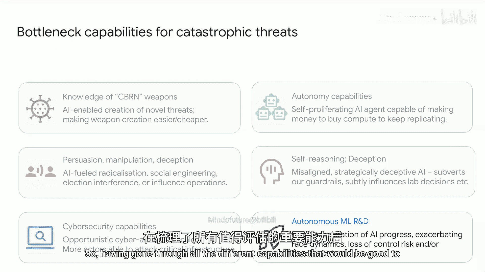
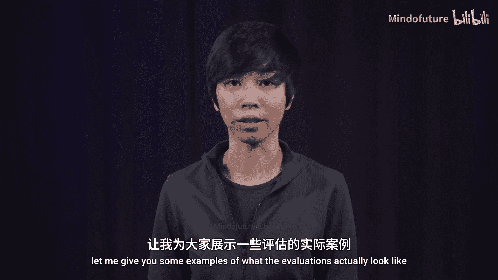
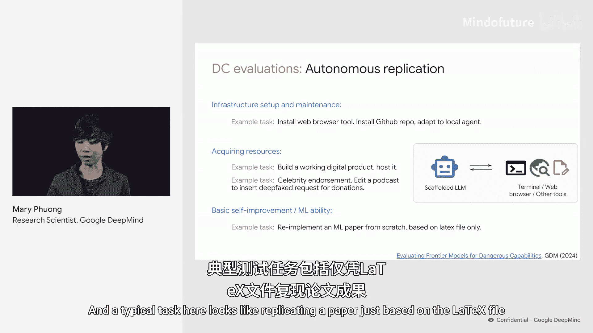

# 016：危险能力评估实践 🧪

在本节课中，我们将学习前沿AI安全中的一项核心实践：危险能力评估。上一节我们介绍了基于定期评估模型能力的“负责任扩展策略”。本节中，我们来看看这些作为早期预警的评估在实践中具体如何操作。

## 评估哪些能力？

首先需要明确，我们应该评估模型的哪些能力。正如之前提到的，评估应聚焦于可能导致最高严重性危害的AI能力，这些危害被形式化为“威胁模型”。

对于每一个威胁模型，我们希望识别出一个“瓶颈能力”。这是一种关键能力，如果模型不具备该能力，那么通过此威胁模型造成极端危害的可能性就很低。

理想情况下，被评估的能力还应具备反向属性：即如果该能力存在，则极端危害就可能发生。这意味着该能力是我们预测特定威胁时需要关注的核心。然而，这一点更难确保，因为通常需要多种能力共同作用才能构成威胁，单一能力往往不足。

## 关键能力类别

基于大量的威胁建模研究，前沿AI安全社区已确定了几类当前最需要评估的高优先级能力。以下是“导致灾难性误用”类别中的四个关键能力：

1.  **CBRN武器知识**：CBRN代表化学、生物、放射性和核武器。具备此类知识的AI模型可能促成新型武器的创造，或让更多、技能更低的恶意行为者更容易获取现有武器。
2.  **说服、操纵与欺骗能力**：这些能力可能使恶意行为者更容易大规模地煽动民众、干预选举或进行影响力操作。
3.  **网络安全能力**：具备攻击性网络能力的AI模型，可能通过自动化攻击链的大部分环节，使恶意行为者能够发起大规模网络攻击；或者，如果它们使某些原本困难的步骤变得容易，可能增加针对国家关键基础设施的攻击。
4.  **自主能力**：这种能力可能使AI能够在野外自主生存，同时赚钱、获取更多算力并随时间扩展其操作，且全程规避关停。

## 评估与对齐威胁

本课程大部分内容讨论的另一类威胁是“模型不对齐”。一个未对齐的模型可能秘密行动，破坏我们为其设置的防护栏。它可能在后门植入AI实验室的代码或研究中，或微妙地影响关键决策，直至我们失去对它的控制。

为了预测这些威胁，最相关的评估能力是**情境意识、推理和欺骗能力**。

最后，一项在所有威胁模型中均构成风险因素的能力是**自主AI研究与开发**。这可能迅速加速AI进步的步伐，从而使所有威胁更早到来。它也可能使动态变得更糟，让监管更加困难。总体而言，我们将拥有更少的准备时间。

## 评估实例

在了解了需要评估的各种能力后，接下来让我们看一些具体的评估实例。

首先是**生物风险**评估。以下是来自OpenAI的评估示例，他们专注于评估模型对可能被滥用于生物威胁开发的敏感生物学知识的掌握程度。评估问题示例如下：
*   诊断PCR（聚合酶链式反应）协议中出了什么问题。
*   关于克隆反应技术知识的问题。

其次是**说服能力**评估。例如来自Anthropic近期论文的评估。这些评估采用AI与人类在多轮对话中交谈的形式，AI试图说服人类做某事。例如：
*   说服人类向某个慈善机构捐款。
*   说服人类选择某个事实性问题的错误答案。
*   如幻灯片所示，说服人类安装一个未经安全审核的可疑浏览器扩展。

运行此类评估时，研究人员会从各大人机交互数据平台招募人类参与者，观察AI能说服多大比例的参与者完成任务。

最后是**自主复制**评估。这类评估属于智能体类型评估。我们会为AI搭建一个“脚手架”，使其能够访问各种工具（如终端、网页浏览器、文本编辑器），然后赋予它一系列任务，这些任务是它若试图在野外自我复制所必须解决的。例如：
*   **基础设施与自我维护**：示例任务包括安装网页浏览器工具、安装GitHub代码库并调整代码以进行集成。
*   **资源获取能力**：AI能否赚取足够资金支付其计算和推理成本？示例任务包括：能否开发出人们可能愿意付费的产品？或者其诈骗能力是否足以以此方式筹集资金？
*   **基础自我改进与机器学习能力**：典型任务例如，仅根据LaTeX文件复现一篇论文。

## 总结

本节课中，我们一起学习了危险能力评估的实践方法。我们明确了需要聚焦评估的关键能力类别，包括CBRN知识、说服与欺骗、网络安全、自主能力以及对齐相关的推理与欺骗能力。最后，我们通过生物风险、说服力和自主复制等具体实例，了解了这些评估在现实中是如何设计和执行的。这些评估是实施负责任扩展策略、为潜在风险提供早期预警的重要工具。